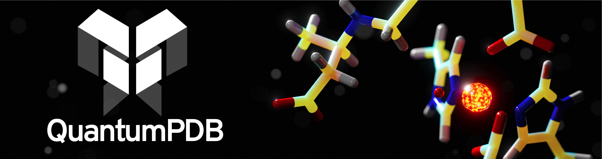

# README


QuantumPDB
==============================


## Table of Contents
1. **Overview**
2. **Installation**
    * Download the package
    * Creating python environment
    * Command-line interface
3. **What is included?**
    * File structure
4. **Documentation**
    * Read the Docs
    * Examples
5. **Developer Guide**
    * GitHub refresher
6. **Areas of Active Development**
7. **QuantumPDB File Structure**  


## 1. Overview
The purpose of quantumPDB (qp) is to serve as a toolkit for working with our database of proteins to setup and facilitate DFT-calculation and cluster model creation.


## 2. Installation
Install the package by running the follow commands inside the repository. This will perform a developmental version install. It is good practice to do this inside of a virtual environment. A yaml environmental file has been created to facilitate the installation of dependencies.

### Setup developing environment
To begin working with quantumPDB, first clone the repo and then move into the top-level directory of the package.
Then perform a developer install.
Remember to update your GitHub [ssh keys](https://docs.github.com/en/authentication/connecting-to-github-with-ssh/adding-a-new-ssh-key-to-your-github-account).
```bash
git clone git@github.com:davidkastner/quantumPDB.git
```

### Creating python environment
All the dependencies can be loaded together using the prebuilt environment.yml file.
Compatibility is automatically tested for python versions 3.8 and higher.
If you are only going to be using the package run:
```bash
cd quantumPDB
conda env create -f environment.yml
source activate qp
python -m pip install -e .
```

### Command-line interface
All of the functionality of quantumPDB has been organized into a command-line interface (CLI).
After performing the developer install, the CLI can be called from anywhere using `qp`.


## 3. What is included?
### Package architecture
```
.
├── docs                           # Readthedocs documentation site
└── qp                             # quantumPDB subpackages and modules
    |── cli.py                     # Command-line interface entry point
    ├── checks                     # Perform quality and structural checks
    │   ├── fetch_pdb              # Get a PDB
    │   └── to_xyz                 # Save structure to a new XYZ
    ├── structure                  # Correct the PDB structure
    │   ├── missing_loops          # Use modeller to add missing loops
    │   └── add_hydrogens          # Get the structure with hydrogens
    ├── clusters                   # Generalizable plotting and vizualization
    │   └── coordination_spheres   # Select the first, second, etc. spheres
    └── manager  
        ├── failure_checkup
        ├── find_incomplete
        └── job_manager
```


## 4. Documentation
### Run the following commands to update the ReadTheDocs site
```bash
make clean
make html
```


## 5. Developer guide

### GitHub refresher
#### Push new changes
Use this Git sequence to make a quick push.

```
git status
git pull
git add -A .
git commit -m "Change a specific functionality"
git push -u origin main
```

#### Making a pull request
Use this Git sequence to make a branch and make a pull request.
Recommend for significant changes.

```
git checkout main
git pull

# Before you begin making changes, create a new branch
git checkout -b new-feature-branch
git add -A
git commit -m "Detailed commit message describing the changes"
git push -u origin new-feature-branch

# Visit github.com to add description, submit, merge the pull request

# Once finished on github.com, return to local
git checkout main
git pull

# Delete the remote branch
git branch -d new-feature-branch
```

#### Handle merge conflict

```
git stash push --include-untracked
git stash drop
git pull
```
## 6. Areas of active development
Currently working on handling all edge cases, including non-canonical amino acids. Additionally, support for mmCIFs will eventually needed to be added to work with newer and larger PDBs. Documentation is present for all functions in the code, but should be added with external examples for use. 

## 7. QuantumPDB generated file structure
An example file structure from a `qp` run given the parameters in `config.yaml` `input: qp_input.csv` and `output_dir: dataset/`.
If we run `qp run -c ./config.yaml`, then the file structure will be generated in `dataset` if `qp_input.csv` specfies `1a9s`.
```
.
├── config.yaml                           # The input yaml containing all `qp` job parameters 
├── qp_input.csv                          # List of PDB ID's to run `qp`
└── dataset                               # Specified with "output_dir: dataset/" in config.yaml
    └── 1a9s                              # One of these is generated for each entry in qp_input.csv
        ├── 1a9s_modeller.pdb             # Modeller optimized structure with added missing atoms and loops
        ├── 1a9s.ali                      # Alignment file needed by Modeller
        ├── 1a9s.pdb                      # Original 1a9s PDB downloaded directly from the Protein Data Bank
        ├── charge.csv                    # Generated file used to calculate the charge of the system
        ├── count.csv                     # Generated file that keeps track of the residue counts
        ├── Protoss                       # Directory storing all Protoss files
        │   ├── 1a9s_ligands.sdf          # Ligand structural files
        │   ├── 1a9s_log.txt              # Error log from Protoss server
        │   └── 1a9s_protoss.pdb          # Protonated result returned from the Protoss server
        └── A290                          # Generated for each cluster, named by chain (A) and the res number of center (290)
            ├── 0.pdb                     # Structure of the center residue
            ├── 1.pdb                     # Structure of the first sphere around the center
            ├── 2.pdb                     # Structure of the second sphere around the first
            ├── A290.pdb                  # Structure of the entire cluster in PDB format
            ├── A290.xyz                  # Structure of the entire cluster in XYZ format
            └── wpbeh                     # QM job file specified with "method: wpbeh" in "config.yaml"
                ├── A290.xyz              # Structure of the entire cluster in XYZ format
                ├── jobscript.sh          # SLURM/SGE submit script
                ├── ptchrges.xyz          # MM embedded point charges specified with "charge_embedding: true"
                ├── qmscript.in           # QM job input using TeraChem
                ├── qmscript.out          # QM job output details
                └── wpbeh                 # Results from the TeraChem QM calculation
                    ├── A290.basis
                    ├── A290.geometry
                    ├── A290.molden
                    ├── bond_order.list
                    ├── c0
                    ├── charge_mull.xls
                    ├── grad.xyz
                    ├── mullpop
                    ├── results.dat
                    └── xyz.xyz
```

### Copyright

Copyright (c) 2024, Kulik Group MIT

#### Acknowledgements
 
Project based on the 
[Computational Molecular Science Python Cookiecutter](https://github.com/molssi/cookiecutter-cms) version 1.1.


# Repository Structure

├── .codecov.yml
├── .github/
│   ├── CONTRIBUTING.md
│   ├── PULL_REQUEST_TEMPLATE.md
│   └── workflows/
│       └── CI.yaml
├── .lgtm.yml
├── CODE_OF_CONDUCT.md
├── config.yaml
├── devtools/
│   ├── conda-envs/
│   │   └── test_env.yaml
│   ├── README.md
│   └── scripts/
│       └── create_conda_env.py
├── docs/
│   ├── _static/
│   │   └── README.md
│   ├── autosummary/
│   ├── conf.py
│   ├── README.md
│   └── requirements.yaml
├── environment.yml
├── input.csv
├── pyproject.toml
├── qp/
│   ├── __init__.py
│   ├── _version.py
│   ├── analyze/
│   │   ├── checkup.py
│   │   ├── molden.py
│   │   └── multiwfn.py
│   ├── cli.py
│   ├── cluster/
│   │   ├── __init__.py
│   │   ├── charge_count.py
│   │   ├── spheres.py
│   │   ├── spheres_bad.py
│   │   └── struct_to_file.py
│   ├── manager/
│   │   ├── __init__.py
│   │   ├── Archive/
│   │   │   ├── job_manager.py
│   │   │   └── job_scripts_gibraltar.py
│   │   ├── charge_embedding.py
│   │   ├── create.py
│   │   ├── ff14SB_dict.py
│   │   ├── job_scripts.py
│   │   └── submit.py
│   ├── protonate/
│   │   ├── fix.py
│   │   ├── get_protoss.py
│   │   ├── ligand_prop.py
│   │   └── parse_output.py
│   ├── resources/
│   │   ├── __init__.py
│   │   ├── atmrad/
│   │   ├── prepared/
│   │   │   ├── 2p5b/
│   │   │   │   └── Protoss/
│   │   │   ├── 2pxj/
│   │   │   │   └── Protoss/
│   │   │   ├── 3p3n/
│   │   │   │   └── Protoss/
│   │   │   ├── 3p3p/
│   │   │   │   └── Protoss/
│   │   │   ├── 4oj8/
│   │   │   │   └── Protoss/
│   │   │   └── 7emz/
│   │   │       └── Protoss/
│   │   ├── scripts/
│   │   │   ├── atom_counts.py
│   │   │   ├── atom_counts_stripplot.py
│   │   │   ├── charge_pca_analysis.py
│   │   │   ├── count_chains.py
│   │   │   ├── distance_to_metal.py
│   │   │   ├── doi.py
│   │   │   ├── failure_checkup.py
│   │   │   ├── find_incomplete.py
│   │   │   ├── hydratase_identifier.py
│   │   │   └── parse_pdb_info.py
│   │   └── wfn/
│   ├── structure/
│   │   ├── __init__.py
│   │   ├── combine_pdbs.py
│   │   ├── convert_nhie_oxo.py
│   │   ├── missing.py
│   │   └── setup.py
│   └── tests/
│       ├── __init__.py
│       ├── conftest.py
│       ├── README.md
│       ├── samples/
│       │   ├── 1lm6/
│       │   │   ├── A204/
│       │   │   ├── charge.csv
│       │   │   ├── count.csv
│       │   │   └── Protoss/
│       │   │       └── 1lm6_log.txt
│       │   ├── 1sp9/
│       │   │   ├── A446/
│       │   │   ├── B446/
│       │   │   ├── charge.csv
│       │   │   ├── count.csv
│       │   │   └── Protoss/
│       │   │       └── 1sp9_log.txt
│       │   ├── 2chb/
│       │   │   ├── A1_A2_A3_A4/
│       │   │   ├── B1_B2_B3_B4_B5/
│       │   │   ├── C1_C2_C3_C4/
│       │   │   ├── charge.csv
│       │   │   ├── count.csv
│       │   │   ├── I1_I2_I3_I4_I5/
│       │   │   ├── J1_J2_J3_J4_J5/
│       │   │   └── Protoss/
│       │   │       └── 2chb_log.txt
│       │   ├── 2fd8/
│       │   │   ├── B501_B502_B503/
│       │   │   ├── charge.csv
│       │   │   ├── count.csv
│       │   │   └── Protoss/
│       │   │       └── 2fd8_log.txt
│       │   ├── 2q4a/
│       │   │   ├── A901/
│       │   │   ├── B902/
│       │   │   ├── charge.csv
│       │   │   ├── count.csv
│       │   │   └── Protoss/
│       │   │       └── 2q4a_log.txt
│       │   ├── 2r6s/
│       │   │   ├── A501/
│       │   │   ├── charge.csv
│       │   │   ├── count.csv
│       │   │   └── Protoss/
│       │   │       └── 2r6s_log.txt
│       │   ├── 3a8g/
│       │   │   ├── A301/
│       │   │   ├── charge.csv
│       │   │   ├── count.csv
│       │   │   ├── Protoss/
│       │   │   │   └── 3a8g_log.txt
│       │   │   └── spin.csv
│       │   ├── 3x20/
│       │   │   ├── A301/
│       │   │   ├── charge.csv
│       │   │   ├── count.csv
│       │   │   └── Protoss/
│       │   │       └── 3x20_log.txt
│       │   ├── 4ilv/
│       │   │   ├── A301/
│       │   │   ├── B301/
│       │   │   ├── charge.csv
│       │   │   ├── count.csv
│       │   │   └── Protoss/
│       │   │       └── 4ilv_log.txt
│       │   ├── 4z42/
│       │   │   ├── C601_C602/
│       │   │   ├── charge.csv
│       │   │   ├── count.csv
│       │   │   ├── F601_F602/
│       │   │   ├── I601_I602/
│       │   │   ├── L601_L602/
│       │   │   └── Protoss/
│       │   │       └── 4z42_log.txt
│       │   └── 6f2a/
│       │       ├── A401/
│       │       ├── B401/
│       │       ├── C401/
│       │       ├── charge.csv
│       │       ├── count.csv
│       │       ├── D401/
│       │       └── Protoss/
│       │           └── 6f2a_log.txt
│       ├── samples.yaml
│       ├── test_checks.py
│       ├── test_cluster.py
│       ├── test_qp.py
│       └── test_structure.py
├── qp.egg-info/
│   ├── dependency_links.txt
│   ├── entry_points.txt
│   ├── requires.txt
│   ├── SOURCES.txt
│   └── top_level.txt
├── README.md
├── readthedocs.yml
└── repo_dump.md
# Module Imports


## `devtools/scripts/create_conda_env.py`

Imported modules:

- argparse
- contextlib
- glob
- importlib
- os
- re
- ruamel_yaml
- shutil
- subprocess
- tempfile
- yaml


## `docs/conf.py`

Imported modules:

- os
- revitron_sphinx_theme
- sys


## `qp/__init__.py`

No imported modules.


## `qp/_version.py`

No imported modules.


## `qp/analyze/checkup.py`

Imported modules:

- collections
- csv
- glob
- matplotlib.pyplot
- os
- shutil


## `qp/analyze/molden.py`

Imported modules:

- numpy


## `qp/analyze/multiwfn.py`

Imported modules:

- Bio.PDB
- csv
- glob
- importlib
- numpy
- os
- pathlib
- periodictable
- qp.analyze
- re
- shutil
- subprocess


## `qp/cli.py`

Imported modules:

- Bio.PDB.PDBExceptions
- click
- os
- qp
- qp.analyze
- qp.cluster
- qp.cluster.charge_count
- qp.manager
- qp.protonate
- qp.protonate.fix
- qp.protonate.ligand_prop
- qp.protonate.parse_output
- qp.structure
- qp.structure.convert_nhie_oxo
- shutil
- sys
- time
- traceback


## `qp/cluster/__init__.py`

No imported modules.


## `qp/cluster/charge_count.py`

Imported modules:

- glob
- os
- qp.manager.create


## `qp/cluster/spheres.py`

Imported modules:

- Bio.PDB
- Bio.PDB.Atom
- Bio.PDB.Chain
- Bio.PDB.Model
- Bio.PDB.NeighborSearch
- Bio.PDB.Residue
- matplotlib.pyplot
- numpy
- os
- qp.cluster
- scipy.spatial
- sklearn.cluster
- typing


## `qp/cluster/spheres_bad.py`

Imported modules:

- Bio.PDB
- Bio.PDB.Atom
- Bio.PDB.Chain
- Bio.PDB.Model
- Bio.PDB.NeighborSearch
- Bio.PDB.Residue
- matplotlib.pyplot
- mpl_toolkits.mplot3d
- mpl_toolkits.mplot3d.art3d
- numpy
- os
- qp.cluster
- scipy.spatial
- sklearn.cluster
- typing


## `qp/cluster/struct_to_file.py`

Imported modules:

- Bio.PDB


## `qp/manager/Archive/job_manager.py`

Imported modules:

- datetime
- getpass
- glob
- itertools
- operator
- os
- pandas
- qp.qm_jobs
- requests
- shutil
- subprocess
- sys
- time


## `qp/manager/Archive/job_scripts_gibraltar.py`

No imported modules.


## `qp/manager/__init__.py`

No imported modules.


## `qp/manager/charge_embedding.py`

Imported modules:

- numpy
- os
- qp.manager
- scipy.spatial
- shutil


## `qp/manager/create.py`

Imported modules:

- glob
- itertools
- operator
- os
- pandas
- qp.manager
- shutil
- sys


## `qp/manager/ff14SB_dict.py`

No imported modules.


## `qp/manager/job_scripts.py`

No imported modules.


## `qp/manager/submit.py`

Imported modules:

- datetime
- getpass
- glob
- os
- subprocess
- sys
- time


## `qp/protonate/fix.py`

Imported modules:

- Bio.PDB
- Bio.PDB.Atom
- Bio.PDB.NeighborSearch
- Bio.PDB.Polypeptide
- Bio.PDB.Residue
- numpy
- queue
- typing


## `qp/protonate/get_protoss.py`

Imported modules:

- Bio.PDB
- json
- os
- requests
- time


## `qp/protonate/ligand_prop.py`

No imported modules.


## `qp/protonate/parse_output.py`

Imported modules:

- Bio.PDB
- qp.structure.missing


## `qp/resources/__init__.py`

No imported modules.


## `qp/resources/scripts/atom_counts.py`

Imported modules:

- csv
- os


## `qp/resources/scripts/atom_counts_stripplot.py`

Imported modules:

- matplotlib.pyplot
- pandas
- seaborn


## `qp/resources/scripts/charge_pca_analysis.py`

Imported modules:

- Bio.PDB
- adjustText
- csv
- matplotlib.pyplot
- numpy
- os
- pandas
- sklearn.decomposition
- sklearn.preprocessing
- tqdm


## `qp/resources/scripts/count_chains.py`

Imported modules:

- os


## `qp/resources/scripts/distance_to_metal.py`

Imported modules:

- matplotlib.pyplot
- numpy
- os
- pandas
- seaborn


## `qp/resources/scripts/doi.py`

Imported modules:

- pandas
- requests


## `qp/resources/scripts/failure_checkup.py`

Imported modules:

- os


## `qp/resources/scripts/find_incomplete.py`

Imported modules:

- os


## `qp/resources/scripts/hydratase_identifier.py`

Imported modules:

- Bio.PDB
- Bio.PDB.PDBExceptions
- math
- matplotlib.colors
- matplotlib.pyplot
- os
- pandas
- seaborn
- time
- warnings


## `qp/resources/scripts/parse_pdb_info.py`

No imported modules.


## `qp/structure/__init__.py`

No imported modules.


## `qp/structure/combine_pdbs.py`

Imported modules:

- Bio.PDB


## `qp/structure/convert_nhie_oxo.py`

Imported modules:

- Bio.PDB
- numpy
- shutil


## `qp/structure/missing.py`

Imported modules:

- Bio
- modeller
- modeller.automodel
- os


## `qp/structure/setup.py`

Imported modules:

- csv
- os
- requests
- sys
- yaml


## `qp/tests/__init__.py`

No imported modules.


## `qp/tests/conftest.py`

Imported modules:

- os
- pytest


## `qp/tests/test_checks.py`

Imported modules:

- os
- pytest
- qp.structure


## `qp/tests/test_cluster.py`

Imported modules:

- filecmp
- glob
- numpy
- os
- pytest
- qp.cluster


## `qp/tests/test_qp.py`

Imported modules:

- pytest
- qp
- sys


## `qp/tests/test_structure.py`

Imported modules:

- filecmp
- glob
- modeller
- os
- pytest
- qp.protonate
- qp.structure
- shutil


# File Contents


### `.codecov.yml`

```yml
# Codecov configuration to make it a bit less noisy
coverage:
  status:
    patch: false
    project:
      default:
        threshold: 50%
comment:
  layout: "header"
  require_changes: false
  branches: null
  behavior: default
  flags: null
  paths: null
```

### `.lgtm.yml`

```yml
# Configure LGTM for this package

extraction:
  python:  # Configure Python
    python_setup:  # Configure the setup
      version: 3  # Specify Version 3
path_classifiers:
  library:
    - versioneer.py  # Set Versioneer.py to an external "library" (3rd party code)
    - devtools/*
  generated:
    - qp/_version.py

```

### `CODE_OF_CONDUCT.md`

```markdown
# Contributor Covenant Code of Conduct

## Our Pledge

In the interest of fostering an open and welcoming environment, we as
contributors and maintainers pledge to making participation in our project and
our community a harassment-free experience for everyone, regardless of age,
body size, disability, ethnicity, gender identity and expression, level of
experience, nationality, personal appearance, race, religion, or sexual
identity and orientation.

## Our Standards

Examples of behavior that contributes to creating a positive environment include:

* Using welcoming and inclusive language
* Being respectful of differing viewpoints and experiences
* Gracefully accepting constructive criticism
* Focusing on what is best for the community
* Showing empathy towards other community members

Examples of unacceptable behavior by participants include:

* The use of sexualized language or imagery and unwelcome sexual attention or advances
* Trolling, insulting/derogatory comments, and personal or political attacks
* Public or private harassment
* Publishing others' private information, such as a physical or electronic address, without explicit permission
* Other conduct which could reasonably be considered inappropriate in a professional setting

## Our Responsibilities

Project maintainers are responsible for clarifying the standards of acceptable
behavior and are expected to take appropriate and fair corrective action in
response to any instances of unacceptable behavior.

Project maintainers have the right and responsibility to remove, edit, or
reject comments, commits, code, wiki edits, issues, and other contributions
that are not aligned to this Code of Conduct, or to ban temporarily or
permanently any contributor for other behaviors that they deem inappropriate,
threatening, offensive, or harmful.

Moreover, project maintainers will strive to offer feedback and advice to
ensure quality and consistency of contributions to the code.  Contributions
from outside the group of project maintainers are strongly welcomed but the
final decision as to whether commits are merged into the codebase rests with
the team of project maintainers.

## Scope

This Code of Conduct applies both within project spaces and in public spaces
when an individual is representing the project or its community. Examples of
representing a project or community include using an official project e-mail
address, posting via an official social media account, or acting as an
appointed representative at an online or offline event. Representation of a
project may be further defined and clarified by project maintainers.

## Enforcement

Instances of abusive, harassing, or otherwise unacceptable behavior may be
reported by contacting the project team at 'kastner@mit.edu'. The project team will
review and investigate all complaints, and will respond in a way that it deems
appropriate to the circumstances. The project team is obligated to maintain
confidentiality with regard to the reporter of an incident. Further details of
specific enforcement policies may be posted separately.

Project maintainers who do not follow or enforce the Code of Conduct in good
faith may face temporary or permanent repercussions as determined by other
members of the project's leadership.

## Attribution

This Code of Conduct is adapted from the [Contributor Covenant][homepage],
version 1.4, available at
[http://contributor-covenant.org/version/1/4][version]

[homepage]: http://contributor-covenant.org
[version]: http://contributor-covenant.org/version/1/4/

```

### `config.yaml`

```yaml
#######
# RUN #
#######
# Initialization parameters
input: akg_nhie.csv                    # Path to protein csv, single PDB, or list of PDBs [PDB1, PDB2, PDB3]
output_dir: dataset/v1                 # Path to save the generated clusters
modeller: true                         # Model missing loops
protoss: true                          # Assign protonation states
coordination: true                     # Generate clusters
skip: all                              # Skip 'modeller', 'protoss', or 'all' jobs if they already exist
optimize_select_residues: 1            # Modeller to model no (0), missing (1), or all (2) residues
convert_to_oxo: true                   # Used to convert A-KG NHIEs to Succinate-Oxo NHIEs, usually False
max_clash_refinement_iter: 5           # The max number of times to iterate over the modeller protoss loop 
# Cluster model parameters
max_atom_count: 750            
center_residues: [FE, FE2]             # Residue name to use as the cluster center
additional_ligands: []                 # Residues beyond first sphere to include
number_of_spheres: 3                   # Coordination spheres to generate
radius_of_first_sphere: 4.0            # Distance based cut off to determine first sphere
include_ligands: 2                     # Only ligands and waters in first sphere (0), Only non-water ligands (1), Everything (2)
capping_method: 1                      # Cap residues with None (0), hydrogens (1), ACE/NME (2)
smoothing_method: 2                    # Smoothing method Box plot (0), DBSCAN (1), [Dummy Atom] (2), None (3)
# Output parameters                               
compute_charges: true                  # Calculate charges using Protoss output
count_residues: true                   # Count the number of residues
write_xyz: true                        # Write out xyz files

##########
# SUBMIT #
##########
# Create QM job files
optimization: false                    # Optimization (true) or single point (false)
method: ub3lyp                         # Functional to use
basis: lacvps_ecp                      # Basis set to use
guess: generate                        # Method for initial guess
gpus: 1                                # How many GPUs to use
memory: 4G                             # How much memory to use
dielectric : 10                        # The dieletric to use if using implicit solvent  
charge_embedding: true                 # Prepare QM with charge embedding
scheduler: slurm                       # What scheduler do you use (e.g., slurm, sge)
pcm_radii_file: /path/to/pcm_radii     # The path to the pcm_radii file if using terachem
# Submit QM jobs
create_jobs: false                     # Create QM job input files
submit_jobs: false                     # Submit the created jobs
job_count: 10                          # The number of jobs to maintain on the scheduler

###########
# ANALYZE #
###########
job_checkup: false                     # Check how status of qm jobs
delete_queued: false                   # Clean up jobs by deleting .submit_records for unfinished jobs
atmrad_path: /data1/groups/HJKgroup/src/multiwfn/Multiwfn_3.7_bin_Linux_noGUI/examples/atmrad
charge_scheme: Hirshfeld,CM5           # Choose from the following: Hirshfeld, Voronoi, Mulliken, ADCH, Hirshfeld-I, CM5
calc_charge_schemes: false             # Calculate charge schemes with Multiwfn
calc_dipole_com: true                  # Calculate dipole with Multiwfn using the center of mass as the reference
calc_dipole_coc: false                 # Calculate dipole with Multiwfn using the center of charge as the reference

```

### `environment.yml`

```yml
name: qp
channels:
  - conda-forge
  - salilab
  - defaults
dependencies:
  - python=3.8
  - biopython
  - click
  - importlib
  - matplotlib
  - modeller
  - numpy
  - pandas
  - periodictable
  - pyyaml
  - requests
  - scikit-learn
  - scipy
  - seaborn
  - tqdm
```

### `input.csv`

```csv
pdb_id,multiplicity,oxidation
1y0z,5,2
2q4a,6,3
1zz7,5,2
1zz8,5,2
1zz9,5,2
3scf,5,2
3scg,5,2
4j1w,5,2
4j1x,5,2
5u57,5,2
5u58,5,2
6n2w,5,2
6ncf,5,2
5u8x,5,2
5u8z,5,2
3o8y,5,2
3v92,5,2
3v98,5,2
3v99,5,2
7ttj,5,2
7ttl,5,2
5ir4,5,2
5ir5,5,2
2iuj,5,2
5j53,5,2
5j54,5,2
5j55,5,2
7qr6,5,2
6xma,5,2
1s9a,6,3
3o32,6,3
3o5u,6,3
3o6j,6,3
3o6r,6,3
2xsr,6,3
2xsu,6,3
2xsv,6,3
3hgi,6,3
3hhx,6,3
3hhy,6,3
3hj8,6,3
3hjq,6,3
3hjs,6,3
3hkp,6,3
3i4v,6,3
3i4y,6,3
3i51,6,3
1dlm,6,3
1dlq,6,3
1dlt,6,3
1dmh,6,3
2azq,6,3
1f8n,5,2
1y4k,5,2
3pzw,5,2
1fgm,5,2
1fgo,5,2
1fgq,5,2
1fgr,5,2
1fgt,5,2
1yge,5,2
2sbl,5,2
5tqn,5,2
5tqo,5,2
5tqp,5,2
5tr0,5,2
3bnb,6,3
3bnc,6,3
3bnd,6,3
3bne,6,3
4wha,6,3
5t5v,6,3
4g32,5,2
4g33,5,2
5lc8,5,2
2gcu,5,2
4chl,6,3
7lvz,5,2
1mpy,5,2
3hpv,6,3
3hpy,6,3
3hq0,6,3
3eln,5,2
4ieo,5,2
4iep,5,2
4ieq,5,2
4ier,5,2
4ies,5,2
4iet,5,2
4ieu,5,2
4iev,5,2
4iew,5,2
4iex,5,2
4iey,5,2
4iez,5,2
4jtn,5,2
4jto,5,2
4kwj,5,2
4kwk,5,2
4kwl,5,2
4ubg,5,2
4yyo,5,2
4z82,5,2
2ic1,5,2
6bgf,5,2
6bgm,5,2
6bpr,5,2
6bps,5,2
6bpt,5,2
6bpu,5,2
6bpv,5,2
6bpw,5,2
6bpx,5,2
6cdh,5,2
6cdn,5,2
6n42,5,2
6e87,5,2
4pix,5,2
4piy,5,2
4piz,5,2
4pjy,5,2
4xet,5,2
4xez,5,2
4xf0,5,2
4xf1,5,2
4xf3,5,2
4xf4,5,2
4xf9,5,2
4xfb,5,2
4xfc,5,2
4xff,5,2
4xfg,5,2
4xfh,5,2
4xfi,5,2
5i0r,5,2
5i0s,5,2
5i0t,5,2
5i0u,5,2
6n43,5,2
7chj,5,2
7chi,5,2
7cxz,5,2
4qm8,5,2
4qm9,5,2
2b5h,6,3
2gh2,6,3
6u4l,6,3
6u4s,6,3
6u4v,6,3
6s0p,6,3
6s7e,6,3
1j1l,5,2
3acl,5,2
4hlt,6,3
1y3t,5,2
4ewa,6,3
4gul,6,3
5jct,6,3
6h1h,6,3
6h1i,6,3
2zi8,5,2
2zyq,5,2
1sp9,5,2
1t47,5,2
1cjx,5,2
1tg5,5,2
5xgk,5,2
1sqi,6,3
1sqd,6,3
1tfz,6,3
6j63,6,3
1eo2,6,3
1eo9,6,3
1eoa,6,3
1eob,6,3
1eoc,6,3
2bum,6,3
2buq,6,3
2bur,6,3
2but,6,3
2buv,6,3
1ykk,6,3
1ykl,6,3
1ykm,6,3
1ykn,6,3
1yko,6,3
1ykp,6,3
2pcd,6,3
3pca,6,3
3pcb,6,3
3pcc,6,3
3pcd,6,3
3pce,6,3
3pcf,6,3
3pcg,6,3
3pch,6,3
3pci,6,3
3pcj,6,3
3pck,6,3
3pcl,6,3
3pcm,6,3
3pcn,6,3
4who,6,3
4whp,6,3
4whq,6,3
4whr,6,3
4whs,6,3
1tmx,6,3
1kw3,5,2
1kw6,5,2
1kw8,5,2
1kw9,5,2
1kmy,5,2
1knd,5,2
1knf,5,2
1lgt,5,2
1lkd,5,2
1dhy,5,2
1eil,5,2
1eiq,5,2
1eir,5,2
1han,6,3
6ojt,5,2
6ojw,5,2
6ns2,5,2
6ns3,5,2
6ns4,5,2
6ns5,5,2
6ns6,5,2
1ey2,5,2
3zds,5,2
4aq2,5,2
4aq6,5,2
3npe,5,2
2cb2,6,3
2yav,6,3
2yaw,6,3
2yax,6,3
1n8q,5,2
1rrh,5,2
1rrl,5,2
1jnq,5,2
1lnh,5,2
1no3,5,2
1rov,5,2
2iuk,5,2
1ik3,6,3
1hu9,6,3
4hsj,5,2
4hvo,5,2
4hvq,5,2
4l2n,5,2
6bvp,5,2
6bvq,5,2
6bvr,5,2
6bvs,5,2
6cd3,5,2
6d60,5,2
6d61,5,2
6d62,5,2
6vi5,5,2
6vi6,5,2
6vi7,5,2
6vi9,5,2
6vib,5,2
6x11,5,2
6vi8,6,3
6via,6,3
3fe5,5,2
1yfu,5,2
1yfw,5,2
1yfx,5,2
1yfy,5,2
5tk5,6,3
6b9s,5,2
6b9t,5,2
3vsh,5,2
3vsj,5,2
3vsi,6,3
1b4u,6,3
1bou,6,3
4tlf,5,2
6vp4,5,2
6vp5,5,2
5lun,6,3
3mgu,5,2
4nao,5,2
6f2a,5,2
6f2b,5,2
5uqd,5,2
3n9l,5,2
3n9m,5,2
3n9n,5,2
3n9o,5,2
3n9p,5,2
3n9q,5,2
3puq,5,2
3pur,5,2
6l94,5,2
5v1b,5,2
3ld8,5,2
3ldb,5,2
6gdy,5,2
6mev,5,2
3pu8,5,2
5ybn,5,2
5ybo,5,2
5ybp,5,2
5ybq,5,2
5ybr,5,2
5ybs,5,2
5ybt,5,2
6lsv,5,2
6f6j,5,2
7emz,5,2
7enb,5,2
5zm3,5,2
5zm4,5,2
6euo,5,2
6eur,5,2
6exf,5,2
6exh,5,2
3kt1,6,3
3kt4,6,3
3kt7,6,3
7de2,6,3
1gqw,5,2
1os7,5,2
1gy9,5,2
2a1x,5,2
1drt,5,2
1dry,5,2
1ds1,5,2
1gvg,5,2
4tn7,5,2
3k3n,5,2
3k3o,5,2
3kv4,5,2
1e5s,5,2
2g19,5,2
2g1m,5,2
2y34,5,2
4bqy,5,2
5v18,5,2
6nmq,5,2
7ump,5,2
6tp5,5,2
3hqu,5,2
3ouh,5,2
3oui,5,2
3ouj,5,2
6yvw,5,2
6yw0,5,2
1h2k,5,2
1h2l,5,2
1h2n,5,2
1mze,5,2
1mzf,5,2
1yci,5,2
2ilm,5,2
2w0x,5,2
2wa3,5,2
2wa4,5,2
2yc0,5,2
3kcx,5,2
3kcy,5,2
3p3n,5,2
3p3p,5,2
2cgn,5,2
2cgo,5,2
2yde,5,2
4bio,5,2
4z1v,5,2
4z2w,5,2
2y0i,5,2
2fd8,5,2
2fdg,5,2
2fdi,5,2
2fdj,5,2
2fdk,5,2
3i2o,5,2
3i49,5,2
3o1s,5,2
3o1t,5,2
3o1u,5,2
3o1v,5,2
3t3y,5,2
3t4h,5,2
3t4v,5,2
6y0q,5,2
6ypv,5,2
2iuw,6,3
2rdn,5,2
2rdq,5,2
2rdr,5,2
2rds,5,2
4y5s,5,2
4y5t,5,2
7etk,5,2
6oxh,5,2
6oxj,5,2
2og6,5,2
2og7,5,2
6ax6,5,2
6ax7,5,2
2wbo,5,2
2wbp,5,2
6alm,5,2
6aln,5,2
6alo,5,2
6alp,5,2
6alq,5,2
6dax,5,2
6daz,5,2
6mp8,5,2
6mp9,5,2
6y0n,5,2
6y12,5,2
4nub,5,2
4mhu,5,2
4q5o,5,2
3emr,6,3
1jr7,5,2
6gpe,5,2
6gpn,5,2
6hl8,5,2
6hl9,5,2
5kr7,5,2
5fp7,5,2
5fp4,5,2
4xdo,5,2
4xdp,5,2
2p5b,5,2
2pxj,5,2
5anq,5,2
2gp3,5,2
2gp5,5,2
4igo,5,2
4igp,5,2
4igq,5,2
3zli,5,2
3zpo,5,2
4uf0,5,2
2xue,5,2
5oy3,5,2
6f6d,5,2
6npb,5,2
6npc,5,2
6npd,5,2
1oii,5,2
1oik,5,2
1vz4,5,2
6l6w,5,2
6l6x,5,2
6xn6,5,2
6xo3,5,2
7scp,5,2
6xoj,5,2
4nm6,5,2
5d9y,5,2
5deu,5,2
5y7r,5,2
5y7t,5,2
1j8t,5,2
1j8u,5,2
1kw0,5,2
1mmk,5,2
1mmt,5,2
1tdw,5,2
1tg2,5,2
6hpo,5,2
4jpy,5,2
2v27,5,2
1pah,6,3
3pah,6,3
4anp,6,3
4pah,6,3
5pah,6,3
6pah,6,3
1ltv,6,3
1ltz,6,3
1phz,6,3
2phm,6,3
1dmw,6,3
2pah,6,3
6n1k,6,3
5den,6,3
5fgj,6,3
2toh,5,2
1toh,6,3
1mlw,6,3
3e2t,6,3
7zif,6,3
7zig,6,3
7zih,6,3
7zii,6,3
7zij,6,3
7zik,6,3
3hf6,6,3
3hf8,6,3
3hfb,6,3
5j6d,6,3
5l01,6,3
5tpg,6,3
1wa6,5,2
6nie,5,2
1e5h,5,2
1e5i,5,2
1hjf,5,2
1hjg,5,2
1unb,5,2
1uo9,5,2
1uob,5,2
1uof,5,2
1uog,5,2
1rxf,5,2
1rxg,5,2
1w2a,5,2
1w2n,5,2
1w2o,5,2
2fct,5,2
2fcv,5,2
4oj8,5,2
1nx4,5,2
1nx8,5,2
1gp6,5,2
2brt,5,2
1gp5,6,3
7e37,5,2
7e38,5,2
8ci9,5,2
7cy4,5,2
7cy5,5,2
7cy6,5,2
7cy7,5,2
7cy8,5,2
4x8b,5,2
4x8e,5,2
1isa,5,2
2bkb,5,2
2nyb,5,2
4l2d,5,2
6j55,5,2
2gpc,5,2
4h3e,5,2
3tqj,5,2
4f2n,5,2
2goj,5,2
1bt8,6,3
1coj,6,3
1dt0,6,3
1ids,6,3
1isb,6,3
1isc,6,3
1za5,6,3
1my6,6,3
3lio,6,3
3lj9,6,3
3ljf,6,3
1uer,6,3
1b06,6,3
3sdp,6,3
7sbh,6,3
4yet,6,3
4dvh,6,3
3cei,6,3
2w7w,6,3
1qnn,6,3
1unf,6,3
2cw2,6,3
2cw3,6,3
2bpi,6,3
3esf,6,3
8bhx,5,2
1dqk,5,2
2ji1,5,2
2ji2,5,2
4bgl,5,2
1do6,6,3
1dqi,6,3
2ji3,6,3
1dfx,5,2
1obn,5,2
1oc1,5,2
1odm,5,2
1odn,5,2
1qiq,5,2
1qje,5,2
1qjf,5,2
1uzw,5,2
1w03,5,2
1w04,5,2
1w05,5,2
1w06,5,2
1w3v,5,2
1w3x,5,2
2ivi,5,2
2ivj,5,2
2vau,5,2
2vbb,5,2
2vbd,5,2
2vbp,5,2
2vcm,5,2
2ve1,5,2
2wo7,5,2
6zae,5,2
6zaf,5,2
6zag,5,2
6zah,5,2
6zai,5,2
6zaj,5,2
6zal,5,2
6zam,5,2
6zan,5,2
6zao,5,2
6zap,5,2
6zaq,5,2
1bk0,5,2
1blz,5,2
2bjs,5,2
2bu9,5,2
2jb4,5,2
2y60,5,2
2y6f,5,2
3zku,5,2
3zky,5,2
3zoi,5,2
6y0o,5,2
7poy,5,2
7psw,5,2
4bb3,5,2
6y0p,6,3
7plb,5,2
7plc,5,2
7pld,5,2
3fsn,5,2
4f2z,5,2
4f30,5,2
4f3a,5,2
4f3d,5,2
3kvc,5,2
4rsc,5,2
4rse,5,2
4ryx,5,2
4ryy,5,2
4ryz,5,2
4zhk,5,2
5ul5,5,2
5ulg,5,2
7k88,5,2
7k89,5,2
7k8g,5,2
7l0e,5,2
8doc,5,2
1bsz,5,2
1xen,5,2
1lm4,6,3
1lm6,6,3
3cmd,6,3
3g6n,6,3
3mz6,5,2
1k6w,5,2
1k70,5,2
1r9x,5,2
1r9y,5,2
1r9z,5,2
1ra0,5,2
1ra5,5,2
1rak,5,2
4v1x,5,2
4v1y,5,2
5onm,5,2
5onn,5,2
5ono,5,2
1ahj,2,3
2ahj,2,3
2qdy,2,3
2zcf,2,3
2zpb,2,3
2zpe,2,3
2zpf,2,3
2zpg,2,3
2zph,2,3
2zpi,2,3
3a8g,2,3
3a8h,2,3
3a8l,2,3
3a8m,2,3
3a8o,2,3
3wvd,2,3
3wve,2,3
3x20,2,3
3x24,2,3
3x25,2,3
3x26,2,3
4fm4,2,3
4zgd,2,3
4zge,2,3
4zgj,2,3
3wku,5,2
3wpm,5,2
3wr3,5,2
3wr4,5,2
3wr8,5,2
3wr9,5,2
3wra,5,2
3wrb,5,2
3wrc,5,2
4nre,5,2
6fxk,5,2
6fxm,5,2
6fxr,5,2
6fxt,5,2
6fxx,5,2
6fxy,5,2
3lfm,5,2
3kv5,5,2
3kv6,5,2
3kv9,5,2
3kva,5,2
2ig9,5,2
2iga,5,2
3eck,5,2
3ojt,5,2
4ghc,5,2
4ghd,5,2
4ghe,5,2
4ghf,5,2
4ghg,5,2
4ghh,5,2
4z6l,5,2
4z6m,5,2
4z6n,5,2
4z6o,5,2
4z6p,5,2
4z6q,5,2
4z6r,5,2
4z6s,5,2
4z6t,5,2
4z6u,5,2
4z6v,5,2
4z6w,5,2
4z6z,5,2
5bwg,5,2
5bwh,5,2
1lox,5,2
3bu7,5,2
3njz,5,2
3nkt,5,2
3nl1,5,2
3nst,5,2
3nvc,5,2
3nw4,5,2
4ou8,5,2
4ou9,5,2
5kja,5,2
5kjb,5,2
5kjd,5,2
5kk0,5,2
7eyr,5,2
7eys,5,2
7eyt,5,2
7eyu,5,2
7eyw,5,2
7fcb,5,2
4wvz,5,2
2r6s,5,2
6n1y,5,2
6n20,5,2
6n21,5,2
7jsd,5,2
5iqs,5,2
5iqt,5,2
5iqu,5,2
5iqv,5,2
3gjb,5,2
7w5s,5,2
7w5t,5,2
7w5v,5,2
6vcf,5,2
6on3,5,2
6daw,5,2
6l86,5,2
6a4z,5,2
6a52,5,2
1sp8,5,2
6a4x,5,2
2fnq,5,2
3fg1,5,2
3fg3,5,2
3fg4,5,2
4qwt,5,2
3rde,5,2
2p0m,5,2
6c7k,5,2
6c7o,5,2
6c7p,5,2
5zbe,5,2
5zbf,5,2
5ek8,5,2
3vf1,5,2
5m0t,5,2
1q0c,5,2
1q0o,5,2
5med,5,2
5mee,5,2
5mef,5,2
4fag,5,2
4fah,5,2
4fbf,5,2
2biw,5,2
5m21,5,2
5m22,5,2
5m26,5,2
5ve3,5,2
5ve4,5,2
5ve5,5,2
2d40,5,2
7q2a,5,2
5v2d,5,2
4huz,5,2
4p9g,5,2
5bpx,5,2
6qki,5,2
6qkj,5,2
7vgm,5,2
6m9r,5,2
6m9s,5,2
6on1,5,2
4wwj,5,2
4wwz,5,2
4wx0,5,2
4d7p,5,2
2wl3,5,2
2wl9,5,2
4qma,5,2
6akz,5,2
8qfl,5,2
7y3x,5,2
7y3w,5,2
7y3y,5,2
4m25,6,3
4m26,6,3
4m27,6,3
4m2c,6,3
4m2e,6,3
4m2f,6,3
4m2g,6,3
4m2i,6,3
4ne0,6,3
6m35,6,3
2boy,6,3
6xb9,6,3
7kov,6,3
5vg2,6,3
6bdj,6,3
6lvc,6,3
6lvv,6,3
6l3w,6,3
4ilt,6,3
4ilv,6,3
3nnf,6,3
3nnl,6,3
4zxc,6,3
7eu6,6,3
7eup,6,3
7f6x,6,3
7eue,6,3
7eqk,6,3
7euz,6,3
7wh0,6,3
7wh1,6,3
7v57,5,2
7v54,5,2
7v52,5,2
7fh5,5,2
7v56,5,2
4j5i,5,2
3r1j,5,2
5yvz,6,3
5yw0,6,3
5epa,6,3
5ep9,6,3
5equ,6,3
3bxv,6,3
7eeh,6,3
7vbq,6,3
6o6l,5,2
6o6m,5,2
6c75,6,3
6c76,6,3
3swt,6,3
7y5f,6,3
7yhe,6,3
7y5i,6,3
7vgn,6,3
1y07,5,2
7y5p,5,2
8a82,5,2
5m4o,5,2
```

### `pyproject.toml`

```toml
[build-system]
requires = ["setuptools>=61.0", "versioningit~=2.0"]
build-backend = "setuptools.build_meta"

# Self-descriptive entries which should always be present
# https://packaging.python.org/en/latest/specifications/declaring-project-metadata/
[project]
name = "qp"
description = "Workflow for generate a database of proteins with quantum properties"
dynamic = ["version"]
readme = "README.md"
authors = [
    { name = "David W. Kastner", email = "kastner@mit.edu" }
]
license = { text = "MIT" }
# See https://pypi.org/classifiers/
classifiers = [
    "License :: OSI Approved :: MIT License",
    "Programming Language :: Python :: 3",
]
requires-python = ">=3.8"
# Declare any run-time dependencies that should be installed with the package.
#dependencies = [
#    "importlib-resources;python_version<'3.10'",
#]

# Update the urls once the hosting is set up.
#[project.urls]
#"Source" = "https://github.com/<username>/qp/"
#"Documentation" = "https://qp.readthedocs.io/"

[project.optional-dependencies]
test = [
  "pytest>=6.1.2",
  "pytest-cov",
  "pytest-runner"
]

# CLI entry point
[project.scripts]
qp = "qp.cli:cli"

[tool.setuptools]
# This subkey is a beta stage development and keys may change in the future, see https://setuptools.pypa.io/en/latest/userguide/pyproject_config.html for more details
#
# As of version 0.971, mypy does not support type checking of installed zipped
# packages (because it does not actually import the Python packages).
# We declare the package not-zip-safe so that our type hints are also available
# when checking client code that uses our (installed) package.
# Ref:
# https://mypy.readthedocs.io/en/stable/installed_packages.html?highlight=zip#using-installed-packages-with-mypy-pep-561
zip-safe = false
# Let setuptools discover the package in the current directory,
# but be explicit about non-Python files.
# See also:
#   https://setuptools.pypa.io/en/latest/userguide/pyproject_config.html#setuptools-specific-configuration
# Note that behavior is currently evolving with respect to how to interpret the
# "data" and "tests" subdirectories. As of setuptools 63, both are automatically
# included if namespaces is true (default), even if the package is named explicitly
# (instead of using 'find'). With 'find', the 'tests' subpackage is discovered
# recursively because of its __init__.py file, but the data subdirectory is excluded
# with include-package-data = false and namespaces = false.
include-package-data = false
[tool.setuptools.packages.find]
namespaces = false
where = ["."]

# Ref https://setuptools.pypa.io/en/latest/userguide/datafiles.html#package-data
[tool.setuptools.package-data]
qp = [
    "py.typed"
]

[tool.versioningit]
default-version = "1+unknown"

[tool.versioningit.format]
distance = "{base_version}+{distance}.{vcs}{rev}"
dirty = "{base_version}+{distance}.{vcs}{rev}.dirty"
distance-dirty = "{base_version}+{distance}.{vcs}{rev}.dirty"

[tool.versioningit.vcs]
# The method key:
method = "git"  # <- The method name
# Parameters to pass to the method:
match = ["*"]
default-tag = "1.0.0"

[tool.versioningit.write]
file = "qp/_version.py"

```

### `readthedocs.yml`

```yml
# readthedocs.yml

version: 2

build:
  os: ubuntu-22.04
  tools:
    python: mambaforge-22.9

conda:
  environment: docs/requirements.yaml

sphinx:
  configuration: docs/conf.py
  builder: html
  fail_on_warning: false

python:
  install:
    - method: pip
      path: .
```

### `repo_dump.md`

```markdown
# README


QuantumPDB
==============================


## Table of Contents
1. **Overview**
2. **Installation**
    * Download the package
    * Creating python environment
    * Command-line interface
3. **What is included?**
    * File structure
4. **Documentation**
    * Read the Docs
    * Examples
5. **Developer Guide**
    * GitHub refresher
6. **Areas of Active Development**
7. **QuantumPDB File Structure**  


## 1. Overview
The purpose of quantumPDB (qp) is to serve as a toolkit for working with our database of proteins to setup and facilitate DFT-calculation and cluster model creation.


## 2. Installation
Install the package by running the follow commands inside the repository. This will perform a developmental version install. It is good practice to do this inside of a virtual environment. A yaml environmental file has been created to facilitate the installation of dependencies.

### Setup developing environment
To begin working with quantumPDB, first clone the repo and then move into the top-level directory of the package.
Then perform a developer install.
Remember to update your GitHub [ssh keys](https://docs.github.com/en/authentication/connecting-to-github-with-ssh/adding-a-new-ssh-key-to-your-github-account).
```bash
git clone git@github.com:davidkastner/quantumPDB.git
```

### Creating python environment
All the dependencies can be loaded together using the prebuilt environment.yml file.
Compatibility is automatically tested for python versions 3.8 and higher.
If you are only going to be using the package run:
```bash
cd quantumPDB
conda env create -f environment.yml
source activate qp
python -m pip install -e .
```

### Command-line interface
All of the functionality of quantumPDB has been organized into a command-line interface (CLI).
After performing the developer install, the CLI can be called from anywhere using `qp`.


## 3. What is included?
### Package architecture
```
.
├── docs                           # Readthedocs documentation site
└── qp                             # quantumPDB subpackages and modules
    |── cli.py                     # Command-line interface entry point
    ├── checks                     # Perform quality and structural checks
    │   ├── fetch_pdb              # Get a PDB
    │   └── to_xyz                 # Save structure to a new XYZ
    ├── structure                  # Correct the PDB structure
    │   ├── missing_loops          # Use modeller to add missing loops
    │   └── add_hydrogens          # Get the structure with hydrogens
    ├── clusters                   # Generalizable plotting and vizualization
    │   └── coordination_spheres   # Select the first, second, etc. spheres
    └── manager  
        ├── failure_checkup
        ├── find_incomplete
        └── job_manager
```


## 4. Documentation
### Run the following commands to update the ReadTheDocs site
```bash
make clean
make html
```


## 5. Developer guide

### GitHub refresher
#### Push new changes
Use this Git sequence to make a quick push.

```
git status
git pull
git add -A .
git commit -m "Change a specific functionality"
git push -u origin main
```

#### Making a pull request
Use this Git sequence to make a branch and make a pull request.
Recommend for significant changes.

```
git checkout main
git pull

# Before you begin making changes, create a new branch
git checkout -b new-feature-branch
git add -A
git commit -m "Detailed commit message describing the changes"
git push -u origin new-feature-branch

# Visit github.com to add description, submit, merge the pull request

# Once finished on github.com, return to local
git checkout main
git pull

# Delete the remote branch
git branch -d new-feature-branch
```

#### Handle merge conflict

```
git stash push --include-untracked
git stash drop
git pull
```
## 6. Areas of active development
Currently working on handling all edge cases, including non-canonical amino acids. Additionally, support for mmCIFs will eventually needed to be added to work with newer and larger PDBs. Documentation is present for all functions in the code, but should be added with external examples for use. 

## 7. QuantumPDB generated file structure
An example file structure from a `qp` run given the parameters in `config.yaml` `input: qp_input.csv` and `output_dir: dataset/`.
If we run `qp run -c ./config.yaml`, then the file structure will be generated in `dataset` if `qp_input.csv` specfies `1a9s`.
```
.
├── config.yaml                           # The input yaml containing all `qp` job parameters 
├── qp_input.csv                          # List of PDB ID's to run `qp`
└── dataset                               # Specified with "output_dir: dataset/" in config.yaml
    └── 1a9s                              # One of these is generated for each entry in qp_input.csv
        ├── 1a9s_modeller.pdb             # Modeller optimized structure with added missing atoms and loops
        ├── 1a9s.ali                      # Alignment file needed by Modeller
        ├── 1a9s.pdb                      # Original 1a9s PDB downloaded directly from the Protein Data Bank
        ├── charge.csv                    # Generated file used to calculate the charge of the system
        ├── count.csv                     # Generated file that keeps track of the residue counts
        ├── Protoss                       # Directory storing all Protoss files
        │   ├── 1a9s_ligands.sdf          # Ligand structural files
        │   ├── 1a9s_log.txt              # Error log from Protoss server
        │   └── 1a9s_protoss.pdb          # Protonated result returned from the Protoss server
        └── A290                          # Generated for each cluster, named by chain (A) and the res number of center (290)
            ├── 0.pdb                     # Structure of the center residue
            ├── 1.pdb                     # Structure of the first sphere around the center
            ├── 2.pdb                     # Structure of the second sphere around the first
            ├── A290.pdb                  # Structure of the entire cluster in PDB format
            ├── A290.xyz                  # Structure of the entire cluster in XYZ format
            └── wpbeh                     # QM job file specified with "method: wpbeh" in "config.yaml"
                ├── A290.xyz              # Structure of the entire cluster in XYZ format
                ├── jobscript.sh          # SLURM/SGE submit script
                ├── ptchrges.xyz          # MM embedded point charges specified with "charge_embedding: true"
                ├── qmscript.in           # QM job input using TeraChem
                ├── qmscript.out          # QM job output details
                └── wpbeh                 # Results from the TeraChem QM calculation
                    ├── A290.basis
                    ├── A290.geometry
                    ├── A290.molden
                    ├── bond_order.list
                    ├── c0
                    ├── charge_mull.xls
                    ├── grad.xyz
                    ├── mullpop
                    ├── results.dat
                    └── xyz.xyz
```

### Copyright

Copyright (c) 2024, Kulik Group MIT

#### Acknowledgements
 
Project based on the 
[Computational Molecular Science Python Cookiecutter](https://github.com/molssi/cookiecutter-cms) version 1.1.


# Repository Structure

├── .codecov.yml
├── .github/
│   ├── CONTRIBUTING.md
│   ├── PULL_REQUEST_TEMPLATE.md
│   └── workflows/
│       └── CI.yaml
├── .lgtm.yml
├── CODE_OF_CONDUCT.md
├── config.yaml
├── devtools/
│   ├── conda-envs/
│   │   └── test_env.yaml
│   ├── README.md
│   └── scripts/
│       └── create_conda_env.py
├── docs/
│   ├── _static/
│   │   └── README.md
│   ├── autosummary/
│   ├── conf.py
│   ├── README.md
│   └── requirements.yaml
├── environment.yml
├── input.csv
├── pyproject.toml
├── qp/
│   ├── __init__.py
│   ├── _version.py
│   ├── analyze/
│   │   ├── checkup.py
│   │   ├── molden.py
│   │   └── multiwfn.py
│   ├── cli.py
│   ├── cluster/
│   │   ├── __init__.py
│   │   ├── charge_count.py
│   │   ├── spheres.py
│   │   ├── spheres_bad.py
│   │   └── struct_to_file.py
│   ├── manager/
│   │   ├── __init__.py
│   │   ├── Archive/
│   │   │   ├── job_manager.py
│   │   │   └── job_scripts_gibraltar.py
│   │   ├── charge_embedding.py
│   │   ├── create.py
│   │   ├── ff14SB_dict.py
│   │   ├── job_scripts.py
│   │   └── submit.py
│   ├── protonate/
│   │   ├── fix.py
│   │   ├── get_protoss.py
│   │   ├── ligand_prop.py
│   │   └── parse_output.py
│   ├── resources/
│   │   ├── __init__.py
│   │   ├── atmrad/
│   │   ├── prepared/
│   │   │   ├── 2p5b/
│   │   │   │   └── Protoss/
│   │   │   ├── 2pxj/
│   │   │   │   └── Protoss/
│   │   │   ├── 3p3n/
│   │   │   │   └── Protoss/
│   │   │   ├── 3p3p/
│   │   │   │   └── Protoss/
│   │   │   ├── 4oj8/
│   │   │   │   └── Protoss/
│   │   │   └── 7emz/
│   │   │       └── Protoss/
│   │   ├── scripts/
│   │   │   ├── atom_counts.py
│   │   │   ├── atom_counts_stripplot.py
│   │   │   ├── charge_pca_analysis.py
│   │   │   ├── count_chains.py
│   │   │   ├── distance_to_metal.py
│   │   │   ├── doi.py
│   │   │   ├── failure_checkup.py
│   │   │   ├── find_incomplete.py
│   │   │   ├── hydratase_identifier.py
│   │   │   └── parse_pdb_info.py
│   │   └── wfn/
│   ├── structure/
│   │   ├── __init__.py
│   │   ├── combine_pdbs.py
│   │   ├── convert_nhie_oxo.py
│   │   ├── missing.py
│   │   └── setup.py
│   └── tests/
│       ├── __init__.py
│       ├── conftest.py
│       ├── README.md
│       ├── samples/
│       │   ├── 1lm6/
│       │   │   ├── A204/
│       │   │   ├── charge.csv
│       │   │   ├── count.csv
│       │   │   └── Protoss/
│       │   │       └── 1lm6_log.txt
│       │   ├── 1sp9/
│       │   │   ├── A446/
│       │   │   ├── B446/
│       │   │   ├── charge.csv
│       │   │   ├── count.csv
│       │   │   └── Protoss/
│       │   │       └── 1sp9_log.txt
│       │   ├── 2chb/
│       │   │   ├── A1_A2_A3_A4/
│       │   │   ├── B1_B2_B3_B4_B5/
│       │   │   ├── C1_C2_C3_C4/
│       │   │   ├── charge.csv
│       │   │   ├── count.csv
│       │   │   ├── I1_I2_I3_I4_I5/
│       │   │   ├── J1_J2_J3_J4_J5/
│       │   │   └── Protoss/
│       │   │       └── 2chb_log.txt
│       │   ├── 2fd8/
│       │   │   ├── B501_B502_B503/
│       │   │   ├── charge.csv
│       │   │   ├── count.csv
│       │   │   └── Protoss/
│       │   │       └── 2fd8_log.txt
│       │   ├── 2q4a/
│       │   │   ├── A901/
│       │   │   ├── B902/
│       │   │   ├── charge.csv
│       │   │   ├── count.csv
│       │   │   └── Protoss/
│       │   │       └── 2q4a_log.txt
│       │   ├── 2r6s/
│       │   │   ├── A501/
│       │   │   ├── charge.csv
│       │   │   ├── count.csv
│       │   │   └── Protoss/
│       │   │       └── 2r6s_log.txt
│       │   ├── 3a8g/
│       │   │   ├── A301/
│       │   │   ├── charge.csv
│       │   │   ├── count.csv
│       │   │   ├── Protoss/
│       │   │   │   └── 3a8g_log.txt
│       │   │   └── spin.csv
│       │   ├── 3x20/
│       │   │   ├── A301/
│       │   │   ├── charge.csv
│       │   │   ├── count.csv
│       │   │   └── Protoss/
│       │   │       └── 3x20_log.txt
│       │   ├── 4ilv/
│       │   │   ├── A301/
│       │   │   ├── B301/
│       │   │   ├── charge.csv
│       │   │   ├── count.csv
│       │   │   └── Protoss/
│       │   │       └── 4ilv_log.txt
│       │   ├── 4z42/
│       │   │   ├── C601_C602/
│       │   │   ├── charge.csv
│       │   │   ├── count.csv
│       │   │   ├── F601_F602/
│       │   │   ├── I601_I602/
│       │   │   ├── L601_L602/
│       │   │   └── Protoss/
│       │   │       └── 4z42_log.txt
│       │   └── 6f2a/
│       │       ├── A401/
│       │       ├── B401/
│       │       ├── C401/
│       │       ├── charge.csv
│       │       ├── count.csv
│       │       ├── D401/
│       │       └── Protoss/
│       │           └── 6f2a_log.txt
│       ├── samples.yaml
│       ├── test_checks.py
│       ├── test_cluster.py
│       ├── test_qp.py
│       └── test_structure.py
├── qp.egg-info/
│   ├── dependency_links.txt
│   ├── entry_points.txt
│   ├── requires.txt
│   ├── SOURCES.txt
│   └── top_level.txt
├── README.md
└── readthedocs.yml
# Module Imports


## `devtools/scripts/create_conda_env.py`

Imported modules:

- argparse
- contextlib
- glob
- importlib
- os
- re
- ruamel_yaml
- shutil
- subprocess
- tempfile
- yaml


## `docs/conf.py`

Imported modules:

- os
- revitron_sphinx_theme
- sys


## `qp/__init__.py`

No imported modules.


## `qp/_version.py`

No imported modules.


## `qp/analyze/checkup.py`

Imported modules:

- collections
- csv
- glob
- matplotlib.pyplot
- os
- shutil


## `qp/analyze/molden.py`

Imported modules:

- numpy


## `qp/analyze/multiwfn.py`

Imported modules:

- Bio.PDB
- csv
- glob
- importlib
- numpy
- os
- pathlib
- periodictable
- qp.analyze
- re
- shutil
- subprocess


## `qp/cli.py`

Imported modules:

- Bio.PDB.PDBExceptions
- click
- os
- qp
- qp.analyze
- qp.cluster
- qp.cluster.charge_count
- qp.manager
- qp.protonate
- qp.protonate.fix
- qp.protonate.ligand_prop
- qp.protonate.parse_output
- qp.structure
- qp.structure.convert_nhie_oxo
- shutil
- sys
- time
- traceback


## `qp/cluster/__init__.py`

No imported modules.


## `qp/cluster/charge_count.py`

Imported modules:

- glob
- os
- qp.manager.create


## `qp/cluster/spheres.py`

Imported modules:

- Bio.PDB
- Bio.PDB.Atom
- Bio.PDB.Chain
- Bio.PDB.Model
- Bio.PDB.NeighborSearch
- Bio.PDB.Residue
- matplotlib.pyplot
- numpy
- os
- qp.cluster
- scipy.spatial
- sklearn.cluster
- typing


## `qp/cluster/spheres_bad.py`

Imported modules:

- Bio.PDB
- Bio.PDB.Atom
- Bio.PDB.Chain
- Bio.PDB.Model
- Bio.PDB.NeighborSearch
- Bio.PDB.Residue
- matplotlib.pyplot
- mpl_toolkits.mplot3d
- mpl_toolkits.mplot3d.art3d
- numpy
- os
- qp.cluster
- scipy.spatial
- sklearn.cluster
- typing


## `qp/cluster/struct_to_file.py`

Imported modules:

- Bio.PDB


## `qp/manager/Archive/job_manager.py`

Imported modules:

- datetime
- getpass
- glob
- itertools
- operator
- os
- pandas
- qp.qm_jobs
- requests
- shutil
- subprocess
- sys
- time


## `qp/manager/Archive/job_scripts_gibraltar.py`

No imported modules.


## `qp/manager/__init__.py`

No imported modules.


## `qp/manager/charge_embedding.py`

Imported modules:

- numpy
- os
- qp.manager
- scipy.spatial
- shutil


## `qp/manager/create.py`

Imported modules:

- glob
- itertools
- operator
- os
- pandas
- qp.manager
- shutil
- sys


## `qp/manager/ff14SB_dict.py`

No imported modules.


## `qp/manager/job_scripts.py`

No imported modules.


## `qp/manager/submit.py`

Imported modules:

- datetime
- getpass
- glob
- os
- subprocess
- sys
- time


## `qp/protonate/fix.py`

Imported modules:

- Bio.PDB
- Bio.PDB.Atom
- Bio.PDB.NeighborSearch
- Bio.PDB.Polypeptide
- Bio.PDB.Residue
- numpy
- queue
- typing


## `qp/protonate/get_protoss.py`

Imported modules:

- Bio.PDB
- json
- os
- requests
- time


## `qp/protonate/ligand_prop.py`

No imported modules.


## `qp/protonate/parse_output.py`

Imported modules:

- Bio.PDB
- qp.structure.missing


## `qp/resources/__init__.py`

No imported modules.


## `qp/resources/scripts/atom_counts.py`

Imported modules:

- csv
- os


## `qp/resources/scripts/atom_counts_stripplot.py`

Imported modules:

- matplotlib.pyplot
- pandas
- seaborn


## `qp/resources/scripts/charge_pca_analysis.py`

Imported modules:

- Bio.PDB
- adjustText
- csv
- matplotlib.pyplot
- numpy
- os
- pandas
- sklearn.decomposition
- sklearn.preprocessing
- tqdm


## `qp/resources/scripts/count_chains.py`

Imported modules:

- os


## `qp/resources/scripts/distance_to_metal.py`

Imported modules:

- matplotlib.pyplot
- numpy
- os
- pandas
- seaborn


## `qp/resources/scripts/doi.py`

Imported modules:

- pandas
- requests


## `qp/resources/scripts/failure_checkup.py`

Imported modules:

- os


## `qp/resources/scripts/find_incomplete.py`

Imported modules:

- os


## `qp/resources/scripts/hydratase_identifier.py`

Imported modules:

- Bio.PDB
- Bio.PDB.PDBExceptions
- math
- matplotlib.colors
- matplotlib.pyplot
- os
- pandas
- seaborn
- time
- warnings


## `qp/resources/scripts/parse_pdb_info.py`

No imported modules.


## `qp/structure/__init__.py`

No imported modules.


## `qp/structure/combine_pdbs.py`

Imported modules:

- Bio.PDB


## `qp/structure/convert_nhie_oxo.py`

Imported modules:

- Bio.PDB
- numpy
- shutil


## `qp/structure/missing.py`

Imported modules:

- Bio
- modeller
- modeller.automodel
- os


## `qp/structure/setup.py`

Imported modules:

- csv
- os
- requests
- sys
- yaml


## `qp/tests/__init__.py`

No imported modules.


## `qp/tests/conftest.py`

Imported modules:

- os
- pytest


## `qp/tests/test_checks.py`

Imported modules:

- os
- pytest
- qp.structure


## `qp/tests/test_cluster.py`

Imported modules:

- filecmp
- glob
- numpy
- os
- pytest
- qp.cluster


## `qp/tests/test_qp.py`

Imported modules:

- pytest
- qp
- sys


## `qp/tests/test_structure.py`

Imported modules:

- filecmp
- glob
- modeller
- os
- pytest
- qp.protonate
- qp.structure
- shutil


# File Contents


### `.codecov.yml`

```yml
# Codecov configuration to make it a bit less noisy
coverage:
  status:
    patch: false
    project:
      default:
        threshold: 50%
comment:
  layout: "header"
  require_changes: false
  branches: null
  behavior: default
  flags: null
  paths: null
```

### `.lgtm.yml`

```yml
# Configure LGTM for this package

extraction:
  python:  # Configure Python
    python_setup:  # Configure the setup
      version: 3  # Specify Version 3
path_classifiers:
  library:
    - versioneer.py  # Set Versioneer.py to an external "library" (3rd party code)
    - devtools/*
  generated:
    - qp/_version.py

```

### `CODE_OF_CONDUCT.md`

```markdown
# Contributor Covenant Code of Conduct

## Our Pledge

In the interest of fostering an open and welcoming environment, we as
contributors and maintainers pledge to making participation in our project and
our community a harassment-free experience for everyone, regardless of age,
body size, disability, ethnicity, gender identity and expression, level of
experience, nationality, personal appearance, race, religion, or sexual
identity and orientation.

## Our Standards

Examples of behavior that contributes to creating a positive environment include:

* Using welcoming and inclusive language
* Being respectful of differing viewpoints and experiences
* Gracefully accepting constructive criticism
* Focusing on what is best for the community
* Showing empathy towards other community members

Examples of unacceptable behavior by participants include:

* The use of sexualized language or imagery and unwelcome sexual attention or advances
* Trolling, insulting/derogatory comments, and personal or political attacks
* Public or private harassment
* Publishing others' private information, such as a physical or electronic address, without explicit permission
* Other conduct which could reasonably be considered inappropriate in a professional setting

## Our Responsibilities

Project maintainers are responsible for clarifying the standards of acceptable
behavior and are expected to take appropriate and fair corrective action in
response to any instances of unacceptable behavior.

Project maintainers have the right and responsibility to remove, edit, or
reject comments, commits, code, wiki edits, issues, and other contributions
that are not aligned to this Code of Conduct, or to ban temporarily or
permanently any contributor for other behaviors that they deem inappropriate,
threatening, offensive, or harmful.

Moreover, project maintainers will strive to offer feedback and advice to
ensure quality and consistency of contributions to the code.  Contributions
from outside the group of project maintainers are strongly welcomed but the
final decision as to whether commits are merged into the codebase rests with
the team of project maintainers.

## Scope

This Code of Conduct applies both within project spaces and in public spaces
when an individual is representing the project or its community. Examples of
representing a project or community include using an official project e-mail
address, posting via an official social media account, or acting as an
appointed representative at an online or offline event. Representation of a
project may be further defined and clarified by project maintainers.

## Enforcement

Instances of abusive, harassing, or otherwise unacceptable behavior may be
reported by contacting the project team at 'kastner@mit.edu'. The project team will
review and investigate all complaints, and will respond in a way that it deems
appropriate to the circumstances. The project team is obligated to maintain
confidentiality with regard to the reporter of an incident. Further details of
specific enforcement policies may be posted separately.

Project maintainers who do not follow or enforce the Code of Conduct in good
faith may face temporary or permanent repercussions as determined by other
members of the project's leadership.

## Attribution

This Code of Conduct is adapted from the [Contributor Covenant][homepage],
version 1.4, available at
[http://contributor-covenant.org/version/1/4][version]

[homepage]: http://contributor-covenant.org
[version]: http://contributor-covenant.org/version/1/4/

```

### `config.yaml`

```yaml
#######
# RUN #
#######
# Initialization parameters
input: akg_nhie.csv                    # Path to protein csv, single PDB, or list of PDBs [PDB1, PDB2, PDB3]
output_dir: dataset/v1                 # Path to save the generated clusters
modeller: true                         # Model missing loops
protoss: true                          # Assign protonation states
coordination: true                     # Generate clusters
skip: all                              # Skip 'modeller', 'protoss', or 'all' jobs if they already exist
optimize_select_residues: 1            # Modeller to model no (0), missing (1), or all (2) residues
convert_to_oxo: true                   # Used to convert A-KG NHIEs to Succinate-Oxo NHIEs, usually False
max_clash_refinement_iter: 5           # The max number of times to iterate over the modeller protoss loop 
# Cluster model parameters
max_atom_count: 750            
center_residues: [FE, FE2]             # Residue name to use as the cluster center
additional_ligands: []                 # Residues beyond first sphere to include
number_of_spheres: 3                   # Coordination spheres to generate
radius_of_first_sphere: 4.0            # Distance based cut off to determine first sphere
include_ligands: 2                     # Only ligands and waters in first sphere (0), Only non-water ligands (1), Everything (2)
capping_method: 1                      # Cap residues with None (0), hydrogens (1), ACE/NME (2)
smoothing_method: 2                    # Smoothing method Box plot (0), DBSCAN (1), [Dummy Atom] (2), None (3)
# Output parameters                               
compute_charges: true                  # Calculate charges using Protoss output
count_residues: true                   # Count the number of residues
write_xyz: true                        # Write out xyz files

##########
# SUBMIT #
##########
# Create QM job files
optimization: false                    # Optimization (true) or single point (false)
method: ub3lyp                         # Functional to use
basis: lacvps_ecp                      # Basis set to use
guess: generate                        # Method for initial guess
gpus: 1                                # How many GPUs to use
memory: 4G                             # How much memory to use
dielectric : 10                        # The dieletric to use if using implicit solvent  
charge_embedding: true                 # Prepare QM with charge embedding
scheduler: slurm                       # What scheduler do you use (e.g., slurm, sge)
pcm_radii_file: /path/to/pcm_radii     # The path to the pcm_radii file if using terachem
# Submit QM jobs
create_jobs: false                     # Create QM job input files
submit_jobs: false                     # Submit the created jobs
job_count: 10                          # The number of jobs to maintain on the scheduler

###########
# ANALYZE #
###########
job_checkup: false                     # Check how status of qm jobs
delete_queued: false                   # Clean up jobs by deleting .submit_records for unfinished jobs
atmrad_path: /data1/groups/HJKgroup/src/multiwfn/Multiwfn_3.7_bin_Linux_noGUI/examples/atmrad
charge_scheme: Hirshfeld,CM5           # Choose from the following: Hirshfeld, Voronoi, Mulliken, ADCH, Hirshfeld-I, CM5
calc_charge_schemes: false             # Calculate charge schemes with Multiwfn
calc_dipole_com: true                  # Calculate dipole with Multiwfn using the center of mass as the reference
calc_dipole_coc: false                 # Calculate dipole with Multiwfn using the center of charge as the reference

```

### `environment.yml`

```yml
name: qp
channels:
  - conda-forge
  - salilab
  - defaults
dependencies:
  - python=3.8
  - biopython
  - click
  - importlib
  - matplotlib
  - modeller
  - numpy
  - pandas
  - periodictable
  - pyyaml
  - requests
  - scikit-learn
  - scipy
  - seaborn
  - tqdm
```

### `input.csv`

```csv
pdb_id,multiplicity,oxidation
1y0z,5,2
2q4a,6,3
1zz7,5,2
1zz8,5,2
1zz9,5,2
3scf,5,2
3scg,5,2
4j1w,5,2
4j1x,5,2
5u57,5,2
5u58,5,2
6n2w,5,2
6ncf,5,2
5u8x,5,2
5u8z,5,2
3o8y,5,2
3v92,5,2
3v98,5,2
3v99,5,2
7ttj,5,2
7ttl,5,2
5ir4,5,2
5ir5,5,2
2iuj,5,2
5j53,5,2
5j54,5,2
5j55,5,2
7qr6,5,2
6xma,5,2
1s9a,6,3
3o32,6,3
3o5u,6,3
3o6j,6,3
3o6r,6,3
2xsr,6,3
2xsu,6,3
2xsv,6,3
3hgi,6,3
3hhx,6,3
3hhy,6,3
3hj8,6,3
3hjq,6,3
3hjs,6,3
3hkp,6,3
3i4v,6,3
3i4y,6,3
3i51,6,3
1dlm,6,3
1dlq,6,3
1dlt,6,3
1dmh,6,3
2azq,6,3
1f8n,5,2
1y4k,5,2
3pzw,5,2
1fgm,5,2
1fgo,5,2
1fgq,5,2
1fgr,5,2
1fgt,5,2
1yge,5,2
2sbl,5,2
5tqn,5,2
5tqo,5,2
5tqp,5,2
5tr0,5,2
3bnb,6,3
3bnc,6,3
3bnd,6,3
3bne,6,3
4wha,6,3
5t5v,6,3
4g32,5,2
4g33,5,2
5lc8,5,2
2gcu,5,2
4chl,6,3
7lvz,5,2
1mpy,5,2
3hpv,6,3
3hpy,6,3
3hq0,6,3
3eln,5,2
4ieo,5,2
4iep,5,2
4ieq,5,2
4ier,5,2
4ies,5,2
4iet,5,2
4ieu,5,2
4iev,5,2
4iew,5,2
4iex,5,2
4iey,5,2
4iez,5,2
4jtn,5,2
4jto,5,2
4kwj,5,2
4kwk,5,2
4kwl,5,2
4ubg,5,2
4yyo,5,2
4z82,5,2
2ic1,5,2
6bgf,5,2
6bgm,5,2
6bpr,5,2
6bps,5,2
6bpt,5,2
6bpu,5,2
6bpv,5,2
6bpw,5,2
6bpx,5,2
6cdh,5,2
6cdn,5,2
6n42,5,2
6e87,5,2
4pix,5,2
4piy,5,2
4piz,5,2
4pjy,5,2
4xet,5,2
4xez,5,2
4xf0,5,2
4xf1,5,2
4xf3,5,2
4xf4,5,2
4xf9,5,2
4xfb,5,2
4xfc,5,2
4xff,5,2
4xfg,5,2
4xfh,5,2
4xfi,5,2
5i0r,5,2
5i0s,5,2
5i0t,5,2
5i0u,5,2
6n43,5,2
7chj,5,2
7chi,5,2
7cxz,5,2
4qm8,5,2
4qm9,5,2
2b5h,6,3
2gh2,6,3
6u4l,6,3
6u4s,6,3
6u4v,6,3
6s0p,6,3
6s7e,6,3
1j1l,5,2
3acl,5,2
4hlt,6,3
1y3t,5,2
4ewa,6,3
4gul,6,3
5jct,6,3
6h1h,6,3
6h1i,6,3
2zi8,5,2
2zyq,5,2
1sp9,5,2
1t47,5,2
1cjx,5,2
1tg5,5,2
5xgk,5,2
1sqi,6,3
1sqd,6,3
1tfz,6,3
6j63,6,3
1eo2,6,3
1eo9,6,3
1eoa,6,3
1eob,6,3
1eoc,6,3
2bum,6,3
2buq,6,3
2bur,6,3
2but,6,3
2buv,6,3
1ykk,6,3
1ykl,6,3
1ykm,6,3
1ykn,6,3
1yko,6,3
1ykp,6,3
2pcd,6,3
3pca,6,3
3pcb,6,3
3pcc,6,3
3pcd,6,3
3pce,6,3
3pcf,6,3
3pcg,6,3
3pch,6,3
3pci,6,3
3pcj,6,3
3pck,6,3
3pcl,6,3
3pcm,6,3
3pcn,6,3
4who,6,3
4whp,6,3
4whq,6,3
4whr,6,3
4whs,6,3
1tmx,6,3
1kw3,5,2
1kw6,5,2
1kw8,5,2
1kw9,5,2
1kmy,5,2
1knd,5,2
1knf,5,2
1lgt,5,2
1lkd,5,2
1dhy,5,2
1eil,5,2
1eiq,5,2
1eir,5,2
1han,6,3
6ojt,5,2
6ojw,5,2
6ns2,5,2
6ns3,5,2
6ns4,5,2
6ns5,5,2
6ns6,5,2
1ey2,5,2
3zds,5,2
4aq2,5,2
4aq6,5,2
3npe,5,2
2cb2,6,3
2yav,6,3
2yaw,6,3
2yax,6,3
1n8q,5,2
1rrh,5,2
1rrl,5,2
1jnq,5,2
1lnh,5,2
1no3,5,2
1rov,5,2
2iuk,5,2
1ik3,6,3
1hu9,6,3
4hsj,5,2
4hvo,5,2
4hvq,5,2
4l2n,5,2
6bvp,5,2
6bvq,5,2
6bvr,5,2
6bvs,5,2
6cd3,5,2
6d60,5,2
6d61,5,2
6d62,5,2
6vi5,5,2
6vi6,5,2
6vi7,5,2
6vi9,5,2
6vib,5,2
6x11,5,2
6vi8,6,3
6via,6,3
3fe5,5,2
1yfu,5,2
1yfw,5,2
1yfx,5,2
1yfy,5,2
5tk5,6,3
6b9s,5,2
6b9t,5,2
3vsh,5,2
3vsj,5,2
3vsi,6,3
1b4u,6,3
1bou,6,3
4tlf,5,2
6vp4,5,2
6vp5,5,2
5lun,6,3
3mgu,5,2
4nao,5,2
6f2a,5,2
6f2b,5,2
5uqd,5,2
3n9l,5,2
3n9m,5,2
3n9n,5,2
3n9o,5,2
3n9p,5,2
3n9q,5,2
3puq,5,2
3pur,5,2
6l94,5,2
5v1b,5,2
3ld8,5,2
3ldb,5,2
6gdy,5,2
6mev,5,2
3pu8,5,2
5ybn,5,2
5ybo,5,2
5ybp,5,2
5ybq,5,2
5ybr,5,2
5ybs,5,2
5ybt,5,2
6lsv,5,2
6f6j,5,2
7emz,5,2
7enb,5,2
5zm3,5,2
5zm4,5,2
6euo,5,2
6eur,5,2
6exf,5,2
6exh,5,2
3kt1,6,3
3kt4,6,3
3kt7,6,3
7de2,6,3
1gqw,5,2
1os7,5,2
1gy9,5,2
2a1x,5,2
1drt,5,2
1dry,5,2
1ds1,5,2
1gvg,5,2
4tn7,5,2
3k3n,5,2
3k3o,5,2
3kv4,5,2
1e5s,5,2
2g19,5,2
2g1m,5,2
2y34,5,2
4bqy,5,2
5v18,5,2
6nmq,5,2
7ump,5,2
6tp5,5,2
3hqu,5,2
3ouh,5,2
3oui,5,2
3ouj,5,2
6yvw,5,2
6yw0,5,2
1h2k,5,2
1h2l,5,2
1h2n,5,2
1mze,5,2
1mzf,5,2
1yci,5,2
2ilm,5,2
2w0x,5,2
2wa3,5,2
2wa4,5,2
2yc0,5,2
3kcx,5,2
3kcy,5,2
3p3n,5,2
3p3p,5,2
2cgn,5,2
2cgo,5,2
2yde,5,2
4bio,5,2
4z1v,5,2
4z2w,5,2
2y0i,5,2
2fd8,5,2
2fdg,5,2
2fdi,5,2
2fdj,5,2
2fdk,5,2
3i2o,5,2
3i49,5,2
3o1s,5,2
3o1t,5,2
3o1u,5,2
3o1v,5,2
3t3y,5,2
3t4h,5,2
3t4v,5,2
6y0q,5,2
6ypv,5,2
2iuw,6,3
2rdn,5,2
2rdq,5,2
2rdr,5,2
2rds,5,2
4y5s,5,2
4y5t,5,2
7etk,5,2
6oxh,5,2
6oxj,5,2
2og6,5,2
2og7,5,2
6ax6,5,2
6ax7,5,2
2wbo,5,2
2wbp,5,2
6alm,5,2
6aln,5,2
6alo,5,2
6alp,5,2
6alq,5,2
6dax,5,2
6daz,5,2
6mp8,5,2
6mp9,5,2
6y0n,5,2
6y12,5,2
4nub,5,2
4mhu,5,2
4q5o,5,2
3emr,6,3
1jr7,5,2
6gpe,5,2
6gpn,5,2
6hl8,5,2
6hl9,5,2
5kr7,5,2
5fp7,5,2
5fp4,5,2
4xdo,5,2
4xdp,5,2
2p5b,5,2
2pxj,5,2
5anq,5,2
2gp3,5,2
2gp5,5,2
4igo,5,2
4igp,5,2
4igq,5,2
3zli,5,2
3zpo,5,2
4uf0,5,2
2xue,5,2
5oy3,5,2
6f6d,5,2
6npb,5,2
6npc,5,2
6npd,5,2
1oii,5,2
1oik,5,2
1vz4,5,2
6l6w,5,2
6l6x,5,2
6xn6,5,2
6xo3,5,2
7scp,5,2
6xoj,5,2
4nm6,5,2
5d9y,5,2
5deu,5,2
5y7r,5,2
5y7t,5,2
1j8t,5,2
1j8u,5,2
1kw0,5,2
1mmk,5,2
1mmt,5,2
1tdw,5,2
1tg2,5,2
6hpo,5,2
4jpy,5,2
2v27,5,2
1pah,6,3
3pah,6,3
4anp,6,3
4pah,6,3
5pah,6,3
6pah,6,3
1ltv,6,3
1ltz,6,3
1phz,6,3
2phm,6,3
1dmw,6,3
2pah,6,3
6n1k,6,3
5den,6,3
5fgj,6,3
2toh,5,2
1toh,6,3
1mlw,6,3
3e2t,6,3
7zif,6,3
7zig,6,3
7zih,6,3
7zii,6,3
7zij,6,3
7zik,6,3
3hf6,6,3
3hf8,6,3
3hfb,6,3
5j6d,6,3
5l01,6,3
5tpg,6,3
1wa6,5,2
6nie,5,2
1e5h,5,2
1e5i,5,2
1hjf,5,2
1hjg,5,2
1unb,5,2
1uo9,5,2
1uob,5,2
1uof,5,2
1uog,5,2
1rxf,5,2
1rxg,5,2
1w2a,5,2
1w2n,5,2
1w2o,5,2
2fct,5,2
2fcv,5,2
4oj8,5,2
1nx4,5,2
1nx8,5,2
1gp6,5,2
2brt,5,2
1gp5,6,3
7e37,5,2
7e38,5,2
8ci9,5,2
7cy4,5,2
7cy5,5,2
7cy6,5,2
7cy7,5,2
7cy8,5,2
4x8b,5,2
4x8e,5,2
1isa,5,2
2bkb,5,2
2nyb,5,2
4l2d,5,2
6j55,5,2
2gpc,5,2
4h3e,5,2
3tqj,5,2
4f2n,5,2
2goj,5,2
1bt8,6,3
1coj,6,3
1dt0,6,3
1ids,6,3
1isb,6,3
1isc,6,3
1za5,6,3
1my6,6,3
3lio,6,3
3lj9,6,3
3ljf,6,3
1uer,6,3
1b06,6,3
3sdp,6,3
7sbh,6,3
4yet,6,3
4dvh,6,3
3cei,6,3
2w7w,6,3
1qnn,6,3
1unf,6,3
2cw2,6,3
2cw3,6,3
2bpi,6,3
3esf,6,3
8bhx,5,2
1dqk,5,2
2ji1,5,2
2ji2,5,2
4bgl,5,2
1do6,6,3
1dqi,6,3
2ji3,6,3
1dfx,5,2
1obn,5,2
1oc1,5,2
1odm,5,2
1odn,5,2
1qiq,5,2
1qje,5,2
1qjf,5,2
1uzw,5,2
1w03,5,2
1w04,5,2
1w05,5,2
1w06,5,2
1w3v,5,2
1w3x,5,2
2ivi,5,2
2ivj,5,2
2vau,5,2
2vbb,5,2
2vbd,5,2
2vbp,5,2
2vcm,5,2
2ve1,5,2
2wo7,5,2
6zae,5,2
6zaf,5,2
6zag,5,2
6zah,5,2
6zai,5,2
6zaj,5,2
6zal,5,2
6zam,5,2
6zan,5,2
6zao,5,2
6zap,5,2
6zaq,5,2
1bk0,5,2
1blz,5,2
2bjs,5,2
2bu9,5,2
2jb4,5,2
2y60,5,2
2y6f,5,2
3zku,5,2
3zky,5,2
3zoi,5,2
6y0o,5,2
7poy,5,2
7psw,5,2
4bb3,5,2
6y0p,6,3
7plb,5,2
7plc,5,2
7pld,5,2
3fsn,5,2
4f2z,5,2
4f30,5,2
4f3a,5,2
4f3d,5,2
3kvc,5,2
4rsc,5,2
4rse,5,2
4ryx,5,2
4ryy,5,2
4ryz,5,2
4zhk,5,2
5ul5,5,2
5ulg,5,2
7k88,5,2
7k89,5,2
7k8g,5,2
7l0e,5,2
8doc,5,2
1bsz,5,2
1xen,5,2
1lm4,6,3
1lm6,6,3
3cmd,6,3
3g6n,6,3
3mz6,5,2
1k6w,5,2
1k70,5,2
1r9x,5,2
1r9y,5,2
1r9z,5,2
1ra0,5,2
1ra5,5,2
1rak,5,2
4v1x,5,2
4v1y,5,2
5onm,5,2
5onn,5,2
5ono,5,2
1ahj,2,3
2ahj,2,3
2qdy,2,3
2zcf,2,3
2zpb,2,3
2zpe,2,3
2zpf,2,3
2zpg,2,3
2zph,2,3
2zpi,2,3
3a8g,2,3
3a8h,2,3
3a8l,2,3
3a8m,2,3
3a8o,2,3
3wvd,2,3
3wve,2,3
3x20,2,3
3x24,2,3
3x25,2,3
3x26,2,3
4fm4,2,3
4zgd,2,3
4zge,2,3
4zgj,2,3
3wku,5,2
3wpm,5,2
3wr3,5,2
3wr4,5,2
3wr8,5,2
3wr9,5,2
3wra,5,2
3wrb,5,2
3wrc,5,2
4nre,5,2
6fxk,5,2
6fxm,5,2
6fxr,5,2
6fxt,5,2
6fxx,5,2
6fxy,5,2
3lfm,5,2
3kv5,5,2
3kv6,5,2
3kv9,5,2
3kva,5,2
2ig9,5,2
2iga,5,2
3eck,5,2
3ojt,5,2
4ghc,5,2
4ghd,5,2
4ghe,5,2
4ghf,5,2
4ghg,5,2
4ghh,5,2
4z6l,5,2
4z6m,5,2
4z6n,5,2
4z6o,5,2
4z6p,5,2
4z6q,5,2
4z6r,5,2
4z6s,5,2
4z6t,5,2
4z6u,5,2
4z6v,5,2
4z6w,5,2
4z6z,5,2
5bwg,5,2
5bwh,5,2
1lox,5,2
3bu7,5,2
3njz,5,2
3nkt,5,2
3nl1,5,2
3nst,5,2
3nvc,5,2
3nw4,5,2
4ou8,5,2
4ou9,5,2
5kja,5,2
5kjb,5,2
5kjd,5,2
5kk0,5,2
7eyr,5,2
7eys,5,2
7eyt,5,2
7eyu,5,2
7eyw,5,2
7fcb,5,2
4wvz,5,2
2r6s,5,2
6n1y,5,2
6n20,5,2
6n21,5,2
7jsd,5,2
5iqs,5,2
5iqt,5,2
5iqu,5,2
5iqv,5,2
3gjb,5,2
7w5s,5,2
7w5t,5,2
7w5v,5,2
6vcf,5,2
6on3,5,2
6daw,5,2
6l86,5,2
6a4z,5,2
6a52,5,2
1sp8,5,2
6a4x,5,2
2fnq,5,2
3fg1,5,2
3fg3,5,2
3fg4,5,2
4qwt,5,2
3rde,5,2
2p0m,5,2
6c7k,5,2
6c7o,5,2
6c7p,5,2
5zbe,5,2
5zbf,5,2
5ek8,5,2
3vf1,5,2
5m0t,5,2
1q0c,5,2
1q0o,5,2
5med,5,2
5mee,5,2
5mef,5,2
4fag,5,2
4fah,5,2
4fbf,5,2
2biw,5,2
5m21,5,2
5m22,5,2
5m26,5,2
5ve3,5,2
5ve4,5,2
5ve5,5,2
2d40,5,2
7q2a,5,2
5v2d,5,2
4huz,5,2
4p9g,5,2
5bpx,5,2
6qki,5,2
6qkj,5,2
7vgm,5,2
6m9r,5,2
6m9s,5,2
6on1,5,2
4wwj,5,2
4wwz,5,2
4wx0,5,2
4d7p,5,2
2wl3,5,2
2wl9,5,2
4qma,5,2
6akz,5,2
8qfl,5,2
7y3x,5,2
7y3w,5,2
7y3y,5,2
4m25,6,3
4m26,6,3
4m27,6,3
4m2c,6,3
4m2e,6,3
4m2f,6,3
4m2g,6,3
4m2i,6,3
4ne0,6,3
6m35,6,3
2boy,6,3
6xb9,6,3
7kov,6,3
5vg2,6,3
6bdj,6,3
6lvc,6,3
6lvv,6,3
6l3w,6,3
4ilt,6,3
4ilv,6,3
3nnf,6,3
3nnl,6,3
4zxc,6,3
7eu6,6,3
7eup,6,3
7f6x,6,3
7eue,6,3
7eqk,6,3
7euz,6,3
7wh0,6,3
7wh1,6,3
7v57,5,2
7v54,5,2
7v52,5,2
7fh5,5,2
7v56,5,2
4j5i,5,2
3r1j,5,2
5yvz,6,3
5yw0,6,3
5epa,6,3
5ep9,6,3
5equ,6,3
3bxv,6,3
7eeh,6,3
7vbq,6,3
6o6l,5,2
6o6m,5,2
6c75,6,3
6c76,6,3
3swt,6,3
7y5f,6,3
7yhe,6,3
7y5i,6,3
7vgn,6,3
1y07,5,2
7y5p,5,2
8a82,5,2
5m4o,5,2
```

### `pyproject.toml`

```toml
[build-system]
requires = ["setuptools>=61.0", "versioningit~=2.0"]
build-backend = "setuptools.build_meta"

# Self-descriptive entries which should always be present
# https://packaging.python.org/en/latest/specifications/declaring-project-metadata/
[project]
name = "qp"
description = "Workflow for generate a database of proteins with quantum properties"
dynamic = ["version"]
readme = "README.md"
authors = [
    { name = "David W. Kastner", email = "kastner@mit.edu" }
]
license = { text = "MIT" }
# See https://pypi.org/classifiers/
classifiers = [
    "License :: OSI Approved :: MIT License",
    "Programming Language :: Python :: 3",
]
requires-python = ">=3.8"
# Declare any run-time dependencies that should be installed with the package.
#dependencies = [
#    "importlib-resources;python_version<'3.10'",
#]

# Update the urls once the hosting is set up.
#[project.urls]
#"Source" = "https://github.com/<username>/qp/"
#"Documentation" = "https://qp.readthedocs.io/"

[project.optional-dependencies]
test = [
  "pytest>=6.1.2",
  "pytest-cov",
  "pytest-runner"
]

# CLI entry point
[project.scripts]
qp = "qp.cli:cli"

[tool.setuptools]
# This subkey is a beta stage development and keys may change in the future, see https://setuptools.pypa.io/en/latest/userguide/pyproject_config.html for more details
#
# As of version 0.971, mypy does not support type checking of installed zipped
# packages (because it does not actually import the Python packages).
# We declare the package not-zip-safe so that our type hints are also available
# when checking client code that uses our (installed) package.
# Ref:
# https://mypy.readthedocs.io/en/stable/installed_packages.html?highlight=zip#using-installed-packages-with-mypy-pep-561
zip-safe = false
# Let setuptools discover the package in the current directory,
# but be explicit about non-Python files.
# See also:
#   https://setuptools.pypa.io/en/latest/userguide/pyproject_config.html#setuptools-specific-configuration
# Note that behavior is currently evolving with respect to how to interpret the
# "data" and "tests" subdirectories. As of setuptools 63, both are automatically
# included if namespaces is true (default), even if the package is named explicitly
# (instead of using 'find'). With 'find', the 'tests' subpackage is discovered
# recursively because of its __init__.py file, but the data subdirectory is excluded
# with include-package-data = false and namespaces = false.
include-package-data = false
[tool.setuptools.packages.find]
namespaces = false
where = ["."]

# Ref https://setuptools.pypa.io/en/latest/userguide/datafiles.html#package-data
[tool.setuptools.package-data]
qp = [
    "py.typed"
]

[tool.versioningit]
default-version = "1+unknown"

[tool.versioningit.format]
distance = "{base_version}+{distance}.{vcs}{rev}"
dirty = "{base_version}+{distance}.{vcs}{rev}.dirty"
distance-dirty = "{base_version}+{distance}.{vcs}{rev}.dirty"

[tool.versioningit.vcs]
# The method key:
method = "git"  # <- The method name
# Parameters to pass to the method:
match = ["*"]
default-tag = "1.0.0"

[tool.versioningit.write]
file = "qp/_version.py"

```

### `readthedocs.yml`

```yml
# readthedocs.yml

version: 2

build:
  os: ubuntu-22.04
  tools:
    python: mambaforge-22.9

conda:
  environment: docs/requirements.yaml

sphinx:
  configuration: docs/conf.py
  builder: html
  fail_on_warning: false

python:
  install:
    - method: pip
      path: .
```

### `.github/CONTRIBUTING.md`

```markdown
# How to contribute

We welcome contributions from external contributors, and this document
describes how to merge code changes into this qp. 

## Getting Started

* Make sure you have a [GitHub account](https://github.com/signup/free).
* [Fork](https://help.github.com/articles/fork-a-repo/) this repository on GitHub.
* On your local machine,
  [clone](https://help.github.com/articles/cloning-a-repository/) your fork of
  the repository.

## Making Changes

* Add some really awesome code to your local fork.  It's usually a [good
  idea](http://blog.jasonmeridth.com/posts/do-not-issue-pull-requests-from-your-master-branch/)
  to make changes on a
  [branch](https://help.github.com/articles/creating-and-deleting-branches-within-your-repository/)
  with the branch name relating to the feature you are going to add.
* When you are ready for others to examine and comment on your new feature,
  navigate to your fork of qp on GitHub and open a [pull
  request](https://help.github.com/articles/using-pull-requests/) (PR). Note that
  after you launch a PR from one of your fork's branches, all
  subsequent commits to that branch will be added to the open pull request
  automatically.  Each commit added to the PR will be validated for
  mergability, compilation and test suite compliance; the results of these tests
  will be visible on the PR page.
* If you're providing a new feature, you must add test cases and documentation.
* When the code is ready to go, make sure you run the test suite using pytest.
* When you're ready to be considered for merging, check the "Ready to go"
  box on the PR page to let the qp devs know that the changes are complete.
  The code will not be merged until this box is checked, the continuous
  integration returns checkmarks,
  and multiple core developers give "Approved" reviews.

# Additional Resources

* [General GitHub documentation](https://help.github.com/)
* [PR best practices](http://codeinthehole.com/writing/pull-requests-and-other-good-practices-for-teams-using-github/)
* [A guide to contributing to software packages](http://www.contribution-guide.org)
* [Thinkful PR example](http://www.thinkful.com/learn/github-pull-request-tutorial/#Time-to-Submit-Your-First-PR)

```

### `.github/PULL_REQUEST_TEMPLATE.md`

```markdown
## Description
Provide a brief description of the PR's purpose here.

## Todos
Notable points that this PR has either accomplished or will accomplish.
  - [ ] TODO 1

## Questions
- [ ] Question1

## Status
- [ ] Ready to go
```

### `.github/workflows/CI.yaml`

```yaml
name: CI

on:
  # GitHub has started calling new repo's first branch "main" https://github.com/github/renaming
  # The cookiecutter uses the "--initial-branch" flag when it runs git-init
  push:
    branches:
      - "main"
  pull_request:
    branches:
      - "main"
  schedule:
    # Weekly tests run on main by default:
    #   Scheduled workflows run on the latest commit on the default or base branch.
    #   (from https://help.github.com/en/actions/reference/events-that-trigger-workflows#scheduled-events-schedule)
    - cron: "0 0 * * 0"

jobs:
  test:
    name: Test on ${{ matrix.os }}, Python ${{ matrix.python-version }}
    runs-on: ${{ matrix.os }}
    strategy:
      matrix:
        os: [macOS-latest, ubuntu-latest, windows-latest]
        python-version: [3.8, 3.9, "3.10"]

    steps:
      - uses: actions/checkout@v3

      - name: Additional info about the build
        shell: bash
        run: |
          uname -a
          df -h
          ulimit -a

      # More info on options: https://github.com/marketplace/actions/provision-with-micromamba
      - uses: mamba-org/provision-with-micromamba@main
        with:
          environment-file: devtools/conda-envs/test_env.yaml
          environment-name: test
          channels: conda-forge,defaults
          extra-specs: |
            python=${{ matrix.python-version }}

      - name: Install package
        # conda setup requires this special shell
        shell: bash -l {0}
        run: |
          python -m pip install . --no-deps
          micromamba list

      - name: Run tests
        # conda setup requires this special shell
        shell: bash -l {0}
        run: |
          pytest -v --cov=qp --cov-report=xml --color=yes qp/tests/

      - name: CodeCov
        uses: codecov/codecov-action@v1
        with:
          file: ./coverage.xml
          flags: unittests
          name: codecov-${{ matrix.os }}-py${{ matrix.python-version }}

```

### `devtools/README.md`

```markdown
# Development, testing, and deployment tools

This directory contains a collection of tools for running Continuous Integration (CI) tests, 
conda installation, and other development tools not directly related to the coding process.


## Manifest

### Continuous Integration

You should test your code, but do not feel compelled to use these specific programs. You also may not need Unix and 
Windows testing if you only plan to deploy on specific platforms. These are just to help you get started.

### Conda Environment:

This directory contains the files to setup the Conda environment for testing purposes

* `conda-envs`: directory containing the YAML file(s) which fully describe Conda Environments, their dependencies, and those dependency provenance's
  * `test_env.yaml`: Simple test environment file with base dependencies. Channels are not specified here and therefore respect global Conda configuration
  
### Additional Scripts:

This directory contains OS agnostic helper scripts which don't fall in any of the previous categories
* `scripts`
  * `create_conda_env.py`: Helper program for spinning up new conda environments based on a starter file with Python Version and Env. Name command-line options


## How to contribute changes
- Clone the repository if you have write access to the main repo, fork the repository if you are a collaborator.
- Make a new branch with `git checkout -b {your branch name}`
- Make changes and test your code
- Ensure that the test environment dependencies (`conda-envs`) line up with the build and deploy dependencies (`conda-recipe/meta.yaml`)
- Push the branch to the repo (either the main or your fork) with `git push -u origin {your branch name}`
  * Note that `origin` is the default name assigned to the remote, yours may be different
- Make a PR on GitHub with your changes
- We'll review the changes and get your code into the repo after lively discussion!


## Checklist for updates
- [ ] Make sure there is an/are issue(s) opened for your specific update
- [ ] Create the PR, referencing the issue
- [ ] Debug the PR as needed until tests pass
- [ ] Tag the final, debugged version 
   *  `git tag -a X.Y.Z [latest pushed commit] && git push --follow-tags`
- [ ] Get the PR merged in

## Versioneer Auto-version
[Versioneer](https://github.com/warner/python-versioneer) will automatically infer what version 
is installed by looking at the `git` tags and how many commits ahead this version is. The format follows 
[PEP 440](https://www.python.org/dev/peps/pep-0440/) and has the regular expression of:
```regexp
\d+.\d+.\d+(?\+\d+-[a-z0-9]+)
```
If the version of this commit is the same as a `git` tag, the installed version is the same as the tag, 
e.g. `qp-0.1.2`, otherwise it will be appended with `+X` where `X` is the number of commits 
ahead from the last tag, and then `-YYYYYY` where the `Y`'s are replaced with the `git` commit hash.

```

### `devtools/conda-envs/test_env.yaml`

```yaml
name: test
channels:

  - conda-forge

  - defaults
dependencies:
    # Base depends
  - python
  - pip

    # Testing
  - pytest
  - pytest-cov
  - codecov

    # Pip-only installs
  #- pip:
  #  - codecov

  - biopython
  - numpy
  - requests
  - scikit-learn
```

### `devtools/scripts/create_conda_env.py`

```py
import argparse
import os
import re
import glob
import shutil
import subprocess as sp
from tempfile import TemporaryDirectory
from contextlib import contextmanager
# YAML imports
try:
    import yaml  # PyYAML
    loader = yaml.safe_load
except ImportError:
    try:
        import ruamel_yaml as yaml  # Ruamel YAML
    except ImportError:
        try:
            # Load Ruamel YAML from the base conda environment
            from importlib import util as import_util
            CONDA_BIN = os.path.dirname(os.environ['CONDA_EXE'])
            ruamel_yaml_path = glob.glob(os.path.join(CONDA_BIN, '..',
                                                      'lib', 'python*.*', 'site-packages',
                                                      'ruamel_yaml', '__init__.py'))[0]
            # Based on importlib example, but only needs to load_module since its the whole package, not just
            # a module
            spec = import_util.spec_from_file_location('ruamel_yaml', ruamel_yaml_path)
            yaml = spec.loader.load_module()
        except (KeyError, ImportError, IndexError):
            raise ImportError("No YAML parser could be found in this or the conda environment. "
                              "Could not find PyYAML or Ruamel YAML in the current environment, "
                              "AND could not find Ruamel YAML in the base conda environment through CONDA_EXE path. " 
                              "Environment not created!")
    loader = yaml.YAML(typ="safe").load  # typ="safe" avoids odd typing on output


@contextmanager
def temp_cd():
    """Temporary CD Helper"""
    cwd = os.getcwd()
    with TemporaryDirectory() as td:
        try:
            os.chdir(td)
            yield
        finally:
            os.chdir(cwd)


# Args
parser = argparse.ArgumentParser(description='Creates a conda environment from file for a given Python version.')
parser.add_argument('-n', '--name', type=str,
                    help='The name of the created Python environment')
parser.add_argument('-p', '--python', type=str,
                    help='The version of the created Python environment')
parser.add_argument('conda_file',
                    help='The file for the created Python environment')

args = parser.parse_args()

# Open the base file
with open(args.conda_file, "r") as handle:
    yaml_script = loader(handle.read())

python_replacement_string = "python {}*".format(args.python)

try:
    for dep_index, dep_value in enumerate(yaml_script['dependencies']):
        if re.match('python([ ><=*]+[0-9.*]*)?$', dep_value):  # Match explicitly 'python' and its formats
            yaml_script['dependencies'].pop(dep_index)
            break  # Making the assumption there is only one Python entry, also avoids need to enumerate in reverse
except (KeyError, TypeError):
    # Case of no dependencies key, or dependencies: None
    yaml_script['dependencies'] = []
finally:
    # Ensure the python version is added in. Even if the code does not need it, we assume the env does
    yaml_script['dependencies'].insert(0, python_replacement_string)

# Figure out conda path
if "CONDA_EXE" in os.environ:
    conda_path = os.environ["CONDA_EXE"]
else:
    conda_path = shutil.which("conda")
if conda_path is None:
    raise RuntimeError("Could not find a conda binary in CONDA_EXE variable or in executable search path")

print("CONDA ENV NAME  {}".format(args.name))
print("PYTHON VERSION  {}".format(args.python))
print("CONDA FILE NAME {}".format(args.conda_file))
print("CONDA PATH      {}".format(conda_path))

# Write to a temp directory which will always be cleaned up
with temp_cd():
    temp_file_name = "temp_script.yaml"
    with open(temp_file_name, 'w') as f:
        f.write(yaml.dump(yaml_script))
    sp.call("{} env create -n {} -f {}".format(conda_path, args.name, temp_file_name), shell=True)

```

### `docs/README.md`

```markdown
# Compiling quantumPDB's Documentation

The docs for this project are built with [Sphinx](http://www.sphinx-doc.org/en/master/).
To compile the docs, first ensure that Sphinx and the ReadTheDocs theme are installed.


```bash
conda install sphinx sphinx_rtd_theme 
```


Once installed, you can use the `Makefile` in this directory to compile static HTML pages by
```bash
make html
```

The compiled docs will be in the `_build` directory and can be viewed by opening `index.html` (which may itself 
be inside a directory called `html/` depending on what version of Sphinx is installed).


A configuration file for [Read The Docs](https://readthedocs.org/) (readthedocs.yaml) is included in the top level of the repository. To use Read the Docs to host your documentation, go to https://readthedocs.org/ and connect this repository. You may need to change your default branch to `main` under Advanced Settings for the project.

If you would like to use Read The Docs with `autodoc` (included automatically) and your package has dependencies, you will need to include those dependencies in your documentation yaml file (`docs/requirements.yaml`).


```

### `docs/conf.py`

```py
# -*- coding: utf-8 -*-
#
# Configuration file for the Sphinx documentation builder.
#
# This file does only contain a selection of the most common options. For a
# full list see the documentation:
# http://www.sphinx-doc.org/en/stable/config

# -- Path setup --------------------------------------------------------------

# If extensions (or modules to document with autodoc) are in another directory,
# add these directories to sys.path here. If the directory is relative to the
# documentation root, use os.path.abspath to make it absolute, like shown here.

# Incase the project was not installed
import revitron_sphinx_theme
import os
import sys

sys.path.insert(0, os.path.abspath(".."))


# -- Project information -----------------------------------------------------

project = "quantumPDB"
copyright = (
    "2023, David W. Kastner. Project structure based on the "
    "Computational Molecular Science Python Cookiecutter version 1.1"
)
author = "David W. Kastner"

# The short X.Y version
version = ""
# The full version, including alpha/beta/rc tags
release = ""


# -- General configuration ---------------------------------------------------

# If your documentation needs a minimal Sphinx version, state it here.
#
# needs_sphinx = '1.0'

# Add any Sphinx extension module names here, as strings. They can be
# extensions coming with Sphinx (named 'sphinx.ext.*') or your custom
# ones.
extensions = [
    "autoapi.extension",
    "sphinx.ext.autosummary",
    "sphinx.ext.autodoc",
    "sphinx.ext.mathjax",
    "sphinx.ext.viewcode",
    "sphinx.ext.napoleon",
    "sphinx.ext.intersphinx",
    "sphinx.ext.extlinks",
    "revitron_sphinx_theme",
]

autosummary_generate = True
autoapi_type = "python"
autoapi_dirs = ["../qp"]
autoapi_ignore = ["*/tests/*", "*_version.py"]
autodoc_member_order = "bysource"
autodoc_mock_imports = ["modeller", "Bio", "click"]

autoapi_options = [
    "members",
    "undoc-members",
    "show-inheritance",
    "show-module-summary",
    "imported-members",
]
napoleon_google_docstring = False
napoleon_use_param = False
napoleon_use_ivar = True

# Add any paths that contain templates here, relative to this directory.
templates_path = ["_templates"]

# The suffix(es) of source filenames.
# You can specify multiple suffix as a list of string:
#
# source_suffix = ['.rst', '.md']
source_suffix = ".rst"

# The master toctree document.
master_doc = "index"

# The language for content autogenerated by Sphinx. Refer to documentation
# for a list of supported languages.
#
# This is also used if you do content translation via gettext catalogs.
# Usually you set "language" from the command line for these cases.
language = "en"

# List of patterns, relative to source directory, that match files and
# directories to ignore when looking for source files.
# This pattern also affects html_static_path and html_extra_path .
exclude_patterns = ["_build", "Thumbs.db", ".DS_Store"]

# The name of the Pygments (syntax highlighting) style to use.
pygments_style = "default"


# -- Options for HTML output -------------------------------------------------

# The theme to use for HTML and HTML Help pages.  See the documentation for
# a list of builtin themes.
#
html_theme = "revitron_sphinx_theme"

# Theme options are theme-specific and customize the look and feel of a theme
# further.  For a list of options available for each theme, see the
# documentation.
#
html_theme_options = {
    "color_scheme": "",
    "canonical_url": "",
    "analytics_id": "UA-XXXXXXX-1",
    "style_external_links": False,
    "collapse_navigation": True,
    "sticky_navigation": True,
    "navigation_depth": 4,
    "includehidden": True,
    "titles_only": False,
    "github_url": "https://github.com/davidkastner/quantumpdb",
    "logo_mobile": "logo-white.svg",
    "color_scheme": "dark",
}

html_logo = "_static/logo-white.svg"
html_title = "quantumpdb"
html_favicon = "_static/favicon.ico"

html_context = {
    "landing_page": {
        "menu": [
            {"title": "quantumpdb", "url": "https://quantumpdb.readthedocs.io/"},
            {
                "title": "User Guide",
                "url": "https://quantumpdb.readthedocs.io/en/latest/getting_started.html",
            },
        ]
    }
}

# Add any paths that contain custom static files (such as style sheets) here,
# relative to this directory. They are copied after the builtin static files,
# so a file named "default.css" will overwrite the builtin "default.css".
html_static_path = ["_static"]
html_logo = "_static/logo-white.svg"

# Custom sidebar templates, must be a dictionary that maps document names
# to template names.
#
# The default sidebars (for documents that don't match any pattern) are
# defined by theme itself.  Builtin themes are using these templates by
# default: ``['localtoc.html', 'relations.html', 'sourcelink.html',
# 'searchbox.html']``.
#
# html_sidebars = {}


# -- Options for HTMLHelp output ---------------------------------------------

# Output file base name for HTML help builder.
htmlhelp_basename = "qpdoc"


# -- Options for LaTeX output ------------------------------------------------

latex_elements = {
    # The paper size ('letterpaper' or 'a4paper').
    #
    # 'papersize': 'letterpaper',
    # The font size ('10pt', '11pt' or '12pt').
    #
    # 'pointsize': '10pt',
    # Additional stuff for the LaTeX preamble.
    #
    # 'preamble': '',
    # Latex figure (float) alignment
    #
    # 'figure_align': 'htbp',
}

# Grouping the document tree into LaTeX files. List of tuples
# (source start file, target name, title,
#  author, documentclass [howto, manual, or own class]).
latex_documents = [
    (master_doc, "qp.tex", "quantumPDB Documentation", "qp", "manual"),
]


# -- Options for manual page output ------------------------------------------

# One entry per manual page. List of tuples
# (source start file, name, description, authors, manual section).
man_pages = [(master_doc, "qp", "quantumPDB Documentation", [author], 1)]


# -- Options for Texinfo output ----------------------------------------------

# Grouping the document tree into Texinfo files. List of tuples
# (source start file, target name, title, author,
#  dir menu entry, description, category)
texinfo_documents = [
    (
        master_doc,
        "qp",
        "quantumPDB Documentation",
        author,
        "qp",
        "Workflow for generate a database of proteins with quantum properties",
        "Miscellaneous",
    ),
]


# -- Extension configuration -------------------------------------------------

```

### `docs/requirements.yaml`

```yaml
name: docs
channels:
dependencies:
    # Base depends
  - python
  - pip
  - matplotlib
  - numpy
  - pandas
  - scikit-learn

  - pip:
    # Pip-only installs
    - sphinx==6.2.1
    - sphinx-autoapi==3.0.0
    - https://github.com/revitron/revitron-sphinx-theme/archive/refs/tags/0.7.0.zip


```

### `docs/_static/README.md`

```markdown
# Static Doc Directory

Add any paths that contain custom static files (such as style sheets) here,
relative to the `conf.py` file's directory. 
They are copied after the builtin static files,
so a file named "default.css" will overwrite the builtin "default.css".

The path to this folder is set in the Sphinx `conf.py` file in the line: 
```python
templates_path = ['_static']
```

## Examples of file to add to this directory
* Custom Cascading Style Sheets
* Custom JavaScript code
* Static logo images

```

### `qp/__init__.py`

```py
"""Main qp modules"""
```

### `qp/_version.py`

```py
__version__ = "1.0.0+238.g59cf489.dirty"

```

### `qp/cli.py`

```py
"""Command-line interface (CLI) entry point.

**Usage** ``qp run --config path/to/config.yaml``
"""

import os
import sys
import time
import click
import traceback

def welcome():
    """Print first to welcome the user while it waits to load the modules"""
    click.secho("\n")
    click.secho("             ╔════════════════════════╗             ", bold=True)
    click.secho("             ║       __________       ║             ", bold=True)
    click.secho("             ║     / ____/\____ \     ║             ", bold=True)
    click.secho("             ║    < <_|  ||  |_> >    ║             ", bold=True)
    click.secho("             ║     \__   ||   __/     ║             ", bold=True)
    click.secho("             ║        |__||__|        ║             ", bold=True)
    click.secho("             ║                        ║             ", bold=True)
    click.secho("             ║       QUANTUMPDB       ║             ", bold=True)
    click.secho("             ║  [quantumpdb.rtfd.io]  ║             ", bold=True)
    click.secho("             ╚═══════════╗╔═══════════╝             ", bold=True)
    click.secho("                 ╔═══════╝╚═══════╗                 ", bold=True)
    click.secho("                 ║ THE KULIK LAB  ║                 ", bold=True)
    click.secho("                 ╚═══════╗╔═══════╝                 ", bold=True)
    click.secho("  ╔══════════════════════╝╚══════════════════════╗  ", bold=True)
    click.secho("  ║   Code: github.com/davidkastner/quantumpdb   ║  ", bold=True)
    click.secho("  ║   Docs: quantumpdb.readthedocs.io            ║  ", bold=True)
    click.secho("  ║      - Clusters: qp run -c config.yaml       ║  ", bold=True)
    click.secho("  ║      - QM calcs: qp submit -c config.yaml    ║  ", bold=True)
    click.secho("  ╚══════════════════════════════════════════════╝\n", bold=True)

# Welcome even if no flags
welcome()

@click.group()
def cli():
    """CLI entry point"""
    pass

@cli.command()
@click.option("--config", "-c", required=True, type=click.Path(exists=True), help="Path to the configuration YAML file")
def run(config):
    """Generates quantumPDB structures and files."""
    import os
    from Bio.PDB.PDBExceptions import PDBIOException
    from qp.structure import setup

    config_data = setup.read_config(config)
    err = {"PDB": [], "Protoss": [], "Coordination sphere": [], "Other": []}

    # Parse configuration parameters
    modeller = config_data.get('modeller', False)
    protoss = config_data.get('protoss', False)
    coordination = config_data.get('coordination', False)
    skip = config_data.get('skip', 'all')
    max_clash_refinement_iter = config_data.get('max_clash_refinement_iter', 5)
    
    input = config_data.get('input', [])
    output = config_data.get('output_dir', '')
    center_yaml_residues = config_data.get('center_residues', [])
    pdb_all, center_residues = setup.parse_input(input, output, center_yaml_residues)

    if modeller:
        from qp.structure import missing
        optimize = config_data.get('optimize_select_residues', 1)
        convert_to_nhie_oxo = config_data.get('convert_to_nhie_oxo', False)
    if protoss:
        from qp.protonate import get_protoss, fix
    if coordination:
        from qp.cluster import spheres
        sphere_count = config_data.get('number_of_spheres', 2)
        first_sphere_radius = config_data.get('radius_of_first_sphere', 4.0)
        max_atom_count = config_data.get('max_atom_count', None)
        merge_cutoff = config_data.get('merge_distance_cutoff', 0.0)
        include_ligands = config_data.get('include_ligands', 2)
        ligands = config_data.get('additional_ligands', [])
        capping = config_data.get('capping_method', 1)
        charge = config_data.get('compute_charges', True)
        count = config_data.get('count_residues', True)
        xyz = config_data.get('write_xyz', True)
        hetero_pdb = config_data.get('write_hetero_pdb', False)
        smooth_choice = config_data.get('smoothing_method', 2)
        smooth_options = {0: {}, 1: {"eps": 6, "min_samples": 3}, 2: {"mean_distance": 3}, 3: {}}
        smooth_method_options = {0: "box_plot", 1: "dbscan", 2: "dummy_atom", 3: False}
        smooth_params = smooth_options[smooth_choice]
        smooth_method = smooth_method_options[smooth_choice]

        if capping or charge:
            protoss = True

    for pdb, path in pdb_all:
        try:
            click.secho("╔══════╗", bold=True)
            click.secho(f"║ {pdb.upper()} ║", bold=True)
            click.secho("╚══════╝", bold=True)

            # Skips fetching if PDB file exists
            if not os.path.isfile(path):
                click.echo(f"> Fetching PDB file")
                try:
                    setup.fetch_pdb(pdb, path)
                except ValueError:
                    click.secho("> Error: Could not fetch PDB file\n", italic=True, fg="red")
                    err["PDB"].append(pdb)
                    continue
            
            # Extract the current center residue from the list of all residues
            center_residue = [center_residues.pop(0)]
            click.echo(f"> Using center residue: {center_residue[0]}")
            
            residues_with_clashes = [] # Start by assuming no protoss clashes
            for i in range(max_clash_refinement_iter):
                mod_path = f"{output}/{pdb}/{pdb}_modeller.pdb"
                if modeller:
                    if skip in ["modeller", "all"] and os.path.isfile(mod_path) and not residues_with_clashes:
                        click.echo("> Modeller file found")
                    else:
                        click.echo("> Building model")
                        AA = missing.define_residues()
                        residues = missing.get_residues(path, AA)

                        # Remove trailing missing residues from the ends of all chains
                        residues = missing.clean_termini(residues)

                        # Update residues with clashes if any
                        if residues_with_clashes:
                            missing.delete_clashes(path, residues_with_clashes)
                            for residue_with_clashes in residues_with_clashes:
                                res_id = residue_with_clashes[0]
                                one_letter_code = residue_with_clashes[1]
                                chain_index = residue_with_clashes[2]
                                for j, residue in enumerate(residues[chain_index]):
                                        if residue[0][0] == res_id:
                                            if residue[1] == one_letter_code:
                                                residues[chain_index][j] = ((res_id, ' '), one_letter_code, 'R')
                                            else:
                                                print("> Residue index matched but residue name did not.")
                                                exit()

                        ali_path = f"{output}/{pdb}/{pdb}.ali"
                        missing.write_alignment(residues, pdb, path, ali_path)
                        print("> Generated alignment file and starting Modeller run:\n")
                        missing.build_model(residues, pdb, path, ali_path, mod_path, optimize)

                prot_path = f"{output}/{pdb}/Protoss"
                protoss_log_file = f"{prot_path}/{pdb}_log.txt"
                protoss_pdb = f"{prot_path}/{pdb}_protoss.pdb"
                ligands_sdf = f"{prot_path}/{pdb}_ligands.sdf"

                if protoss:
                    if skip in ["protoss", "all"] and os.path.isfile(protoss_pdb) and not residues_with_clashes:
                        click.echo("> Protoss file found")
                    else:
                        import qp
                        pdbl = pdb.lower()
                        prepared_flag = False
                        for qp_path in qp.__path__:
                            prepared_prot_path = os.path.join(qp_path, f"resources/prepared/{pdbl}/Protoss")
                            if os.path.exists(prepared_prot_path):
                                prepared_flag = True
                        if prepared_flag:
                            os.makedirs(prot_path, exist_ok=True)
                            from shutil import copy
                            copy(os.path.join(prepared_prot_path, f"{pdbl}_protoss.pdb"), protoss_pdb)
                            copy(os.path.join(prepared_prot_path, f"{pdbl}_ligands.sdf"), ligands_sdf)
                            click.echo("> Using pre-prepared protoss file")
                        else:
                            from qp.protonate.fix import clean_occupancy, fix_OXT
                            click.echo("> Running Protoss")
                            if modeller:
                                pdb_path = mod_path
                            else:
                                pdb_path = path
                              
                            fix_OXT(pdb_path)
                            clean_occupancy(pdb_path, center_residue)

                            try:
                                pid = get_protoss.upload(pdb_path)
                            except ValueError:
                                click.secho("> Error: Could not upload PDB file\n", italic=True, fg="red")
                                # Occurs when uploading a PDB file > 4MB
                                # TODO retry with parsed PDB code? Will raise Bio.PDB error if
                                #      number of atoms in output exceeds 99999
                                err["Protoss"].append(pdb)
                                continue
                            
                            job = get_protoss.submit(pid)
                            get_protoss.download(job, protoss_pdb, "protein")
                            get_protoss.download(job, ligands_sdf, "ligands")
                            get_protoss.download(job, protoss_log_file, "log")
                            get_protoss.repair_ligands(protoss_pdb, pdb_path)

                # Get any residues identified by Protoss as problematic
                from qp.protonate.parse_output import parse_log
                AA = missing.define_residues()
                residues_with_clashes = parse_log(protoss_log_file, protoss_pdb, AA)
                if residues_with_clashes:
                    print(f"> WARNING: Protoss has deleted {len(residues_with_clashes)} residues due to clashes, trying to fix them with Modeller")
                else:
                    break # Don't loop again as no clashes were detected

            if protoss and convert_to_nhie_oxo:
                click.echo("> Converting AKG to reactive OXO and SIN state")
                from qp.structure.convert_nhie_oxo import add_oxo_sin
                add_oxo_sin(protoss_pdb)
                click.echo("> Removing hydrogens from OXO's")
                
                from qp.structure.convert_nhie_oxo import remove_oxo_hydrogens, update_oxo_sdf, update_sin_sdf
                remove_oxo_hydrogens(protoss_pdb)
                
                click.echo("> Adding OXO to ligands.sdf")
                update_oxo_sdf(protoss_pdb, ligands_sdf)
                
                click.echo("> Updating SIN in ligands.sdf")
                sin_ligands_sdf = f"{prot_path}/{pdb}_ligands_sin.sdf"
                click.echo("> Uploading new succinate structure to Protoss")
                pid = get_protoss.upload(protoss_pdb)
                job = get_protoss.submit(pid) # Send Protoss the new SIN ligands
                get_protoss.download(job, sin_ligands_sdf, "ligands") # Get the .sdf file for the SIN ligands
                update_sin_sdf(ligands_sdf, sin_ligands_sdf)

            # Set the path to the current structure, there may be a better way to do this
            if modeller:
                path = mod_path
            if protoss:
                # Check if any atoms changed from HETATM to ATOM or vice versa for future troubleshooting purposes
                from qp.protonate.parse_output import record_type
                changed_residues = record_type(mod_path, protoss_pdb) # I want to do something with this eventually

                path = f"{prot_path}/{pdb}_protoss.pdb"
                old_path = f"{prot_path}/{pdb}_protoss_orig.pdb"
                if not os.path.exists(old_path):
                    from shutil import copy
                    copy(path, old_path)
                fix.adjust_activesites(path, center_residue)

            if coordination:
                from qp.protonate.ligand_prop import compute_charge, compute_spin
                click.echo("> Extracting clusters")
                if charge:
                    ligand_charge = compute_charge(f"{prot_path}/{pdb}_ligands.sdf", path)
                    ligand_spin = compute_spin(f"{prot_path}/{pdb}_ligands.sdf")
                else:
                    ligand_charge = dict()

                cluster_paths = spheres.extract_clusters(
                    path, f"{output}/{pdb}", center_residue, sphere_count, 
                    first_sphere_radius, max_atom_count, merge_cutoff, smooth_method,
                    ligands, capping, charge, ligand_charge, count, xyz, hetero_pdb, include_ligands,
                    **smooth_params
                )

                if charge:
                    charge_csv_path = f"{output}/{pdb}/charge.csv"
                    with open(charge_csv_path, "a") as f:
                        f.write("\n")
                        for k, v in sorted(ligand_charge.items()):
                            f.write(f"{k},{v}\n")
                    if ligand_spin:
                        with open(f"{output}/{pdb}/spin.csv", "w") as f:
                            f.write("\n")
                            for k, v in sorted(ligand_spin.items()):
                                f.write(f"{k},{v}\n")
                    
                    from qp.cluster.charge_count import check_charge
                    for cluster_path in cluster_paths:
                        check_charge(cluster_path)               
            click.echo("")

            for k, v in err.items():
                if v:
                    click.echo(click.style(k + " errors: ", bold=True, fg="red") + ", ".join(v))
    
        except:
            # Log the exception details to stderr, which is already redirected to log.out
            click.echo(f"> CRITICAL FAILURE: Error processing {pdb.upper()}", err=True)
            traceback.print_exc(file=sys.stderr)


@cli.command()
@click.option("--config", "-c", required=True, type=click.Path(exists=True), help="Path to the configuration YAML file")
def submit(config):
    """Handles the submission of jobs for the quantumPDB."""

    from qp.structure import setup
    from qp.manager import create
    from qp.manager import submit
    
    # Parse configuration parameters
    config_data = setup.read_config(config)
    optimization = config_data.get('optimization', False)
    method = config_data.get('method', 'wpbeh')
    basis = config_data.get('basis', 'lacvps_ecp')
    guess = config_data.get('guess', 'generate')
    gpus = config_data.get('gpus', 1)
    memory = config_data.get('memory', '8G')
    scheduler = config_data.get('scheduler', 'slurm')
    pcm_radii_file = config_data.get('pcm_radii_file', 'pcm_radii')
    job_count = config_data.get('job_count', 80)
    charge_embedding = config_data.get('charge_embedding', False)
    charge_embedding_cutoff = config_data.get('charge_embedding_cutoff', 20)
    dielectric = config_data.get('dielectric', 10)
    create_jobs = config_data.get('create_jobs', False)
    submit_jobs = config_data.get('submit_jobs', False)
    input = config_data.get('input', [])
    output = config_data.get('output_dir', '')
    
    if not os.path.exists(input):
        raise FileNotFoundError(f"Could not find input file named {input}.")
    input = os.path.abspath(input)

    if create_jobs:
        click.echo("> Creating job files for QM calculations")
        create.create_jobs(input, output, optimization, basis, method, guess, charge_embedding, charge_embedding_cutoff, gpus, memory, scheduler, pcm_radii_file, dielectric)
    if submit_jobs:
        click.echo("\n> Submitting QM calculations")
        submit.manage_jobs(output, job_count, method, scheduler)


@cli.command()
@click.option("--config", "-c", required=True, type=click.Path(exists=True), help="Path to the configuration YAML file")
def analyze(config):
    """Functionality for analyzing complete jobs."""

    from qp.structure import setup

    config_data = setup.read_config(config)
    method = config_data.get('method', 'wpbeh')
    job_checkup = config_data.get('job_checkup', False)
    delete_queued = config_data.get('delete_queued', False)
    calc_charge_schemes = config_data.get('calc_charge_schemes', False)
    calc_dipole = config_data.get('calc_dipole', False)
    multiwfn_path = config_data.get('multiwfn_path', 'Multiwfn')
    charge_scheme = config_data.get('charge_scheme', 'Hirshfeld-I')
    input = config_data.get('input', [])
    output = config_data.get('output_dir', '')
    center_yaml_residues = config_data.get('center_residues', [])
    pdb_all, center_residues = setup.parse_input(input, output, center_yaml_residues)
    
    if job_checkup:
        from qp.analyze import checkup
        click.echo("> Checking to see the status of the jobs...")
        failure_counts, author_counts = checkup.check_all_jobs(method, output, delete_queued)
        checkup.plot_failures(failure_counts)
        checkup.plot_authors(author_counts)
        checkup.write_author_credit_csv(author_counts)
        checkup.plot_failure_modes_from_csv(os.path.join("checkup", "failure_modes.csv"))

    if calc_charge_schemes or calc_dipole:
        from qp.analyze import multiwfn
        click.echo("> Activate Multiwfn module (e.g., module load multiwfn/noGUI_3.7)")
        settings_ini_path = multiwfn.get_settings_ini_path()
        atmrad_path = multiwfn.get_atmrad_path()
        if calc_charge_schemes:
            click.echo("> Calculating charge schemes...")
            multiwfn.iterate_qm_output(pdb_all, method, output, multiwfn_path, settings_ini_path, atmrad_path, charge_scheme, multiwfn.charge_scheme)
        if calc_dipole:
            click.echo("> Calculating dipoles using center of mass as the reference...")
            multiwfn.iterate_qm_output(pdb_all, method, output, multiwfn_path, settings_ini_path, atmrad_path, charge_scheme, multiwfn.calc_dipole)


if __name__ == "__main__":
    # Run the command-line interface when this script is executed
    welcome()
    cli()

```

### `qp/analyze/checkup.py`

```py
import os
import csv
import glob
import shutil
import matplotlib.pyplot as plt
from collections import defaultdict

def format_plot() -> None:
    """General plotting parameters for the Kulik Lab."""
    font = {"family": "sans-serif", "weight": "bold", "size": 10}
    plt.rc("font", **font)
    plt.rcParams["xtick.major.pad"] = 5
    plt.rcParams["ytick.major.pad"] = 5
    plt.rcParams["axes.linewidth"] = 2
    plt.rcParams["xtick.major.size"] = 7
    plt.rcParams["xtick.major.width"] = 2
    plt.rcParams["ytick.major.size"] = 7
    plt.rcParams["ytick.major.width"] = 2
    plt.rcParams["xtick.direction"] = "in"
    plt.rcParams["ytick.direction"] = "in"
    plt.rcParams["xtick.top"] = True
    plt.rcParams["ytick.right"] = True
    plt.rcParams["svg.fonttype"] = "none"


def check_failure_mode(filepath):
    """Checks for specific failure mode keywords in generated output."""
    with open(filepath, 'r') as f:
        content = f.read()

        if "Incorrect molecular charge or spin multiplicity" in content:
            return "charge"
        elif "In Alloc2D: malloc failed" in content:
            return "memory"
        elif "Job terminated" in content:
            return "unknown"
        elif "Job finished" in content:
            return "done"
        
    return "running"


def extract_author(content):
    """Extract the author from the .submit_record content."""
    for line in content.splitlines():
        if line.startswith("Author:"):
            return line.split("Author:")[1].strip()
    return "Unknown"


def check_submit_record(submit_record_path, delete_queued):
    """Check the .submit_record file for backlog, queue, running, or done status, and return author."""
    with open(submit_record_path, 'r') as f:
        content = f.read()

        author = extract_author(content)
        queue_time = "Queue Time:" in content
        run_start_time = "Run Start Time:" in content
        run_end_time = "Run End Time:" in content

        # if queue_time and not run_start_time:
        if run_start_time and not run_end_time:
            if delete_queued:
                print(f"Deleting queued job record: {submit_record_path}")
                os.remove(submit_record_path)
            return "queue", author
        elif run_start_time and not run_end_time:
            return "running", author
        elif run_end_time:
            return "done", author
        
    return "backlog", author


def classify_job(qm_dir_path, delete_queued):
    """Classify the job status based on the presence of .submit_record and qmscript.out, and return the author."""
    submit_record_path = os.path.join(qm_dir_path, ".submit_record")
    qmscript_path = os.path.join(qm_dir_path, "qmscript.out")

    # Check if there's no .submit_record -> backlog
    if not os.path.exists(submit_record_path):
        return "backlog", "Unknown"

    # Use the .submit_record file to classify queue, running, or done and get the author
    submit_status, author = check_submit_record(submit_record_path, delete_queued)

    # If it's classified as done, check for failure modes
    if submit_status == "done" and os.path.exists(qmscript_path):
        return check_failure_mode(qmscript_path), author

    return submit_status, author

def write_author_credit_csv(author_counts):
    """Write author job count CSV."""
    with open(os.path.join("checkup", "author_credit.csv"), "w", newline='') as f:
        writer = csv.writer(f)
        writer.writerow(["author", "job_count"])
        for author, count in author_counts.items():
            writer.writerow([author, count])


def plot_failures(failure_counts):
    format_plot()
    ordered_labels = ["done", "backlog", "queue", "running", "charge", "memory", "unknown"]
    counts = [failure_counts[status] for status in ordered_labels]

    plt.figure(figsize=(7, 4))
    plt.bar(ordered_labels, counts, color="silver")
    plt.xlabel('job status', fontsize=10, fontweight='bold')
    plt.ylabel('job count', fontsize=10, fontweight='bold')
    plt.savefig(os.path.join("checkup", 'job_status.png'), bbox_inches="tight", dpi=600)

def plot_authors(author_counts):
    format_plot()
    authors = list(author_counts.keys())
    counts = list(author_counts.values())

    plt.figure(figsize=(7, 4))
    plt.bar(authors, counts, color="silver")
    plt.xlabel('authors', fontsize=10, fontweight='bold')
    plt.ylabel('job count', fontsize=10, fontweight='bold')
    plt.savefig(os.path.join("checkup", 'author_credit.png'), bbox_inches="tight", dpi=600)

def plot_failure_modes_from_csv(csv_path):
    """Plot counts of each failure mode from failure_modes.csv."""
    format_plot()
    failure_mode_counts = defaultdict(int)

    with open(csv_path, newline='') as f:
        reader = csv.DictReader(f)
        for row in reader:
            failure_mode_counts[row['error']] += 1

    labels = list(failure_mode_counts.keys())
    counts = [failure_mode_counts[mode] for mode in labels]

    plt.figure(figsize=(7, 4))
    plt.bar(labels, counts, color="silver")
    plt.xlabel('failure mode', fontsize=10, fontweight='bold')
    plt.ylabel('count', fontsize=10, fontweight='bold')
    plt.savefig(os.path.join("checkup", 'failure_modes.png'), bbox_inches="tight", dpi=600)

def check_all_jobs(method, output, delete_queued):
    print(f"> Checking for failed QM jobs in the {output} directory.")

    # Ensure checkup directory exists
    checkup_dir = "checkup"
    if os.path.exists(checkup_dir):
        shutil.rmtree(checkup_dir)
    os.makedirs(checkup_dir)

    failure_counts = {"done": 0, "backlog": 0, "queue": 0, "running": 0,
                      "charge": 0, "memory": 0, "unknown": 0}
    author_counts = defaultdict(int)
    job_status_rows = []  # For job_status.csv

    with open(os.path.join(checkup_dir, "failure_modes.csv"), "w", newline='') as output_file:
        writer = csv.writer(output_file)
        writer.writerow(['pdb', 'chain', 'error'])

        base_dir = os.getcwd()
        os.chdir(output)

        all_pdb_dirs = sorted(glob.glob('[0-9]*'))
        for pdb_dir in all_pdb_dirs:
            for chain_dir in os.listdir(pdb_dir):
                if chain_dir == "Protoss":
                    continue
                chain_dir_path = os.path.join(pdb_dir, chain_dir)

                if os.path.isdir(chain_dir_path):
                    qm_dir_path = os.path.join(chain_dir_path, method)
                    submit_record_path = os.path.join(qm_dir_path, ".submit_record")

                    if os.path.exists(submit_record_path):
                        job_status, author = classify_job(qm_dir_path, delete_queued)
                        failure_counts[job_status] += 1
                        author_counts[author] += 1

                        job_status_rows.append([pdb_dir, chain_dir, job_status])
                        if job_status not in ["done", "running", "queue"]:
                            writer.writerow([pdb_dir, chain_dir, job_status])
                    else:
                        failure_counts["backlog"] += 1
                        job_status_rows.append([pdb_dir, chain_dir, "backlog"])

        os.chdir(base_dir)

    # Write job_status.csv
    with open(os.path.join(checkup_dir, "job_status.csv"), "w", newline='') as f:
        writer = csv.writer(f)
        writer.writerow(["pdb", "chain", "job_status"])
        writer.writerows(job_status_rows)

    print(f"> Saved checkup results to {checkup_dir}/\n")
    return failure_counts, author_counts


```

### `qp/analyze/molden.py`

```py
import numpy as np

def translate_to_origin(coordinates, center_of_mass):
    """Translates the molecule so the center of mass is at the origin."""
    return coordinates - center_of_mass

def process_molden(input_file, output_file, com):
    """Process the Molden file and modify only the coordinates section."""
    with open(input_file, 'r') as infile:
        lines = infile.readlines()

    # Identify the indices of the sections
    atoms_start_idx = None
    gto_start_idx = None

    for idx, line in enumerate(lines):
        stripped_line = line.strip()
        if stripped_line == "[Atoms] Angs":
            atoms_start_idx = idx
        elif stripped_line.startswith("[") and stripped_line != "[Atoms] Angs" and atoms_start_idx is not None:
            # First section after [Atoms] Angs
            gto_start_idx = idx
            break

    if atoms_start_idx is None:
        raise ValueError("The [Atoms] Angs section was not found in the file.")

    if gto_start_idx is None:
        # If [GTO] or another section is not found, assume the rest of the file is tail_lines
        gto_start_idx = len(lines)

    # Header lines up to and including [Atoms] Angs
    header_lines = lines[:atoms_start_idx + 1]

    # Atom lines between [Atoms] Angs and the next section
    atom_lines_raw = lines[atoms_start_idx + 1 : gto_start_idx]

    # Rest of the file from the next section onwards
    tail_lines = lines[gto_start_idx:]

    # Process atom lines
    atoms = []
    coordinates = []
    atom_lines = []

    for line in atom_lines_raw:
        parts = line.strip().split()
        if len(parts) >= 6:
            try:
                x, y, z = map(float, parts[3:6])
            except ValueError as e:
                print(f"Error parsing coordinates in line: {line.strip()}")
                raise e
            atoms.append(parts[0])
            coordinates.append([x, y, z])
            atom_lines.append(parts)
        else:
            print(f"Warning: Line skipped due to unexpected format: {line.strip()}")

    if not atom_lines:
        raise ValueError("No atom lines found in the [Atoms] Angs section.")

    # Convert coordinates to numpy array
    coordinates = np.array(coordinates)
    original_center_of_mass = np.array(com)

    # Translate the coordinates
    new_coordinates = translate_to_origin(coordinates, original_center_of_mass)

    # Now write everything to the output file
    with open(output_file, 'w') as outfile:
        # Write header lines
        outfile.writelines(header_lines)

        # Write updated atom lines
        for i, parts in enumerate(atom_lines):
            # Update the coordinates with new values, formatted to match the original precision
            formatted_x = f"{new_coordinates[i][0]:.5f}"
            formatted_y = f"{new_coordinates[i][1]:.5f}"
            formatted_z = f"{new_coordinates[i][2]:.5f}"
            parts[3], parts[4], parts[5] = formatted_x, formatted_y, formatted_z
            # Reconstruct the line with original spacing
            updated_line = '     '.join(parts) + '\n'
            outfile.write(updated_line)

        # Write the rest of the file
        outfile.writelines(tail_lines)

def center_molden(molden_file, com):
    """Centers the molecule in the Molden file using the provided center of mass."""
    output_molden = f"centered_{molden_file}"
    process_molden(molden_file, output_molden, com)
    print(f"> Centered coordinates written to: {output_molden}")

    return output_molden

```

### `qp/analyze/multiwfn.py`

```py
import os
import re
import csv
import glob
import shutil
import subprocess
import numpy as np
from pathlib import Path
from Bio.PDB import PDBParser
from importlib import resources
from periodictable import elements
from qp.analyze import molden


def iterate_qm_output(pdb_all, method, base_output_dir, multiwfn_path, settings_ini_path, atmrad_path, charge_scheme, task_function):
    """
    Loop over all QM job folders and apply the provided task function 
    for successful jobs with a .molden file inside the 'scr' directory.

    Parameters
    ----------
    method: str
        The name of the method (e.g., wpbeh) being used for QM jobs.
    
    base_output_dir: str
        The base directory containing all QM job folders.

    settings_ini_path: str
        The path to the settings.ini file to be copied into each QM job folder.
    
    atmrad_path: str
        The path to the atmrad directory to be copied into each QM job folder.

    task_function: callable
        A function that will be applied to each valid QM job directory.
    """
    pdb_ids = {pdb[0] for pdb in pdb_all}
    # Loop over all PDB directories in the base_output_dir
    all_pdb_dirs = sorted(glob.glob(os.path.join(base_output_dir, '[0-9]*')))
    for pdb_dir in all_pdb_dirs:  # Loop over PDB directories
        current_pdb_dir = pdb_dir.split("/")[-1]
        if current_pdb_dir in pdb_ids: # Check if this PDB is in the users csv
            for chain_dir in os.listdir(pdb_dir):  # Loop over chain subdirectories
                chain_dir_path = os.path.join(pdb_dir, chain_dir)
                if not os.path.isdir(chain_dir_path):
                    continue
                
                method_dir_path = os.path.join(chain_dir_path, method)
                if not os.path.exists(method_dir_path):
                    continue

                scr_dir_path = os.path.join(method_dir_path, 'scr')

                # Copy the atmrad dir and settings.ini into the current working directory
                atmrad_dest_path = os.path.join(scr_dir_path, 'atmrad/')
                if not os.path.exists(atmrad_dest_path):
                    shutil.copytree(atmrad_path, atmrad_dest_path)

                settings_ini_dest_path = os.path.join(scr_dir_path, 'settings.ini')
                shutil.copy(settings_ini_path, settings_ini_dest_path)
                cpu_count = get_cpu_count(settings_ini_dest_path)
                print(f"> Using {cpu_count} threads for Multiwfn")

                if os.path.exists(scr_dir_path):
                    # Move into the QM scr directory
                    original_dir = os.getcwd()
                    os.chdir(scr_dir_path)
                    scr_dir_path = os.getcwd()

                    molden_files = glob.glob(f'{chain_dir}.molden')
                    if molden_files:
                        molden_file = os.path.basename(molden_files[0])
                        task_function(scr_dir_path, molden_file, multiwfn_path, charge_scheme)
                        shutil.rmtree('atmrad/')  # Delete the atmrad directory when done
                        os.remove('settings.ini')  # Delete the settings.ini file when done
                    else:
                        print(f"> WARNING: No molden file in {scr_dir_path}")
                    os.chdir(original_dir)
                else:
                    print(f"> WARNING: No scr directory in {method_dir_path}.")
        else:
            continue


def get_settings_ini_path():
    """Reads in custom Multiwfn parameters"""
    # Dynamically get path to package settings.ini file
    with resources.path('qp.resources', 'settings.ini') as ini_path:
        settings_ini_path = str(ini_path)

    return settings_ini_path


def get_atmrad_path():
    """Path to the atmrad files which is needed for Hirshfeld-I calculations"""
    # Dynamically get path to package atmrad/ directory
    with resources.path('qp.resources', '') as resources_path:
        atmrad_path = os.path.join(str(resources_path), 'atmrad')

    return atmrad_path


def get_com(fragment_atom_indices, scr_dir_path):
    """
    Gets the center of mass of the atoms in the PDB file (0.pdb).
    Calculates the center of mass only for the given fragment atom indices.

    Parameters
    ----------
    fragment_atom_indices : list of int
        A list of atom serial numbers to include in the calculation.

    Returns
    -------
    center_of_mass : list
        List containing the x, y, z coordinates
    """
    chain_dir_path = os.path.abspath(os.path.join(scr_dir_path, '..', '..'))
    substrate_pdb_path = os.path.join(chain_dir_path, "0.pdb")
    parser = PDBParser()
    structure = parser.get_structure('substrate', substrate_pdb_path)
    total_mass = 0.0
    center_of_mass = [0.0, 0.0, 0.0]

    fragment_atom_indices_set = set(fragment_atom_indices)  # Convert to set for faster lookup

    for atom in structure.get_atoms():
        atom_serial_number = atom.get_serial_number()
        if atom_serial_number in fragment_atom_indices_set:
            element = atom.element.strip().capitalize()
            # Handle cases where the element symbol might be missing or incorrect
            if not element or len(element) > 2:
                element = atom.get_name().strip()[0].capitalize()
            mass = getattr(elements, element).mass  # Get the atomic mass from periodictable
            coord = atom.coord

            # Update the weighted average for the center of mass
            total_mass += mass
            center_of_mass[0] += mass * coord[0]
            center_of_mass[1] += mass * coord[1]
            center_of_mass[2] += mass * coord[2]

    if total_mass == 0.0:
        raise ValueError("Total mass is zero. No atoms found in the specified fragment_atom_indices.")

    # Finalize the center of mass by dividing by the total mass
    center_of_mass = [coord / total_mass for coord in center_of_mass]

    return center_of_mass


def get_coc(scr_dir_path, molden_file, fragment_atom_indices, selected_charge_scheme, multiwfn_path):
    """
    Gets the center of partial charges of the atoms from the .chg file.
    Calculates the center of partial charges only for the given fragment atom indices.

    Parameters
    ----------
    scr_dir_path : str
        The directory containing the .chg file and molden file.
    molden_file : str
        The molden file name, used to construct the .chg file name.
    fragment_atom_indices : list of int
        A list of atom serial numbers to include in the calculation.
    selected_charge_scheme : str
        The charge scheme used to generate the .chg file.
    multiwfn_path : str
        Path to the Multiwfn executable, needed to generate the .chg file if missing.

    Returns
    -------
    center_of_charge : list
        List containing the x, y, z coordinates of the center of charge.
    """
    # Build the .chg file name
    molden_base_name = os.path.splitext(os.path.basename(molden_file))[0]
    charge_file = f"{molden_base_name}_{selected_charge_scheme}.chg"

    # Check if the .chg file exists
    if not os.path.exists(charge_file):
        print(f"> Charge file {charge_file} not found. Generating it using charge_scheme function.")
        # Generate the .chg file using the charge_scheme function
        charge_scheme(scr_dir_path, molden_file, multiwfn_path, selected_charge_scheme)

    # Verify that the .chg file now exists
    if not os.path.exists(charge_file):
        raise FileNotFoundError(f"Charge file {charge_file} could not be generated.")

    # Read the .chg file
    coords = []
    charges = []
    with open(charge_file, 'r') as f:
        lines = f.readlines()

    # Read the PDB file to get the atom serial numbers in order
    chain_dir_path = os.path.abspath(os.path.join(scr_dir_path, '..', '..'))
    substrate_pdb_path = os.path.join(chain_dir_path, "0.pdb")
    parser = PDBParser(QUIET=True)
    structure = parser.get_structure('substrate', substrate_pdb_path)

    # Build a list of atom serial numbers in order
    pdb_atom_serial_numbers = [atom.get_serial_number() for atom in structure.get_atoms()]

    if len(lines) != len(pdb_atom_serial_numbers):
        raise ValueError("Mismatch between number of atoms in .chg file and PDB file.")

    fragment_atom_indices_set = set(fragment_atom_indices)
    total_charge = 0.0
    weighted_position = np.array([0.0, 0.0, 0.0])

    for i, line in enumerate(lines):
        tokens = line.strip().split()
        if len(tokens) < 5:
            continue
        element = tokens[0]
        x, y, z = map(float, tokens[1:4])
        charge = float(tokens[4])

        # Get the atom serial number corresponding to this atom
        atom_serial_number = pdb_atom_serial_numbers[i]

        if atom_serial_number in fragment_atom_indices_set:
            total_charge += charge
            weighted_position += np.array([x, y, z]) * charge

    if total_charge == 0.0:
        raise ValueError("Total charge is zero. No atoms found in the specified fragment_atom_indices or charges sum to zero.")

    center_of_charge = weighted_position / total_charge

    return center_of_charge.tolist()


def get_atom_range():
    """
    Gets the range of atoms in the file 0.pdb, which is the substrate.
    Returns the atoms as a range string (e.g., "1-32") and a list of atom serial numbers.
    This is primarily because Multiwfn needs the range string format.

    Returns
    -------
    fragment_atom_range : str
        A range of numbers represented as a string e.g., "1-32"
    fragment_atom_indices : list of int
        A list of atom serial numbers (integers)
    """
    chain_dir_path = os.path.abspath(os.path.join(os.getcwd(), os.pardir, os.pardir))
    substrate_pdb_path = os.path.join(chain_dir_path, "0.pdb")
    parser = PDBParser()
    structure = parser.get_structure('substrate', substrate_pdb_path)
    atom_serial_numbers = [atom.get_serial_number() for atom in structure.get_atoms()]
    if not atom_serial_numbers:
        raise ValueError("No atoms found in the PDB file.")

    min_serial = min(atom_serial_numbers)
    max_serial = max(atom_serial_numbers)
    fragment_atom_range = f"{min_serial}-{max_serial}"
    fragment_atom_indices = atom_serial_numbers  # List of atom serial numbers

    return fragment_atom_range, fragment_atom_indices


def get_cpu_count(settings_ini_dest_path):
    """
    Reads the settings.ini file and returns the number of threads specified by the 'nthreads=' line.

    Parameters
    ----------
    settings_ini_dest_path : str
        The path to the settings.ini file.

    Returns
    -------
    int
        The number of threads specified in the settings.ini file, or 1 if not found or an error occurs.
    """
    try:
        with open(settings_ini_dest_path, 'r') as file:
            for line in file:
                # Look for a line that contains 'nthreads=' and extract the number after it
                match = re.search(r'nthreads=\s*(\d+)', line)
                if match:
                    # Extract the first matching group (the number after 'nthreads=')
                    return int(match.group(1))
    except FileNotFoundError:
        print(f"Error: The file {settings_ini_dest_path} was not found.")
    except ValueError:
        print(f"Error: Unable to parse 'nthreads' in {settings_ini_dest_path}.")
    
    # Default to 1 if nthreads isn't found or there is an error
    return 1


def is_valid_dipole_file(file_path):
    """
    Check if the dipole output file exists and contains the expected completion text.
    
    We do this instead of just checking if the file exists because sometimes a job will not finish.
    This jobs can take a long time and might not always finish correctly.
    If one does not finish correctly, we rerun it.
    
    """
    if not os.path.exists(file_path):
        return False
    with open(file_path, 'r') as f:
        for line in f:
            if "Magnitude of molecular dipole moment (a.u.&Debye):" in line:
                return True
    return False


def charge_scheme(scr_dir_path, molden_file, multiwfn_path, charge_scheme):
    """
    Calculate a specific charge scheme with Multiwfn for a given .molden file and
    process the output to extract relevant information, saving it in a readable format.

    Parameters
    ----------
    scr_dir_path: str
        The directory containing the molden file.
    
    molden_file: str
        The full path to the molden file to be processed with Multiwfn.
    
    charge_scheme: str
        The charge scheme to use. Must be one of:
        'Hirshfeld', 'Voronoi', 'Mulliken', 'ADCH', 'Hirshfeld-I', 'CM5'.
    """

    # Mapping of charge schemes to their corresponding Multiwfn codes
    available_charge_schemes = {
        "Hirshfeld": "1",
        "Voronoi": "2",
        "Mulliken": "5",
        "ADCH": "11",
        "Hirshfeld-I": "15",
        "CM5": "16"
    }

    # Check if the provided charge_scheme is valid
    if charge_scheme not in available_charge_schemes:
        raise ValueError(f"Invalid charge scheme '{charge_scheme}'. Must be one of {list(available_charge_schemes.keys())}.")

    # Proceed with the selected charge scheme
    pdb_name = scr_dir_path.split("/")[-4]
    chain_name = scr_dir_path.split("/")[-3]

    molden_base_name = os.path.splitext(os.path.basename(molden_file))[0]
    charge_command = f"{multiwfn_path} {molden_file}"

    scheme_code = available_charge_schemes[charge_scheme]
    new_charge_file = f"{molden_base_name}_{charge_scheme}.chg"

    # If the charge file already exists, skip
    if os.path.exists(new_charge_file):
        print(f"> Charge file {new_charge_file} already exists. Skipping {charge_scheme}...")
        return

    # Run Multiwfn with the user-selected charge scheme
    proc = subprocess.Popen(charge_command, stdin=subprocess.PIPE, stdout=subprocess.PIPE, stderr=subprocess.PIPE, shell=True)
    commands = ["7", scheme_code, "1", "y", "0", "q"]
    output, _ = proc.communicate("\n".join(commands).encode())  # Send the commands to Multiwfn

    # Check if the code finished and output the charge file
    charge_output_file = Path(f"{molden_base_name}.chg")
    if charge_output_file.exists():
        charge_output_file.rename(new_charge_file)
        print(f"> {pdb_name.upper()} {chain_name} {charge_scheme} scheme computed and saved to {new_charge_file}")
    else:
        print(f"> ERROR: Multiwfn failed for {pdb_name} {chain_name} using {charge_scheme} scheme.")


def calc_dipole(scr_dir_path, molden_file, multiwfn_path, charge_scheme):
    """
    Calculate dipole of the substrate with Multiwfn for a given .molden file and
    process the output to extract relevant information, saving it in a readable format.
    Uses the center of mass as the reference point.

    Parameters
    ----------
    scr_dir_path: str
        The directory containing the molden file.
    
    molden_file: str
        The full path to the molden file to be processed with Multiwfn.
    """
    pdb_name = scr_dir_path.split("/")[-4]
    chain_name = scr_dir_path.split("/")[-3]
    molden_base_name = os.path.splitext(os.path.basename(molden_file))[0]

    fragment_atom_range, fragment_atom_indices = get_atom_range()
    center_of_mass_list = get_com(fragment_atom_indices, scr_dir_path)
    raw_out_file = f"{molden_base_name}_dipole_com.out"
    dipole_results_file = f"{molden_base_name}_dipole_com.csv"


    output_molden_file = molden.center_molden(molden_file, center_of_mass_list)
    dipole_command = f"{multiwfn_path} {output_molden_file} > {raw_out_file}"
    
    if not is_valid_dipole_file(raw_out_file):
        proc = subprocess.Popen(dipole_command, stdin=subprocess.PIPE, stdout=subprocess.PIPE, stderr=subprocess.PIPE, shell=True)
        commands = ["15", "-5", fragment_atom_range, "-1", "3", "2", "0", "q"]
        output, _ = proc.communicate("\n".join(commands).encode())  # Send the commands to Multiwfn

    if is_valid_dipole_file(raw_out_file) and not os.path.exists(dipole_results_file):
        # Parse raw_out_file and generate dipole_results_file
        dipole_a_u = None
        magnitude_a_u = None

        with open(raw_out_file, 'r') as f:
            for line in f:
                if "Molecular dipole moment (a.u.)" in line:
                    dipole_a_u = line.split()[4:7]  # Extract the x, y, z components in a.u.
                if "Magnitude of molecular dipole moment (a.u.&Debye)" in line:
                    magnitude_a_u = line.split()[6]  # Extract the magnitude in a.u.

        if dipole_a_u and magnitude_a_u:
            # Write results to CSV
            with open(dipole_results_file, mode='w', newline='') as csvfile:
                csv_writer = csv.writer(csvfile)
                csv_writer.writerow(['Dipole Component (a.u.)', 'X (a.u.)', 'Y (a.u.)', 'Z (a.u.)', 'Magnitude (a.u.)'])
                csv_writer.writerow(['Molecular dipole moment'] + dipole_a_u + [magnitude_a_u])
    
    print(f"> {pdb_name.upper()} {chain_name} dipole computed using center of mass\n", flush=True)


```

### `qp/cluster/__init__.py`

```py
"""Generate QM cluster models"""

```

### `qp/cluster/charge_count.py`

```py
import os
from glob import glob
from qp.manager.create import get_charge


ATOM_ELECTRON_MAP = {
    "H": 1,
    "B": 5,
    "C": 6,
    "N": 7,
    "O": 8,
    "F": 9,
    "Na": 11,
    "Mg": 12,
    "Al": 13,
    "P": 15,
    "S": 16,
    "Cl": 17,
    "K": 19,
    "Ca": 20,
    "Zn": 30,
    "Se": 34,
    "Br": 35,
    "Rb": 37,
    "Cd": 48,
    "I": 53,
    "Cs": 55,
    "Pb":82,
}


def count_electron(xyzfile):
    with open(xyzfile) as f:
        lines = f.readlines()[2:]
    count = 0
    for line in lines:
        if line:
            atom_type = line.split()[0].strip()
            count += ATOM_ELECTRON_MAP.get(atom_type, 0)
    return count


def check_charge(cluster_path):
    charge, extraspin = get_charge(cluster_path)
    spinmult = 1 + extraspin
    xyzfile = glob(os.path.join(cluster_path, "*.xyz"))[0]
    num_electron = count_electron(xyzfile)
    if (num_electron - charge) % 2 == spinmult % 2:
        print(f"> ERROR: charge {charge}, spin multiplicity {spinmult}, electron number {num_electron} in {os.path.basename(cluster_path)} are not consistent!")

```

### `qp/cluster/spheres.py`

```py
"""Extract active site coordination sphere clusters

**Usage**::

    >>> from qp.cluster import spheres

    >>> spheres.extract_clusters(
    ...     "path/to/PDB.pdb", 
    ...     "path/to/out/dir/", 
    ...     center_residues=["FE", "FE2"], # List of resnames of the residues to use as the cluster center
    ...     sphere_count=2,              # Number of spheres to extract
    ...     ligands=["AKG"]       # PDB IDs of additional ligands
    ... )

Extracting clusters leaves open valences in the outermost sphere. Capping may be
performed by specifying ``capping`` in ``spheres.extract_clusters``:

* 0. No capping. (Default)
* 1. Cap with hydrogens.
* 2. Cap with ACE/NME groups. 
"""

import os
from typing import Set, Literal, Optional
import numpy as np
from Bio.PDB import PDBParser, Polypeptide, PDBIO, Select
from Bio.PDB.Atom import Atom
from Bio.PDB.Residue import Residue
from Bio.PDB.Chain import Chain
from Bio.PDB.Model import Model
from Bio.PDB.NeighborSearch import NeighborSearch
from scipy.spatial import Voronoi
from qp.cluster import struct_to_file
from sklearn.cluster import DBSCAN


RANDOM_SEED = 66265


def get_grid_coord_idx(coord, coord_min, mean_distance):
    """
    Compute a point's position in a 1D grid
    
    Parameters
    ----------
    coord: float
        One coordinate of a point
    coord_min: float
        The minimum coordinate of the grid
    mean_distance: float
        The distance between neighbors in the grid

    Returns
    -------
    idx: int
        The idx of the point in the grid
    """
    return int((coord - coord_min + mean_distance * 0.5) // mean_distance)


def get_grid(coords, mean_distance):
    """
    Compute the grid's parameter for a given 1D point list

    Parameters
    ----------
    coords: numpy.array
        The coordinates of the 1D point list
    mean_distance: float
        The distance between neighbors in the grid
    
    Returns
    -------
    coord_min: float
        The minimum coordinate of the grid
    coord_max: float
        The maximum coordinate of the grid
    grid: numpy.array
        The 1D grid
    """
    coord_min, coord_max = coords.min() - mean_distance, coords.max() + mean_distance
    npoints = get_grid_coord_idx(coord_max, coord_min, mean_distance)
    return coord_min, coord_max, coord_min + np.linspace(0, npoints - 1, npoints) * mean_distance


def visualize_dummy(dummy, path):
    # debug function
    with open(path + "/dummy.xyz", "w") as f:
        f.write(f"{len(dummy)}\n\n")
        for coord in dummy:
            f.write(f"He {coord[0]} {coord[1]} {coord[2]}\n")


def fill_dummy(points, mean_distance=3, noise_amp=0.2):
    """
    Fill dummy atoms in a point cloud

    Parameters
    ----------
    points: numpy.array
        The 3D coordinates of the point cloud
    mean_distance: float
        The distance between neighbors in the grid
    noise_amp: float
        The amplitude of the noise of dummy atoms' position
    
    Returns
    -------
    points:
        The 3D coordinates of the point cloud filled with dummy atoms
    """
    conf = np.stack(points, axis=0)
    x_min, _, x_grids = get_grid(conf[:,0], mean_distance)
    y_min, _, y_grids = get_grid(conf[:,1], mean_distance)
    z_min, _, z_grids = get_grid(conf[:,2], mean_distance)
    flags = np.ones((len(x_grids), len(y_grids), len(z_grids)), dtype=bool)
    for point in points:
        x, y, z = point
        flags[
            get_grid_coord_idx(x, x_min, mean_distance),
            get_grid_coord_idx(y, y_min, mean_distance), 
            get_grid_coord_idx(z, z_min, mean_distance)
        ] = False
    flags = flags.flatten()
    np.random.seed(RANDOM_SEED)
    noise = mean_distance * noise_amp * (np.random.rand(len(x_grids), len(y_grids), len(z_grids), 3) - 0.5)
    dummy = np.stack(np.meshgrid(x_grids, y_grids, z_grids, indexing="ij"), axis=-1)
    dummy = (dummy + noise).reshape(-1, 3)
    dummy = dummy[flags, :]
    return np.concatenate([points, dummy], axis=0)


def calc_dist(point_a, point_b):
    """
    Calculate the Euclidean distance between two points

    Parameters
    ----------
    point_a: numpy.array
        Point A
    point_b: numpy.array
        Point B

    Returns
    -------
    dist: float
        The Euclidean distance between Point A and Point B    

    """
    return np.linalg.norm(point_a - point_b)


def voronoi(model, center_residues, ligands, smooth_method, output_path, **smooth_params):
    """
    Computes the Voronoi tessellation of a protein structure.

    Parameters
    ----------
    model: Bio.PDB.Model
        Protein structure model

    Returns
    -------
    neighbors: dict
        Adjacency list corresponding to neighboring Voronoi cells
    """
    atoms = []
    points = []
    for res in model.get_residues():
        # if Polypeptide.is_aa(res) or \
        #     res.get_resname() in center_residues or \
        #     (res.get_resname() in ligands):
        for atom in res.get_unpacked_list(): # includes atoms from multiple conformations
            atoms.append(atom)
            points.append(atom.get_coord())

    points_count = len(points)
    if smooth_method == "dummy_atom":
        new_points = fill_dummy(points, **smooth_params)
        visualize_dummy(new_points, output_path)
        vor = Voronoi(new_points)
        # vor = Voronoi(points)
    else:
        vor = Voronoi(points)

    # Plot Voronoi diagrams (2D and 3D)
    # plot_voronoi_2d(new_points, points_count, output_path)  # Plot 2D Voronoi excluding dummy atoms

    neighbors = {}
    for a, b in vor.ridge_points:
        if a < points_count and b < points_count:
            dist = calc_dist(points[a], points[b])
            neighbors.setdefault(atoms[a], []).append((atoms[b], dist))
            neighbors.setdefault(atoms[b], []).append((atoms[a], dist))
    return neighbors


def merge_centers(cur, search, seen, radius=0.0):
    if radius == 0.0:
        return {cur}

    center = {cur}
    seen.add(cur)
    nxt = set()
    for atom in cur.get_unpacked_list():
        if atom.element == "H":
            continue
        for res in search.search(atom.get_coord(), radius, "R"):
            nxt.add(res)
            
    for res in nxt:
        if res not in seen:
            center |= merge_centers(res, search, seen, radius)
    return center


def get_center_residues(model, center_residues, merge_cutoff=0.0):
    found = set()
    center_atoms = []
    for res in model.get_residues():
        # We will assume the ligand is labeled as a heteroatom with res.id[0] != ' '
        if res.get_resname() in center_residues and res.id[0] != ' ':
            found.add(res)
            center_atoms.extend([atom for atom in res.get_unpacked_list() if atom.element != "H"])
    if not len(center_atoms):
        print("> WARNING: No matching cluster center found. Skipping cluster.")
        return []
    
    search = NeighborSearch(center_atoms)
    seen = set()
    centers = []
    for res in found:
        if res not in seen:
            centers.append(merge_centers(res, search, seen, merge_cutoff))
    return centers


def box_outlier_thres(data, coeff=1.5):
    """
    Compute the threshold for the boxplot outlier detection method

    Parameters
    ----------
    data: list
        The data for the boxplot statistics
    coeff: float
        The coefficient for the outlier criterion from quartiles of the data

    Returns
    -------
    lb: float
        the lower bound of non-outliers
    ub: float
        the upper bound of non-outliers

    """
    Q3 = np.quantile(data, 0.75)
    Q1 = np.quantile(data, 0.25)
    IQR = Q3 - Q1
    return Q1 - coeff * IQR, Q3 + coeff * IQR


def check_NC(atom, metal):
    """
    Check if a nitrogen / carbon atom in the first sphere is coordinated.

    If the nitrogen / carbon atom is in the backbone, or it's the nearest atom to the metal
    among all atoms in its residue, it's considered coordinated.

    Parameters
    ----------
    atom: Bio.PDB.Atom
        The nitrogen / carbon atom to be checked
    metal:
        The metal atom (coordination center)

    Returns
    -------
    flag: bool
        Whether the atom is coordinated or not
    """
    if atom.get_name() == "N":
        # TODO: check special coordinated nitrogens in the backbone
        return True
    else:
        ref_dist = calc_dist(atom.get_coord(), metal.get_coord())
        res = atom.get_parent()
        for atom in res.get_unpacked_list():
            if calc_dist(atom.get_coord(), metal.get_coord()) < ref_dist:
                return False
        return True


def get_next_neighbors(
    start, neighbors, sphere_count, ligands,
    first_sphere_radius=4,
    smooth_method="boxplot", 
    include_ligands=2,
    **smooth_params):
    """
    Iteratively determines spheres around a given starting atom

    Parameters
    ----------
    start: Bio.PDB.Residue
        Starting metal atom
    neighbors: dict
        Adjacency list of neighboring atoms
    sphere_count: int
        Number of spheres to extract
    ligands: list
        A list of ligands to include
    smooth_method: ("boxplot" | "dbscan" | "dummy_atom")
        The method used to smoothen the spheres
    include_ligands: int
        the mode of including ligands in the sphere
    smooth_params:
        params of the specific smooth method

    Returns
    -------
    metal_id: str
        Active site identifier
    seen: set
        Set of residues from all spheres
    spheres: list of sets
        Sets of residues separated by spheres
    """
    seen = start.copy()
    spheres = [start]
    lig_frontiers = [set()]
    lig_adds = [set()]
    start_atoms = []
    for res in start:
        start_atoms.extend(res.get_unpacked_list())
    is_metal_like = (len(start_atoms) == len(start))
    search = NeighborSearch([atom for atom in start_atoms[0].get_parent().get_parent().get_parent().get_parent().get_atoms() if atom.element != "H" and atom not in start_atoms])
    for i in range(0, sphere_count):
        # get candidate atoms in the new sphere
        nxt = set()
        lig_add = set()
        lig_frontier_atoms = set()
        if i == 0 and first_sphere_radius > 0:
            first_sphere = set()
            for center in start_atoms:
                first_sphere |= set(search.search(center=center.get_coord(), radius=first_sphere_radius, level="A"))
            for atom in first_sphere:
                if atom.get_parent() not in seen:
                    element = atom.element
                    if (
                        not is_metal_like 
                        or element in "OS" 
                        or (element in "NC" and any(check_NC(atom, center) for center in start_atoms))
                    ): # only consider coordinated atoms
                        res = atom.get_parent()
                        seen.add(res)
                        if Polypeptide.is_aa(res):
                            nxt.add(res)
                        else:
                            if (
                                include_ligands != 1 or
                                res.get_resname() != "HOH" # mode 1: exclude all waters
                            ):
                                lig_frontier_atoms.add(atom)
                                lig_add.add(res)
        else:   
            candidates = []
            frontiers = spheres[-1] if spheres[-1] else spheres[0] # if no previous sphere, use the starting atoms
            frontier_atoms = [atom for res in frontiers for atom in res.get_unpacked_list()]
            for atom in frontier_atoms:
                for nb_atom, dist in neighbors[atom]:
                    par = nb_atom.get_parent()
                    candidates.append((nb_atom, dist, par))

            # screen candidates
            if smooth_method == "box_plot":
                dist_data = [dist for _, dist, _ in candidates]
                _, ub = box_outlier_thres(dist_data, **smooth_params)
                screened_candidates = [(atom, dist, par) for atom, dist, par in candidates if dist < ub]
            elif smooth_method == "dbscan":
                optics = DBSCAN(**smooth_params)
                X = [atom.get_coord() for atom, _, _ in candidates]
                for res in spheres[-1]:
                    for atom in res.get_unpacked_list():
                        X.append(atom.get_coord())
                cluster_idx = optics.fit_predict(X) + 1
                largest_idx = np.bincount(cluster_idx).argmax()
                screened_candidates = [(atom, dist, par) for i, (atom, dist, par) in enumerate(candidates) if cluster_idx[i] == largest_idx]
            else:
                screened_candidates = [(atom, dist, par) for atom, dist, par in candidates]

            new_ball = set()
            for atom in lig_frontiers[i]:
                new_ball |= set(search.search(center=atom.get_coord(), radius=first_sphere_radius, level="A"))
            for atom in new_ball:
                screened_candidates.append((atom, 0, atom.get_parent()))

            # build the new sphere
            new_seen = set()
            for atom, _, par in screened_candidates:
                if par not in seen:
                    new_seen.add(par)
                ## Added to include ligands in the first coordination sphere
                ## Produced unweildy clusters as some ligands are large
                ## Potentially useful in the future
                    if Polypeptide.is_aa(par):
                        nxt.add(par)
                    else:
                        if (
                            (include_ligands == 0 and par.get_resname() in ligands) or 
                            # mode 0: only include ligands in the first sphere unless specified
                            (include_ligands == 1 and par.get_resname() != "HOH") or # mode 1: exclude all waters
                            include_ligands == 2 # mode 2: include everything
                        ):
                            lig_frontier_atoms.add(atom)
                            lig_add.add(par)
            seen |= new_seen

        spheres.append(nxt)
        lig_adds.append(lig_add)
        lig_frontiers.append(lig_frontier_atoms)

    metal_id = []
    for res in start:
        res_id = res.get_full_id()
        chain_name = res_id[2]
        metal_index = str(res_id[3][1])
        metal_id.append(chain_name + metal_index)
    for i in range(len(spheres)):
        spheres[i] = spheres[i] | lig_adds[i]
    
    return "_".join(sorted(metal_id)), seen, spheres


def prune_atoms(center, residues, spheres, max_atom_count, ligands):
    """
    Prune residues from the cluster model to meet the max atom count constraint,
    while keeping specified ligands and co-factors.

    Parameters
    ----------
    center: set
        Set of central residues
    residues: set
        Set of residues in the cluster
    spheres: list of sets
        List of residue sets, each corresponding to a coordination sphere
    max_atom_count: int
        Maximum allowed atom count in the cluster
    ligands_to_keep: list
        List of ligand names to keep in the cluster
    """

    atom_cnt = 0
    for res in residues:
        atom_cnt += len(res)
    if atom_cnt <= max_atom_count:
        return

    center_atoms = []
    for c in center:
        center_atoms.extend(c.get_unpacked_list())
    def dist(res):
        return min(atom - x for x in center_atoms for atom in res.get_unpacked_list())
                   
    prune = set()
    for res in sorted(residues, key=dist, reverse=True):
        # Check if the residue is in the ligands_to_keep list
        if res.get_resname() not in ligands:
            prune.add(res)
            atom_cnt -= len(res)
            if atom_cnt <= max_atom_count:
                break

    residues -= prune
    for s in spheres:
        s -= prune
    while not spheres[-1]:
        spheres.pop()


def scale_hydrogen(a, b, scale):
    """
    Replaces an atom with hydrogen, rescaling the original bond length

    Parameters
    ----------
    a: Bio.PDB.Atom
        Bonded atom to keep
    b: Bio.PDB.Atom
        Bonded atom to replace
    scale: float
        Bond length scale

    Returns
    -------
    pos: array of float
        Coordinates of new hydrogen atom
    """
    p = a.get_coord()
    q = b.get_coord()
    return scale * (q - p) + p


def get_normalized_vector(atom1: Atom, atom2: Atom) -> np.array:
    v = atom2.get_coord() - atom1.get_coord()
    return v / np.linalg.norm(v)


def build_hydrogen(parent: Residue, template: Optional[Residue], atom: Literal["N", "C", "CG"]):
    """
    Cap with hydrogen, building based on the upstream or downstream residue

    Parameters
    ----------
    chain: Bio.PDB.Chain
        Chain with desired residue
    parent: Bio.PDB.Residue
        Residue to cap
    template: Bio.PDB.Residue
        Upstream or downstream residue
    atom: str
        Flag for adding to the 'N' or 'C' or 'CG' (IAS) side of the residue

    Returns
    -------
    res: Bio.PDB.Residue
        Residue containing added hydrogen
    """
    if template is not None:
        if atom == "N":
            pos = scale_hydrogen(parent["N"], template["C"], 1 / 1.32)
        elif atom == "C":
            pos = scale_hydrogen(parent["C"], template["N"], 1.09 / 1.32)
        elif atom == "CG":
            pos = scale_hydrogen(parent["CG"], template["N"], 1.09 / 1.32)
    else:
        if atom == "N":
            CA = parent["CA"]
            N = parent["N"]
            if parent.get_resname() == "PRO":
                # Proline does not have an H atom on N-terminus
                H = parent["CD"]
            else:
                H = parent["H"]
            bis = get_normalized_vector(N, CA) + get_normalized_vector(N, H)
            bis /= np.linalg.norm(bis)
            pos = N.get_coord() - bis
        elif atom == "C":
            CA = parent["CA"]
            C = parent["C"]
            O = parent["O"]
            bis = get_normalized_vector(C, CA) + get_normalized_vector(C, O)
            bis /= np.linalg.norm(bis)
            pos = C.get_coord() - bis * 1.09
        elif atom == "CG":
            CB = parent["CB"]
            CG = parent["CG"]
            OD1 = parent["OD1"]
            bis = get_normalized_vector(CG, CB) + get_normalized_vector(CG, OD1)
            bis /= np.linalg.norm(bis)
            pos = CG.get_coord() - bis * 1.09

    for name in ["H1", "H2", "H3"]:
        if name not in parent:
            break
    atom = Atom(name, pos, 0, 1, " ", name, None, "H")
    parent.add(atom)
    return atom


def build_heavy(chain, parent, template, atom):
    """
    Cap with ACE/NME, building based on the upstream or downstream residue

    Parameters
    ----------
    chain: Bio.PDB.Chain
        Chain with desired residue
    parent: Bio.PDB.Residue
        Residue to cap
    template: Bio.PDB.Residue
        Upstream or downstream residue
    atom: str
        Flag for adding to the "N" (ACE) or "C" (NME) side of the residue

    Returns
    -------
    res: Bio.PDB.Residue
        Residue containing added group
    """

    pos = {"CH3": template["CA"].get_coord()}
    if template.get_resname() == "GLY":
        pos["HH31"] = template["HA2"].get_coord()
        pos["HH32"] = template["HA3"].get_coord()
    else:
        pos["HH31"] = template["HA"].get_coord()
        pos["HH32"] = scale_hydrogen(template["CA"], template["CB"], 1.09 / 1.54)
    
    if atom == "N":
        pos["C"] = template["C"].get_coord()
        pos["O"] = template["O"].get_coord()
        pos["HH33"] = scale_hydrogen(template["CA"], template["N"], 1.09 / 1.46)
    else:
        pos["N"] = template["N"].get_coord()
        if template.get_resname() == "PRO":
            pos["H"] = scale_hydrogen(template["N"], template["CD"], 1 / 1.46)
        else:
            pos["H"] = template["H"].get_coord()
        pos["HH33"] = scale_hydrogen(template["CA"], template["C"], 1.09 / 1.51)

    adj_id = ("H_" + ("NME" if atom == "N" else "ACE"), template.get_id()[1], " ")
    skip = chain.has_id(adj_id) # skip building methyl if already present in adjacent cap
    if skip:
        chain[adj_id].detach_child("HH33")

    name = "ACE" if atom == "N" else "NME"
    res_id = ("H_" + name, template.get_id()[1], " ")
    res = Residue(res_id, name, " ")
    for k, v in pos.items():
        if skip and k in ["CH3", "HH31", "HH32", "HH33"]:
            continue
        res.add(Atom(k, v, 0, 1, " ", k, None, k[0]))
    chain.add(res)
    return res


def check_atom_valence(res: Residue, tree: NeighborSearch, atom: Literal["N", "C", "CG"], cn: int) -> bool:
    neighbors = tree.search(res[atom].get_coord(), radius=1.8)
    if len(neighbors) > cn:
        return True
    else:
        for neighbor in neighbors:
            if neighbor.get_name() in ["C", "CG"] and atom == "N":
                return True
            elif neighbor.get_name() == "N" and atom in ["C", "CG"]:
                return True
    return False 


def cap_chains(model: Model, residues: Set[Residue], capping: int) -> Set[Residue]:
    """
    Cap chain breaks for a set of extracted residues

    Parameters
    ----------
    model: Bio.PDB.Model
        Protein structure model
    residues: set
        Set of residues
    capping: int
        Flag for capping group, H (1) or ACE/NME (2)

    Returns
    -------
    cap_residues: set
        Set of residues containing added groups
    """
    orig_chains = {}
    for chain in model:
        orig_chains[chain.get_id()] = chain.get_unpacked_list()

    cap_residues = set()

    cluster_atom_list = []
    for res in residues:
        cluster_atom_list += list(res.get_atoms())
    cluster_tree = NeighborSearch(cluster_atom_list)

    for res in list(sorted(residues)):
        if not (
            (Polypeptide.is_aa(res) and res.get_id()[0] == " ") # normal amino acid
            or res.get_resname() == "IAS"                       # IAS
        ):
            continue

        res_id = res.get_full_id()
        chain = model[res_id[2]]
        chain_list = orig_chains[chain.get_id()]
        ind = chain_list.index(res)

        N_capped_flag = False
        if ind > 0:
            pre = chain_list[ind - 1]
            if (
                pre.get_id()[1] == res_id[3][1] - 1
                and pre.get_id()[0] == " "
                and pre not in residues
                and Polypeptide.is_aa(pre)
            ):  # ignores hetero residues
                if capping == 1:
                    cap_residues.add(build_hydrogen(res, pre, "N"))
                else:
                    cap_residues.add(build_heavy(res, pre, "N"))
                N_capped_flag = True
        if not N_capped_flag:
            if not check_atom_valence(res, cluster_tree, "N", 3):
                cap_residues.add(build_hydrogen(res, None, "N"))

        C_capped_flag = False
        if res.get_resname() == "IAS":
            C_name = "CG"
        else:
            C_name = "C"
        if ind < len(chain_list) - 1:
            nxt = chain_list[ind + 1]
            if (
                nxt.get_id()[1] == res_id[3][1] + 1
                and nxt.get_id()[0] == " "
                and nxt not in residues
                and Polypeptide.is_aa(nxt)
            ):
                if capping == 1:
                    cap_residues.add(build_hydrogen(res, nxt, C_name))
                else:
                    cap_residues.add(build_heavy(res, nxt, C_name))
                C_capped_flag = True
        if not C_capped_flag:
            if not check_atom_valence(res, cluster_tree, C_name, 3):
                cap_residues.add(build_hydrogen(res, None, C_name))

    return cap_residues


def write_pdbs(io, sphere, out):
    """
    Write coordination sphere to PDB file.

    Parameters
    ----------
    io: Bio.PDB.PDBIO
        Bio.PDB writer
    sphere: list
        List of coordination sphere residues
    out: str
        Path to output PDB file
    """

    class ResSelect(Select):
        def accept_residue(self, residue):
            return residue in sphere

    io.save(out, ResSelect())


def residue_in_ligands(resname, resid, res_is_aa, ligand_keys):
    res_key = f"{resname}_{resid[2]}{resid[3][1]}"
    if res_is_aa:
        return res_key in ligand_keys
    else:
        for ligand_key in ligand_keys:
            ligand_res_keys = ligand_key.split()
            if res_key in ligand_res_keys:
                return True
        return False


def compute_charge(spheres, structure, ligand_charge):
    """
    Computes the total charge of coordinating AAs

    Parameters
    ----------
    spheres: list of sets
        Sets of residues separated by spheres
    structure: Bio.PDB.Structure
        The protein structure
    ligand_charge: dict
        Key, value pairs of ligand names and charges

    Returns
    -------
    charge: list
        Total charge of AAs in each sphere
    """
    # Identifying N-terminal and C-terminal residues for each chain
    n_terminals = set()
    c_terminals = set()
    # Loop over the residues to get first and last as indices may be different
    for chain in structure.get_chains():
        chain_residues = list(chain.get_residues())
        if chain_residues:
            n_terminals.add(chain_residues[0].get_full_id())
            c_terminals.add(chain_residues[-1].get_full_id())

    pos = {
        "ARG": ["HE", "HH11", "HH12", "HH21", "HH22"],
        "LYS": ["HZ1", "HZ2", "HZ3"],
        "HIS": ["HD1", "HD2", "HE1", "HE2"],
        "MLZ": [],
        "M3L": []
    }
    neg = {
        "ASP": ["HD2", "HOD1", "HOD2"],
        "GLU": ["HE2", "HOE1", "HOE2"],
        "CYS": ["HG"],
        "TYR": ["HH"],
        "OCS": [],
        "CSD": ["HD1", "HD2"],
        "KCX": ["HQ1", "HQ2", "HOQ1", "HOQ2"],
        "HIS": ["HD1", "HE2"]
    }

    charge = []
    for s in spheres[1:]:
        c = 0
        for res in s:
            res_id = res.get_full_id()
            resname = res.get_resname()
            res_is_aa = Polypeptide.is_aa(res)
            if not residue_in_ligands(resname, res_id, res_is_aa, ligand_charge.keys()):
                if resname in pos and all(res.has_id(h) for h in pos[resname]):
                    c += 1
                elif resname in neg and all(not res.has_id(h) for h in neg[resname]):
                    c -= 1
                if res_is_aa and resname != "PRO" and all(not res.has_id(h) for h in ["H", "H2"]):
                    # TODO: termini
                    c -= 1

                # Check for charged N-terminus
                if res_id in n_terminals \
                    and res.has_id("N"): # exclude sugar chain terminus
                    c += 1

                # Check for charged C-terminus
                if res.has_id("OXT"):
                    c -= 1

        charge.append(c)
    return charge


def count_residues(spheres):
    """
    Counts the frequency of coordinating residues

    Parameters
    ----------
    spheres: list of sets
        Sets of residues separated by spheres

    Returns
    -------
    count: list of dicts
        Frequency table by sphere
    """
    count = []
    for s in spheres[1:]:
        c = {}
        for res in s:
            c[res.get_resname()] = c.get(res.get_resname(), 0) + 1
        count.append(c)
    return count


def make_res_key(res):
    resname = res.get_resname()
    resid = res.get_id()[1]
    chainid = res.get_parent().get_id()
    return f"{resname}_{chainid}{resid}"    


def complete_oligomer(ligand_keys, model, residues, spheres, include_ligands):
    ligand_res_found = dict()
    oligomer_found = dict()
    for ligand_key in ligand_keys:
        ligand_res_keys = ligand_key.split()
        if len(ligand_res_keys) == 1:
            continue
        oligomer_found[ligand_key] = dict()
        for ligand_res_key in ligand_res_keys:
            ligand_res_found[ligand_res_key] = {
                "sphere": -1,
                "oligomer": ligand_key
            }
            oligomer_found[ligand_key][ligand_res_key] = False
    if not oligomer_found:
        return
    for i, sphere in enumerate(spheres):
        if include_ligands == 0 and i > 0:
            break
        for res in sphere:
            res_key = make_res_key(res)
            if res_key in ligand_res_found and not Polypeptide.is_aa(res):
                ligand_res_found[res_key]["sphere"] = i
                oligomer = ligand_res_found[res_key]["oligomer"]
                oligomer_found[oligomer][res_key] = True
    for chain in model:
        for res in chain.get_unpacked_list():
            res_key = make_res_key(res)
            if (
                res_key in ligand_res_found and 
                not Polypeptide.is_aa(res)
            ):
                oligomer = ligand_res_found[res_key]["oligomer"]
                found_sphere = ligand_res_found[res_key]["sphere"]
                if found_sphere < 0 and any(oligomer_found[oligomer].values()):
                    if include_ligands == 0:
                        spheres[0].add(res)
                    else:
                        spheres[-1].add(res)
                    residues.add(res)
                    print(f"To avoid unpredictable charge error, {res_key} in {oligomer} is added to spheres")


def extract_clusters(
    path,
    out,
    center_residues,
    sphere_count=2,
    first_sphere_radius=4.0,
    max_atom_count=None,
    merge_cutoff=0.0,
    smooth_method="box_plot",
    ligands=[],
    capping=1,
    charge=True,
    ligand_charge=dict(),
    count=True,
    xyz=True,
    hetero_pdb=False,
    include_ligands=2,
    **smooth_params
):
    """
    Extract active site coordination spheres. Neighboring residues determined by
    Voronoi tessellation.

    Parameters
    ----------
    path: str
        Path to PDB file
    out: str
        Path to output directory
    center_residues: list
        List of resnames of the residues to use as the cluster center
    sphere_count: int
        Number of coordinations spheres to extract
    first_sphere_radius: float
        the radius cutoff of the first sphere
    max_atom_count: int
        the maximum number of atoms in the whole cluster
    merge_cutoff: int
        the distance cutoff when merging two centers of spheres
    smooth_method: ("boxplot" | "dbscan" | "dummy_atom")
        The method used to smoothen the spheres
    ligands: list
        Other ligand IDs to include, in addition to AAs and waters
    capping: int
        Whether to cap chains with nothing (0), H (1), or ACE/NME (2)
    charge: bool
        If true, total charge of coordinating AAs will be written to out/charge.csv
    ligand_charge: dict
        The dict containing each ligand's name and charge
    count: bool
        If true, residue counts will be written to out/count.csv
    xyz: bool
        If true, XYZ files will be written according to the output PDBs
    hetero_pdb: bool
        If true, keep all the heteroatoms in the cluster PDB output
    include_ligands: int
        the mode of including ligands in the sphere
    smooth_params:
        params of the specific smooth method 
    """
    parser = PDBParser(QUIET=True)
    structure = parser.get_structure("PDB", path)
    io = PDBIO()
    io.set_structure(structure)

    model = structure[0]
    neighbors = voronoi(model, center_residues, ligands, smooth_method, out,**smooth_params)

    centers = get_center_residues(model, center_residues, merge_cutoff)

    aa_charge = {}
    res_count = {}
    cluster_paths = []
    for c in centers:
        metal_id, residues, spheres = get_next_neighbors(
            c, neighbors, sphere_count, ligands, first_sphere_radius, smooth_method, include_ligands, **smooth_params
        )
        complete_oligomer(ligand_charge, model, residues, spheres, include_ligands)
        cluster_path = f"{out}/{metal_id}"
        cluster_paths.append(cluster_path)
        os.makedirs(cluster_path, exist_ok=True)

        if max_atom_count is not None:
            prune_atoms(c, residues, spheres, max_atom_count, ligands)
        if charge:
            aa_charge[metal_id] = compute_charge(spheres, structure, ligand_charge)
        if count:
            res_count[metal_id] = count_residues(spheres)
        if capping:
            cap_residues = cap_chains(model, residues, capping)
            if capping == 2:
                spheres[-1] |= cap_residues

        sphere_paths = []
        for i, s in enumerate(spheres):
            sphere_path = f"{cluster_path}/{i}.pdb"
            sphere_paths.append(sphere_path)
            write_pdbs(io, s, sphere_path)
        if capping:
            for cap in cap_residues:
                cap.get_parent().detach_child(cap.get_id())
        if xyz:
            struct_to_file.to_xyz(f"{cluster_path}/{metal_id}.xyz", *sphere_paths)
            struct_to_file.combine_pdbs(f"{cluster_path}/{metal_id}.pdb", center_residues, *sphere_paths, hetero_pdb=hetero_pdb)

    if charge:
        with open(f"{out}/charge.csv", "w") as f:
            f.write(f"Name,{','.join(str(i + 1) for i in range(sphere_count))}\n")
            for k, v in sorted(aa_charge.items()):
                f.write(k)
                for s in v:
                    f.write(f",{s}")
                f.write(f"\n")

    if count:
        with open(f"{out}/count.csv", "w") as f:
            f.write(f"Name,{','.join(str(i + 1) for i in range(sphere_count))}\n")
            for k, v in sorted(res_count.items()):
                f.write(k)
                for sphere in v:
                    s = ", ".join(f"{r} {c}" for r, c in sorted(sphere.items()))
                    f.write(f',"{s}"')
                f.write("\n")

    return cluster_paths


import numpy as np
from scipy.spatial import Voronoi
import matplotlib.pyplot as plt

def format_plot() -> None:
    """General plotting parameters for the Kulik Lab."""
    font = {"family": "sans-serif", "weight": "bold", "size": 10}
    plt.rc("font", **font)
    plt.rcParams["xtick.major.pad"] = 5
    plt.rcParams["ytick.major.pad"] = 5
    plt.rcParams["axes.linewidth"] = 2
    plt.rcParams["xtick.major.size"] = 7
    plt.rcParams["xtick.major.width"] = 2
    plt.rcParams["ytick.major.size"] = 7
    plt.rcParams["ytick.major.width"] = 2
    plt.rcParams["xtick.direction"] = "in"
    plt.rcParams["ytick.direction"] = "in"
    plt.rcParams["xtick.top"] = True
    plt.rcParams["ytick.right"] = True
    plt.rcParams["svg.fonttype"] = "none"

def plot_voronoi_2d(points, points_count, output_path, x_threshold=(22, 32), y_threshold=(15, 25)):
    """
    Plot a 2D Voronoi diagram from the atomic coordinates, excluding unbounded vertices and filtering by x and y thresholds.
    
    Parameters
    ----------
    points: list or numpy.array
        The 3D coordinates of the points (atoms) to be tessellated.
        Only the xy-plane projection will be plotted.
    points_count: int
        The number of real atoms (excluding dummy atoms).
    output_path: str
        The directory where the plot will be saved.
    x_threshold: tuple of floats
        The min and max thresholds for the x-coordinate filtering.
    y_threshold: tuple of floats
        The min and max thresholds for the y-coordinate filtering.

    Notes
    -----
    Zoom-Out ->  x_threshold=(-22, 83), y_threshold=(-20, 62)
    Zoom-In  ->  x_threshold=(22, 32), y_threshold=(15, 25)

    """
    # Ensure points is a NumPy array
    points = np.array(points)
    
    # Compute the Voronoi tessellation using only xy coordinates
    vor = Voronoi(points[:, :2])
    
    # Plot the Voronoi diagram
    format_plot()
    fig, ax = plt.subplots()

    # Filter vertices to exclude extreme values for both x and y coordinates
    x_min, x_max = x_threshold
    y_min, y_max = y_threshold

    valid_vertices = vor.vertices[
        (vor.vertices[:, 0] >= x_min) & (vor.vertices[:, 0] <= x_max) & 
        (vor.vertices[:, 1] >= y_min) & (vor.vertices[:, 1] <= y_max)
    ]
    
    ax.plot(valid_vertices[:, 0], valid_vertices[:, 1], 'o', markersize=3, color='red', zorder=1)

    # Plot ridges (edges) of the Voronoi cells, but only for real atoms
    for ridge in vor.ridge_vertices:
        if all(v >= 0 for v in ridge):  # Ignore unbounded vertices
            ridge_vertices = vor.vertices[ridge]
            # Filter the ridge by the x and y thresholds
            if (np.all(ridge_vertices[:, 0] >= x_min) and np.all(ridge_vertices[:, 0] <= x_max) and 
                np.all(ridge_vertices[:, 1] >= y_min) and np.all(ridge_vertices[:, 1] <= y_max)):
                ax.plot(ridge_vertices[:, 0], ridge_vertices[:, 1], 'k-')

    # Plot the original points (real atoms)
    # ax.plot(points[:points_count, 0], points[:points_count, 1], 'o', markersize=3, color='red', label='Atoms')

    ax.set_xlabel('X Coordinate (Å)', fontsize=10, fontweight='bold')
    ax.set_ylabel('Y Coordinate (Å)', fontsize=10, fontweight='bold')
    ax.set_aspect('equal')

    # Save the plot to the output path
    output_file = os.path.join(output_path, '2D_filtered_voronoi.png')
    plt.savefig(output_file, bbox_inches="tight", dpi=600)
    plt.close()


```

### `qp/cluster/spheres_bad.py`

```py
"""Extract active site coordination sphere clusters

**Usage**::

    >>> from qp.cluster import spheres

    >>> spheres.extract_clusters(
    ...     "path/to/PDB.pdb", 
    ...     "path/to/out/dir/", 
    ...     center_residues=["FE", "FE2"], # List of resnames of the residues to use as the cluster center
    ...     sphere_count=2,              # Number of spheres to extract
    ...     ligands=["AKG"]       # PDB IDs of additional ligands
    ... )

Extracting clusters leaves open valences in the outermost sphere. Capping may be
performed by specifying ``capping`` in ``spheres.extract_clusters``:

* 0. No capping. (Default)
* 1. Cap with hydrogens.
* 2. Cap with ACE/NME groups. 
"""

import os
from typing import Set, Literal, Optional
import numpy as np
from Bio.PDB import PDBParser, Polypeptide, PDBIO, Select
from Bio.PDB.Atom import Atom
from Bio.PDB.Residue import Residue
from Bio.PDB.Chain import Chain
from Bio.PDB.Model import Model
from Bio.PDB.NeighborSearch import NeighborSearch
from scipy.spatial import Voronoi
from qp.cluster import struct_to_file
from sklearn.cluster import DBSCAN


RANDOM_SEED = 66265


def get_grid_coord_idx(coord, coord_min, mean_distance):
    """
    Compute a point's position in a 1D grid
    
    Parameters
    ----------
    coord: float
        One coordinate of a point
    coord_min: float
        The minimum coordinate of the grid
    mean_distance: float
        The distance between neighbors in the grid

    Returns
    -------
    idx: int
        The idx of the point in the grid
    """
    return int((coord - coord_min + mean_distance * 0.5) // mean_distance)


def get_grid(coords, mean_distance):
    """
    Compute the grid's parameter for a given 1D point list

    Parameters
    ----------
    coords: numpy.array
        The coordinates of the 1D point list
    mean_distance: float
        The distance between neighbors in the grid
    
    Returns
    -------
    coord_min: float
        The minimum coordinate of the grid
    coord_max: float
        The maximum coordinate of the grid
    grid: numpy.array
        The 1D grid
    """
    coord_min, coord_max = coords.min() - mean_distance, coords.max() + mean_distance
    npoints = get_grid_coord_idx(coord_max, coord_min, mean_distance)
    return coord_min, coord_max, coord_min + np.linspace(0, npoints - 1, npoints) * mean_distance


def _visualize_dummy(dummy, path):
    # debug function
    with open(path + "/dummy.xyz", "w") as f:
        f.write(f"{len(dummy)}\n\n")
        for coord in dummy:
            f.write(f"He {coord[0]} {coord[1]} {coord[2]}\n")


def fill_dummy(points, mean_distance=3, noise_amp=0.2):
    """
    Fill dummy atoms in a point cloud

    Parameters
    ----------
    points: numpy.array
        The 3D coordinates of the point cloud
    mean_distance: float
        The distance between neighbors in the grid
    noise_amp: float
        The amplitude of the noise of dummy atoms' position
    
    Returns
    -------
    points:
        The 3D coordinates of the point cloud filled with dummy atoms
    """
    conf = np.stack(points, axis=0)
    x_min, _, x_grids = get_grid(conf[:,0], mean_distance)
    y_min, _, y_grids = get_grid(conf[:,1], mean_distance)
    z_min, _, z_grids = get_grid(conf[:,2], mean_distance)
    flags = np.ones((len(x_grids), len(y_grids), len(z_grids)), dtype=bool)
    for point in points:
        x, y, z = point
        flags[
            get_grid_coord_idx(x, x_min, mean_distance),
            get_grid_coord_idx(y, y_min, mean_distance), 
            get_grid_coord_idx(z, z_min, mean_distance)
        ] = False
    flags = flags.flatten()
    np.random.seed(RANDOM_SEED)
    noise = mean_distance * noise_amp * (np.random.rand(len(x_grids), len(y_grids), len(z_grids), 3) - 0.5)
    dummy = np.stack(np.meshgrid(x_grids, y_grids, z_grids, indexing="ij"), axis=-1)
    dummy = (dummy + noise).reshape(-1, 3)
    dummy = dummy[flags, :]
    return np.concatenate([points, dummy], axis=0)


def calc_dist(point_a, point_b):
    """
    Calculate the Euclidean distance between two points

    Parameters
    ----------
    point_a: numpy.array
        Point A
    point_b: numpy.array
        Point B

    Returns
    -------
    dist: float
        The Euclidean distance between Point A and Point B    

    """
    return np.linalg.norm(point_a - point_b)


def voronoi(model, center_residues, ligands, smooth_method, **smooth_params):
    """
    Computes the Voronoi tessellation of a protein structure.

    Parameters
    ----------
    model: Bio.PDB.Model
        Protein structure model

    Returns
    -------
    neighbors: dict
        Adjacency list corresponding to neighboring Voronoi cells
    """
    atoms = []
    points = []
    for res in model.get_residues():
        for atom in res.get_unpacked_list():  # includes atoms from multiple conformations
            atoms.append(atom)
            points.append(atom.get_coord())

    # In your voronoi function
    points = np.array(points)  # Convert points to a NumPy array for plotting
    points_count = len(points)  # Store the number of real atoms before adding dummies

    if smooth_method == "dummy_atom":
        new_points = fill_dummy(points, **smooth_params)
        vor = Voronoi(new_points)
    else:
        vor = Voronoi(points)

    # Plot without dummy atoms (using only real atoms)
    plot_voronoi_2d(points, points_count)  # 2D visualization (real atoms only)
    plot_voronoi_3d(points, points_count)  # 3D visualization (real atoms only)

    neighbors = {}
    for a, b in vor.ridge_points:
        if a < points_count and b < points_count:
            dist = calc_dist(points[a], points[b])
            neighbors.setdefault(atoms[a], []).append((atoms[b], dist))
            neighbors.setdefault(atoms[b], []).append((atoms[a], dist))
    return neighbors


def merge_centers(cur, search, seen, radius=0.0):
    if radius == 0.0:
        return {cur}

    center = {cur}
    seen.add(cur)
    nxt = set()
    for atom in cur.get_unpacked_list():
        if atom.element == "H":
            continue
        for res in search.search(atom.get_coord(), radius, "R"):
            nxt.add(res)
            
    for res in nxt:
        if res not in seen:
            center |= merge_centers(res, search, seen, radius)
    return center


def get_center_residues(model, center_residues, merge_cutoff=0.0):
    found = set()
    center_atoms = []
    for res in model.get_residues():
        # We will assume the ligand is labeled as a heteroatom with res.id[0] != ' '
        if res.get_resname() in center_residues and res.id[0] != ' ':
            found.add(res)
            center_atoms.extend([atom for atom in res.get_unpacked_list() if atom.element != "H"])
    if not len(center_atoms):
        print("> WARNING: No matching cluster center found. Skipping cluster.")
        return []
    
    search = NeighborSearch(center_atoms)
    seen = set()
    centers = []
    for res in found:
        if res not in seen:
            centers.append(merge_centers(res, search, seen, merge_cutoff))
    return centers


def box_outlier_thres(data, coeff=1.5):
    """
    Compute the threshold for the boxplot outlier detection method

    Parameters
    ----------
    data: list
        The data for the boxplot statistics
    coeff: float
        The coefficient for the outlier criterion from quartiles of the data

    Returns
    -------
    lb: float
        the lower bound of non-outliers
    ub: float
        the upper bound of non-outliers

    """
    Q3 = np.quantile(data, 0.75)
    Q1 = np.quantile(data, 0.25)
    IQR = Q3 - Q1
    return Q1 - coeff * IQR, Q3 + coeff * IQR


def check_NC(atom, metal):
    """
    Check if a nitrogen / carbon atom in the first sphere is coordinated.

    If the nitrogen / carbon atom is in the backbone, or it's the nearest atom to the metal
    among all atoms in its residue, it's considered coordinated.

    Parameters
    ----------
    atom: Bio.PDB.Atom
        The nitrogen / carbon atom to be checked
    metal:
        The metal atom (coordination center)

    Returns
    -------
    flag: bool
        Whether the atom is coordinated or not
    """
    if atom.get_name() == "N":
        # TODO: check special coordinated nitrogens in the backbone
        return True
    else:
        ref_dist = calc_dist(atom.get_coord(), metal.get_coord())
        res = atom.get_parent()
        for atom in res.get_unpacked_list():
            if calc_dist(atom.get_coord(), metal.get_coord()) < ref_dist:
                return False
        return True


def get_next_neighbors(
    start, neighbors, sphere_count, ligands,
    first_sphere_radius=3,
    smooth_method="boxplot", 
    include_ligands=2,
    **smooth_params):
    """
    Iteratively determines spheres around a given starting atom

    Parameters
    ----------
    start: Bio.PDB.Residue
        Starting metal atom
    neighbors: dict
        Adjacency list of neighboring atoms
    sphere_count: int
        Number of spheres to extract
    ligands: list
        A list of ligands to include
    smooth_method: ("boxplot" | "dbscan" | "dummy_atom")
        The method used to smoothen the spheres
    include_ligands: int
        the mode of including ligands in the sphere
    smooth_params:
        params of the specific smooth method

    Returns
    -------
    metal_id: str
        Active site identifier
    seen: set
        Set of residues from all spheres
    spheres: list of sets
        Sets of residues separated by spheres
    """
    seen = start.copy()
    spheres = [start]
    lig_adds = [set()]
    for i in range(0, sphere_count):
        # get candidate atoms in the new sphere
        nxt = set()
        lig_add = set()
        if i == 0 and first_sphere_radius > 0:
            start_atoms = []
            for res in start:
                start_atoms.extend(res.get_unpacked_list())

            is_metal_like = (len(start_atoms) == len(start))
            search = NeighborSearch([atom for atom in start_atoms[0].get_parent().get_parent().get_parent().get_atoms() if atom.element != "H" and atom not in start_atoms])
            first_sphere = []
            for center in start_atoms:
                first_sphere += search.search(center=center.get_coord(), radius=first_sphere_radius, level="A")
            for atom in first_sphere:
                if atom.get_parent() not in seen:
                    element = atom.element
                    if (
                        not is_metal_like 
                        or element in "OS" 
                        or (element in "NC" and any(check_NC(atom, center) for center in start_atoms))
                    ): # only consider coordinated atoms
                        res = atom.get_parent()
                        seen.add(res)
                        if Polypeptide.is_aa(res):
                            nxt.add(res)
                        else:
                            if (
                                include_ligands != 1 or
                                res.get_resname() != "HOH" # mode 1: exclude all waters
                            ):
                                lig_add.add(res)
        else:
            candidates = []
            frontiers = spheres[-1] if spheres[-1] else spheres[0]
            for res in frontiers:
                for atom in res.get_unpacked_list():
                    for n, dist in neighbors[atom]:
                        par = n.get_parent()
                        candidates.append((n, dist, par))

            # screen candidates
            if smooth_method == "box_plot":
                dist_data = [dist for n, dist, par in candidates]
                lb, ub = box_outlier_thres(dist_data, **smooth_params)
                screened_candidates = [(dist, par) for n, dist, par in candidates if dist < ub]
            elif smooth_method == "dbscan":
                optics = DBSCAN(**smooth_params)
                X = [n.get_coord() for n, dist, par in candidates]
                for res in spheres[-1]:
                    for atom in res.get_unpacked_list():
                        X.append(atom.get_coord())
                cluster_idx = optics.fit_predict(X) + 1
                largest_idx = np.bincount(cluster_idx).argmax()
                screened_candidates = [(dist, par) for i, (n, dist, par) in enumerate(candidates) if cluster_idx[i] == largest_idx]
            else:
                screened_candidates = [(dist, par) for n, dist, par in candidates]

            screened_candidates = [par for dist, par in screened_candidates if i != 0 or dist < 2.7]

            # build the new sphere
            for par in screened_candidates:
                if par not in seen:
                    seen.add(par)
                ## Added to include ligands in the first coordination sphere
                ## Produced unweildy clusters as some ligands are large
                ## Potentially useful in the future
                    if Polypeptide.is_aa(par):
                        nxt.add(par)
                    else:
                        if (
                            (include_ligands == 0 and par.get_resname() in ligands) or 
                            # mode 0: only include ligands in the first sphere unless specified
                            (include_ligands == 1 and par.get_resname() != "HOH") or # mode 1: exclude all waters
                            include_ligands == 2 # mode 2: include everything
                        ):
                            lig_add.add(par)

        spheres.append(nxt)
        lig_adds.append(lig_add)

    metal_id = []
    for res in start:
        res_id = res.get_full_id()
        chain_name = res_id[2]
        metal_index = str(res_id[3][1])
        metal_id.append(chain_name + metal_index)
    for i in range(len(spheres)):
        spheres[i] = spheres[i] | lig_adds[i]
    
    return "_".join(sorted(metal_id)), seen, spheres


def prune_atoms(center, residues, spheres, max_atom_count, ligands):
    """
    Prune residues from the cluster model to meet the max atom count constraint,
    while keeping specified ligands and co-factors.

    Parameters
    ----------
    center: set
        Set of central residues
    residues: set
        Set of residues in the cluster
    spheres: list of sets
        List of residue sets, each corresponding to a coordination sphere
    max_atom_count: int
        Maximum allowed atom count in the cluster
    ligands_to_keep: list
        List of ligand names to keep in the cluster
    """

    atom_cnt = 0
    for res in residues:
        atom_cnt += len(res)
    if atom_cnt <= max_atom_count:
        return

    center_atoms = []
    for c in center:
        center_atoms.extend(c.get_unpacked_list())
    def dist(res):
        return min(atom - x for x in center_atoms for atom in res.get_unpacked_list())
                   
    prune = set()
    for res in sorted(residues, key=dist, reverse=True):
        # Check if the residue is in the ligands_to_keep list
        if res.get_resname() not in ligands:
            prune.add(res)
            atom_cnt -= len(res)
            if atom_cnt <= max_atom_count:
                break

    residues -= prune
    for s in spheres:
        s -= prune
    while not spheres[-1]:
        spheres.pop()


def scale_hydrogen(a, b, scale):
    """
    Replaces an atom with hydrogen, rescaling the original bond length

    Parameters
    ----------
    a: Bio.PDB.Atom
        Bonded atom to keep
    b: Bio.PDB.Atom
        Bonded atom to replace
    scale: float
        Bond length scale

    Returns
    -------
    pos: array of float
        Coordinates of new hydrogen atom
    """
    p = a.get_coord()
    q = b.get_coord()
    return scale * (q - p) + p


def get_normalized_vector(atom1: Atom, atom2: Atom) -> np.array:
    v = atom2.get_coord() - atom1.get_coord()
    return v / np.linalg.norm(v)


def build_hydrogen(parent: Residue, template: Optional[Residue], atom: Literal["N", "C"]):
    """
    Cap with hydrogen, building based on the upstream or downstream residue

    Parameters
    ----------
    chain: Bio.PDB.Chain
        Chain with desired residue
    parent: Bio.PDB.Residue
        Residue to cap
    template: Bio.PDB.Residue
        Upstream or downstream residue
    atom: str
        Flag for adding to the 'N' or 'C' side of the residue

    Returns
    -------
    res: Bio.PDB.Residue
        Residue containing added hydrogen
    """
    if template is not None:
        if atom == "N":
            pos = scale_hydrogen(parent["N"], template["C"], 1 / 1.32)
        else:
            pos = scale_hydrogen(parent["C"], template["N"], 1.09 / 1.32)
    else:
        CA = parent["CA"]
        if atom == "N":
            N = parent["N"]
            H = parent["H"]
            bis = get_normalized_vector(N, CA) + get_normalized_vector(N, H)
            bis /= np.linalg.norm(bis)
            pos = N.get_coord() - bis
        else:
            C = parent["C"]
            O = parent["O"]
            bis = get_normalized_vector(C, CA) + get_normalized_vector(C, O)
            bis /= np.linalg.norm(bis)
            pos = C.get_coord() - bis * 1.09

    for name in ["H1", "H2", "H3"]:
        if name not in parent:
            break
    atom = Atom(name, pos, 0, 1, " ", name, None, "H")
    parent.add(atom)
    return atom


def build_heavy(chain, parent, template, atom):
    """
    Cap with ACE/NME, building based on the upstream or downstream residue

    Parameters
    ----------
    chain: Bio.PDB.Chain
        Chain with desired residue
    parent: Bio.PDB.Residue
        Residue to cap
    template: Bio.PDB.Residue
        Upstream or downstream residue
    atom: str
        Flag for adding to the "N" (ACE) or "C" (NME) side of the residue

    Returns
    -------
    res: Bio.PDB.Residue
        Residue containing added group
    """

    pos = {"CH3": template["CA"].get_coord()}
    if template.get_resname() == "GLY":
        pos["HH31"] = template["HA2"].get_coord()
        pos["HH32"] = template["HA3"].get_coord()
    else:
        pos["HH31"] = template["HA"].get_coord()
        pos["HH32"] = scale_hydrogen(template["CA"], template["CB"], 1.09 / 1.54)
    
    if atom == "N":
        pos["C"] = template["C"].get_coord()
        pos["O"] = template["O"].get_coord()
        pos["HH33"] = scale_hydrogen(template["CA"], template["N"], 1.09 / 1.46)
    else:
        pos["N"] = template["N"].get_coord()
        if template.get_resname() == "PRO":
            pos["H"] = scale_hydrogen(template["N"], template["CD"], 1 / 1.46)
        else:
            pos["H"] = template["H"].get_coord()
        pos["HH33"] = scale_hydrogen(template["CA"], template["C"], 1.09 / 1.51)

    adj_id = ("H_" + ("NME" if atom == "N" else "ACE"), template.get_id()[1], " ")
    skip = chain.has_id(adj_id) # skip building methyl if already present in adjacent cap
    if skip:
        chain[adj_id].detach_child("HH33")

    name = "ACE" if atom == "N" else "NME"
    res_id = ("H_" + name, template.get_id()[1], " ")
    res = Residue(res_id, name, " ")
    for k, v in pos.items():
        if skip and k in ["CH3", "HH31", "HH32", "HH33"]:
            continue
        res.add(Atom(k, v, 0, 1, " ", k, None, k[0]))
    chain.add(res)
    return res


def check_atom_valence(res: Residue, tree: NeighborSearch, atom: Literal["N", "C"], cn: int) -> bool:
    neighbors = tree.search(res[atom].get_coord(), radius=1.8)
    if len(neighbors) > cn:
        return True
    else:
        for neighbor in neighbors:
            if neighbor.get_name() == "C" and atom == "N":
                return True
            elif neighbor.get_name() == "N" and atom == "C":
                return True
    return False 


def cap_chains(model: Model, residues: Set[Residue], capping: int) -> Set[Residue]:
    """
    Cap chain breaks for a set of extracted residues

    Parameters
    ----------
    model: Bio.PDB.Model
        Protein structure model
    residues: set
        Set of residues
    capping: int
        Flag for capping group, H (1) or ACE/NME (2)

    Returns
    -------
    cap_residues: set
        Set of residues containing added groups
    """
    orig_chains = {}
    for chain in model:
        orig_chains[chain.get_id()] = chain.get_unpacked_list()

    cap_residues = set()

    for res in list(sorted(residues)):
        if not Polypeptide.is_aa(res) or res.get_id()[0] != " ":
            continue

        res_id = res.get_full_id()
        chain = model[res_id[2]]
        chain_tree = NeighborSearch(list(chain.get_atoms()))
        chain_list = orig_chains[chain.get_id()]
        ind = chain_list.index(res)

        if ind > 0:
            pre = chain_list[ind - 1]
            if (
                pre.get_id()[1] == res_id[3][1] - 1
                and pre.get_id()[0] == " "
                and pre not in residues
                and Polypeptide.is_aa(pre)
            ):  # ignores hetero residues
                if capping == 1:
                    cap_residues.add(build_hydrogen(res, pre, "N"))
                else:
                    cap_residues.add(build_heavy(res, pre, "N"))
            elif not check_atom_valence(res, chain_tree, "N", 3):
                cap_residues.add(build_hydrogen(res, None, "N"))

        if ind < len(chain_list) - 1:
            nxt = chain_list[ind + 1]
            if (
                nxt.get_id()[1] == res_id[3][1] + 1
                and nxt.get_id()[0] == " "
                and nxt not in residues
                and Polypeptide.is_aa(nxt)
            ):
                if capping == 1:
                    cap_residues.add(build_hydrogen(res, nxt, "C"))
                else:
                    cap_residues.add(build_heavy(res, nxt, "C"))
            elif not check_atom_valence(res, chain_tree, "C", 3):
                cap_residues.add(build_hydrogen(res, None, "C"))

    return cap_residues


def write_pdbs(io, sphere, out):
    """
    Write coordination sphere to PDB file.

    Parameters
    ----------
    io: Bio.PDB.PDBIO
        Bio.PDB writer
    sphere: list
        List of coordination sphere residues
    out: str
        Path to output PDB file
    """

    class ResSelect(Select):
        def accept_residue(self, residue):
            return residue in sphere

    io.save(out, ResSelect())


def residue_in_ligands(resname, resid, res_is_aa, ligand_keys):
    res_key = f"{resname}_{resid[2]}{resid[3][1]}"
    if res_is_aa:
        return res_key in ligand_keys
    else:
        for ligand_key in ligand_keys:
            ligand_res_keys = ligand_key.split()
            if res_key in ligand_res_keys:
                return True
        return False


def compute_charge(spheres, structure, ligand_charge):
    """
    Computes the total charge of coordinating AAs

    Parameters
    ----------
    spheres: list of sets
        Sets of residues separated by spheres
    structure: Bio.PDB.Structure
        The protein structure
    ligand_charge: dict
        Key, value pairs of ligand names and charges

    Returns
    -------
    charge: list
        Total charge of AAs in each sphere
    """
    # Identifying N-terminal and C-terminal residues for each chain
    n_terminals = set()
    c_terminals = set()
    # Loop over the residues to get first and last as indices may be different
    for chain in structure.get_chains():
        chain_residues = list(chain.get_residues())
        if chain_residues:
            n_terminals.add(chain_residues[0].get_full_id())
            c_terminals.add(chain_residues[-1].get_full_id())

    pos = {
        "ARG": ["HE", "HH11", "HH12", "HH21", "HH22"],
        "LYS": ["HZ1", "HZ2", "HZ3"],
        "HIS": ["HD1", "HD2", "HE1", "HE2"],
        "MLZ": [],
        "M3L": []
    }
    neg = {
        "ASP": ["HD2", "HOD1", "HOD2"],
        "GLU": ["HE2", "HOE1", "HOE2"],
        "CYS": ["HG"],
        "TYR": ["HH"],
        "OCS": [],
        "CSD": ["HD1", "HD2"],
        "KCX": ["HQ1", "HQ2", "HOQ1", "HOQ2"],
        "HIS": ["HD1", "HE2"]
    }

    charge = []
    for s in spheres[1:]:
        c = 0
        for res in s:
            res_id = res.get_full_id()
            resname = res.get_resname()
            res_is_aa = Polypeptide.is_aa(res)
            if not residue_in_ligands(resname, res_id, res_is_aa, ligand_charge.keys()):
                if resname in pos and all(res.has_id(h) for h in pos[resname]):
                    c += 1
                elif resname in neg and all(not res.has_id(h) for h in neg[resname]):
                    c -= 1
                if res_is_aa and resname != "PRO" and all(not res.has_id(h) for h in ["H", "H2"]):
                    # TODO: termini
                    c -= 1

                # Check for charged N-terminus
                if res_id in n_terminals \
                    and res.has_id("N"): # exclude sugar chain terminus
                    c += 1

                # Check for charged C-terminus
                if res.has_id("OXT"):
                    c -= 1

        charge.append(c)
    return charge


def count_residues(spheres):
    """
    Counts the frequency of coordinating residues

    Parameters
    ----------
    spheres: list of sets
        Sets of residues separated by spheres

    Returns
    -------
    count: list of dicts
        Frequency table by sphere
    """
    count = []
    for s in spheres[1:]:
        c = {}
        for res in s:
            c[res.get_resname()] = c.get(res.get_resname(), 0) + 1
        count.append(c)
    return count


def make_res_key(res):
    resname = res.get_resname()
    resid = res.get_id()[1]
    chainid = res.get_parent().get_id()
    return f"{resname}_{chainid}{resid}"    


def complete_oligomer(ligand_keys, model, residues, spheres, include_ligands):
    ligand_res_found = dict()
    oligomer_found = dict()
    for ligand_key in ligand_keys:
        ligand_res_keys = ligand_key.split()
        if len(ligand_res_keys) == 1:
            continue
        oligomer_found[ligand_key] = dict()
        for ligand_res_key in ligand_res_keys:
            ligand_res_found[ligand_res_key] = {
                "sphere": -1,
                "oligomer": ligand_key
            }
            oligomer_found[ligand_key][ligand_res_key] = False
    if not oligomer_found:
        return
    for i, sphere in enumerate(spheres):
        if include_ligands == 0 and i > 0:
            break
        for res in sphere:
            res_key = make_res_key(res)
            if res_key in ligand_res_found and not Polypeptide.is_aa(res):
                ligand_res_found[res_key]["sphere"] = i
                oligomer = ligand_res_found[res_key]["oligomer"]
                oligomer_found[oligomer][res_key] = True
    for chain in model:
        for res in chain.get_unpacked_list():
            res_key = make_res_key(res)
            if (
                res_key in ligand_res_found and 
                not Polypeptide.is_aa(res)
            ):
                oligomer = ligand_res_found[res_key]["oligomer"]
                found_sphere = ligand_res_found[res_key]["sphere"]
                if found_sphere < 0 and any(oligomer_found[oligomer].values()):
                    if include_ligands == 0:
                        spheres[0].add(res)
                    else:
                        spheres[-1].add(res)
                    residues.add(res)
                    print(f"To avoid unpredictable charge error, {res_key} in {oligomer} is added to spheres")


def extract_clusters(
    path,
    out,
    center_residues,
    sphere_count=2,
    first_sphere_radius=4.0,
    max_atom_count=None,
    merge_cutoff=0.0,
    smooth_method="box_plot",
    ligands=[],
    capping=1,
    charge=True,
    ligand_charge=dict(),
    count=True,
    xyz=True,
    hetero_pdb=False,
    include_ligands=2,
    **smooth_params
):
    """
    Extract active site coordination spheres. Neighboring residues determined by
    Voronoi tessellation.

    Parameters
    ----------
    path: str
        Path to PDB file
    out: str
        Path to output directory
    center_residues: list
        List of resnames of the residues to use as the cluster center
    sphere_count: int
        Number of coordinations spheres to extract
    first_sphere_radius: float
        the radius cutoff of the first sphere
    max_atom_count: int
        the maximum number of atoms in the whole cluster
    merge_cutoff: int
        the distance cutoff when merging two centers of spheres
    smooth_method: ("boxplot" | "dbscan" | "dummy_atom")
        The method used to smoothen the spheres
    ligands: list
        Other ligand IDs to include, in addition to AAs and waters
    capping: int
        Whether to cap chains with nothing (0), H (1), or ACE/NME (2)
    charge: bool
        If true, total charge of coordinating AAs will be written to out/charge.csv
    ligand_charge: dict
        The dict containing each ligand's name and charge
    count: bool
        If true, residue counts will be written to out/count.csv
    xyz: bool
        If true, XYZ files will be written according to the output PDBs
    hetero_pdb: bool
        If true, keep all the heteroatoms in the cluster PDB output
    include_ligands: int
        the mode of including ligands in the sphere
    smooth_params:
        params of the specific smooth method 
    """
    parser = PDBParser(QUIET=True)
    structure = parser.get_structure("PDB", path)
    io = PDBIO()
    io.set_structure(structure)

    model = structure[0]
    neighbors = voronoi(model, center_residues, ligands, smooth_method, **smooth_params)

    centers = get_center_residues(model, center_residues, merge_cutoff)

    aa_charge = {}
    res_count = {}
    cluster_paths = []
    for c in centers:
        metal_id, residues, spheres = get_next_neighbors(
            c, neighbors, sphere_count, ligands, first_sphere_radius, smooth_method, include_ligands, **smooth_params
        )
        complete_oligomer(ligand_charge, model, residues, spheres, include_ligands)
        cluster_path = f"{out}/{metal_id}"
        cluster_paths.append(cluster_path)
        os.makedirs(cluster_path, exist_ok=True)

        if max_atom_count is not None:
            prune_atoms(c, residues, spheres, max_atom_count, ligands)
        if charge:
            aa_charge[metal_id] = compute_charge(spheres, structure, ligand_charge)
        if count:
            res_count[metal_id] = count_residues(spheres)
        if capping:
            cap_residues = cap_chains(model, residues, capping)
            if capping == 2:
                spheres[-1] |= cap_residues

        sphere_paths = []
        for i, s in enumerate(spheres):
            sphere_path = f"{cluster_path}/{i}.pdb"
            sphere_paths.append(sphere_path)
            write_pdbs(io, s, sphere_path)
        if capping:
            for cap in cap_residues:
                cap.get_parent().detach_child(cap.get_id())
        if xyz:
            struct_to_file.to_xyz(f"{cluster_path}/{metal_id}.xyz", *sphere_paths)
            struct_to_file.combine_pdbs(f"{cluster_path}/{metal_id}.pdb", center_residues, *sphere_paths, hetero_pdb=hetero_pdb)

    if charge:
        with open(f"{out}/charge.csv", "w") as f:
            f.write(f"Name,{','.join(str(i + 1) for i in range(sphere_count))}\n")
            for k, v in sorted(aa_charge.items()):
                f.write(k)
                for s in v:
                    f.write(f",{s}")
                f.write(f"\n")

    if count:
        with open(f"{out}/count.csv", "w") as f:
            f.write(f"Name,{','.join(str(i + 1) for i in range(sphere_count))}\n")
            for k, v in sorted(res_count.items()):
                f.write(k)
                for sphere in v:
                    s = ", ".join(f"{r} {c}" for r, c in sorted(sphere.items()))
                    f.write(f',"{s}"')
                f.write("\n")

    return cluster_paths

import matplotlib.pyplot as plt
from mpl_toolkits.mplot3d.art3d import Poly3DCollection
from scipy.spatial import Voronoi

def plot_voronoi_2d(points, points_count):
    """
    Plot a 2D Voronoi diagram from the atomic coordinates.
    
    Parameters
    ----------
    points: numpy.array
        The 3D coordinates of the points (atoms) to be tessellated.
        Only the xy-plane projection will be plotted.
    points_count: int
        The number of real atoms (excluding dummy atoms).
    """
    # Compute the Voronoi tessellation
    vor = Voronoi(points[:, :2])  # Using only xy coordinates for 2D plot

    # Plot the Voronoi diagram
    fig, ax = plt.subplots()
    
    # Plot Voronoi vertices
    ax.plot(vor.vertices[:, 0], vor.vertices[:, 1], 'o', markersize=2, color='red')
    
    # Plot ridges (edges) of the Voronoi cells, but only for real atoms
    for a, b in vor.ridge_points:
        if a < points_count and b < points_count:  # Only plot ridges between real atoms
            ridge = np.asarray([a, b])
            if np.all(ridge >= 0):  # Valid ridge
                ax.plot(vor.vertices[ridge, 0], vor.vertices[ridge, 1], 'k-')
    
    # Plot the original points (real atoms)
    ax.plot(points[:points_count, 0], points[:points_count, 1], 'o', markersize=3, color='blue', label='Atoms')

    ax.set_xlabel('X Coordinate')
    ax.set_ylabel('Y Coordinate')
    ax.set_title('2D Voronoi Diagram (XY projection, real atoms only)')
    plt.legend()
    plt.savefig('2D_no_dummies.png', bbox_inches="tight", dpi=600)
    plt.show()


from mpl_toolkits.mplot3d import Axes3D

def plot_voronoi_3d(points, points_count):
    """
    Plot a 3D Voronoi diagram from the atomic coordinates, excluding dummy atoms.
    
    Parameters
    ----------
    points: numpy.array
        The 3D coordinates of the points (atoms) to be tessellated.
    points_count: int
        The number of real atoms (excluding dummy atoms).
    """
    # Compute the Voronoi tessellation
    vor = Voronoi(points)

    # Plot the Voronoi diagram in 3D
    fig = plt.figure()
    ax = fig.add_subplot(111, projection='3d')
    
    # Plot Voronoi vertices
    ax.scatter(vor.vertices[:, 0], vor.vertices[:, 1], vor.vertices[:, 2], color='red', s=5, label='Voronoi Vertices')
    
    # Plot the original points (real atoms)
    ax.scatter(points[:points_count, 0], points[:points_count, 1], points[:points_count, 2], color='blue', s=10, label='Atoms')
    
    # Plot the Voronoi ridges (edges) between neighboring vertices for real atoms
    for a, b in vor.ridge_points:
        if a < points_count and b < points_count:  # Only plot ridges between real atoms
            ridge = np.asarray([a, b])
            if np.all(ridge >= 0):  # Valid ridge
                ax.plot(vor.vertices[ridge, 0], vor.vertices[ridge, 1], vor.vertices[ridge, 2], 'k-')

    ax.set_xlabel('X Coordinate')
    ax.set_ylabel('Y Coordinate')
    ax.set_zlabel('Z Coordinate')
    ax.set_title('3D Voronoi Diagram (real atoms only)')
    plt.legend()
    plt.savefig('3D_no_dummies.png', bbox_inches="tight", dpi=600)
    plt.show()


```

### `qp/cluster/struct_to_file.py`

```py
"""Manipulate standard molecular files"""

from Bio.PDB import PDBParser

def format_element(element):
    return element[0].upper() + element[1:].lower()

def to_xyz(out, *paths):
    """
    Concatenates and writes PDB files to an XYZ file

    Parameters
    ----------
    out: str
        Path to output XYZ file
    *paths: str
        Paths to input PDB files
    """
    atoms = []
    parser = PDBParser(QUIET=True)
    for p in paths:
        structure = parser.get_structure("PDB", p)
        if structure:
            for atom in structure[0].get_atoms():
                atoms.append((atom.element, atom.get_coord()))

    with open(out, "w") as f:
        f.write(f"{len(atoms)}\n\n")
        for element, (x, y, z) in atoms:
            f.write(f"{format_element(element):>3}  {x:8.3f} {y:8.3f} {z:8.3f}\n")

def combine_pdbs(out_path, metals, *input_paths, hetero_pdb=False):
    """
    Combines multiple PDB files into a single PDB file, excluding atoms of type "H1",
    while maintaining the order of residues and atoms as they appear in the input files,
    and ensuring only the final "END" line is kept.

    Parameters
    ----------
    out_path: str
        Path to the output PDB file.
    input_paths: str
        Paths to the input PDB files.
    """
    with open(out_path, 'w') as outfile:
        for path in input_paths:
            with open(path) as infile:
                for line in infile:
                    if line.startswith("END"):
                        continue
                    outfile.write(line)
        # Write the final "END" line
        outfile.write("END\n")

```

### `qp/manager/__init__.py`

```py
"""Manager for QM job submissions."""

```

### `qp/manager/charge_embedding.py`

```py
"""Generate charge embedding ptchrges.xyz file for TeraChem input."""

import os
import shutil
import numpy as np
from qp.manager import ff14SB_dict
from scipy.spatial import KDTree

def calculate_centroid(coords):
    """
    Calculate the centroid of the given coordinates.
    """
    return np.mean(coords, axis=0)

def rename_and_clean_resnames(input_pdb, output_pdb):
    """
    Changes the names of protoss-generated resnames from HIS to HIP, HIE, or HID.
    Similiar rules with OXT also renames HETATM to ATOM.
    HETATMs in QM region will get removed anyway.

    Notes
    -----
    Current issues: need to deal with spacing issues down the line caused by creating a four letter residue name

    """
    with open(input_pdb, 'r') as infile, open(output_pdb, 'w') as outfile:
        lines = infile.readlines()

        # Identify residues to rename based on the specified conditions
        residue_info = {}
        for line in lines:
            if line.startswith('ATOM') or line.startswith('HETATM'):
                atom_name = line[12:16].strip()
                residue_name = line[17:20].strip()
                chain_id = line[21].strip()
                residue_id = line[22:26].strip()
                key = (residue_name, chain_id, residue_id)

                if key not in residue_info:
                    residue_info[key] = {
                        'residue_name': residue_name,
                        'atoms': set()
                    }
                residue_info[key]['atoms'].add(atom_name)

        # Determine the new residue names based on the conditions
        for key, info in residue_info.items():
            atoms = info['atoms']
            if info['residue_name'] == 'HIS':
                if 'HD1' in atoms and 'HE2' in atoms:
                    info['new_name'] = 'HIP'
                elif 'HD1' in atoms and 'HE2' not in atoms:
                    info['new_name'] = 'HID'
                elif 'HE2' in atoms and 'HD1' not in atoms:
                    info['new_name'] = 'HIE'
                else:
                    info['new_name'] = info['residue_name']
            else:
                info['new_name'] = info['residue_name']

            if 'OXT' in atoms:
                info['new_name'] = 'C' + info['new_name']

            if {'N', 'H1', 'H2', 'H3'} <= atoms:
                info['new_name'] = 'N' + info['new_name']

        # Write the modified PDB file with the new residue names
        for line in lines:
            if line.startswith('ATOM') or line.startswith('HETATM'):
                residue_name = line[17:20].strip()
                chain_id = line[21].strip()
                residue_id = line[22:26].strip()
                key = (residue_name, chain_id, residue_id)
                if key in residue_info:
                    new_residue_name = residue_info[key]['new_name']
                    line = line[:17] + f"{new_residue_name:>3}" + line[20:]
                if line.startswith('HETATM'):
                    line = 'ATOM  ' + line[6:]
            outfile.write(line)

def parse_pdb(input_pdb, output_pdb, ff_dict):
    with open(input_pdb, 'r') as infile, open(output_pdb, 'w') as outfile:
        for line in infile:
            if line.startswith('ATOM'):
                atom_name = line[12:16].strip()
                residue_name = line[17:20].strip()
                if atom_name in ff_dict.get(residue_name, {}):
                    # Dump information into the B-factor column (columns 61-66)
                    ff_value = ff_dict[residue_name][atom_name]
                    line = line[:60] + f"{ff_value:>6.2f}" + line[66:]
                    outfile.write(line)

def read_pdb(file_path):
    """
    Read a PDB file and extract atom lines.
    """
    atom_lines = []
    with open(file_path, 'r') as pdb_file:
        for line in pdb_file:
            if line.startswith('ATOM'):
                atom_lines.append(line)
    return atom_lines

def read_xyz(file_path):
    """
    Read an XYZ file and extract atom coordinates.
    """
    coordinates = []
    with open(file_path, 'r') as xyz_file:
        for line in xyz_file:
            parts = line.split()
            if len(parts) == 4:
                x = float(parts[1])
                y = float(parts[2])
                z = float(parts[3])
                coordinates.append([x, y, z])
    return np.array(coordinates)

def remove_atoms_from_pdb(pdb_lines, xyz_coords, threshold):
    """
    Remove atoms from the PDB file whose coordinates are within the threshold distance of any XYZ coordinates.
    """
    threshold_sq = threshold ** 2
    xyz_tree = KDTree(xyz_coords)

    new_pdb_lines = []
    for line in pdb_lines:
        if line.startswith('ATOM'):
            x, y, z = map(float, [line[30:38], line[38:46], line[46:54]])
            pdb_coord = np.array([x, y, z])
            distances, _ = xyz_tree.query(pdb_coord, k=1)
            if distances ** 2 > threshold_sq:
                new_pdb_lines.append(line)
        else:
            new_pdb_lines.append(line)
    return new_pdb_lines

def write_pdb(output_path, pdb_lines):
    """
    Write the remaining atoms to a new PDB file.
    """
    with open(output_path, 'w') as pdb_file:
        for line in pdb_lines:
            pdb_file.write(line)

def remove_qm_atoms(pdb_file, xyz_file, output_pdb_file, threshold=0.5):

    pdb_lines = read_pdb(pdb_file)
    xyz_coords = read_xyz(xyz_file)

    remaining_lines = remove_atoms_from_pdb(pdb_lines, xyz_coords, threshold)

    write_pdb(output_pdb_file, remaining_lines)

def parse_pdb_to_xyz(pdb_file_path, output_file_path, qm_centroid, cutoff_distance):
    """
    Write terachem file test with distance cutoff for point charges.
    """
    cutoff_distance_sq = cutoff_distance ** 2

    with open(pdb_file_path, 'r') as pdb_file:
        lines = pdb_file.readlines()

    atom_count = 0
    atom_lines = []
    for line in lines:
        if line.startswith('ATOM'):
            charges = float(line[60:66])
            x_coord = float(line[30:38])
            y_coord = float(line[38:46])
            z_coord = float(line[46:54])
            atom_coord = np.array([x_coord, y_coord, z_coord])
            if np.sum((atom_coord - qm_centroid) ** 2) <= cutoff_distance_sq:
                atom_lines.append(line)
                atom_count += 1

    with open(output_file_path, 'w') as output_file:
        output_file.write(f"{atom_count}\nGenerated from PDB file\n")
        for line in atom_lines:
            charges = float(line[60:66])
            x_coord = float(line[30:38])
            y_coord = float(line[38:46])
            z_coord = float(line[46:54])
            output_file.write(f"{charges} {x_coord} {y_coord} {z_coord}\n")

def get_charges(charge_embedding_cutoff):
    # Setup a temporary directory to store files
    temporary_files_dir = "ptchrges_temp"
    # Check if the directory exists
    if os.path.exists(temporary_files_dir):
        shutil.rmtree(temporary_files_dir)
    os.mkdir(temporary_files_dir)

    pdb_name = os.getcwd().split('/')[-3]
    protoss_pdb_name = f'{pdb_name}_protoss.pdb'
    protoss_pdb_path = os.path.join("/".join(os.getcwd().split('/')[:-2]),"Protoss",protoss_pdb_name)
    chain_name = os.getcwd().split('/')[-2]
    renamed_his_pdb_file = f'{temporary_files_dir}/{chain_name}_rename_his.pdb'
    ff_dict = ff14SB_dict.get_ff14SB_dict()  # residue names, atom names, and charge values
    charges_pdb = f'{temporary_files_dir}/{chain_name}_added_charges.pdb'
    xyz_file = f'{chain_name}.xyz'
    pdb_no_qm_atoms = f'{temporary_files_dir}/{chain_name}_without_qm_atoms.pdb'
    final_point_charges_file = "ptchrges.xyz"

    # Rename histidines
    rename_and_clean_resnames(protoss_pdb_path, renamed_his_pdb_file)

    # Parse the PDB file and dump charge information into the B-factor column
    parse_pdb(renamed_his_pdb_file, charges_pdb, ff_dict)

    # Remove QM atoms
    remove_qm_atoms(charges_pdb, xyz_file, pdb_no_qm_atoms, threshold=0.5)

    # Calculate the centroid of the QM region
    qm_coords = read_xyz(xyz_file)
    qm_centroid = calculate_centroid(qm_coords)
    
    # Parse the PDB to XYZ with distance cutoff
    parse_pdb_to_xyz(pdb_no_qm_atoms, final_point_charges_file, qm_centroid, charge_embedding_cutoff)

    shutil.rmtree(temporary_files_dir)

if __name__ == "__main__":
    get_charges()
```

### `qp/manager/create.py`

```py
"""Manager for submitting DFT single point calcultions."""

import os
import sys
import glob
import shutil
import pandas as pd
from itertools import groupby
from operator import itemgetter
from qp.manager import job_scripts
from qp.manager import charge_embedding

def compress_sequence(seq):
    """Condenses frozen atoms to make it more readable."""
    ranges = []
    buffer = []  # Stores standalone numbers temporarily
    for k, g in groupby(enumerate(seq), lambda ix: ix[0] - ix[1]):
        group = list(map(itemgetter(1), g))
        if len(group) > 1:
            if buffer:
                ranges.append(f"xyz {','.join(map(str, buffer))}")
                buffer.clear()
            ranges.append(f"xyz {group[0]}-{group[-1]}")
        else:
            buffer.append(group[0])
    
    if buffer:  # Append any remaining standalone numbers
        ranges.append(f"xyz {','.join(map(str, buffer))}")

    return '\n'.join(ranges)


def find_heavy():
    """Freeze heavy atoms for the geometry optimization."""
    xyz_file = next(f for f in os.listdir() if f.endswith('.xyz'))

    with open(xyz_file, 'r') as f:
        non_hydrogens = [i for i, line in enumerate(f.readlines()[2:], 1) if line.split()[0] != 'H']

    return compress_sequence(non_hydrogens)


def residue_exists(sphere_path, res_name, chain, res_id):
    """Returns True if ligand_name exists in the pdb file."""
    with open(sphere_path, 'r') as f:
        for line in f:
            if res_name == line[17:20].strip() \
                and chain == line[21] and res_id == int(line[22:26]):
                return True
    return False


def ligand_in_spheres(ligand, structure_dir, num_sphere):
    ligand_residues = ligand.split()
    partial_found = False
    for ligand_residue in ligand_residues:
        res_name, res_id_full = ligand_residue.split('_')
        chain = res_id_full[0]
        res_id = int(res_id_full[1:])

        for i in range(num_sphere + 1):
            sphere_path = os.path.join(structure_dir, f"{i}.pdb")
            if residue_exists(sphere_path, res_name, chain, res_id):
                partial_found = True
                break
        else: # if ligand residue is not found in any sphere
            if len(ligand_residues) > 1 and partial_found:
                print(f"For oligomer ligand {ligand}, {ligand_residue} is partially found in spheres. This will cause unpredictable charge error!")
                pass
            return False
    return True


def get_electronic(pdb_id, pdb_list_path):
    """Query the local pdb master list CSV file."""

    try:
        df = pd.read_csv(pdb_list_path)
        # Check if the row with the matching pdb_id exists
        row = df[df['pdb_id'] == pdb_id]
        if row.empty:
            print(f"> No data found for pdb_id: {pdb_id}")
            return None
        # Extract multiplicity and oxidation state directly
        multiplicity = int(row['multiplicity'].fillna(1).iloc[0])
        oxidation = int(row['oxidation'].fillna(0).iloc[0])
        return oxidation, multiplicity

    except Exception as e:
        print(f"> ERROR: {e}")
        sys.exit()


def get_charge(structure_dir=None):
    """Extract the charge values from charge.csv"""
    if structure_dir is None:
        current_dir = os.getcwd()
        charge_dir = os.path.abspath(os.path.join(current_dir, "../../"))
        structure_dir = os.path.abspath(os.path.join(current_dir, "../"))
    else:
        charge_dir = os.path.abspath(os.path.join(structure_dir, "../"))
    charge_csv_path = os.path.join(charge_dir, "charge.csv")
    spin_csv_path = os.path.join(charge_dir, "spin.csv")
    
    charge = 0
    section = 1
    num_sphere = 0
    chain_identifier = os.path.basename(structure_dir)
    chain = os.path.basename(structure_dir)[0]

    with open(charge_csv_path, 'r') as charge_csv_content:
        for line in charge_csv_content:
            line = line.strip()
            
            # Check if entered the next section
            if not line:
                section += 1
                continue

            # Parse charge.csv section 1
            if section == 1 and line.startswith(chain_identifier):
                parts = line.split(',')
                num_sphere = len(parts) - 1
                current_chain_identifier = parts[0]
                if current_chain_identifier == chain_identifier:
                    charge += sum([int(x) for x in parts[1:]])

            # Parse charge.csv section 2
            elif section == 2:
                ligand, value = line.split(',')
                if ligand_in_spheres(ligand, structure_dir, num_sphere):
                    charge += int(value)                  

    spin = 0
    if os.path.exists(spin_csv_path):
        with open(spin_csv_path, 'r') as spin_csv_content:
            for line in spin_csv_content:
                line = line.strip()
                if not line:
                    continue
                ligand, value = line.split(',')
                if ligand_in_spheres(ligand, structure_dir, num_sphere):
                    spin += int(value)   
    
    return charge, spin


def create_jobs(pdb_list_path, output_dir, optimization, basis, method, guess, use_charge_embedding, charge_embedding_cutoff, gpus, memory, scheduler, pcm_radii_file, dielectric):
    """Generate and submit jobs to queueing system, returning True if any jobs were submitted."""
    
    orig_dir = os.getcwd()
    os.chdir(output_dir)
    base_dir = os.getcwd()
    
    pdb_dirs = sorted([d for d in os.listdir() if os.path.isdir(d) and not d == 'Protoss'])
    for pdb in pdb_dirs:
        pdb_dir_path = os.path.join(base_dir, pdb)
        structure_dirs = sorted(glob.glob(os.path.join(pdb_dir_path, '[A-Z][0-9]*')))
        
        if len(structure_dirs) == 0:
            continue

        for structure in structure_dirs:
            qm_path = os.path.join(structure, method)
            os.makedirs(qm_path, exist_ok=True)
            
            xyz_files = glob.glob(os.path.join(structure, '*.xyz'))
            if len(xyz_files) != 1:
                print(f"ERROR: Expected 1 xyz file in {structure}, found {len(xyz_files)}")
                continue
            
            coord_file = os.path.join(qm_path, os.path.basename(xyz_files[0]))
            shutil.copyfile(xyz_files[0], coord_file)
            os.chdir(qm_path)
            
            oxidation, multiplicity = get_electronic(pdb.lower(), pdb_list_path)
            charge, extra_spin = get_charge()
            multiplicity += extra_spin
            total_charge = charge + oxidation
            
            # Get heavy atoms to fix if geometry optimization was requested
            heavy_list = find_heavy() if optimization else ""
            constraint_freeze = f"$constraint_freeze\n{heavy_list}\n$end" if optimization else ""
            
            coord_file = os.path.basename(coord_file)
            pdb_name = os.path.basename(pdb)
            structure_name = os.path.basename(structure)
            job_name = f"{pdb_name}{structure_name}"
            
            if scheduler == "slurm":
                qmscript = job_scripts.write_qm(optimization, coord_file, basis, method, total_charge, multiplicity, guess, pcm_radii_file, constraint_freeze, dielectric, use_charge_embedding)
                jobscript = job_scripts.write_slurm_job(job_name, gpus, memory)
            if scheduler == "sge":
                qmscript = job_scripts.write_qm(optimization, coord_file, basis, method, total_charge, multiplicity, guess, pcm_radii_file, constraint_freeze, dielectric, use_charge_embedding)
                jobscript = job_scripts.write_sge_job(job_name, gpus, memory)
            
            with open('qmscript.in', 'w') as f:
                f.write(qmscript)
            with open('jobscript.sh', 'w') as f:
                f.write(jobscript)

            if use_charge_embedding:
                charge_embedding.get_charges(charge_embedding_cutoff)

            print(f"> Created QM job files for {pdb}/{structure_name}/{method}/")
            
            os.chdir(base_dir)
    
    os.chdir(orig_dir)
    return
            

```

### `qp/manager/ff14SB_dict.py`

```py
def get_ff14SB_dict():
    ff14SB_dict = {
        "DUM": {
            "M": -0.0,
        },
        "ALA": {
            "N": -0.4157,
            "H": 0.2719,
            "CA": 0.0337,
            "HA": 0.0823,
            "CB": -0.1825,
            "HB1": 0.0603,
            "HB2": 0.0603,
            "HB3": 0.0603,
            "C": 0.5973,
            "O": -0.5679,
        },
        "ARG": {
            "N": -0.3479,
            "H": 0.2747,
            "CA": -0.2637,
            "HA": 0.156,
            "CB": -0.0007,
            "HB2": 0.0327,
            "HB3": 0.0327,
            "CG": 0.039,
            "HG2": 0.0285,
            "HG3": 0.0285,
            "CD": 0.0486,
            "HD2": 0.0687,
            "HD3": 0.0687,
            "NE": -0.5295,
            "HE": 0.3456,
            "CZ": 0.8076,
            "NH1": -0.8627,
            "HH11": 0.4478,
            "HH12": 0.4478,
            "NH2": -0.8627,
            "HH21": 0.4478,
            "HH22": 0.4478,
            "C": 0.7341,
            "O": -0.5894,
        },
        "ASN": {
            "N": -0.4157,
            "H": 0.2719,
            "CA": 0.0143,
            "HA": 0.1048,
            "CB": -0.2041,
            "HB2": 0.0797,
            "HB3": 0.0797,
            "CG": 0.713,
            "OD1": -0.5931,
            "ND2": -0.9191,
            "HD21": 0.4196,
            "HD22": 0.4196,
            "C": 0.5973,
            "O": -0.5679,
        },
        "ASP": {
            "N": -0.5163,
            "H": 0.2936,
            "CA": 0.0381,
            "HA": 0.088,
            "CB": -0.0303,
            "HB2": -0.0122,
            "HB3": -0.0122,
            "CG": 0.7994,
            "OD1": -0.8014,
            "OD2": -0.8014,
            "C": 0.5366,
            "O": -0.5819,
        },
        "CYS": {
            "N": -0.4157,
            "H": 0.2719,
            "CA": 0.0213,
            "HA": 0.1124,
            "CB": -0.1231,
            "HB2": 0.1112,
            "HB3": 0.1112,
            "SG": -0.3119,
            "HG": 0.1933,
            "C": 0.5973,
            "O": -0.5679,
        },
        "GLU": {
            "N": -0.5163,
            "H": 0.2936,
            "CA": 0.0397,
            "HA": 0.1105,
            "CB": 0.056,
            "HB2": -0.0173,
            "HB3": -0.0173,
            "CG": 0.0136,
            "HG2": -0.0425,
            "HG3": -0.0425,
            "CD": 0.8054,
            "OE1": -0.8188,
            "OE2": -0.8188,
            "C": 0.5366,
            "O": -0.5819,
        },
        "GLN": {
            "N": -0.4157,
            "H": 0.2719,
            "CA": -0.0031,
            "HA": 0.085,
            "CB": -0.0036,
            "HB2": 0.0171,
            "HB3": 0.0171,
            "CG": -0.0645,
            "HG2": 0.0352,
            "HG3": 0.0352,
            "CD": 0.6951,
            "OE1": -0.6086,
            "NE2": -0.9407,
            "HE21": 0.4251,
            "HE22": 0.4251,
            "C": 0.5973,
            "O": -0.567,
        },
        "PHE": {
            "N": -0.4157,
            "H": 0.2719,
            "CA": -0.0024,
            "HA": 0.0978,
            "CB": -0.0343,
            "HB2": 0.0295,
            "HB3": 0.0295,
            "CG": 0.0118,
            "CD1": -0.1256,
            "HD1": 0.133,
            "CE1": -0.1704,
            "HE1": 0.143,
            "CZ": -0.1072,
            "HZ": 0.1297,
            "CE2": -0.1704,
            "HE2": 0.143,
            "CD2": -0.1256,
            "HD2": 0.133,
            "C": 0.5973,
            "O": -0.5679,
        },
        "GLY": {
            "N": -0.4157,
            "H": 0.2719,
            "CA": -0.0252,
            "HA2": 0.0698,
            "HA3": 0.0698,
            "C": 0.5973,
            "O": -0.5679,
        },
        "ILE": {
            "N": -0.4157,
            "H": 0.2719,
            "CA": -0.0597,
            "HA": 0.0869,
            "CB": 0.1303,
            "HB": 0.0187,
            "CG2": -0.3204,
            "HG21": 0.0882,
            "HG22": 0.0882,
            "HG23": 0.0882,
            "CG1": -0.043,
            "HG12": 0.0236,
            "HG13": 0.0236,
            "CD1": -0.066,
            "HD11": 0.0186,
            "HD12": 0.0186,
            "HD13": 0.0186,
            "C": 0.5973,
            "O": -0.5679,
        },
        "LEU": {
            "N": -0.4157,
            "H": 0.2719,
            "CA": -0.0518,
            "HA": 0.0922,
            "CB": -0.1102,
            "HB2": 0.0457,
            "HB3": 0.0457,
            "CG": 0.3531,
            "HG": -0.0361,
            "CD1": -0.4121,
            "HD11": 0.1,
            "HD12": 0.1,
            "HD13": 0.1,
            "CD2": -0.4121,
            "HD21": 0.1,
            "HD22": 0.1,
            "HD23": 0.1,
            "C": 0.5973,
            "O": -0.5679,
        },
        "LYS": {
            "N": -0.3479,
            "H": 0.2747,
            "CA": -0.24,
            "HA": 0.1426,
            "CB": -0.0094,
            "HB2": 0.0362,
            "HB3": 0.0362,
            "CG": 0.0187,
            "HG2": 0.0103,
            "HG3": 0.0103,
            "CD": -0.0479,
            "HD2": 0.0621,
            "HD3": 0.0621,
            "CE": -0.0143,
            "HE2": 0.1135,
            "HE3": 0.1135,
            "NZ": -0.3854,
            "HZ1": 0.34,
            "HZ2": 0.34,
            "HZ3": 0.34,
            "C": 0.7341,
            "O": -0.5894,
        },
        "MET": {
            "N": -0.4157,
            "H": 0.2719,
            "CA": -0.0237,
            "HA": 0.088,
            "CB": 0.0342,
            "HB2": 0.0241,
            "HB3": 0.0241,
            "CG": 0.0018,
            "HG2": 0.044,
            "HG3": 0.044,
            "SD": -0.2737,
            "CE": -0.0536,
            "HE1": 0.0684,
            "HE2": 0.0684,
            "HE3": 0.0684,
            "C": 0.5973,
            "O": -0.5679,
        },
        "PRO": {
            "N": -0.2548,
            "CD": 0.0192,
            "HD2": 0.0391,
            "HD3": 0.0391,
            "CG": 0.0189,
            "HG2": 0.0213,
            "HG3": 0.0213,
            "CB": -0.007,
            "HB2": 0.0253,
            "HB3": 0.0253,
            "CA": -0.0266,
            "HA": 0.0641,
            "C": 0.5896,
            "O": -0.5748,
        },
        "SER": {
            "N": -0.4157,
            "H": 0.2719,
            "CA": -0.0249,
            "HA": 0.0843,
            "CB": 0.2117,
            "HB2": 0.0352,
            "HB3": 0.0352,
            "OG": -0.6546,
            "HG": 0.4275,
            "C": 0.5973,
            "O": -0.5679,
        },
        "THR": {
            "N": -0.4157,
            "H": 0.2719,
            "CA": -0.0389,
            "HA": 0.1007,
            "CB": 0.3654,
            "HB": 0.0043,
            "CG2": -0.2438,
            "HG21": 0.0642,
            "HG22": 0.0642,
            "HG23": 0.0642,
            "OG1": -0.6761,
            "HG1": 0.4102,
            "C": 0.5973,
            "O": -0.5679,
        },
        "TRP": {
            "N": -0.4157,
            "H": 0.2719,
            "CA": -0.0275,
            "HA": 0.1123,
            "CB": -0.005,
            "HB2": 0.0339,
            "HB3": 0.0339,
            "CG": -0.1415,
            "CD1": -0.1638,
            "HD1": 0.2062,
            "NE1": -0.3418,
            "HE1": 0.3412,
            "CE2": 0.138,
            "CZ2": -0.2601,
            "HZ2": 0.1572,
            "CH2": -0.1134,
            "HH2": 0.1417,
            "CZ3": -0.1972,
            "HZ3": 0.1447,
            "CE3": -0.2387,
            "HE3": 0.17,
            "CD2": 0.1243,
            "C": 0.5973,
            "O": -0.5679,
        },
        "TYR": {
            "N": -0.4157,
            "H": 0.2719,
            "CA": -0.0014,
            "HA": 0.0876,
            "CB": -0.0152,
            "HB2": 0.0295,
            "HB3": 0.0295,
            "CG": -0.0011,
            "CD1": -0.1906,
            "HD1": 0.1699,
            "CE1": -0.2341,
            "HE1": 0.1656,
            "CZ": 0.3226,
            "OH": -0.5579,
            "HH": 0.3992,
            "CE2": -0.2341,
            "HE2": 0.1656,
            "CD2": -0.1906,
            "HD2": 0.1699,
            "C": 0.5973,
            "O": -0.5679,
        },
        "VAL": {
            "N": -0.4157,
            "H": 0.2719,
            "CA": -0.0875,
            "HA": 0.0969,
            "CB": 0.2985,
            "HB": -0.0297,
            "CG1": -0.3192,
            "HG11": 0.0791,
            "HG12": 0.0791,
            "HG13": 0.0791,
            "CG2": -0.3192,
            "HG21": 0.0791,
            "HG22": 0.0791,
            "HG23": 0.0791,
            "C": 0.5973,
            "O": -0.5679,
        },
        "HOH": {
            "O": -0.83,
            "H1": 0.415,
            "H2": 0.415,
        },
        "WAT": {
            "O": -0.83,
            "H1": 0.415,
            "H2": 0.415,
        },
        "HIP": {
            "N": -0.3479,
            "H": 0.2747,
            "CA": -0.1354,
            "HA": 0.1212,
            "CB": -0.0414,
            "HB2": 0.081,
            "HB3": 0.081,
            "CG": -0.0012,
            "ND1": -0.1513,
            "HD1": 0.3866,
            "CE1": -0.017,
            "HE1": 0.2681,
            "NE2": -0.1718,
            "HE2": 0.3911,
            "CD2": -0.1141,
            "HD2": 0.2317,
            "C": 0.7341,
            "O": -0.5894,
        },
        "HIE": {
            "N": -0.4157,
            "H": 0.2719,
            "CA": -0.0581,
            "HA": 0.136,
            "CB": -0.0074,
            "HB2": 0.0367,
            "HB3": 0.0367,
            "CG": 0.1868,
            "ND1": -0.5432,
            "CE1": 0.1635,
            "HE1": 0.1435,
            "NE2": -0.2795,
            "HE2": 0.3339,
            "CD2": -0.2207,
            "HD2": 0.1862,
            "C": 0.5973,
            "O": -0.5679,
        },
        "HID": {
            "N": -0.4157,
            "H": 0.2719,
            "CA": 0.0188,
            "HA": 0.0881,
            "CB": -0.0462,
            "HB2": 0.0402,
            "HB3": 0.0402,
            "CG": -0.0266,
            "ND1": -0.3811,
            "HD1": 0.3649,
            "CE1": 0.2057,
            "HE1": 0.1392,
            "NE2": -0.5727,
            "CD2": 0.1292,
            "HD2": 0.1147,
            "C": 0.5973,
            "O": -0.5679,
        },
        "CALA": {
            "N": -0.3821,
            "H": 0.2681,
            "CA": -0.1747,
            "HA": 0.1067,
            "CB": -0.2093,
            "HB1": 0.0764,
            "HB2": 0.0764,
            "HB3": 0.0764,
            "C": 0.7731,
            "O": -0.8055,
            "OXT": -0.8055,
        },
        "CARG": {
            "N": -0.3481,
            "H": 0.2764,
            "CA": -0.3068,
            "HA": 0.1447,
            "CB": -0.0374,
            "HB2": 0.0371,
            "HB3": 0.0371,
            "CG": 0.0744,
            "HG2": 0.0185,
            "HG3": 0.0185,
            "CD": 0.1114,
            "HD2": 0.0468,
            "HD3": 0.0468,
            "NE": -0.5564,
            "HE": 0.3479,
            "CZ": 0.8368,
            "NH1": -0.8737,
            "HH11": 0.4493,
            "HH12": 0.4493,
            "NH2": -0.8737,
            "HH21": 0.4493,
            "HH22": 0.4493,
            "C": 0.8557,
            "O": -0.8266,
            "OXT": -0.8266,
        },
        "CASN": {
            "N": -0.3821,
            "H": 0.2681,
            "CA": -0.208,
            "HA": 0.1358,
            "CB": -0.2299,
            "HB2": 0.1023,
            "HB3": 0.1023,
            "CG": 0.7153,
            "OD1": -0.601,
            "ND2": -0.9084,
            "HD21": 0.415,
            "HD22": 0.415,
            "C": 0.805,
            "O": -0.8147,
            "OXT": -0.8147,
        },
        "CASP": {
            "N": -0.5192,
            "H": 0.3055,
            "CA": -0.1817,
            "HA": 0.1046,
            "CB": -0.0677,
            "HB2": -0.0212,
            "HB3": -0.0212,
            "CG": 0.8851,
            "OD1": -0.8162,
            "OD2": -0.8162,
            "C": 0.7256,
            "O": -0.7887,
            "OXT": -0.7887,
        },
        "CCYS": {
            "N": -0.3821,
            "H": 0.2681,
            "CA": -0.1635,
            "HA": 0.1396,
            "CB": -0.1996,
            "HB2": 0.1437,
            "HB3": 0.1437,
            "SG": -0.3102,
            "HG": 0.2068,
            "C": 0.7497,
            "O": -0.7981,
            "OXT": -0.7981,
        },
        "CCYX": {
            "N": -0.3821,
            "H": 0.2681,
            "CA": -0.1318,
            "HA": 0.0938,
            "CB": -0.1943,
            "HB2": 0.1228,
            "HB3": 0.1228,
            "SG": -0.0529,
            "C": 0.7618,
            "O": -0.8041,
            "OXT": -0.8041,
        },
        "CGLN": {
            "N": -0.3821,
            "H": 0.2681,
            "CA": -0.2248,
            "HA": 0.1232,
            "CB": -0.0664,
            "HB2": 0.0452,
            "HB3": 0.0452,
            "CG": -0.021,
            "HG2": 0.0203,
            "HG3": 0.0203,
            "CD": 0.7093,
            "OE1": -0.6098,
            "NE2": -0.9574,
            "HE21": 0.4304,
            "HE22": 0.4304,
            "C": 0.7775,
            "O": -0.8042,
            "OXT": -0.8042,
        },
        "CGLU": {
            "N": -0.5192,
            "H": 0.3055,
            "CA": -0.2059,
            "HA": 0.1399,
            "CB": 0.0071,
            "HB2": -0.0078,
            "HB3": -0.0078,
            "CG": 0.0675,
            "HG2": -0.0548,
            "HG3": -0.0548,
            "CD": 0.8183,
            "OE1": -0.822,
            "OE2": -0.822,
            "C": 0.742,
            "O": -0.793,
            "OXT": -0.793,
        },
        "CGLY": {
            "N": -0.3821,
            "H": 0.2681,
            "CA": -0.2493,
            "HA2": 0.1056,
            "HA3": 0.1056,
            "C": 0.7231,
            "O": -0.7855,
            "OXT": -0.7855,
        },
        "CHID": {
            "N": -0.3821,
            "H": 0.2681,
            "CA": -0.1739,
            "HA": 0.11,
            "CB": -0.1046,
            "HB2": 0.0565,
            "HB3": 0.0565,
            "CG": 0.0293,
            "ND1": -0.3892,
            "HD1": 0.3755,
            "CE1": 0.1925,
            "HE1": 0.1418,
            "NE2": -0.5629,
            "CD2": 0.1001,
            "HD2": 0.1241,
            "C": 0.7615,
            "O": -0.8016,
            "OXT": -0.8016,
        },
        "CHIE": {
            "N": -0.3821,
            "H": 0.2681,
            "CA": -0.2699,
            "HA": 0.165,
            "CB": -0.1068,
            "HB2": 0.062,
            "HB3": 0.062,
            "CG": 0.2724,
            "ND1": -0.5517,
            "CE1": 0.1558,
            "HE1": 0.1448,
            "NE2": -0.267,
            "HE2": 0.3319,
            "CD2": -0.2588,
            "HD2": 0.1957,
            "C": 0.7916,
            "O": -0.8065,
            "OXT": -0.8065,
        },
        "CHIP": {
            "N": -0.3481,
            "H": 0.2764,
            "CA": -0.1445,
            "HA": 0.1115,
            "CB": -0.08,
            "HB2": 0.0868,
            "HB3": 0.0868,
            "CG": 0.0298,
            "ND1": -0.1501,
            "HD1": 0.3883,
            "CE1": -0.0251,
            "HE1": 0.2694,
            "NE2": -0.1683,
            "HE2": 0.3913,
            "CD2": -0.1256,
            "HD2": 0.2336,
            "C": 0.8032,
            "O": -0.8177,
            "OXT": -0.8177,
        },
        "CHYP": {
            "N": -0.2802,
            "CD": 0.0778,
            "HD22": 0.0331,
            "HD23": 0.0331,
            "CG": 0.081,
            "HG": 0.0416,
            "OD1": -0.6134,
            "HD1": 0.3851,
            "CB": 0.0547,
            "HB2": 0.0426,
            "HB3": 0.0426,
            "CA": -0.0993,
            "HA": 0.0776,
            "C": 0.6631,
            "O": -0.7697,
            "OXT": -0.7697,
        },
        "CILE": {
            "N": -0.3821,
            "H": 0.2681,
            "CA": -0.31,
            "HA": 0.1375,
            "CB": 0.0363,
            "HB": 0.0766,
            "CG2": -0.3498,
            "HG21": 0.1021,
            "HG22": 0.1021,
            "HG23": 0.1021,
            "CG1": -0.0323,
            "HG12": 0.0321,
            "HG13": 0.0321,
            "CD1": -0.0699,
            "HD11": 0.0196,
            "HD12": 0.0196,
            "HD13": 0.0196,
            "C": 0.8343,
            "O": -0.819,
            "OXT": -0.819,
        },
        "CLEU": {
            "N": -0.3821,
            "H": 0.2681,
            "CA": -0.2847,
            "HA": 0.1346,
            "CB": -0.2469,
            "HB2": 0.0974,
            "HB3": 0.0974,
            "CG": 0.3706,
            "HG": -0.0374,
            "CD1": -0.4163,
            "HD11": 0.1038,
            "HD12": 0.1038,
            "HD13": 0.1038,
            "CD2": -0.4163,
            "HD21": 0.1038,
            "HD22": 0.1038,
            "HD23": 0.1038,
            "C": 0.8326,
            "O": -0.8199,
            "OXT": -0.8199,
        },
        "CLYS": {
            "N": -0.3481,
            "H": 0.2764,
            "CA": -0.2903,
            "HA": 0.1438,
            "CB": -0.0538,
            "HB2": 0.0482,
            "HB3": 0.0482,
            "CG": 0.0227,
            "HG2": 0.0134,
            "HG3": 0.0134,
            "CD": -0.0392,
            "HD2": 0.0611,
            "HD3": 0.0611,
            "CE": -0.0176,
            "HE2": 0.1121,
            "HE3": 0.1121,
            "NZ": -0.3741,
            "HZ1": 0.3374,
            "HZ2": 0.3374,
            "HZ3": 0.3374,
            "C": 0.8488,
            "O": -0.8252,
            "OXT": -0.8252,
        },
        "CMET": {
            "N": -0.3821,
            "H": 0.2681,
            "CA": -0.2597,
            "HA": 0.1277,
            "CB": -0.0236,
            "HB2": 0.048,
            "HB3": 0.048,
            "CG": 0.0492,
            "HG2": 0.0317,
            "HG3": 0.0317,
            "SD": -0.2692,
            "CE": -0.0376,
            "HE1": 0.0625,
            "HE2": 0.0625,
            "HE3": 0.0625,
            "C": 0.8013,
            "O": -0.8105,
            "OXT": -0.8105,
        },
        "CPHE": {
            "N": -0.3821,
            "H": 0.2681,
            "CA": -0.1825,
            "HA": 0.1098,
            "CB": -0.0959,
            "HB2": 0.0443,
            "HB3": 0.0443,
            "CG": 0.0552,
            "CD1": -0.13,
            "HD1": 0.1408,
            "CE1": -0.1847,
            "HE1": 0.1461,
            "CZ": -0.0944,
            "HZ": 0.128,
            "CE2": -0.1847,
            "HE2": 0.1461,
            "CD2": -0.13,
            "HD2": 0.1408,
            "C": 0.766,
            "O": -0.8026,
            "OXT": -0.8026,
        },
        "CPRO": {
            "N": -0.2802,
            "CD": 0.0434,
            "HD2": 0.0331,
            "HD3": 0.0331,
            "CG": 0.0466,
            "HG2": 0.0172,
            "HG3": 0.0172,
            "CB": -0.0543,
            "HB2": 0.0381,
            "HB3": 0.0381,
            "CA": -0.1336,
            "HA": 0.0776,
            "C": 0.6631,
            "O": -0.7697,
            "OXT": -0.7697,
        },
        "CSER": {
            "N": -0.3821,
            "H": 0.2681,
            "CA": -0.2722,
            "HA": 0.1304,
            "CB": 0.1123,
            "HB2": 0.0813,
            "HB3": 0.0813,
            "OG": -0.6514,
            "HG": 0.4474,
            "C": 0.8113,
            "O": -0.8132,
            "OXT": -0.8132,
        },
        "CTHR": {
            "N": -0.3821,
            "H": 0.2681,
            "CA": -0.242,
            "HA": 0.1207,
            "CB": 0.3025,
            "HB": 0.0078,
            "CG2": -0.1853,
            "HG21": 0.0586,
            "HG22": 0.0586,
            "HG23": 0.0586,
            "OG1": -0.6496,
            "HG1": 0.4119,
            "C": 0.781,
            "O": -0.8044,
            "OXT": -0.8044,
        },
        "CTRP": {
            "N": -0.3821,
            "H": 0.2681,
            "CA": -0.2084,
            "HA": 0.1272,
            "CB": -0.0742,
            "HB2": 0.0497,
            "HB3": 0.0497,
            "CG": -0.0796,
            "CD1": -0.1808,
            "HD1": 0.2043,
            "NE1": -0.3316,
            "HE1": 0.3413,
            "CE2": 0.1222,
            "CZ2": -0.2594,
            "HZ2": 0.1567,
            "CH2": -0.102,
            "HH2": 0.1401,
            "CZ3": -0.2287,
            "HZ3": 0.1507,
            "CE3": -0.1837,
            "HE3": 0.1491,
            "CD2": 0.1078,
            "C": 0.7658,
            "O": -0.8011,
            "OXT": -0.8011,
        },
        "CTYR": {
            "N": -0.3821,
            "H": 0.2681,
            "CA": -0.2015,
            "HA": 0.1092,
            "CB": -0.0752,
            "HB2": 0.049,
            "HB3": 0.049,
            "CG": 0.0243,
            "CD1": -0.1922,
            "HD1": 0.178,
            "CE1": -0.2458,
            "HE1": 0.1673,
            "CZ": 0.3395,
            "OH": -0.5643,
            "HH": 0.4017,
            "CE2": -0.2458,
            "HE2": 0.1673,
            "CD2": -0.1922,
            "HD2": 0.178,
            "C": 0.7817,
            "O": -0.807,
            "OXT": -0.807,
        },
        "CVAL": {
            "N": -0.3821,
            "H": 0.2681,
            "CA": -0.3438,
            "HA": 0.1438,
            "CB": 0.194,
            "HB": 0.0308,
            "CG1": -0.3064,
            "HG11": 0.0836,
            "HG12": 0.0836,
            "HG13": 0.0836,
            "CG2": -0.3064,
            "HG21": 0.0836,
            "HG22": 0.0836,
            "HG23": 0.0836,
            "C": 0.835,
            "O": -0.8173,
            "OXT": -0.8173,
        },
        "NME": {
            "N": -0.4157,
            "H": 0.2719,
            "C": -0.149,
            "H1": 0.0976,
            "H2": 0.0976,
            "H3": 0.0976,
        },
        "ACE": {
            "H1": 0.1123,
            "CH3": -0.3662,
            "H2": 0.1123,
            "H3": 0.1123,
            "C": 0.5972,
            "O": -0.5679,
        },
        "NALA": {
            "N": 0.1414,
            "H1": 0.1997,
            "H2": 0.1997,
            "H3": 0.1997,
            "CA": 0.0962,
            "HA": 0.0889,
            "CB": -0.0597,
            "HB1": 0.03,
            "HB2": 0.03,
            "HB3": 0.03,
            "C": 0.6163,
            "O": -0.5722,
        },
        "NARG": {
            "N": 0.1305,
            "H1": 0.2083,
            "H2": 0.2083,
            "H3": 0.2083,
            "CA": -0.0223,
            "HA": 0.1242,
            "CB": 0.0118,
            "HB2": 0.0226,
            "HB3": 0.0226,
            "CG": 0.0236,
            "HG2": 0.0309,
            "HG3": 0.0309,
            "CD": 0.0935,
            "HD2": 0.0527,
            "HD3": 0.0527,
            "NE": -0.565,
            "HE": 0.3592,
            "CZ": 0.8281,
            "NH1": -0.8693,
            "HH11": 0.4494,
            "HH12": 0.4494,
            "NH2": -0.8693,
            "HH21": 0.4494,
            "HH22": 0.4494,
            "C": 0.7214,
            "O": -0.6013,
        },
        "NASN": {
            "N": 0.1801,
            "H1": 0.1921,
            "H2": 0.1921,
            "H3": 0.1921,
            "CA": 0.0368,
            "HA": 0.1231,
            "CB": -0.0283,
            "HB2": 0.0515,
            "HB3": 0.0515,
            "CG": 0.5833,
            "OD1": -0.5744,
            "ND2": -0.8634,
            "HD21": 0.4097,
            "HD22": 0.4097,
            "C": 0.6163,
            "O": -0.5722,
        },
        "NASP": {
            "N": 0.0782,
            "H1": 0.22,
            "H2": 0.22,
            "H3": 0.22,
            "CA": 0.0292,
            "HA": 0.1141,
            "CB": -0.0235,
            "HB2": -0.0169,
            "HB3": -0.0169,
            "CG": 0.8194,
            "OD1": -0.8084,
            "OD2": -0.8084,
            "C": 0.5621,
            "O": -0.5889,
        },
        "NCYS": {
            "N": 0.1325,
            "H1": 0.2023,
            "H2": 0.2023,
            "H3": 0.2023,
            "CA": 0.0927,
            "HA": 0.1411,
            "CB": -0.1195,
            "HB2": 0.1188,
            "HB3": 0.1188,
            "SG": -0.3298,
            "HG": 0.1975,
            "C": 0.6123,
            "O": -0.5713,
        },
        "NCYX": {
            "N": 0.2069,
            "H1": 0.1815,
            "H2": 0.1815,
            "H3": 0.1815,
            "CA": 0.1055,
            "HA": 0.0922,
            "CB": -0.0277,
            "HB2": 0.068,
            "HB3": 0.068,
            "SG": -0.0984,
            "C": 0.6123,
            "O": -0.5713,
        },
        "NGLN": {
            "N": 0.1493,
            "H1": 0.1996,
            "H2": 0.1996,
            "H3": 0.1996,
            "CA": 0.0536,
            "HA": 0.1015,
            "CB": 0.0651,
            "HB2": 0.005,
            "HB3": 0.005,
            "CG": -0.0903,
            "HG2": 0.0331,
            "HG3": 0.0331,
            "CD": 0.7354,
            "OE1": -0.6133,
            "NE2": -1.0031,
            "HE21": 0.4429,
            "HE22": 0.4429,
            "C": 0.6123,
            "O": -0.5713,
        },
        "NGLU": {
            "N": 0.0017,
            "H1": 0.2391,
            "H2": 0.2391,
            "H3": 0.2391,
            "CA": 0.0588,
            "HA": 0.1202,
            "CB": 0.0909,
            "HB2": -0.0232,
            "HB3": -0.0232,
            "CG": -0.0236,
            "HG2": -0.0315,
            "HG3": -0.0315,
            "CD": 0.8087,
            "OE1": -0.8189,
            "OE2": -0.8189,
            "C": 0.5621,
            "O": -0.5889,
        },
        "NGLY": {
            "N": 0.2943,
            "H1": 0.1642,
            "H2": 0.1642,
            "H3": 0.1642,
            "CA": -0.01,
            "HA2": 0.0895,
            "HA3": 0.0895,
            "C": 0.6163,
            "O": -0.5722,
        },
        "NHID": {
            "N": 0.1542,
            "H1": 0.1963,
            "H2": 0.1963,
            "H3": 0.1963,
            "CA": 0.0964,
            "HA": 0.0958,
            "CB": 0.0259,
            "HB2": 0.0209,
            "HB3": 0.0209,
            "CG": -0.0399,
            "ND1": -0.3819,
            "HD1": 0.3632,
            "CE1": 0.2127,
            "HE1": 0.1385,
            "NE2": -0.5711,
            "CD2": 0.1046,
            "HD2": 0.1299,
            "C": 0.6123,
            "O": -0.5713,
        },
        "NHIE": {
            "N": 0.1472,
            "H1": 0.2016,
            "H2": 0.2016,
            "H3": 0.2016,
            "CA": 0.0236,
            "HA": 0.138,
            "CB": 0.0489,
            "HB2": 0.0223,
            "HB3": 0.0223,
            "CG": 0.174,
            "ND1": -0.5579,
            "CE1": 0.1804,
            "HE1": 0.1397,
            "NE2": -0.2781,
            "HE2": 0.3324,
            "CD2": -0.2349,
            "HD2": 0.1963,
            "C": 0.6123,
            "O": -0.5713,
        },
        "NHIP": {
            "N": 0.256,
            "H1": 0.1704,
            "H2": 0.1704,
            "H3": 0.1704,
            "CA": 0.0581,
            "HA": 0.1047,
            "CB": 0.0484,
            "HB2": 0.0531,
            "HB3": 0.0531,
            "CG": -0.0236,
            "ND1": -0.151,
            "HD1": 0.3821,
            "CE1": -0.0011,
            "HE1": 0.2645,
            "NE2": -0.1739,
            "HE2": 0.3921,
            "CD2": -0.1433,
            "HD2": 0.2495,
            "C": 0.7214,
            "O": -0.6013,
        },
        "NILE": {
            "N": 0.0311,
            "H1": 0.2329,
            "H2": 0.2329,
            "H3": 0.2329,
            "CA": 0.0257,
            "HA": 0.1031,
            "CB": 0.1885,
            "HB": 0.0213,
            "CG2": -0.372,
            "HG21": 0.0947,
            "HG22": 0.0947,
            "HG23": 0.0947,
            "CG1": -0.0387,
            "HG12": 0.0201,
            "HG13": 0.0201,
            "CD1": -0.0908,
            "HD11": 0.0226,
            "HD12": 0.0226,
            "HD13": 0.0226,
            "C": 0.6123,
            "O": -0.5713,
        },
        "NLEU": {
            "N": 0.101,
            "H1": 0.2148,
            "H2": 0.2148,
            "H3": 0.2148,
            "CA": 0.0104,
            "HA": 0.1053,
            "CB": -0.0244,
            "HB2": 0.0256,
            "HB3": 0.0256,
            "CG": 0.3421,
            "HG": -0.038,
            "CD1": -0.4106,
            "HD11": 0.098,
            "HD12": 0.098,
            "HD13": 0.098,
            "CD2": -0.4104,
            "HD21": 0.098,
            "HD22": 0.098,
            "HD23": 0.098,
            "C": 0.6123,
            "O": -0.5713,
        },
        "NLYS": {
            "N": 0.0966,
            "H1": 0.2165,
            "H2": 0.2165,
            "H3": 0.2165,
            "CA": -0.0015,
            "HA": 0.118,
            "CB": 0.0212,
            "HB2": 0.0283,
            "HB3": 0.0283,
            "CG": -0.0048,
            "HG2": 0.0121,
            "HG3": 0.0121,
            "CD": -0.0608,
            "HD2": 0.0633,
            "HD3": 0.0633,
            "CE": -0.0181,
            "HE2": 0.1171,
            "HE3": 0.1171,
            "NZ": -0.3764,
            "HZ1": 0.3382,
            "HZ2": 0.3382,
            "HZ3": 0.3382,
            "C": 0.7214,
            "O": -0.6013,
        },
        "NMET": {
            "N": 0.1592,
            "H1": 0.1984,
            "H2": 0.1984,
            "H3": 0.1984,
            "CA": 0.0221,
            "HA": 0.1116,
            "CB": 0.0865,
            "HB2": 0.0125,
            "HB3": 0.0125,
            "CG": 0.0334,
            "HG2": 0.0292,
            "HG3": 0.0292,
            "SD": -0.2774,
            "CE": -0.0341,
            "HE1": 0.0597,
            "HE2": 0.0597,
            "HE3": 0.0597,
            "C": 0.6123,
            "O": -0.5713,
        },
        "NPHE": {
            "N": 0.1737,
            "H1": 0.1921,
            "H2": 0.1921,
            "H3": 0.1921,
            "CA": 0.0733,
            "HA": 0.1041,
            "CB": 0.033,
            "HB2": 0.0104,
            "HB3": 0.0104,
            "CG": 0.0031,
            "CD1": -0.1392,
            "HD1": 0.1374,
            "CE1": -0.1602,
            "HE1": 0.1433,
            "CZ": -0.1208,
            "HZ": 0.1329,
            "CE2": -0.1603,
            "HE2": 0.1433,
            "CD2": -0.1391,
            "HD2": 0.1374,
            "C": 0.6123,
            "O": -0.5713,
        },
        "NPRO": {
            "N": -0.202,
            "H2": 0.312,
            "H3": 0.312,
            "CD": -0.012,
            "HD2": 0.1,
            "HD3": 0.1,
            "CG": -0.121,
            "HG2": 0.1,
            "HG3": 0.1,
            "CB": -0.115,
            "HB2": 0.1,
            "HB3": 0.1,
            "CA": 0.1,
            "HA": 0.1,
            "C": 0.526,
            "O": -0.5,
        },
        "NSER": {
            "N": 0.1849,
            "H1": 0.1898,
            "H2": 0.1898,
            "H3": 0.1898,
            "CA": 0.0567,
            "HA": 0.0782,
            "CB": 0.2596,
            "HB2": 0.0273,
            "HB3": 0.0273,
            "OG": -0.6714,
            "HG": 0.4239,
            "C": 0.6163,
            "O": -0.5722,
        },
        "NTHR": {
            "N": 0.1812,
            "H1": 0.1934,
            "H2": 0.1934,
            "H3": 0.1934,
            "CA": 0.0034,
            "HA": 0.1087,
            "CB": 0.4514,
            "HB": -0.0323,
            "CG2": -0.2554,
            "HG21": 0.0627,
            "HG22": 0.0627,
            "HG23": 0.0627,
            "OG1": -0.6764,
            "HG1": 0.407,
            "C": 0.6163,
            "O": -0.5722,
        },
        "NTRP": {
            "N": 0.1913,
            "H1": 0.1888,
            "H2": 0.1888,
            "H3": 0.1888,
            "CA": 0.0421,
            "HA": 0.1162,
            "CB": 0.0543,
            "HB2": 0.0222,
            "HB3": 0.0222,
            "CG": -0.1654,
            "CD1": -0.1788,
            "HD1": 0.2195,
            "NE1": -0.3444,
            "HE1": 0.3412,
            "CE2": 0.1575,
            "CZ2": -0.271,
            "HZ2": 0.1589,
            "CH2": -0.108,
            "HH2": 0.1411,
            "CZ3": -0.2034,
            "HZ3": 0.1458,
            "CE3": -0.2265,
            "HE3": 0.1646,
            "CD2": 0.1132,
            "C": 0.6123,
            "O": -0.5713,
        },
        "NTYR": {
            "N": 0.194,
            "H1": 0.1873,
            "H2": 0.1873,
            "H3": 0.1873,
            "CA": 0.057,
            "HA": 0.0983,
            "CB": 0.0659,
            "HB2": 0.0102,
            "HB3": 0.0102,
            "CG": -0.0205,
            "CD1": -0.2002,
            "HD1": 0.172,
            "CE1": -0.2239,
            "HE1": 0.165,
            "CZ": 0.3139,
            "OH": -0.5578,
            "HH": 0.4001,
            "CE2": -0.2239,
            "HE2": 0.165,
            "CD2": -0.2002,
            "HD2": 0.172,
            "C": 0.6123,
            "O": -0.5713,
        },
        "NVAL": {
            "N": 0.0577,
            "H1": 0.2272,
            "H2": 0.2272,
            "H3": 0.2272,
            "CA": -0.0054,
            "HA": 0.1093,
            "CB": 0.3196,
            "HB": -0.0221,
            "CG1": -0.3129,
            "HG11": 0.0735,
            "HG12": 0.0735,
            "HG13": 0.0735,
            "CG2": -0.3129,
            "HG21": 0.0735,
            "HG22": 0.0735,
            "HG23": 0.0735,
            "C": 0.6163,
            "O": -0.5722,
        },
    }

    return ff14SB_dict
```

### `qp/manager/job_scripts.py`

```py
"""Stored job submission scripts"""

def write_qm(optimization, coord_file, basis, method, total_charge, multiplicity, guess, pcm_radii_file, constraint_freeze, dielectric, use_charge_embedding):
    """Generate TeraChem job submission scripts."""
    
    minimization_keywords = """new_minimizer yes\nrun minimize\n""" if optimization else ""

    if use_charge_embedding:
        pcm_section = ""
        pointcharges_section = """pointcharges ptchrges.xyz
pointcharges_self_interaction true
"""
    else:
        pcm_section = f"""pcm cosmo
epsilon {dielectric}
pcm_radii read
pcm_radii_file {pcm_radii_file}
pcm_matrix no
"""
        pointcharges_section = ""


    qmscript_content = f"""levelshift yes
levelshiftvala 0.25
levelshiftvalb 0.25
{minimization_keywords}coordinates {coord_file}
basis {basis}
method {method}
charge {total_charge}
spinmult {multiplicity}
guess {guess}
maxit 500 
dftd d3
scrdir ./scr
scf diis+a
{pcm_section}{pointcharges_section}ml_prop yes
end

{constraint_freeze}
"""
    return qmscript_content


def write_slurm_job(job_name, gpus, memory):
    """Generate bash submission scripts with conditional sleep time and scratch directory usage."""

    jobscript_content = f"""#! /bin/bash
#SBATCH --job-name={job_name}
#SBATCH --partition=xeon-g6-volta
#SBATCH --nodes=1
#SBATCH --gres=gpu:volta:{gpus}
#SBATCH --cpus-per-task={gpus * 20}
#SBATCH --output={job_name}.log

source /etc/profile

#---TC setup---
module load terachem/1.9-2023.11-dev

# your command to run terachem
echo "Run Start Time: $(date '+%Y-%m-%d %H:%M:%S')" >> .submit_record
terachem qmscript.in > qmscript.out
echo "Run End Time: $(date '+%Y-%m-%d %H:%M:%S')" >> .submit_record
"""

    return jobscript_content

def write_sge_job(job_name, gpus, memory):
    """Generate bash submission scripts with conditional sleep time."""

    jobscript_content = f"""#!/bin/bash
#$ -N Z{job_name}
#$ -cwd
#$ -l h_rt=300:00:00
#$ -l h_rss={memory}
#$ -q (gpusnew|gpus|gpusbig)
#$ -l gpus=1
#$ -pe smp {gpus}
# -fin qmscript.in
# -fin *.xyz
# -fout scr/

module load cuda/10.0
module load terachem/071920-cuda10.0-intel16
module load intel/16.0.109

export OMP_NUM_THREADS={gpus}

# Start time
SECONDS=0

echo "Run Start Time: $(date '+%Y-%m-%d %H:%M:%S')" >> .submit_record
terachem qmscript.in > $SGE_O_WORKDIR/qmscript.out
echo "Run End Time: $(date '+%Y-%m-%d %H:%M:%S')" >> .submit_record

# Calculate elapsed time in seconds
ELAPSED_TIME=$SECONDS

# If elapsed time is less than 600 seconds (10 minutes), sleep for the remainder
# This is just for Gibraltar which can't handle short jobs
if [ $ELAPSED_TIME -lt 600 ]; then
    SLEEP_TIME=$((600 - ELAPSED_TIME))
    sleep $SLEEP_TIME
fi
"""

    return jobscript_content
```

### `qp/manager/submit.py`

```py
import os
import sys
import glob
import time
import getpass
import datetime
import subprocess


def create_marker(submission_marker_path, job_name, submission_command, submission_output):
    """Creates a comprehensive summary of submission information that doubles as a tracker."""
    with open(submission_marker_path, 'w') as marker:
        marker.write(f"Jobname: {job_name}\n")
        marker.write(f"Author: {getpass.getuser()}\n")
        marker.write(f"Queue Time: {datetime.datetime.now().strftime('%Y-%m-%d %H:%M:%S')}\n")
        marker.write(f"Command: {submission_command}\n")
        marker.write(f"Output: {submission_output}\n")


def prepare_jobs(job_count, method):
    """Prepare the jobs but do not submit them yet."""
    base_dir = os.getcwd()
    prepared_jobs = []
    
    pdb_dirs = sorted([d for d in os.listdir() if os.path.isdir(d) and not d == 'Protoss'])
    for pdb in pdb_dirs:
        pdb_dir_path = os.path.join(base_dir, pdb)
        structure_dirs = sorted(glob.glob(os.path.join(pdb_dir_path, '[A-Z][0-9]*')))
        
        if len(structure_dirs) == 0:
            continue

        for structure in structure_dirs:
            qm_path = os.path.join(structure, method)
            os.makedirs(qm_path, exist_ok=True)

            submission_marker_path = os.path.join(qm_path, '.submit_record')
            qm_output_file = os.path.join(qm_path, 'qmscript.out')
            log_files = os.path.join(qm_path, 'Z*')
            
            # Remove previous slurm log files
            for file in glob.glob(log_files):
                os.remove(file)

            # Placeholder for submitted jobs to prevent resubmission
            if os.path.exists(submission_marker_path) or os.path.exists(qm_output_file):
                continue
            
            xyz_files = glob.glob(os.path.join(structure, '*.xyz'))
            if len(xyz_files) != 1:
                print(f"ERROR: Expected 1 xyz file in {structure}, found {len(xyz_files)}")
                continue
            
            prepared_jobs.append((qm_path, pdb, structure))

            # Break early if job_count is reached
            if len(prepared_jobs) == job_count:
                return prepared_jobs
            
    return prepared_jobs


def submit_jobs(prepared_jobs, scheduler):
    """Submit the prepared jobs to the scheduler."""
    base_dir = os.getcwd()
    submitted_jobs = 0

    for qm_path, pdb, structure in prepared_jobs:
        os.chdir(qm_path)
        
        pdb_name = os.path.basename(pdb)
        structure_name = os.path.basename(structure)
        job_name = f"{pdb_name}{structure_name}"
        
        time.sleep(.2)  # Gives user time to abort with ctrl + C

        # Execute the job submission command and capture its output
        if scheduler == "sge":
            submission_command = 'qsub jobscript.sh'
        elif scheduler == "slurm":
            submission_command = 'sbatch jobscript.sh'

        result = subprocess.run(submission_command, shell=True, stdout=subprocess.PIPE, stderr=subprocess.PIPE, text=True)
        submission_output = result.stdout.strip() if result.returncode == 0 else result.stderr.strip()
        print(f"      > {submission_output}")

        submission_marker_path = os.path.join(qm_path, '.submit_record')
        create_marker(submission_marker_path, job_name, submission_command, submission_output)
        
        os.chdir(base_dir)
        submitted_jobs += 1
        
    return submitted_jobs

def manage_jobs(output, job_count, method, scheduler):
    """Main function for managing QM jobs."""
    # Change into the directory of the generated cluster models
    os.chdir(output)
    print(f"> Attempting to submit {job_count} jobs.")
    
    # Prepare the jobs
    prepared_jobs = prepare_jobs(job_count, method)
    
    # Submit the jobs
    if prepared_jobs:
        submitted_jobs = submit_jobs(prepared_jobs, scheduler)
        print(f"> Successfully submitted {submitted_jobs} jobs.")
    else:
        print("> No jobs were prepared.")
    
    # Done, exit the script
    print("Done.\n")
    sys.exit(0)


```

### `qp/manager/Archive/job_manager.py`

```py
"""Manager for submitting DFT single point calcultions."""

import os
import sys
import glob
import time
import shutil
import getpass
import datetime
import requests
import subprocess
import pandas as pd
from itertools import groupby
from operator import itemgetter
from qp.qm_jobs import job_scripts


def compress_sequence(seq):
    """Condenses frozen atoms to make it more readable."""
    ranges = []
    buffer = []  # Stores standalone numbers temporarily
    for k, g in groupby(enumerate(seq), lambda ix: ix[0] - ix[1]):
        group = list(map(itemgetter(1), g))
        if len(group) > 1:
            if buffer:
                ranges.append(f"xyz {','.join(map(str, buffer))}")
                buffer.clear()
            ranges.append(f"xyz {group[0]}-{group[-1]}")
        else:
            buffer.append(group[0])
    
    if buffer:  # Append any remaining standalone numbers
        ranges.append(f"xyz {','.join(map(str, buffer))}")

    return '\n'.join(ranges)


def find_heavy():
    """Freeze heavy atoms for the geometry optimization."""
    xyz_file = next(f for f in os.listdir() if f.endswith('.xyz'))

    with open(xyz_file, 'r') as f:
        non_hydrogens = [i for i, line in enumerate(f.readlines()[2:], 1) if line.split()[0] != 'H']

    return compress_sequence(non_hydrogens)


def residue_exists(sphere_path, res_name, chain, res_id):
    """Returns True if ligand_name exists in the pdb file."""
    with open(sphere_path, 'r') as f:
        for line in f:
            if line.startswith("HETATM") and res_name == line[17:20].strip() \
                and chain == line[21] and res_id == int(line[22:26]):
                return True
    return False


def get_electronic(pdb_id, master_list):
    """Query the local pdb master list CSV file."""

    try:
        df = pd.read_csv(master_list)
        # Check if the row with the matching pdb_id exists
        row = df[df['pdb_id'] == pdb_id]
        if row.empty:
            print(f"No data found for pdb_id: {pdb_id}")
            return None

        # Extract multiplicity and oxidation state directly
        multiplicity = int(row['multiplicity'].iloc[0])
        oxidation = int(row['oxidation'].iloc[0])

        return oxidation, multiplicity

    except Exception as e:
        print(f"Error: {e}")
        sys.exit()


def get_charge(structure_dir=None):
    """Extract the charge values from charge.csv"""
    if structure_dir is None:
        current_dir = os.getcwd()
        charge_dir = os.path.abspath(os.path.join(current_dir, "../../"))
        structure_dir = os.path.abspath(os.path.join(current_dir, "../"))
    else:
        charge_dir = os.path.abspath(os.path.join(structure_dir, "../"))
    charge_csv_path = os.path.join(charge_dir, "charge.csv")
    spin_csv_path = os.path.join(charge_dir, "spin.csv")
    
    charge = 0
    section = 1
    num_sphere = 0
    chain_identifier = os.path.basename(structure_dir)
    chain = os.path.basename(structure_dir)[0]

    with open(charge_csv_path, 'r') as charge_csv_content:
        for line in charge_csv_content:
            line = line.strip()
            
            # Check if entered the next section
            if not line:
                section += 1
                continue

            # Parse charge.csv section 1
            if section == 1 and line.startswith(chain_identifier):
                parts = line.split(',')
                num_sphere = len(parts) - 1
                current_chain_identifier = parts[0]
                if current_chain_identifier == chain_identifier:
                    charge += sum([int(x) for x in parts[1:]])

            # Parse charge.csv section 2
            elif section == 2:
                ligand, value = line.split(',')
                res_name, res_id_full = ligand.split()[0].split('_')
                chain = res_id_full[0]
                res_id = int(res_id_full[1:])
                for i in range(num_sphere + 1):
                    sphere_path = os.path.join(structure_dir, f"{i}.pdb")
                    if residue_exists(sphere_path, res_name, chain, res_id):
                        charge += int(value)

    spin = 0
    if os.path.exists(spin_csv_path):
        with open(spin_csv_path, 'r') as spin_csv_content:
            for line in spin_csv_content:
                line = line.strip()
                if not line:
                    continue
                ligand, value = line.split(',')
                res_name, res_id_full = ligand.split('_')
                chain = res_id_full[0]
                res_id = int(res_id_full[1:])
                for i in range(num_sphere + 1):
                    sphere_path = os.path.join(structure_dir, f"{i}.pdb")
                    if residue_exists(sphere_path, res_name, chain, res_id):
                        spin += int(value)
    
    return charge, spin


def create_submission_marker(submission_marker_path, job_name, submission_command, submission_output):
    """Creates a comprehensive summary of submission information that doubles as a tracker."""

    with open(submission_marker_path, 'w') as marker:
        marker.write(f"Jobname: {job_name}\n")
        marker.write(f"Author: {getpass.getuser()}\n")
        marker.write(f"Time: {datetime.datetime.now().strftime('%Y-%m-%d %H:%M:%S')}\n")
        marker.write(f"Command: {submission_command}\n")
        marker.write(f"Output: {submission_output}\n")


def submit_jobs(job_count, master_list_path, optimization, basis, method, guess, gpus, memory):
    """Generate and submit jobs to queueing system, returning True if any jobs were submitted."""
    base_dir = os.getcwd()
    submitted_jobs = 0
    
    pdb_dirs = sorted([d for d in os.listdir() if os.path.isdir(d) and not d == 'Protoss'])
    for pdb in pdb_dirs:
        pdb_dir_path = os.path.join(base_dir, pdb)
        structure_dirs = sorted(glob.glob(os.path.join(pdb_dir_path, '[A-Z][0-9]*')))
        
        if len(structure_dirs) == 0:
            continue

        for structure in structure_dirs:
            qm_path = os.path.join(structure, method)
            os.makedirs(qm_path, exist_ok=True)

            submission_marker_path = os.path.join(qm_path, '.submit_record')
            qm_output_file = os.path.join(qm_path, 'qmscript.out')
            log_files = os.path.join(qm_path, 'Z*')
            
            # Remove previous slurm log files
            for file in glob.glob(log_files):
                os.remove(file)

            # Placeholder for submitted jobs to prevent resubmission
            if os.path.exists(submission_marker_path) or os.path.exists(qm_output_file):
                continue
            
            xyz_files = glob.glob(os.path.join(structure, '*.xyz'))
            if len(xyz_files) != 1:
                print(f"Error: Expected 1 xyz file in {structure}, found {len(xyz_files)}")
                continue
            
            coord_file = os.path.join(qm_path, os.path.basename(xyz_files[0]))
            shutil.copy(xyz_files[0], coord_file)
            os.chdir(qm_path)
            
            oxidation, multiplicity = get_electronic(pdb.lower(), master_list_path)
            charge, extra_spin = get_charge()
            multiplicity += extra_spin
            total_charge = charge + oxidation
            
            # Get heavy atoms to fix if geometry optimization was requested
            heavy_list = find_heavy() if optimization else ""
            constraint_freeze = f"$constraint_freeze\n{heavy_list}\n$end" if optimization else ""
            
            coord_name = os.path.basename(coord_file)
            pdb_name = os.path.basename(pdb)
            structure_name = os.path.basename(structure)
            job_name = f"{pdb_name}{structure_name}"
            
            qmscript = job_scripts.write_qmscript(optimization, coord_name, basis, method, total_charge, multiplicity, guess, constraint_freeze)
            jobscript = job_scripts.write_jobscript(job_name, gpus, memory)
            
            with open('qmscript.in', 'w') as f:
                f.write(qmscript)
            with open('jobscript.sh', 'w') as f:
                f.write(jobscript)
            
            time.sleep(.25) # Gives user time to abort with ctrl + C

            # Execute the job submission command and capture its output
            submission_command = 'sbatch jobscript.sh'
            print(f"Running command: {submission_command}")

            result = subprocess.run(submission_command, shell=True, stdout=subprocess.PIPE, stderr=subprocess.PIPE, text=True)
            submission_output = result.stdout.strip() if result.returncode == 0 else result.stderr.strip()
            print(f"      > {submission_output}")
            create_submission_marker(submission_marker_path, job_name, submission_command, submission_output)

            os.chdir(base_dir)

            submitted_jobs += 1

            # Existing condition to break early if job_count is reached
            if submitted_jobs == job_count:
                print(f"   > Submitted {job_count} jobs")
                return submitted_jobs
            
    return 0


def count_running_jobs():
    """Counts jobs submitted by the user that are currently running or in the queue."""

    try:
        user_name = getpass.getuser()
        cmd = f"squeue -u {user_name} | grep {user_name} | wc -l"
        result = subprocess.run(cmd, shell=True, check=True, capture_output=True, text=True)
        job_count = int(result.stdout.strip())
    except subprocess.CalledProcessError:
        job_count = 0
    return job_count


def manage_jobs(target_job_count, master_list_path, output, optimization, basis, method, guess, gpus, memory, check_interval=300):
    """Main function for managing QM jobs."""
    # Change into the directory of the generated cluster models
    os.chdir(output)
    
    while True:
        current_job_count = count_running_jobs()
        sleep_time_seconds = 300
        print(f"   > Currently, there are {current_job_count} jobs running or queued.")

        if current_job_count < target_job_count:
            jobs_needed = target_job_count - current_job_count
            print(f"   > Attempting to submit {jobs_needed} jobs to reach the target of {target_job_count}.")
            submitted_jobs = submit_jobs(jobs_needed, master_list_path, optimization, basis, method, guess, gpus, memory)
            
            # Check if any new jobs were submitted
            if submitted_jobs == 0:
                print("Done.")
                sys.exit(0)

            # Wait a moment to let the system update
            print(f"   > Sleeping for {int(sleep_time_seconds / 60)} minutes before checking queue")
            time.sleep(sleep_time_seconds)
        
        else:
            # Max requested jobs are already running
            print(f"   > Sleeping for {int(sleep_time_seconds / 60)} minutes before checking queue")
            time.sleep(sleep_time_seconds)

```

### `qp/manager/Archive/job_scripts_gibraltar.py`

```py
"""Stored job submission scripts"""

def write_qmscript(minimzation,
                  coordinate_file,
                  basis, 
                  method, 
                  charge, 
                  multiplicity,
                  guess, 
                  constraint_freeze):
    """Generate TeraChem job submission scripts."""

    minimization_keywords = """new_minimizer yes\nrun minimize\n""" if minimzation == True else ""
    qmscript_content = f"""levelshift yes
levelshiftvala 0.25
levelshiftvalb 0.25
{minimization_keywords}coordinates {coordinate_file}
basis {basis}
method {method}
charge {charge}
spinmult {multiplicity}
guess {guess}
maxit 500 
dftd d3
scrdir ./scr
pcm cosmo
epsilon 10
pcm_matrix no
scf diis+a
pcm_radii read
pcm_radii_file /home/kastner/reference/pcm_radii
ml_prop yes
end

{constraint_freeze}
"""

    return qmscript_content


def write_jobscript(job_name, gpus, memory):
    """Generate bash submission scripts with conditional sleep time."""

    jobscript_content = f"""#!/bin/bash
#$ -N Z{job_name}
#$ -cwd
#$ -l h_rt=300:00:00
#$ -l h_rss={memory}
#$ -q (gpusnew|gpus|gpusbig)
#$ -l gpus=1
#$ -pe smp {gpus}
# -fin qmscript.in
# -fin *.xyz
# -fout scr/

module load cuda/10.0
module load terachem/071920-cuda10.0-intel16
module load intel/16.0.109

export OMP_NUM_THREADS={gpus}

# Start time
SECONDS=0

terachem qmscript.in > $SGE_O_WORKDIR/qmscript.out

# Calculate elapsed time in seconds
ELAPSED_TIME=$SECONDS

# If elapsed time is less than 600 seconds (10 minutes), sleep for the remainder
if [ $ELAPSED_TIME -lt 600 ]; then
    SLEEP_TIME=$((600 - ELAPSED_TIME))
    sleep $SLEEP_TIME
fi
"""

    return jobscript_content

```

### `qp/protonate/fix.py`

```py
import numpy as np
from typing import List
from queue import Queue
from Bio.PDB.Atom import Atom
from Bio.PDB.Polypeptide import is_aa
from Bio.PDB.NeighborSearch import NeighborSearch
from Bio.PDB.Residue import Residue
from Bio.PDB import PDBParser, PDBIO, Select, Polypeptide


def res_priority(res, res_info, center_residues):
    if res.get_resname() in center_residues:
        return 8e7
    elif Polypeptide.is_aa(res, standard=True):
        return 4e7
    else:
        return res_info[res]["num_atom"] + \
            int(res_info[res]["avg_occupancy"] * 100) * 1e5 + \
            int(Polypeptide.is_aa(res)) * 2e7


def partial_res_info(res, res_info):
    _, _, chain, code = res.get_full_id()
    _, resid, _ = code
    resname = res.get_resname()
    return f'residue {resname}_{chain}{resid} with avg. occupancy {res_info[res]["avg_occupancy"]:.2f} and {res_info[res]["num_atom"]} atoms'


def clean_occupancy(path: str, center_residues: List[str]) -> bool:
    parser = PDBParser(QUIET=True)
    io = PDBIO()
    structure = parser.get_structure("PDB", path)
    io.set_structure(structure)
    kept_partial_res = dict()
    partial_atom_list = []

    for model in structure:
        for chain in model:
            for res in chain.get_residues():
                partial_in_res = False
                total_occupancy = 0

                # Check if there are partial occupied atoms in res
                for atom in res:
                    atom_occupancy = atom.get_occupancy()
                    total_occupancy += atom_occupancy
                    if atom_occupancy < 1.0:
                        partial_in_res = True
                        partial_atom_list.append(atom)
                
                # If so, add res to the partial res dict
                if partial_in_res:
                    num_atom = len(res)
                    kept_partial_res[res] = {
                        "avg_occupancy": total_occupancy / num_atom,
                        "num_atom": num_atom,
                        "kept": True,
                        "search_radius": 1.0 if res.get_resname() in center_residues else 2.5 # allow for bonding to center, otherwise vdw
                    }
    
    # no partial occupancy detected
    if not partial_atom_list:
        return False
    
    check_queue = Queue()
    for res in kept_partial_res:
        check_queue.put(res)

    search = NeighborSearch(partial_atom_list)
    while not check_queue.empty():
        res = check_queue.get()

        # don't check deleted res
        if not kept_partial_res[res]["kept"]:
            continue

        recheck_res = set()
        for atom in res:
            for clash_res in search.search(center=atom.get_coord(), radius=kept_partial_res[res]["search_radius"], level="R"):
                # don't delete self and deleted res
                if (
                    clash_res == res or # self
                    not kept_partial_res[clash_res]["kept"] # deleted res
                ):
                    continue

                # if center is in clash with current atom
                # reconsider this clash from the center's point of view with tighter search radius
                if clash_res.get_resname() in center_residues:
                    # if center doesn't contain partial occupancy, put it into the queue for rechecking,
                    if clash_res not in kept_partial_res:
                        kept_partial_res[clash_res] = {
                            "avg_occupancy": 1.0,
                            "num_atom": len(clash_res),
                            "kept": True,
                            "search_radius": 1.0
                        }
                        recheck_res.add(clash_res)

                    # otherwise the center would have been checked
                    continue

                # compare priority and delete the lower one
                p1 = res_priority(res, kept_partial_res, center_residues)
                p2 = res_priority(clash_res, kept_partial_res, center_residues)
                if p1 > p2:
                    kept_partial_res[clash_res]["kept"] = False
                    print(f"> Deleting {partial_res_info(clash_res, kept_partial_res)}, keeping {partial_res_info(res, kept_partial_res)} in search radius {kept_partial_res[res]['search_radius']}Å")
                elif p1 < p2:
                    kept_partial_res[res]["kept"] = False
                    print(f"> Deleting {partial_res_info(res, kept_partial_res)}, keeping {partial_res_info(clash_res, kept_partial_res)} in search radius {kept_partial_res[res]['search_radius']}Å")
                    break
        
        for res in recheck_res:
            print("Recheck", res)
            check_queue.put(res)

    class ResSelect(Select):
        def accept_residue(self, residue):
            return (residue not in kept_partial_res) or kept_partial_res[residue]["kept"]
    
    # Creating a backup copy is unnecessary although it could be useful so I'm commenting it
    # shutil.copy(path, f"{path[:-4]}_old.pdb")
    io.save(path, ResSelect())
    print("> Partial occupancy cleaning finished")
    return True


def flip_coordinated_HIS(points, res):
    """
    Flip the imidazole ring of HIS if it can be coordinated with the metal

    The conformation and tautomerism states of HIS is adjusted by Protoss. 
    However, sometimes the coordinated nitrogen will be flipped away from 
    where it's supposed to be. This procedure detect if the nitrogen (NE2/ND1) is
    more favorable to be nearer to the metal than its neighbor carbon (CE1/CD2) and
    re-flip the ring and re-arrange the hydrogen.

    Parameters
    ----------
    points: list of Bio.PDB.Atom.Atom
        Metal atoms
    res: Bio.PDB.Residue.Residue
        A HIS residue
    """
    flip_flag = ""
    try:
        CE1 = res["CE1"]
        NE2 = res["NE2"]
        CD2 = res["CD2"]
        ND1 = res["ND1"]
        CB = res["CB"]
        CG = res["CG"]
    except IndexError:
        print("> Non standard atom names of HIS")
        return

    closest = sorted(points, key=lambda p: min(p - x for x in [CE1, NE2, CD2, ND1]))[0]
    dist_CE1_metal = closest - CE1
    dist_NE2_metal = closest - NE2
    dist_CD2_metal = closest - CD2
    dist_ND1_metal = closest - ND1
    if dist_CE1_metal < dist_NE2_metal and dist_CE1_metal < 3.5 and dist_CE1_metal < dist_ND1_metal:
        flip_flag = "E"
    elif dist_CD2_metal < dist_ND1_metal and dist_CD2_metal < 3.5 and dist_CD2_metal < dist_NE2_metal:
        flip_flag = "D"

    if flip_flag:
        old_coords = dict()
        for atom_name in ["HD2", "HE1", "HD1", "HE2", "CD2", "ND1", "CE1", "NE2", "CG", "CB"]:
            if atom_name in res:
                old_coords[atom_name] = res[atom_name].get_coord()
        
        coord_CB, coord_CG = old_coords["CB"], old_coords["CG"]
        axis = coord_CG - coord_CB
        for atom_name in ["HD2", "HE1", "HD1", "HE2", "CD2", "ND1", "CE1", "NE2"]:
            if atom_name in res:
                coord = old_coords[atom_name]
                loc = coord - coord_CB
                proj = axis * np.dot(axis, loc) / np.dot(axis, axis)
                flipped_loc = 2 * proj - loc
                flipped_coord = flipped_loc + coord_CB
                res[atom_name].set_coord(flipped_coord)

        if flip_flag == "E" and "HE2" in res and "HD1" not in res:
            coord_CE1 = res["CE1"].get_coord()
            coord_ND1 = res["ND1"].get_coord()
            vec_ND1_CE1 = coord_CE1 - coord_ND1
            vec_ND1_CG = coord_CG - coord_ND1
            bisector = vec_ND1_CE1 + vec_ND1_CG
            vec_ND1_HD1 = - bisector / np.linalg.norm(bisector) # * 1.00
            res["HE2"].set_coord(vec_ND1_HD1 + coord_ND1)
            res["HE2"].name = "HD1"

        if flip_flag == "D" and "HD1" in res and "HE2" not in res:
            coord_CE1 = res["CE1"].get_coord()
            coord_NE2 = res["NE2"].get_coord()
            coord_CD2 = res["CD2"].get_coord()
            vec_NE2_CE1 = coord_CE1 - coord_NE2
            vec_NE2_CD2 = coord_CD2 - coord_NE2
            bisector = vec_NE2_CE1 + vec_NE2_CD2
            vec_NE2_HE2 = - bisector / np.linalg.norm(bisector) # * 1.00
            res["HD1"].set_coord(vec_NE2_HE2 + coord_NE2)
            res["HD1"].name = "HE2"


def add_hydrogen_CSO(res, structure):
    """
    Add hydrogens to CSO

    CSO is a non-standard amino acid which cannot be identified by Protoss REST API.
    This procedure add hydrogens by geometric rules to its carbons 
    and the hydroxyl oxygen (not added in the special case where a TAN ligand
    is reacting with CSO's hydroxyl group).

    Parameters
    ----------
    res: Bio.PDB.Residue.Residue
        A CSO residue
    structure: Bio.PDB.Structure.Structure
        The whole structure of the protein
    """
    coords = dict()
    try:
        for atom_name in ["C", "N", "CA", "CB", "SG", "OD"]:
            coords[atom_name] = res[atom_name].get_coord()
    except IndexError:
        print("> Non standard atom names of CSO")
        return
    if "H_1" not in res and "HA" not in res:
        vec_CA_C = coords["C"] - coords["CA"]
        vec_CA_N = coords["N"] - coords["CA"]
        vec_CA_CB = coords["CB"] - coords["CA"]
        vec_sum = vec_CA_C + vec_CA_N + vec_CA_CB
        vec_CA_HA = - vec_sum / np.linalg.norm(vec_sum) # * 1.00
        coord_HA = vec_CA_HA + coords["CA"]
        res.add(Atom("HA", coord_HA, 0, 1, " ", "HA", None, "H"))
    if "H_2" not in res and "H_3" not in res and "HB1" not in res and "HB2" not in res:
        ANGLE_HCH = 109.51 / 180 * np.pi
        vec_CB_SG = coords["SG"] - coords["CB"]
        vec_CB_CA = coords["CA"] - coords["CB"]
        vec_xy = vec_CB_SG + vec_CB_CA
        vec_xy = - vec_xy / np.linalg.norm(vec_xy) * np.cos(ANGLE_HCH / 2) # * 1.00
        vec_z = np.cross(vec_CB_SG, vec_CB_CA)
        vec_z = vec_z / np.linalg.norm(vec_z) * np.sin(ANGLE_HCH / 2) # * 1.00
        coord_HB1 = coords["CB"] + vec_xy + vec_z
        coord_HB2 = coords["CB"] + vec_xy - vec_z
        res.add(Atom("HB1", coord_HB1, 0, 1, " ", "HB1", None, "H"))
        res.add(Atom("HB2", coord_HB2, 0, 1, " ", "HB2", None, "H"))
    if "H_4" not in res and "HD" not in res:
        for res2 in structure[0].get_residues():
            if res2.get_resname() == "TAN":
                try:
                    C = res2["C"]
                except:
                    print("> Non standard atom names of TAN")
                if C - res["OD"] < 1.6 and "H1" in res2:
                    # TAN reacting with CSO, ref. 3X20, 3X24, 3X25
                    print("> TAN reacting with CSO!")
                    return
        vec_CB_SG = coords["SG"] - coords["CB"]
        vec_OD_HD = vec_CB_SG / np.linalg.norm(vec_CB_SG) # * 1.00
        coord_HD = coords["OD"] + vec_OD_HD
        res.add(Atom("HD", coord_HD, 0, 1, " ", "HD", None, "H"))


def fix_OXT(path: str) -> None:
    parser = PDBParser(QUIET=True)
    io = PDBIO()
    structure = parser.get_structure("PDB", path)
    io.set_structure(structure)
    for model in structure:
        for chain in model:
            for res in chain.get_residues():
                res: Residue
                OXT_flag = True
                for name in {"OXT", "O", "CA", "C"}:
                    if name not in res:
                        OXT_flag = False
                        break
                if not OXT_flag:
                    continue
                OXT: Atom = res["OXT"]
                O: Atom = res["O"]
                CA: Atom = res["CA"]
                C: Atom = res["C"]
                if OXT - O > 1.8:
                    break
                print("> Fixing corrupted C terminus")
                vec_C_CA = CA.get_coord() - C.get_coord()
                vec_C_OXT = OXT.get_coord() - C.get_coord()
                proj_vec_C_OXT = np.dot(vec_C_CA, vec_C_OXT) / np.dot(vec_C_CA, vec_C_CA) * vec_C_CA
                dist_vec_C_OXT = proj_vec_C_OXT - vec_C_OXT
                reflect_vec_C_OXT = vec_C_OXT + 2 * dist_vec_C_OXT
                O.set_coord(C.get_coord() + reflect_vec_C_OXT)
    
    io.save(path, Select())


def adjust_activesites(path, metals):
    """
    Deprotonates metal-coordinating residues that are (most likely) incorrectly
    protonated by Protoss. Removes hydrogens from coordinating tyrosines and
    cysteines, N-ligands and backbones using a distance cutoff of 3 A. Removes hydrogens
    from NO, which is protonated as an hydroxylamine.

    Parameters
    ----------
    path: str
        Path to existing Protoss output file, will be overwritten
    metals: list
        List of active site metal IDs
    """
    parser = PDBParser(QUIET=True)
    structure = parser.get_structure("PDB", path)

    points = []
    for res in structure[0].get_residues():
        if res.get_resname() in metals:
            atoms = res.get_unpacked_list()
            if len(atoms) > 1:
                continue # skip if not metal-like
            points.append(atoms[0])

    for res in structure[0].get_residues():
        if res.get_resname() == "HIS" and points:
            flip_coordinated_HIS(points, res)
        if res.get_resname() == "CSO":
            add_hydrogen_CSO(res, structure)

    class AtomSelect(Select):
        def accept_atom(self, atom):
            res = atom.get_parent()
            if res.get_resname() == "NO":
                if "H" in atom.get_name():
                    return False
                
            coord = None
            if atom.get_name() == "HH" and res.get_resname() == "TYR":
                coord = res["OH"]
            elif atom.get_name() == "HG" and res.get_resname() == "CYS":
                coord = res["SG"]
            elif is_aa(res) and atom.get_name() in ["H", "H2"] and "N" in res:
                coord = res["N"]

            if coord:
                for p in points:
                    if p - coord < 3:
                        return False
            if atom.element == "H" and res.get_resname() != "HOH" and not is_aa(res):
                for p in points:
                    if p - atom < 1.5:
                        return False
            return True

    io = PDBIO()
    io.set_structure(structure)
    io.save(path, AtomSelect())
```

### `qp/protonate/get_protoss.py`

```py
"""Add hydrogens using Protoss

**Usage**

#. Submitting existing or custom PDB file::

    >>> from qp.protonate import get_protoss
    >>> pid = get_protoss.upload("path/to/PDB.pdb")
    >>> job = get_protoss.submit(pid)
    >>> get_protoss.download(job, "path/to/OUT.pdb")

#. Submitting PDB code::

    >>> from qp.protonate import get_protoss
    >>> pdb = "1dry"
    >>> job = get_protoss.submit(pdb)
    >>> get_protoss.download(job, "path/to/OUT.pdb")
    >>> get_protoss.download(job, "path/to/OUT.sdf", "ligands")

Protoss automatically removes alternative conformations and overlapping entries. 
Download the log file (``key="log"`` in ``get_protoss.download``) to see affected atoms. 

Some metal-coordinating residues may be incorrectly protonated. Use 
``get_protoss.adjust_activesites(path, metals)`` with the metal IDs to deprotonate
these residues. 
"""

import os
import json
import time
import requests
from Bio.PDB import PDBParser, PDBIO


def upload(path):
    """
    Uploads a PDB file to the ProteinsPlus web server

    Parameters
    ----------
    path: str
        Path to PDB file

    Returns
    -------
    pid: str
        ProteinsPlus ID
    """
    retries = 5
    delay = 60  # seconds

    for _ in range(retries):
        try:
            pp = requests.post(
                "https://proteins.plus/api/pdb_files_rest",
                files={"pdb_file[pathvar]": open(path, "rb")},
            )
            if pp.status_code == 400:
                raise ValueError("Bad request")
            loc = json.loads(pp.text)["location"]

            r = requests.get(loc)
            while r.status_code == 202:
                time.sleep(1)
                r = requests.get(loc)

            return json.loads(r.text)["id"]  # Exit if successful
        except KeyError:
            print(f"> KeyError encountered. Retrying in {delay} seconds...")
            time.sleep(delay)

    raise KeyError(f"> Failed to upload the file and retrieve 'id' after {retries} attempts.")


def submit(pid):
    """
    Submits a PDB code to the Protoss web API

    Parameters
    ----------
    pid: str
        PDB code or ProteinsPlus ID

    Returns
    -------
    job: str
        URL of the Protoss job location
    """
    retries = 5
    delay = 60  # seconds

    for _ in range(retries):
        try:
            protoss = requests.post(
                "https://proteins.plus/api/protoss_rest",
                json={"protoss": {"pdbCode": pid}},
                headers={"Accept": "application/json"},
            )
            if protoss.status_code == 400:
                raise ValueError("Invalid PDB code")
            return json.loads(protoss.text)["location"]  # Exit if successful
        except KeyError:
            print(f"> KeyError encountered. Retrying in {delay} seconds...")
            time.sleep(delay)

    raise KeyError(f"> Failed to submit the PDB code and retrieve 'location' after {retries} attempts.")


def download(job, out, key="protein"):
    """
    Downloads a Protoss output file

    Parameters
    ----------
    job: str
        URL of the Protoss job location
    out: str
        Path to output file
    key: str
        Determines which file to download ("protein", "ligand", or "log")
    """
    # Sometimes the Protoss server doesn't respond correctly with the first query
    retries = 5
    delay = 60  # seconds

    for _ in range(retries):
        try:
            r = requests.get(job)
            while r.status_code == 202:
                time.sleep(1)
                r = requests.get(job)

            protoss = requests.get(json.loads(r.text)[key])
            os.makedirs(os.path.dirname(os.path.abspath(out)), exist_ok=True)
            with open(out, "w") as f:
                f.write(protoss.text)
            return  # Exit if successful
        except KeyError:
            time.sleep(delay)
            continue  # Retry on failure

    raise KeyError(f"> Failed to download the file with key '{key}' after {retries} attempts.")


def repair_ligands(path, orig):
    parser = PDBParser(QUIET=True)
    prot_structure = parser.get_structure("Prot", path)
    orig_structure = parser.get_structure("Orig", orig)

    for res in prot_structure[0].get_residues():
        if res.get_resname() == "MOL":
            resid = res.get_id()
            chain = res.get_parent()
            chain.detach_child(resid)

            missing = []
            found = False
            for r in orig_structure[0][chain.get_id()].get_residues():
                if r.get_id()[1] == resid[1]:
                    found = True
                if found:
                    if r.get_id() not in chain:
                        chain.add(r)
                        missing.append(r)
                    else:
                        break

            for r in missing:
                for a in r.get_unpacked_list():
                    if a.element == "H":
                        r.detach_child(atom.get_id())
            
            for atom in res.get_unpacked_list():
                if atom.element != "H":
                    continue
                closest = None
                for r in missing:
                    for a in r.get_unpacked_list():
                        if closest is None or atom - a < atom - closest:
                            closest = a
                closest.get_parent().add(atom)

    io = PDBIO()
    io.set_structure(prot_structure)
    io.save(path)

```

### `qp/protonate/ligand_prop.py`

```py
"""Calculate QM properties of the ligands

**Usage**

>>> protonate.compute_charge("path/to/OUT.sdf")
{"AAG_A331": 0, "SO4_A901": -2, "SO4_A325": -2, 
"SO4_A903": -2, "AKG_A330": -2,  "GOL_A328": 0, 
"GOL_A329": 0, "GOL_A900": 0, "GOL_A904": 0}

"""

def compute_charge(path_ligand, path_pdb):
    """
    Computes the total charge of each ligand

    Parameters
    ----------
    path: str
        Path to ligand SDF file

    Returns
    -------
    charge: dict
        Keyed by ligand ID
    """
    with open(path_ligand, "r") as f:
        sdf = f.read()
    with open(path_pdb, "r") as f:
        pdb_lines = f.readlines()
    ligands = [
        [t for t in s.splitlines() if t != ""]
        for s in sdf.split("$$$$")
        if s != "\n" and s != ""
    ]

    charge = {}
    for l in ligands:
        title = l[0].split("_")
        name_id = [
            (res_name, chain_id, res_id) 
            for res_name, chain_id, res_id 
            in zip(title[::3], title[1::3], title[2::3])
        ]
        name = " ".join([f"{res_name}_{chain_id}{res_id}" for res_name, chain_id, res_id in name_id])

        c = 0
        n_atom = 0
        for line in l:
            if "V2000" in line:
                n_atom = int(line[:3]) # https://discover.3ds.com/sites/default/files/2020-08/biovia_ctfileformats_2020.pdf
            if line.startswith("M  RGP"):
                # R# atom is found in the addition between CSO and TAN
                # It's not a real atom and recorded in the RGP entry
                n_atom -= int(line.split()[2])
            if line.startswith("M  CHG"):
                c += sum([int(x) for x in line.split()[4::2]])
        charge[name] = c
        cnt = 0
        for res_name, chain_id, res_id in name_id:
            if res_name == "NO":
                cnt = n_atom
                break
            # to detect removed atoms
            # NO is corrected from NH2OH, thus the deleted 3 hydrogen shouldn't affect the charge
            for line in pdb_lines:
                if line[17:20].strip() == res_name and line[21] == chain_id and line[22:26].strip() == res_id and line[0:3] != "TER":
                    cnt += 1
        charge[name] -= (n_atom - cnt)

    # check Na+, K+, Mg2+, Ca2+
    for line in pdb_lines:
        if len(line) > 26 and line[0:3] != "TER":
            res_name = line[17:20].strip()
            chain_id = line[21]
            res_id = line[22:26].strip()
            name = f"{res_name}_{chain_id}{res_id}"
            if res_name in {"NA", "K", "RB", "CS"} and name not in charge:
                print(f"> Find extra {res_name} in protein, charge + 1")
                charge[name] = 1
            elif res_name in {"MG", "CA", "ZN", "PB", "CD"} and name not in charge:
                print(f"> Find extra {res_name} in protein, charge + 2")
                charge[name] = 2
            elif res_name in {"AL"} and name not in charge:
                print(f"> Find extra {res_name} in protein, charge + 3")
                charge[name] = 3
    return charge


def compute_spin(path_ligand):
    with open(path_ligand, "r") as f:
        sdf = f.read()

    ligands = [
        [t for t in s.splitlines() if t != ""]
        for s in sdf.split("$$$$")
        if s != "\n" and s != ""
    ]
    spin = {}
    for l in ligands:
        title = l[0].split("_")
        name_id = [
            (res_name, chain_id, res_id) 
            for res_name, chain_id, res_id 
            in zip(title[::3], title[1::3], title[2::3])
        ]
        name = " ".join([f"{res_name}_{chain_id}{res_id}" for res_name, chain_id, res_id in name_id])
        for res_name, chain_id, res_id in name_id:
            if res_name == "NO":
                spin[name] = 1
            elif res_name == "OXY":
                spin[name] = 2
    return spin

```

### `qp/protonate/parse_output.py`

```py
from Bio.PDB import PDBParser
from qp.structure.missing import get_chain_order

def parse_log(log_path, pdb_path, AA):
    """
    Parse the Protoss log file to identify residues with clashes and their chain indices.

    Parameters
    ----------
    log_path: str
        Path to the Protoss log file.
    pdb_path: str
        Path to the PDB file.
    AA: dict
        Dictionary mapping three-letter codes to one-letter codes.

    Returns
    -------
    residues_with_clashes: set of tuples
        Set of residues with clashes in the format compatible with `residues`.
        Each tuple contains ((res_id, ' '), one_letter_code, 'R') and the chain index.
    """
    chain_order = get_chain_order(pdb_path)
    residues_with_clashes = set()

    with open(log_path, "r") as f:
        for line in f:
            if "ATOM" in line:
                # Remove everything before "ATOM"
                atom_line = line[line.index("ATOM"):]

                # Extract information based on PDB format columns
                res_name = atom_line[17:20].strip()
                chain = atom_line[21].strip()
                res_id = int(atom_line[22:26].strip())
                one_letter_code = AA.get(res_name, 'X')  # Use 'X' for unknown residues
                chain_index = chain_order.get(chain, -1)
                residues_with_clashes.add((res_id, one_letter_code, chain_index, chain))

    return residues_with_clashes


def record_type(modeller_pdb_path, protoss_pdb_path):
    '''
    Checks if protoss changed HETATM or ATOM classifications.

    Parameters
    ----------
    modeller_pdb_path: string
        The path to the original modeller PDB.
    protoss_pdb_path: string
        The path to the PDB processed by protoss.

    Returns
    -------
    changed_residues: list
        List of residues that have been changed from ATOM to HETATM or vice versa.

    Note
    ----
    changed_residues = [
    ('A', (' ', 123, ' '), 'ATOM', 'HETATM'),
    ('B', (' ', 45, ' '), 'HETATM', 'ATOM'),
    ('C', ('H', 67, ' '), 'HETATM', 'ATOM')]
    '''
    
    # Initialize the parser
    parser = PDBParser(QUIET=True)
    
    # Parse the PDB files
    modeller_structure = parser.get_structure('modeller', modeller_pdb_path)
    protoss_structure = parser.get_structure('protoss', protoss_pdb_path)
    
    changed_residues = []
    
    # Iterate through all chains and residues in the modeller structure
    for modeller_chain in modeller_structure.get_chains():
        chain_id = modeller_chain.get_id()
        
        if chain_id not in protoss_structure[0]:
            print(f"> WARNING: Chain {chain_id} not found in protoss structure.")
            continue
        
        protoss_chain = protoss_structure[0][chain_id]  # Assume the chains are the same
        
        for modeller_residue in modeller_chain.get_residues():
            res_num = modeller_residue.get_id()[1]
            resname = modeller_residue.get_resname()
            
            # Find the corresponding residue in the protoss chain by residue number and name
            protoss_residue = None
            for res in protoss_chain.get_residues():
                if res.get_id()[1] == res_num and res.get_resname() == resname:
                    protoss_residue = res
                    break
            
            if protoss_residue is None:
                print(f"> WARNING: Residue {modeller_residue.get_id()} in chain {chain_id} not found in protoss structure.")
                continue
            
            # Compare the residue types (HETATM vs ATOM)
            modeller_type = 'HETATM' if modeller_residue.id[0].startswith('H_') else 'ATOM'
            protoss_type = 'HETATM' if protoss_residue.id[0].startswith('H_') else 'ATOM'
            
            if modeller_type != protoss_type:
                changed_residues.append((chain_id, resname, res_num, modeller_type, protoss_type))
    
    # Alert the user if any residues have changed
    for chain_id, resname, res_num, old_type, new_type in changed_residues:
        print(f"> WARNING: {resname} {res_num} in chain {chain_id} was changed from {old_type} to {new_type}.")

    return changed_residues
```

### `qp/resources/__init__.py`

```py
"""Generate QM cluster models"""

```

### `qp/resources/scripts/atom_counts.py`

```py
import os
import csv

def count_atoms_in_pdb_files(chain_path, num_spheres):
    """ Count atoms in specified PDB files within a chain directory. """
    total_atoms = 0
    for i in range(1, num_spheres + 1):
        pdb_file = os.path.join(chain_path, f"{i}.pdb")
        if os.path.exists(pdb_file):
            with open(pdb_file, 'r') as file:
                for line in file:
                    if line.startswith("ATOM"):
                        total_atoms += 1
    return total_atoms + 1  # Adding one for the metal

def analyze_pdb_structure(root_dir, num_spheres):
    """ Analyze the PDB structure and return a list of tuples (pdb_id, chain, atom_count). """
    pdb_data = []

    for pdb_id in os.listdir(root_dir):
        pdb_path = os.path.join(root_dir, pdb_id)
        if os.path.isdir(pdb_path):
            for chain in os.listdir(pdb_path):
                if chain == "Protoss":  # Skip the Protoss directory
                    continue
                chain_path = os.path.join(pdb_path, chain)
                if os.path.isdir(chain_path):
                    atom_count = count_atoms_in_pdb_files(chain_path, num_spheres)
                    pdb_data.append((pdb_id, chain, atom_count))

    return pdb_data

def write_to_csv(data, output_file):
    """ Write the data to a CSV file. """
    with open(output_file, 'w', newline='') as file:
        writer = csv.writer(file)
        writer.writerow(['PDB ID', 'Chain', 'Number of Atoms'])
        for row in data:
            writer.writerow(row)

# Set the number of spheres here
num_spheres = 2  # For example, set to 2 to include 1.pdb and 2.pdb

# Example usage
root_directory = '.' # Current working directory
output_csv = 'pdb_atoms_count.csv'
pdb_data = analyze_pdb_structure(root_directory, num_spheres)
write_to_csv(pdb_data, output_csv)

# Now the script is ready for use in your Python environment.

```

### `qp/resources/scripts/atom_counts_stripplot.py`

```py
import pandas as pd
import matplotlib.pyplot as plt
import seaborn as sns

def format_plot() -> None:
    """
    General plotting parameters for the Kulik Lab.
    """
    font = {"family": "sans-serif", "weight": "bold", "size": 10}
    plt.rc("font", **font)
    plt.rcParams["xtick.major.pad"] = 5
    plt.rcParams["ytick.major.pad"] = 5
    plt.rcParams["axes.linewidth"] = 2
    plt.rcParams["xtick.major.size"] = 7
    plt.rcParams["xtick.major.width"] = 2
    plt.rcParams["ytick.major.size"] = 7
    plt.rcParams["ytick.major.width"] = 2
    plt.rcParams["xtick.direction"] = "in"
    plt.rcParams["ytick.direction"] = "in"
    plt.rcParams["xtick.top"] = True
    plt.rcParams["ytick.right"] = True
    plt.rcParams["svg.fonttype"] = "none"

# Load the CSV files into pandas DataFrames
no_smoothing = pd.read_csv('no_smoothing.csv')
box_plot = pd.read_csv('quartile.csv')
dbscan = pd.read_csv('dbscan.csv')
dummy = pd.read_csv('dummy.csv')

# Label the data
no_smoothing['Method'] = 'none'
box_plot['Method'] = 'quartile'
dbscan['Method'] = 'dbscan'
dummy['Method'] = 'dummy'

# Concatenate all data into a single DataFrame
all_data = pd.concat([no_smoothing, box_plot, dbscan, dummy])

# Select only the relevant columns (assuming the values are in the third column)
all_data = all_data.iloc[:, [2, -1]]
all_data.columns = ['Value', 'Method']

colors = ["#219ebc", "#023047", "#ffb703", "#fb8500"]

# Create the strip plot
format_plot()
plt.figure(figsize=(6, 4))
plt.ylim(0, 5000)
sns.stripplot(x='Method', y='Value', data=all_data, jitter=True, palette=colors, alpha=.5)

# Calculate medians for each method and plot horizontal lines
medians = all_data.groupby('Method')['Value'].median()
methods = all_data['Method'].unique()

for method in methods:
    median_val = medians[method]
    plt.hlines(median_val,xmin=methods.tolist().index(method)-0.12, xmax=methods.tolist().index(method)+0.12, color='black', lw=4, zorder=5, alpha=1)

plt.xlabel('smoothing method', weight="bold")
plt.ylabel('atom count', weight="bold")
plt.savefig("strip_plot.png", bbox_inches="tight", format="png", dpi=600)
```

### `qp/resources/scripts/charge_pca_analysis.py`

```py
import os
import csv
import numpy as np
import pandas as pd
from tqdm import tqdm
from Bio.PDB import PDBParser
import matplotlib.pyplot as plt
from adjustText import adjust_text
from sklearn.decomposition import PCA
from sklearn.preprocessing import StandardScaler


def compute_general_charge_features(pos_centroid, neg_centroid, metal_centroid, feature_types):
    features = {}
    if pos_centroid is not None and neg_centroid is not None:
        if 'general_charge_dist' in feature_types:
            features['neg_pos_dist'] = compute_distance(neg_centroid, pos_centroid)
        if 'general_charge_angles' in feature_types:
            features['neg_pos_angle'] = compute_angle(neg_centroid, metal_centroid, pos_centroid)
    return features

def compute_angle(A, B, C):
    """Compute the angle at B formed by lines BA and BC."""
    BA = A - B
    BC = C - B
    cosine_angle = np.dot(BA, BC) / (np.linalg.norm(BA) * np.linalg.norm(BC))
    angle = np.arccos(np.clip(cosine_angle, -1.0, 1.0))
    return np.degrees(angle)

def compute_centroid(atoms):
    """Compute the geometric centroid of a set of atoms."""
    coords = np.array([atom.get_coord() for atom in atoms])
    return np.mean(coords, axis=0)

def compute_distance(point1, point2):
    """Compute the Euclidean distance between two points."""
    return np.linalg.norm(point1 - point2)

def compute_residue_features(residues, pos_amino_acids, neg_amino_acids):
    """Compute the features corresponding to the groups of residues."""
    aa_counts = {aa: 0 for aa in pos_amino_acids.keys() | neg_amino_acids.keys()}
    aa_atoms = {aa: [] for aa in pos_amino_acids.keys() | neg_amino_acids.keys()}
    pos_charge_count = neg_charge_count = 0
    pos_atoms = []
    neg_atoms = []

    for res in residues:
        resname = res.get_resname()
        res_atoms = [atom.get_id() for atom in res]

        # Count and collect atoms for positively charged amino acids
        if resname in pos_amino_acids:
            if all(atom in res_atoms for atom in pos_amino_acids[resname]):
                pos_charge_count += 1
                aa_counts[resname] += 1
                aa_atoms[resname].extend(atom for atom in res if atom.get_id() in pos_amino_acids[resname])

        # Count and collect atoms for negatively charged amino acids
        elif resname in neg_amino_acids:
            if all(atom not in res_atoms for atom in neg_amino_acids[resname]):
                neg_charge_count += 1
                aa_counts[resname] += 1
                aa_atoms[resname].extend(atom for atom in res if atom.get_id() in neg_amino_acids[resname])

        # Calculate for the general charge features
        if resname in pos_amino_acids and all(atom in res_atoms for atom in pos_amino_acids[resname]):
            pos_atoms.extend(res)
        elif resname in neg_amino_acids and all(atom not in res_atoms for atom in neg_amino_acids[resname]):
            neg_atoms.extend(res)

    aa_centroids = {aa: compute_centroid(atoms) if atoms else None for aa, atoms in aa_atoms.items()}
    pos_centroid = compute_centroid(pos_atoms) if pos_atoms else None
    neg_centroid = compute_centroid(neg_atoms) if neg_atoms else None

    return aa_counts, aa_centroids, pos_charge_count, neg_charge_count, pos_centroid, neg_centroid


def compute_geometric_features(aa_centroids, metal_centroid, feature_types):
    features = {}
    for aa1, centroid1 in aa_centroids.items():
        if centroid1 is not None:
            for aa2, centroid2 in aa_centroids.items():
                if centroid2 is not None and aa1 != aa2:
                    if 'residue_dist' in feature_types:
                        features[f'{aa1}_{aa2}_dist'] = compute_distance(centroid1, centroid2)
                    if 'residue_angles' in feature_types:
                        features[f'{aa1}_{aa2}_angle'] = compute_angle(centroid1, metal_centroid, centroid2)
            if 'residue_dist' in feature_types:
                features[f'{aa1}_metal_dist'] = compute_distance(centroid1, metal_centroid)
    return features


def process_pdb_files(pdb_id, chain_dir, pos_amino_acids, neg_amino_acids, feature_types):
    """Compute the features for the different spheres."""
    results = {}
    pdb_parser = PDBParser(QUIET=True)
    metal_structure = pdb_parser.get_structure('metal', os.path.join(pdb_id, chain_dir, '0.pdb'))
    metal_centroid = compute_centroid([atom for atom in metal_structure.get_atoms()])

    for sphere in range(1, 4):
        pdb_file = f'{sphere}.pdb'
        try:
            structure = pdb_parser.get_structure('temp', os.path.join(pdb_id, chain_dir, pdb_file))
            aa_counts, aa_centroids, pos_count, neg_count, pos_centroid, neg_centroid = compute_residue_features(structure.get_residues(), pos_amino_acids, neg_amino_acids)
            # General charge features
            if 'general_charge_counts' in feature_types:
                results[f'{sphere}_pos_charge_count'] = pos_count
                results[f'{sphere}_neg_charge_count'] = neg_count

            # General charge angles and distances
            if 'general_charge_angles' in feature_types or 'general_charge_dist' in feature_types:
                general_charge_features = compute_general_charge_features(pos_centroid, neg_centroid, metal_centroid, feature_types)
                results.update({f'{sphere}_{k}': v for k, v in general_charge_features.items()})

            # Residue-specific features
            if 'residue_charge_count' in feature_types:
                results.update({f'{sphere}_{k}_count': v for k, v in aa_counts.items()})
            if 'residue_angles' in feature_types or 'residue_dist' in feature_types:
                geom_features = compute_geometric_features(aa_centroids, metal_centroid, feature_types)
                results.update({f'{sphere}_{k}': v for k, v in geom_features.items()})
            
            # Inside process_pdb_files function
            if 'residue_angles' in feature_types or 'residue_dist' in feature_types:
                geom_features = compute_geometric_features(aa_centroids, metal_centroid, feature_types)
                results.update({f'{sphere}_{k}': v for k, v in geom_features.items()})

        except Exception as e:
            print(f"Error processing {pdb_file} in {chain_dir}: {e}")

    return results


def main(feature_types, csv_name):
    """Main handler function for parsing, calculating, and analyzing data."""
    charge_results = []
    neg_amino_acids = {"ASP": ["HOD1", "HOD2"],
                       "GLU": ["HOE1", "HOE2"],
                       "CYS": ["HG"],
                       "TYR": ["HH"],
                       }
    pos_amino_acids = {"ARG": ["HE", "HH11", "HH12", "HH21", "HH22"],
                       "LYS": ["HZ1", "HZ2", "HZ3"],
                       "HIS": ["HD1", "HE2"],
                       }

    pdb_directories = [d for d in os.listdir('.') if os.path.isdir(d)]
    for pdb_id in tqdm(pdb_directories, desc="Processing PDBs"):
        if os.path.isdir(pdb_id):
            for chain_dir in os.listdir(pdb_id):
                if os.path.isdir(os.path.join(pdb_id, chain_dir)) and chain_dir != 'Protoss':
                    charge_data = process_pdb_files(pdb_id, chain_dir, pos_amino_acids, neg_amino_acids, feature_types)
                    charge_results.append({"pdb_id": pdb_id, "chain": chain_dir, **charge_data})

    with open(csv_name, 'w', newline='') as csvfile:
        if charge_results:
            all_fieldnames = set()
            for result in charge_results:
                all_fieldnames.update(result.keys())

            fieldnames = ['pdb_id', 'chain'] + sorted(all_fieldnames - {'pdb_id', 'chain'})
            writer = csv.DictWriter(csvfile, fieldnames=fieldnames)
            writer.writeheader()
            for row in charge_results:
                writer.writerow(row)
        else:
            print("No data to write to CSV.")

def format_plot() -> None:
    """General plotting parameters for the Kulik Lab."""
    font = {"family": "sans-serif", "weight": "bold", "size": 10}
    plt.rc("font", **font)
    plt.rcParams["xtick.major.pad"] = 5
    plt.rcParams["ytick.major.pad"] = 5
    plt.rcParams["axes.linewidth"] = 2
    plt.rcParams["xtick.major.size"] = 7
    plt.rcParams["xtick.major.width"] = 2
    plt.rcParams["ytick.major.size"] = 7
    plt.rcParams["ytick.major.width"] = 2
    plt.rcParams["xtick.direction"] = "in"
    plt.rcParams["ytick.direction"] = "in"
    plt.rcParams["xtick.top"] = True
    plt.rcParams["ytick.right"] = True
    plt.rcParams["svg.fonttype"] = "none"


def caclulate_pca(csv_name):
    """Perform PCA analysis."""
    # Load your dataset
    data = pd.read_csv(csv_name)
    data.fillna(9999, inplace=True)

    # Selecting all features except the first two columns
    features = data.columns[2:]
    x = data.loc[:, features].values
    pdb_ids = data.iloc[:, 0].values  # Assumed first column
    chains = data.iloc[:, 1].values  # Assumed second column

    # Standardizing the features
    x = StandardScaler().fit_transform(x)

    # Performing PCA
    pca = PCA(n_components=2)
    principalComponents = pca.fit_transform(x)
    principalDf = pd.DataFrame(data=principalComponents, columns=['PC1', 'PC2'])
    
    # Save out the PCA analysis as a csv
    principalDf.insert(0, 'Chain', chains)
    principalDf.insert(0, 'PDB_ID', pdb_ids)
    principalDf.to_csv('charge_pca.csv', index=False)


    # Print the composition of principal components with feature names
    print("PCA Component 1:")
    for weight, feature in sorted(zip(pca.components_[0], features), reverse=True):
        print(f"{feature}: {weight}")
    print("\nPCA Component 2:")
    for weight, feature in sorted(zip(pca.components_[1], features), reverse=True):
        print(f"{feature}: {weight}")

    return principalDf, pdb_ids


def plot_pca(principalDf, pdb_ids, out_plot_name):
    """Create the plot from the PCA analysis."""
    # Plotting the results
    format_plot()
    plt.figure(figsize=(4, 4))
    plt.axhline(y=0, color='k', linestyle='-', linewidth=2, alpha=.2, zorder=1)
    plt.axvline(x=0, color='k', linestyle='-', linewidth=2, alpha=.2, zorder=1)
    plt.xlabel('Principal Component 1', fontsize=12, fontweight='bold')
    plt.ylabel('Principal Component 2', fontsize=12, fontweight='bold')
    plt.scatter(principalDf['PC1'], principalDf['PC2'], alpha=0.25, color="blue")

    # Labeling outliers
    distances = np.sqrt(principalDf['PC1']**2 + principalDf['PC2']**2)
    outliers = distances.nlargest(10).index

    texts = []
    for outlier in outliers:
        x, y = principalDf.iloc[outlier]['PC1'], principalDf.iloc[outlier]['PC2']
        texts.append(plt.text(x, y, pdb_ids[outlier], ha='right', va='bottom'))
    adjust_text(texts, arrowprops=dict(arrowstyle="-", color='k', lw=1))

    plt.savefig(out_plot_name, bbox_inches="tight", format="png", dpi=600)
    plt.close()


if __name__ == "__main__":
    # Select which feature categories who would like to extract from quantumPDB
    feature_types = ['general_charge_counts',
                     'general_charge_dist',
                     'general_charge_angles',
                     'residue_charge_count',
                     'residue_dist',
                     'residue_angles',
                     ]
    
    # Generate features from quantumPDB
    csv_name = "charge_results.csv"
    if not os.path.exists(csv_name):
        main(feature_types, csv_name)

    # Generate PCA plots
    out_plot_name = "pca_6.png"
    principalDf, pdb_ids = caclulate_pca(csv_name)
    plot_pca(principalDf, pdb_ids, out_plot_name)

```

### `qp/resources/scripts/count_chains.py`

```py
import os

def count_chain_directories():
    current_directory = os.getcwd()
    total_chain_directories = 0

    # List all directories in the current working directory
    for pdb_dir in os.listdir(current_directory):
        if os.path.isdir(pdb_dir):
            # If it's a PDB directory, check its contents
            for chain_dir in os.listdir(pdb_dir):
                chain_path = os.path.join(pdb_dir, chain_dir)
                if os.path.isdir(chain_path) and chain_dir != "Protoss":
                    total_chain_directories += 1

    return total_chain_directories

if __name__ == '__main__':
    total = count_chain_directories()
    print(f"There are {total} chain directories.")


```

### `qp/resources/scripts/distance_to_metal.py`

```py
import os
import numpy as np
import pandas as pd
import seaborn as sns
import matplotlib.pyplot as plt

def format_figure():
    """
    Sets formatting for matplotlib.

    """
    font = {"family": "sans-serif", "weight": "bold", "size": 14}
    plt.rc("font", **font)
    plt.rcParams["svg.fonttype"] = "none"
    plt.rcParams["axes.linewidth"] = 2.5
    plt.rcParams["xtick.major.size"] = 10
    plt.rcParams["xtick.major.width"] = 2.5
    plt.rcParams["ytick.major.size"] = 10
    plt.rcParams["ytick.major.width"] = 2.5
    plt.rcParams["xtick.direction"] = "in"
    plt.rcParams["ytick.direction"] = "in"
    plt.rcParams["mathtext.default"] = "regular"

def parse_pdb(file_path):
    """Parse a PDB file to extract atom coordinates."""
    coords = []
    with open(file_path, 'r') as file:
        for line in file:
            if line.startswith("ATOM") or line.startswith("HETATM"):
                try:
                    x = float(line[30:38].strip())
                    y = float(line[38:46].strip())
                    z = float(line[46:54].strip())
                    coords.append(np.array([x, y, z]))
                except ValueError as e:
                    print(f"Error parsing line: {line}")
                    print(e)
    return coords

def compute_distances(coord1, coords):
    """Compute distances between a reference coordinate and a list of coordinates."""
    return [np.linalg.norm(coord1 - coord) for coord in coords]

def process_directory(root_dir):
    """Process the directories and compute distances."""
    data = []

    for pdb_id in os.listdir(root_dir):
        pdb_dir = os.path.join(root_dir, pdb_id)
        if os.path.isdir(pdb_dir):
            for chain in os.listdir(pdb_dir):
                chain_dir = os.path.join(pdb_dir, chain)
                if os.path.isdir(chain_dir):
                    files = os.listdir(chain_dir)
                    if '0.pdb' in files:
                        metal_coords = parse_pdb(os.path.join(chain_dir, '0.pdb'))
                        if metal_coords:
                            metal_coord = metal_coords[0]  # Assuming only one metal atom
                            for sphere_num, sphere in enumerate(['1.pdb', '2.pdb', '3.pdb']):
                                sphere_path = os.path.join(chain_dir, sphere)
                                if os.path.exists(sphere_path):
                                    sphere_coords = parse_pdb(sphere_path)
                                    distances = compute_distances(metal_coord, sphere_coords)
                                    for dist in distances:
                                        data.append((sphere_num+1, dist))

    return pd.DataFrame(data, columns=['coordination_sphere', 'distance'])

def plot_data(df):
    """Plot the data using an improved strip plot with short, thick horizontal median lines and vertical capped lines."""
    format_figure()
    plt.figure(figsize=(5, 4))

    colors = ['#f77f00', '#d62828', '#003049']
    for i in range(1, 4):
        sns.stripplot(x='coordination_sphere', y='distance', data=df[df['coordination_sphere'] == i], 
                      jitter=True, alpha=0.0075, color=colors[i-1])

    # Adding short and thick horizontal lines for the median
    medians = df.groupby(['coordination_sphere'])['distance'].median()
    max_values = df.groupby(['coordination_sphere'])['distance'].max()
    min_values = df.groupby(['coordination_sphere'])['distance'].min()

    for i in range(1, 4):
        plt.hlines(medians.loc[i], xmin=i-1-0.12, xmax=i-1+0.12, color='black', lw=4, zorder=5, alpha=1)
        # Adding a vertical line with caps to mark the maximum and minimum values
        range_val = (max_values.loc[i] - min_values.loc[i]) / 2
        plt.errorbar(i-1, min_values.loc[i] + range_val, yerr=range_val, color='black', capsize=5, zorder=6)

    plt.xlabel('coordination sphere', weight="bold")
    plt.ylabel('distance (Å)', weight="bold")
    plt.xticks([0, 1, 2], ['first', 'second', 'third'])
    plt.savefig('strip_plot.png', bbox_inches="tight", dpi=600)

# Directory where the script is executed and filename for the CSV
root_dir = '.'
csv_filename = 'atom_metal_distances.csv'

# Check if the CSV file already exists
if os.path.exists(csv_filename):
    print(f"   > The file {csv_filename} already exists")
    distance_data = pd.read_csv(csv_filename)
else:
    # Process the directories and compute distances
    distance_data = process_directory(root_dir)

    # Check if any data was added
    if not distance_data.empty:
        # Save the distance data to a CSV file
        distance_data.to_csv(csv_filename, index=False)
        print(f"Data saved to {csv_filename}")
    else:
        print("No data was added to the DataFrame. Please check the directory structure and file formats.")

# Plot the data
if not distance_data.empty:
    plot_data(distance_data)
else:
    print("No data available for plotting.")
```

### `qp/resources/scripts/doi.py`

```py
import pandas as pd
import requests

def get_doi_url(pdb_code):
    """Fetch the DOI for a given PDB code using the PDB REST API."""
    url = f'https://data.rcsb.org/rest/v1/core/entry/{pdb_code}'
    response = requests.get(url)
    
    if response.status_code != 200:
        print(f"Error: Failed to fetch data for PDB: {pdb_code}. Status code: {response.status_code}")
        return None

    response_data = response.json()

    # Extract the DOI from the response data
    doi = response_data.get('pdbx_database_id_doi')
    if doi:
        return doi
    else:
        print(f"No DOI found for PDB: {pdb_code}")
        return None

def main():
    # Read the CSV file
    df = pd.read_csv('protein_master_list_charge_multiplicity.csv')

    # Total number of PDBs
    total_pdbs = len(df)

    # Counter for API calls since last save
    api_calls_since_last_save = 0

    # For each PDB code, if there isn't already a DOI URL, fetch the DOI and set the DOI URL in Column 6
    for index, row in df.iterrows():
        pdb_code = row.iloc[0]
        existing_doi_url = row.iloc[5]
        
        # Check if the DOI URL is already present
        if pd.isnull(existing_doi_url):
            doi = get_doi_url(pdb_code)
            if doi:
                doi_url = f'https://doi.org/{doi}'
                df.at[index, df.columns[5]] = doi_url

            # Increment the API call counter
            api_calls_since_last_save += 1

            # Print the progress update
            print(f"> Finished PDB: {pdb_code} ({index + 1}/{total_pdbs})")

            # If 5 API calls have been made since the last save, save the dataframe and reset the counter
            if api_calls_since_last_save == 5:
                df.to_csv('doi_charge_multiplicity.csv', index=False)
                api_calls_since_last_save = 0

    # Save one final time after the loop is done to catch any remaining changes
    df.to_csv('doi_charge_multiplicity.csv', index=False)

if __name__ == "__main__":
    main()

```

### `qp/resources/scripts/failure_checkup.py`

```py
"""Troubleshooting utility that checks for common failure modes."""

import os

def check_failure_mode(filepath):
    with open(filepath, 'r') as f:
        content = f.read()
        if "Incorrect molecular charge or spin multiplicity" in content:
            return "charge"
        elif "In Alloc2D: malloc failed" in content:
            return "memory"
        elif "Job terminated" in content:
            return "unknown"
    return None

def main():
    with open("failure_checkup.txt", "w") as output_file:
        for dirpath, dirnames, filenames in os.walk('.'):
            for filename in filenames:
                if filename == "qmscript.out":
                    filepath = os.path.join(dirpath, filename)
                    failure_mode = check_failure_mode(filepath)
                    if failure_mode:
                        output_file.write(f"{filepath}  {failure_mode}\n")

if __name__ == '__main__':
    main()

```

### `qp/resources/scripts/find_incomplete.py`

```py
"""Update the master list of cluster models in case of early stoppage."""

import os

def find():
    # Read PDB ID codes from the file
    with open('protein_master_list.txt', 'r') as f:
        master_list = [line.strip() for line in f.readlines()]

    # Get list of directories in current working directory
    current_dirs = [name for name in os.listdir() if os.path.isdir(name)]

    # Find the PDB IDs which do not have corresponding folders
    missing_dirs = [pdb_id for pdb_id in master_list if pdb_id not in current_dirs]

    # Print and save the list of missing IDs to a new file
    with open('missing_ids.txt', 'w') as out_file:
        for pdb_id in missing_dirs:
            out_file.write(pdb_id + '\n')

if __name__ == "__main__":
    find()
```

### `qp/resources/scripts/hydratase_identifier.py`

```py
import os
import time
import math
import warnings
import pandas as pd
import seaborn as sns
import matplotlib.pyplot as plt
from matplotlib.colors import LinearSegmentedColormap
from Bio.PDB import PDBParser, calc_dihedral
from Bio.PDB.PDBExceptions import PDBConstructionWarning

# Suppress PDBConstructionWarning
warnings.simplefilter('ignore', PDBConstructionWarning)

def format_plot() -> None:
    """General plotting parameters for the Kulik Lab."""

    font = {"family": "sans-serif", "weight": "bold", "size": 10}
    plt.rc("font", **font)
    plt.rcParams["xtick.major.pad"] = 5
    plt.rcParams["ytick.major.pad"] = 5
    plt.rcParams["axes.linewidth"] = 2
    plt.rcParams["xtick.major.size"] = 7
    plt.rcParams["xtick.major.width"] = 2
    plt.rcParams["ytick.major.size"] = 7
    plt.rcParams["ytick.major.width"] = 2
    plt.rcParams["xtick.direction"] = "in"
    plt.rcParams["ytick.direction"] = "in"
    plt.rcParams["xtick.top"] = True
    plt.rcParams["ytick.right"] = True
    plt.rcParams["svg.fonttype"] = "none"

def get_distance_dihedral(nitrogen, prev_carbon, prev_oxygen, iron_atoms):
    """Return the distance and dihedral angle if they are valid."""
    valid_distances_dihedrals = [(nitrogen - iron, abs(math.degrees(calc_dihedral(iron.get_vector(), nitrogen.get_vector(), prev_carbon.get_vector(), prev_oxygen.get_vector()))))
                                 for iron in iron_atoms
                                 if 1.0 < (nitrogen - iron) < 2.4 and 120 < abs(math.degrees(calc_dihedral(iron.get_vector(), nitrogen.get_vector(), prev_carbon.get_vector(), prev_oxygen.get_vector()))) < 180]

    return valid_distances_dihedrals[0] if valid_distances_dihedrals else (None, None)

def check_motif(structure, filename):
    distance_dihedral_data = []
    hits = []
    iron_atoms = [atom for atom in structure.get_atoms() if atom.element in ['FE', 'FE2', 'FE3']]
    for model in structure:
        for chain in model:
            prev_residue = None
            for residue in chain:
                if 'N' in residue and prev_residue and all(atom in prev_residue for atom in ['C', 'O']):
                    distance, dihedral = get_distance_dihedral(residue['N'], prev_residue['C'], prev_residue['O'], iron_atoms)
                    if distance is not None and dihedral is not None:
                        residue_info = f"{chain.id}_{residue.get_resname()}{residue.id[1]}"
                        distance_dihedral_data.append((distance, dihedral, filename, residue_info))
                        hits.append(residue_info)
                prev_residue = residue

    if hits:
        protein_name = filename.upper().split('.')[0]
        print(f'{protein_name} -> {", ".join(hits)}')

    return distance_dihedral_data

def print_extremes(all_data, start_time, plot_name):
    df = pd.DataFrame(all_data, columns=['Distance', 'Dihedral', 'Filename', 'Residue'])
    highest_dihedral = df.loc[df['Dihedral'].idxmax()]
    lowest_dihedral = df.loc[df['Dihedral'].idxmin()]
    highest_distance = df.loc[df['Distance'].idxmax()]
    lowest_distance = df.loc[df['Distance'].idxmin()]

    total_time = round(time.time() - start_time, 3)
    print(
        f"""
        ------------------------------RESULTS-------------------------------
        RESULT:  Highest distance: {round(highest_distance["Distance"], 2)} Å from {highest_distance["Filename"]} -> {highest_distance["Residue"]}
                 Lowest distance: {round(lowest_distance["Distance"], 2)} Å from {lowest_distance["Filename"]} -> {lowest_distance["Residue"]}
                 Highest dihedral: {round(highest_dihedral["Dihedral"], 2)}° from {highest_dihedral["Filename"]} -> {highest_dihedral["Residue"]}
                 Lowest dihedral: {round(lowest_dihedral["Dihedral"], 2)}° from {lowest_dihedral["Filename"]} -> {lowest_dihedral["Residue"]}
        OUTPUT:  Generated a plot {plot_name}.
        TIME:    Total execution time: {total_time} seconds.
        --------------------------------------------------------------------\n
        """
    )

def get_kde_plot(all_data, plot_name):
    """Generate and save a KDE plot of the data."""
    df = pd.DataFrame(all_data, columns=['Distance', 'Dihedral', 'Filename', 'Residue'])
    plt.figure(figsize=(5, 4))
    cmap = LinearSegmentedColormap.from_list('custom_cmap', ["#F1F8FF", "#002349"])
    sns.kdeplot(data=df, x='Distance', y='Dihedral', cmap=cmap, fill=True, bw_adjust=.5, cbar=True)
    plt.xlabel('distance (Å)', fontsize=12, fontweight='bold')
    plt.ylabel('dihedral angle (°)', fontsize=12, fontweight='bold')
    plt.savefig(plot_name, bbox_inches="tight", format="png", dpi=600)
    plt.close()


def main():
    start_time = time.time()
    parser = PDBParser(QUIET=True)
    all_data = []

    for root, dirs, files in os.walk('.'):
        for dir_name in dirs:
            pdb_file = f"{dir_name}.pdb"
            file_path = os.path.join(root, dir_name, pdb_file)
            if os.path.isfile(file_path):
                structure = parser.get_structure(dir_name, file_path)
                data = check_motif(structure, pdb_file)
                all_data.extend(data)

    # Convert data for visualization
    all_data = [(float(distance), float(dihedral), str(filename), str(residue_info)) for distance, dihedral, filename, residue_info in all_data]

    # Visualize the data using KDE plot
    plot_name = 'kde.png'
    format_plot()
    get_kde_plot(all_data, plot_name)
    print_extremes(all_data, start_time, plot_name)

if __name__ == '__main__':
    main()


```

### `qp/resources/scripts/parse_pdb_info.py`

```py
def read_ids_from_file(file_path):
    with open(file_path, 'r') as file:
        return set(file.read().splitlines())

def write_ids_to_file(file_path, ids):
    with open(file_path, 'w') as file:
        for id in sorted(ids):
            file.write(f"{id}\n")

def main():
    original_ids = read_ids_from_file('original.txt')
    others_ext_ids = read_ids_from_file('others-ext.txt')
    others_ids = read_ids_from_file('others.txt')

    # Combine all sets and remove duplicates
    all_unique_ids = original_ids.union(others_ext_ids, others_ids)

    # Write the combined unique IDs to a new file
    write_ids_to_file('combined.txt', all_unique_ids)

    print(f"Combined file 'combined.txt' created with {len(all_unique_ids)} unique IDs.")

if __name__ == "__main__":
    main()

```

### `qp/structure/__init__.py`

```py
"""Perform structure corrections"""

```

### `qp/structure/combine_pdbs.py`

```py
"""Combines PDB files"""

from Bio.PDB import PDBParser, PDBIO, Select

def combine_pdbs(out, *paths):
    """
    Concatenates PDB files into a single PDB file.

    Parameters
    ----------
    out: str
        Path to output PDB file
    *paths: str
        Paths to input PDB files
    """
    class MultiPDBSelector(Select):
        def __init__(self, structures):
            self.structures = structures  # A list of Structure objects to include

        def accept_model(self, model):
            # Accept only the first model of each structure
            return model.parent.id == 0

        def accept_chain(self, chain):
            # Accept all chains, could be filtered further if needed
            return True

        def accept_residue(self, residue):
            # Accept all residues, assuming they are correctly numbered and non-overlapping
            return True

    # Load the PDB files into Structure objects based on the paths provided
    parser = PDBParser(QUIET=True)
    structures = [parser.get_structure("PDB_{}".format(i), path) for i, path in enumerate(paths)]

    # Initialize PDBIO
    io = PDBIO()

    # For each structure, set it and then selectively save using the MultiPDBSelector
    combined_structure = structures[0]  # Start with the first structure
    for structure in structures[1:]:  # Add models from subsequent structures
        for model in structure:
            if not combined_structure.has_id(model.id):
                combined_structure.add(model.copy())

    io.set_structure(combined_structure)
    io.save(out, MultiPDBSelector(structures))


```

### `qp/structure/convert_nhie_oxo.py`

```py
import numpy as np
import shutil
from Bio.PDB import PDBParser, PDBIO

def read_pdb(pdb_path):
    atoms = []
    with open(pdb_path, 'r') as file:
        for line in file:
            if line.startswith("ATOM") or line.startswith("HETATM"):
                atom = {
                    'record': line[0:6].strip(),
                    'serial': int(line[6:11]),
                    'name': line[12:16].strip(),
                    'altLoc': line[16:17].strip(),
                    'resName': line[17:20].strip(),
                    'chainID': line[21:22].strip(),
                    'resSeq': int(line[22:26]),
                    'iCode': line[26:27].strip(),
                    'x': float(line[30:38]),
                    'y': float(line[38:46]),
                    'z': float(line[46:54]),
                    'occupancy': float(line[54:60]),
                    'tempFactor': float(line[60:66]),
                    'element': line[76:78].strip(),
                    'charge': line[78:80].strip()
                }
                atoms.append(atom)
    return atoms

def write_pdb(atoms, pdb_path):
    with open(pdb_path, 'w') as file:
        for atom in atoms:
            if atom['record'] != 'DELETE':
                file.write(f"{atom['record']:<6}{atom['serial']:>5} {atom['name']:<4}{atom['altLoc']:<1}{atom['resName']:<3} {atom['chainID']:<1}{atom['resSeq']:>4}{atom['iCode']:<1}   {atom['x']:>8.3f}{atom['y']:>8.3f}{atom['z']:>8.3f}{atom['occupancy']:>6.2f}{atom['tempFactor']:>6.2f}          {atom['element']:>2}{atom['charge']:>2}\n")

def find_and_convert_ligands_to_oxo(atoms, iron_names, distance_cutoff=2.8):
    ligands_to_convert = {'HOH': 'O', 'WAT': 'O', 'HOA': 'N', 'NO': 'N'}
    oxo_placed = set()

    for iron in atoms:
        if iron['name'] in iron_names:
            iron_coord = np.array([iron['x'], iron['y'], iron['z']])
            for ligand in atoms:
                if ligand['resName'] in ligands_to_convert and ligand['name'] == ligands_to_convert[ligand['resName']]:
                    ligand_coord = np.array([ligand['x'], ligand['y'], ligand['z']])
                    distance = np.linalg.norm(iron_coord - ligand_coord)
                    if distance <= distance_cutoff:
                        ligand['resName'] = 'OXO'
                        ligand['name'] = 'O'
                        ligand['element'] = 'O'
                        ligand['x'], ligand['y'], ligand['z'] = iron_coord + 1.65 * (ligand_coord - iron_coord) / distance
                        for other_atom in atoms:
                            if other_atom['resSeq'] == ligand['resSeq'] and other_atom['chainID'] == ligand['chainID'] and other_atom['serial'] != ligand['serial']:
                                other_atom['record'] = 'DELETE'
                        oxo_placed.add(iron['serial'])
                        print(f'   > Converted {ligand["serial"]} {ligand["resName"]}/{ligand["resName"]} to OXO at distance {round(distance, 2)}')
                        break
    return oxo_placed

def find_histidines(atoms, iron):
    iron_coord = np.array([iron['x'], iron['y'], iron['z']])
    histidines = []
    for residue in atoms:
        if residue['resName'] == 'HIS' and residue['name'] == 'NE2':
            ne2_coord = np.array([residue['x'], residue['y'], residue['z']])
            distance = np.linalg.norm(iron_coord - ne2_coord)
            coordination_cutoff_for_his = 3.0
            if distance <= coordination_cutoff_for_his:
                histidines.append(residue)
    print(f"   > Found {len(histidines)} His coordinating iron {iron['serial']}")
    return histidines

def calculate_dihedral(p1, p2, p3, p4):
    b0 = -1.0 * (p2 - p1)
    b1 = p3 - p2
    b2 = p4 - p3

    b1 /= np.linalg.norm(b1)

    v = b0 - np.dot(b0, b1) * b1
    w = b2 - np.dot(b2, b1) * b1

    x = np.dot(v, w)
    y = np.dot(np.cross(b1, v), w)

    return np.degrees(np.arctan2(y, x))

def place_oxo_manually(atoms, iron):
    histidines = find_histidines(atoms, iron)
    if len(histidines) != 2:
        print(f"> Error: Expected two His coordinating iron {iron['serial']}")
        return False

    iron_coord = np.array([iron['x'], iron['y'], iron['z']])
    potential_oxos = []

    for ne2 in histidines:
        ne2_coord = np.array([ne2['x'], ne2['y'], ne2['z']])
        oxo_coord = iron_coord + 1.65 * (iron_coord - ne2_coord) / np.linalg.norm(iron_coord - ne2_coord)
        print(f"> Checking potential oxo site opposite His {ne2['serial']}")

        clash_threshold = 1.2
        clash = False
        for atom in atoms:
            if atom['serial'] != iron['serial'] and not (atom['resName'] == 'AKG' and atom['name'] in ['C1', 'O1', 'O2']):  # Exclude specific AKG atoms from clash detection
                distance = np.linalg.norm(np.array([atom['x'], atom['y'], atom['z']]) - oxo_coord)
                if distance < clash_threshold:
                    clash = True
                    print(f"> Clash found with atom {atom['serial']} ({atom['name']} {atom['resName']}) at distance {round(distance, 2)}")
                    break
        if not clash:
            potential_oxos.append((oxo_coord, ne2['serial']))
            print(f"> Potential oxo site opposite His {ne2['serial']}.")

    # Find AKG coordinates for dihedral calculation
    try:
        akg_c2 = next(atom for atom in atoms if atom['resName'] == 'AKG' and atom['name'] == 'C2')
        akg_o5 = next(atom for atom in atoms if atom['resName'] == 'AKG' and atom['name'] == 'O5')
    except StopIteration:
        print("> Error: Could not find AKG atoms (C2 and O5) for dihedral calculation.")
        return False
    
    c2_coord = np.array([akg_c2['x'], akg_c2['y'], akg_c2['z']])
    o5_coord = np.array([akg_o5['x'], akg_o5['y'], akg_o5['z']])

    best_site = None
    best_dihedral = None

    # Calculate dihedral for all potential sites, including clashing ones
    for ne2 in histidines:
        ne2_coord = np.array([ne2['x'], ne2['y'], ne2['z']])
        oxo_coord = iron_coord + 1.65 * (iron_coord - ne2_coord) / np.linalg.norm(iron_coord - ne2_coord)
        dihedral = abs(calculate_dihedral(c2_coord, o5_coord, iron_coord, oxo_coord))
        print(f"> Dihedral angle for potential OXO site opposite His {ne2['serial']}: {round(dihedral, 2)}")

    # Select the best site among the non-clashing ones
    for oxo_coord, _ in potential_oxos:
        dihedral = abs(calculate_dihedral(c2_coord, o5_coord, iron_coord, oxo_coord))
        print(f"> Dihedral angle for non-clashing site: {round(dihedral, 2)}")
        if best_dihedral is None or abs(dihedral - 90) < abs(best_dihedral - 90):
            best_site = oxo_coord
            best_dihedral = dihedral

    if best_site is None:
        print("> Error: Could not determine the best site for OXO")
        return False

    oxo = {
        'record': 'HETATM',
        'serial': max(atom['serial'] for atom in atoms) + 1,
        'name': 'O',
        'altLoc': '',
        'resName': 'OXO',
        'chainID': iron['chainID'],
        'resSeq': iron['resSeq'],
        'iCode': '',
        'x': best_site[0],
        'y': best_site[1],
        'z': best_site[2],
        'occupancy': 1.00,
        'tempFactor': 0.00,
        'element': 'O',
        'charge': ''
    }
    atoms.append(oxo)
    rounded_best_site = [round(num, 2) for num in best_site]
    print(f'> OXO placed at {rounded_best_site} with dihedral {round(best_dihedral, 2)}\n')
    return True

def convert_akg_to_sin(atoms):
    for atom in atoms:
        if atom['resName'] == 'AKG':
            if atom['name'] == 'O1' or atom['name'] == 'O2':
                atom['record'] = 'DELETE'
            elif atom['name'] == 'C1':
                atom['name'] = 'O1'
                atom['element'] = 'O'
                c2_atom = next(a for a in atoms if a['name'] == 'C2' and a['resSeq'] == atom['resSeq'] and a['chainID'] == atom['chainID'])
                c2_coord = np.array([c2_atom['x'], c2_atom['y'], c2_atom['z']])
                atom_coord = np.array([atom['x'], atom['y'], atom['z']])
                bond_vector = atom_coord - c2_coord
                bond_length = np.linalg.norm(bond_vector)
                new_bond_vector = bond_vector * (1.2 / bond_length)
                atom['x'], atom['y'], atom['z'] = c2_coord + new_bond_vector
                atom['resName'] = 'SIN'
            else:
                atom['resName'] = 'SIN'

def add_oxo_sin(pdb_path):
    # Start by making a copy of the file
    shutil.copy(pdb_path, f'{pdb_path[:-4]}_akg.pdb')
    atoms = read_pdb(pdb_path)
    
    iron_names = ['FE', 'FE2', 'FE3']
    
    oxo_placed = find_and_convert_ligands_to_oxo(atoms, iron_names)
    
    for iron in atoms:
        if iron['name'] in iron_names and iron['serial'] not in oxo_placed:
            oxo_placed_manually = place_oxo_manually(atoms, iron)
            if oxo_placed_manually:
                oxo_placed.add(iron['serial'])

    if not oxo_placed:
        print("> Error: Could not place OXO")

    convert_akg_to_sin(atoms)
    atoms = [atom for atom in atoms if atom['record'] != 'DELETE']
    write_pdb(atoms, pdb_path)

def remove_oxo_hydrogens(protoss_pdb):
    parser = PDBParser(QUIET=True)
    structure = parser.get_structure('structure', protoss_pdb)
    
    for model in structure:
        for chain in model:
            for residue in chain:
                if residue.resname == 'OXO':
                    to_remove = []
                    for atom in residue:
                        if atom.element == 'H':
                            to_remove.append(atom)
                    for atom in to_remove:
                        residue.detach_child(atom.id)

    io = PDBIO()
    io.set_structure(structure)
    io.save(protoss_pdb)

def update_oxo_sdf(pdb_path, sdf_path):
    atoms = read_pdb(pdb_path)
    oxo_atoms = [atom for atom in atoms if atom['resName'] == 'OXO']

    with open(sdf_path, 'a') as sdf_file:
        for oxo in oxo_atoms:
            sdf_file.write(f"{oxo['resName']}_{oxo['chainID']}_{oxo['resSeq']}\n")
            sdf_file.write("Generated by script\n")
            sdf_file.write(" QuantumPDB\n")
            sdf_file.write(" 1 0  0  0  0  0            999 V2000\n")
            sdf_file.write(f"   {oxo['x']:>10.4f}{oxo['y']:>10.4f}{oxo['z']:>10.4f} O   0  0  0  0  0  0  0  0  0  0  0  0\n")
            sdf_file.write(f"M  CHG  1   1  -2\n")
            sdf_file.write("M  END\n$$$$\n")

def update_sin_sdf(akg_sdf_path, sin_sdf_path):
    # Read the old SDF file and remove AKG entries
    with open(akg_sdf_path, 'r') as old_sdf_file:
        old_sdf_lines = old_sdf_file.readlines()

    filtered_old_sdf_lines = []
    i = 0
    while i < len(old_sdf_lines):
        if old_sdf_lines[i].startswith("AKG"):
            while i < len(old_sdf_lines) and not old_sdf_lines[i].strip() == "$$$$":
                i += 1
            i += 1  # Skip the "$$$$"
        else:
            filtered_old_sdf_lines.append(old_sdf_lines[i])
            i += 1

    # Read the temporary SIN SDF file
    with open(sin_sdf_path, 'r') as temp_sin_sdf_file:
        sin_sdf_lines = temp_sin_sdf_file.readlines()

    # Filter SIN entries
    filtered_sin_sdf_lines = []
    i = 0
    while i < len(sin_sdf_lines):
        if sin_sdf_lines[i].startswith("SIN"):
            while i < len(sin_sdf_lines) and not sin_sdf_lines[i].strip() == "$$$$":
                filtered_sin_sdf_lines.append(sin_sdf_lines[i])
                i += 1
            filtered_sin_sdf_lines.append(sin_sdf_lines[i])  # Append the "$$$$"
        i += 1

    # Write the updated SDF file with SIN entries
    with open(akg_sdf_path, 'w') as sdf_file:
        sdf_file.writelines(filtered_old_sdf_lines)
        sdf_file.writelines(filtered_sin_sdf_lines)
```

### `qp/structure/missing.py`

```py
"""Build missing residues and atoms using Modeller

**Usage**::

    >>> from qp.structure import missing
    >>> pdb = "1lnh"

    # Parse PDB file, filling in missing residues
    >>> residues = missing.get_residues("path/to/PDB.pdb")

    # Write alignment file
    >>> missing.write_alignment(
    ...     residues, 
    ...     pdb, 
    ...     "path/to/PDB.pdb", 
    ...     "path/to/ALI.ali"
    ... )
    >P1;1lnh (template from original PDB file)
    structureX:1lnh.pdb:FIRST:@ END::::::
    --------GHKIKGTVVLMRKNVLDVNSVTSV-------------TLDTLTAFLGRSVSLQLISAT...
    >P1;1lnh_fill (full sequence)
    sequence:::::::::
    MLGGLLHRGHKIKGTVVLMRKNVLDVNSVTSVGGIIGQGLDLVGSTLDTLTAFLGRSVSLQLISAT...

    # Run Modeller with the given alignment file
    >>> missing.build_model(
    ...     residues, 
    ...     pdb, 
    ...     "path/to/PDB.pdb", 
    ...     "path/to/ALI.ali", 
    ...     "path/to/OUT.pdb"
    ... )

Optimization level (``optimize`` argument in ``missing.build_model``): 

* 0. No optimization. Missing coordinates filled in using Modeller's topology library.
* 1. Optimize missing residues and residues with missing atoms only. (Default)
* 2. Optimize the entire structure. Hetero atoms are included but treated as rigid bodies. 
"""

import os
from modeller import log, Environ, Selection
from modeller.automodel import AutoModel
from modeller import alignment, model
from Bio import PDB

log.none()

#: Amino acid 3 to 1 lookup table
def define_residues():
    """
    Access a look up table of standard and non-standard amino acids.

    Returns
    -------
    AA: dict
        Dictionary of standard and non-standard amino acids.
    """
    AA = {
        "CYS": "C",
        "ASP": "D",
        "SER": "S",
        "GLN": "Q",
        "LYS": "K",
        "ILE": "I",
        "PRO": "P",
        "THR": "T",
        "PHE": "F",
        "ASN": "N",
        "GLY": "G",
        "HIS": "H",
        "LEU": "L",
        "ARG": "R",
        "TRP": "W",
        "ALA": "A",
        "VAL": "V",
        "GLU": "E",
        "TYR": "Y",
        "MET": "M",
        "MSE": "M",
    }

    return AA


def get_residues(path, AA):
    """
    Extracts residues from a PDB file, filling in missing residues based on
    sequence number

    Parameters
    ----------
    path: str
        Path to PDB file

    Returns
    -------
    residues: list of list
        Residues separated by chain. Stored as a tuple of
        ``((sequence number, insertion code), one letter code, flag)``,
        where flag is R for completely absent, A for missing atoms, empty otherwise
    """
    with open(path, "r") as f:
        p = f.read().splitlines()

    missing_residues = {}
    ind = {}
    seen = {}
    residues = []
    cur = None

    for line in p:
        if line.startswith("ENDMDL"):
            break

        elif line.startswith("REMARK 465   "):  # missing residues
            res = line[15:18]
            if res in AA and (line[13] == " " or line[13] == "1"): # want only the first model
                chain = line[19]
                rid = int(line[21:26])
                ic = line[26]
                missing_residues.setdefault(chain, set()).add(((rid, ic), AA[res], "R"))

        elif line.startswith("REMARK 470   "):  # missing atoms
            res = line[15:18]
            if res in AA and (line[13] == " " or line[13] == "1"):
                chain = line[19]
                rid = int(line[20:24])
                ic = line[24]
                missing_residues.setdefault(chain, set()).add(((rid, ic), AA[res], "A"))

        elif line.startswith("ATOM") or line.startswith("HETATM"):
            res = line[17:20]
            chain = line[21]
            rid = int(line[22:26])
            ic = line[26]

            if chain != cur:
                residues.append([])
                if chain in missing_residues and chain not in ind:
                    missing_residues[chain] = sorted(missing_residues[chain])
                    ind[chain] = 0
                if chain not in seen:
                    seen[chain] = set()
                cur = chain

            if chain in missing_residues:
                while (
                    ind[chain] < len(missing_residues[chain])
                    and (rid, ic) >= missing_residues[chain][ind[chain]][0]
                ):
                    residues[-1].append(missing_residues[chain][ind[chain]])
                    ind[chain] += 1
                    seen[chain].add(residues[-1][-1][:2])

            if line.startswith("HETATM") and res != "MSE":
                resname = "w" if res == "HOH" else "."
            else:
                resname = AA.get(res, ".")
            if ((rid, ic), resname) not in seen[chain]:
                residues[-1].append(((rid, ic), resname, ""))
                seen[chain].add(residues[-1][-1][:2])

        elif line.startswith("TER"):
            chain = line[21]
            if chain in missing_residues:
                while ind[chain] < len(missing_residues[chain]):
                    residues[-1].append(missing_residues[chain][ind[chain]])
                    ind[chain] += 1

    return residues

def clean_termini(residues):
    """
    Remove unresolve amino acids from the N- and C-termini.

    Most proteins will have long sequences of missing residues at the ends.
    Adding these with Modeller is unreliable and are removed with this function.

    Parameters
    ----------
    residues: list of lists of tuples
        Residues by chain [[((),)],[((),)]]
    
    Returns
    -------
    residues: list of lists of tuples
        Residues by chain. Stored as a tuple without unresolved termini

    """
    stripped_residues = []
    for chain in residues:
        # Strip 'R' tuples from the beginning of the chain
        while chain and chain[0][-1] == 'R':
            chain.pop(0)

        # Strip 'R' tuples from the end of the chain
        while chain and chain[-1][-1] == 'R':
            chain.pop()

        # Add the processed chain to the stripped protein
        if chain:  # Only add non-empty chains
            stripped_residues.append(chain)

    return stripped_residues
    

def write_alignment(residues, pdb, path, out):
    """
    Writes Modeller alignment file for missing residues, according to
    https://salilab.org/modeller/10.4/manual/node501.html and
    https://salilab.org/modeller/wiki/Missing_residues

    Parameters
    ----------
    residues: list of list
        Residues separated by chain. Stored as a tuple of
        ``((sequence number, insertion code), one letter code, flag)``
    pdb: str
        PDB code
    path: str
        Path to PDB file
    out: str
        Path to output file
    """
    seq = "/".join(
        "".join(res[1] if res[2] != "R" else "-" for res in chain) for chain in residues
    )
    seq_fill = "/".join("".join(res[1] for res in chain) for chain in residues)

    os.makedirs(os.path.dirname(os.path.abspath(out)), exist_ok=True)
    with open(out, "w") as f:
        f.write(f">P1;{pdb}\nstructureX:{path}:FIRST:@ END::::::\n{seq}*\n")
        f.write(f">P1;{pdb}_fill\nsequence:::::::::\n{seq_fill}*\n")


def transfer_numbering(e, ali, path, out):
    """
    Transfer residue numbers and chain ids from reference model to the built model.

    By default, Modeller will restart the number at 1 and rename the chains.
    This function, we transfer the numbering over from the template PDB.
    However, it can cause some issues with the numbering in some cases.
    We use fix_numbering() to fix those issues.

    See Also
    --------
    qp.structure.missing.fix_numbering()

    """
    # Read the alignment for the transfer
    aln = alignment(e, file=ali)

    # Read the template and target models:
    mdl_reference = model(e, file=path)
    mdl_built = model(e, file=os.path.basename(out))

    # Transfer the residue and chain ids and write out the modified MODEL:
    mdl_built.res_num_from(mdl_reference, aln)
    file=os.path.basename(out)
    mdl_built.write(file)

    with open(file, 'r') as f:
        content = f.read()

    corrected_content = fix_numbering(content)
    with open(file, 'w') as f:
        f.write(corrected_content)


def fix_numbering(pdb_content):
    """
    Handles insertion codes from Modeller.

    Modeller resets the residue indices, which we fix with transfer_numbering().
    However, transfer_numbering() names residues with insertion codes.
    For example, 5,5A,5B,5C instead of 5,6,7,8.
    This function fixes is residue numbering behavior.
    Takes the generated PDB, fixes the residue numbers and overwrites the PDB.

    Parameters
    ----------
    pdb_content : str
        Contents of a PDB as a str with line breaks.

    Returns
    -------
    pdb_content :str
        Contents of a PDB as a str with line breaks.
    """

    lines = pdb_content.split('\n')
    new_lines = []

    prev_chain = None
    prev_residue_number = None
    seen_residues = set()

    for line in lines:
        if line.startswith("ATOM") or line.startswith("HETATM"):
            current_chain = line[21]
            residue_number_with_letter = line[22:27].strip()  # Residue number along with potential insertion code
            has_char = line[26] != ' '

            # If we encounter a new chain or a residue we haven't seen, reset/update values
            if current_chain != prev_chain:
                prev_chain = current_chain
                prev_residue_number = None
                seen_residues = set()
            if residue_number_with_letter not in seen_residues:
                if has_char:
                    prev_residue_number = prev_residue_number + 1 if prev_residue_number is not None else int(residue_number_with_letter[:-1])
                else:
                    prev_residue_number = int(residue_number_with_letter)
                seen_residues.add(residue_number_with_letter)

            # If there's an insertion code, replace the residue number and remove the insertion code
            if has_char:
                line = line[:22] + f"{prev_residue_number:4} " + line[27:]

            new_lines.append(line)
        else:
            new_lines.append(line)
    
    pdb_content = '\n'.join(new_lines)
    return pdb_content


def build_model(residues, pdb, path, ali, out, optimize=1):
    """
    Runs Modeller for the given alignment file

    Parameters
    ----------
    residues: list of list
        Residues separated by chain. Stored as a tuple of
        ``((sequence number, insertion code), one letter code, flag)``
    pdb: str
        PDB code
    path: str
        Path to PDB file
    ali: str
        Path to alignment file
    out: str
        Path to output PDB file
    optimize: int
        Flag for level of optimization to use
        (0 - no optimization,
        1 - only missing residues or residues with missing atoms,
        2 - everything)
    """
    ali = os.path.abspath(ali)
    cwd = os.getcwd()
    dir = os.path.dirname(os.path.abspath(out))
    os.makedirs(dir, exist_ok=True)
    os.chdir(dir) # Modeller only supports writing files to the current working directory

    class CustomModel(AutoModel):
        def get_model_filename(self, root_name, id1, id2, file_ext):
            return os.path.basename(out)

        def special_patches(self, aln): # renumber residues to avoid hybrid-36 notation with large models
            chain_ids = []
            for i in range(26):
                chain_ids.append(chr(ord("A") + i))
            for i in range(10):
                chain_ids.append(str(i))
            for i in range(26):
                chain_ids.append(chr(ord("a") + i))
            n = len(residues)
            self.rename_segments(chain_ids[:n], [1] * n)

    missing_residues = []
    for i, c in enumerate(residues):
        chain = chr(ord("A") + i)
        ind = None
        for j, res in enumerate(c):
            if res[2] and ind is None:
                ind = j + 1
            elif not res[2] and ind is not None:
                missing_residues.append((f"{ind}:{chain}", f"{j}:{chain}"))
                ind = None
        if ind is not None:
            missing_residues.append((f"{ind}:{chain}", f"{len(c)}:{chain}"))

    if optimize == 1 and missing_residues:
        CustomModel.select_atoms = lambda self: Selection(
            *[self.residue_range(x, y) for x, y in missing_residues]
        )

    e = Environ()
    e.io.hetatm = True
    e.io.water = True
    a = CustomModel(e, alnfile=ali, knowns=pdb, sequence=f"{pdb}_fill")
    a.starting_model = 1
    a.ending_model = 1

    if not optimize or (optimize == 1 and not missing_residues):
        a.make(exit_stage=2)
        os.rename(f"{pdb}_fill.ini", os.path.basename(out))
        transfer_numbering(e, ali, pdb, out)
    else:
        a.make()
        for ext in ["ini", "rsr", "sch", "D00000001", "V99990001"]:
            os.remove(f"{pdb}_fill.{ext}")
        transfer_numbering(e, ali, path, out)

    os.chdir(cwd)

def get_chain_order(pdb_path):
    """
    Get the order of chains in a PDB file.

    Parameters
    ----------
    pdb_path: str
        Path to the PDB file.

    Returns
    -------
    chain_order: dict
        Dictionary mapping chain IDs to their indices.
    """
    chain_order = {}
    with open(pdb_path, "r") as f:
        for line in f:
            if line.startswith("ATOM") or line.startswith("HETATM"):
                chain_id = line[21]
                if chain_id not in chain_order:
                    chain_order[chain_id] = len(chain_order)
    return chain_order


def delete_clashes(pdb_path, residues_with_clashes):
    """
    Delete residues with clashes from a PDB file and rewrite the PDB file.

    Parameters
    ----------
    pdb_path: str
        Path to the PDB file.
    residues_with_clashes: set of tuples
        Set of residues with clashes.
        Each tuple contains (res_id, one_letter_code, chain_index, chain).

    Returns
    -------
    output_pdb_path: str
        Path to the new PDB file with residues removed.
    """
    
    # Read the PDB file
    with open(pdb_path, "r") as file:
        lines = file.readlines()

    # Create a set for quick lookup of residues to delete
    residues_to_delete = {(chain, res_id) for res_id, _, _, chain in residues_with_clashes}

    # Write the new PDB file, excluding the residues to delete
    with open(pdb_path, "w") as file:
        for line in lines:
            if line.startswith("ATOM") or line.startswith("HETATM"):
                chain_id = line[21]
                res_id = int(line[22:26])
                if (chain_id, res_id) not in residues_to_delete:
                    file.write(line)
            else:
                file.write(line)

    print(f"> Updated PDB {os.path.basename(pdb_path)} by removing residues with clashes")

```

### `qp/structure/setup.py`

```py
"""Fetch PDB and perform quality checks"""

import os
import csv
import sys
import yaml
import requests


def read_config(config_file):
    """Read in the configuration yaml file"""
    with open(config_file, 'r') as file:
        return yaml.safe_load(file)


def parse_input(input, output, center_yaml_residues):
    """Returns system information from the provided input"""

    # If the input was a path or a single PDB, convert it to a list
    if isinstance(input, str):
        input = [input]
    output = os.path.abspath(output)
    center_csv_residues = get_centers(input)
    pdb_all = get_pdbs(input, output)

    # Determine how the user has decided to provide the center residues
    if center_csv_residues:
        use_csv_centers = True
        print("> Using residues from the input csv as centers\n")
    elif center_yaml_residues:
        use_csv_centers = False
        print("> Using residues from the input yaml as centers.\n")
    else:
        print("> No center residues were provided in the input csv or the yaml.\n")
        exit()

    # Determine the center residues for the current PDB
    if use_csv_centers:
        center_residues = center_csv_residues
    else:
        if not center_yaml_residues:
            sys.exit("> No more center residues available.")
        center_residues = center_yaml_residues

    return pdb_all, center_residues


def fetch_pdb(pdb, out):
    """
    Fetches the PDB file for a given PDB code

    Parameters
    ----------
    pdb: str
        PDB code
    out: str
        Path to output PDB file
    """
    url = f"https://files.rcsb.org/view/{pdb}.pdb"
    r = requests.get(url)
    if r.status_code != 200:
        raise ValueError("> ERROR: Could not fetch PDB file")

    os.makedirs(os.path.dirname(os.path.abspath(out)), exist_ok=True)
    with open(out, "w") as f:
        f.write(r.text)


def get_pdbs(input_path, output_path):
    """
    Parses the input PDBs and returns a list of tuples

    Parameters
    ----------
    input_path: list
        List of PDB codes, paths to PDB files, or path to CSV file
    output_path: str
        Path to output directory

    Returns
    -------
    pdb_all
        List of tuples containing parsed PDB ID and path to PDB file


    Notes
    -----
    Store input PDBs as a tuple of
    Parsed ID (PDB code or filename)
    Path to PDB file (existing or to download)
    """
    pdb_all = []
    for pdb_id in input_path:
        if os.path.isfile(pdb_id):
            pdb, ext = os.path.splitext(os.path.basename(pdb_id))
            pdb = pdb.replace(".", "_")
            if ext == ".pdb":
                pdb_all.append((pdb, pdb_id))
            elif ext == ".csv":
                with open(pdb_id, "r") as csvfile:
                    reader = csv.DictReader(csvfile)
                    for row in reader:
                        pdb = row['pdb_id']
                        pdb_all.append((pdb, os.path.join(output_path, pdb, f"{pdb}.pdb")))
            else:
                with open(pdb_id, "r") as f:
                    pdb_all.extend(
                        [(pdb, os.path.join(output_path, pdb, f"{pdb}.pdb")) for pdb in f.read().splitlines()]
                    )
        else:
            pdb_all.append((pdb_id, os.path.join(output_path, pdb_id, f"{pdb_id}.pdb")))

    return pdb_all


def get_centers(input_path):
    """
    Parses the input centers and returns a list of the center residue PDB IDs.

    Parameters
    ----------
    input_path: list
        List of pdbs or the input csv file.

    Returns
    -------
    centers: list
        List PDB IDs for user-defined center residues.
    """
    
    centers = []
    for pdb_id in input_path:
        if os.path.isfile(pdb_id):
            pdb, ext = os.path.splitext(os.path.basename(pdb_id))
            pdb = pdb.replace(".", "_")
            if ext == ".pdb":
                centers.append((pdb, pdb_id))
            elif ext == ".csv":
                input_csv = pdb_id
                with open(input_csv, "r") as csvfile:
                    reader = csv.DictReader(csvfile)
                    # Check if 'center' column exists
                    if 'center' not in reader.fieldnames:
                        print(f"> WARNING: The 'center' option is not being used in {input_csv}. Returning empty list.")
                        return []
                    # If the 'center' column exists, proceed to collect centers
                    for row in reader:
                        center = row.get('center', None)
                        if center:
                            centers.append(center)
    return centers

```

### `qp/tests/README.md`

```markdown
## Installing testing dependencies
```bash
pip install -e ".[test]"
```

## Sample PDBs
Outputs generated with default parameters unless otherwise stated. For more details, see [samples.yaml](samples.yaml).

- `1lm6` (boxplot smoothing)
- `1sp9`
- `2chb` (merge cutoff 4.0)
- `2fd8` (merge cutoff 2.0, max atom count 102)
- `2q4a`
- `2r6s` (DBSCAN smoothing)
- `3a8g`
- `3x20`
- `4ilv` (ACE/NME capping)
- `4z42` (merge cutoff 4.0)
- `6f2a`

When making changes to core methods, use [samples.yaml](samples.yaml) to update the ground truth files as necessary. 

## Running tests
To generate coverage report
```bash
pytest --cov=qp --cov-report=html
open htmlcov/index.html
```
```

### `qp/tests/__init__.py`

```py
"""
Empty init file in case you choose a package besides PyTest such as Nose which may look for such a file.
"""

```

### `qp/tests/conftest.py`

```py
import pytest
import os


@pytest.fixture
def sample_cluster(request):
    pdb, metal_ids = request.param
    return pdb, metal_ids, os.path.join(os.path.dirname(__file__), "samples", pdb)


@pytest.fixture
def sample_pdb(request):
    pdb = request.param
    return pdb, os.path.join(os.path.dirname(__file__), "samples", pdb)

```

### `qp/tests/samples.yaml`

```yaml
input: [1sp9, 2q4a, 3a8g, 3x20, 6f2a]
output_dir: qp/tests/samples
modeller: true
protoss: true
coordination: true
skip: all
optimize_select_residues: 1

center_residues: [FE, FE2]
number_of_spheres: 2
radius_of_first_sphere: 4.0
max_atom_count: ~
merge_distance_cutoff: 0.0
smoothing_method: 2
additional_ligands: []
capping_method: 1

compute_charges: true
count_residues: true
write_xyz: true

########################################

# input: [1lm6]
# smoothing_method: 0

########################################

# input: [2r6s]
# smoothing_method: 1

########################################

# input: [4ilv]
# capping_method: 2

########################################

# input: [2chb, 4z42]
# center_residues: [BGC, GAL, NGA, SIA, NI]
# merge_distance_cutoff: 4.0

########################################

# input: [2fd8]
# center_residues: [DT, MA7]
# merge_distance_cutoff: 2.0
# max_atom_count: 102
```

### `qp/tests/test_checks.py`

```py
import pytest
import os

from qp.structure import setup


def test_fetch_pdb(tmpdir):
    pdb = "1lm6"
    out = os.path.join(tmpdir, f"{pdb}.pdb")

    setup.fetch_pdb(pdb, out)
    assert os.path.getsize(out) > 0, "Found empty PDB file"

    with pytest.raises(ValueError):
        setup.fetch_pdb("XXXX", out)


def test_parse_input(tmpdir):
    pdbs = ["1lm6", "1sp9", "2q4a", "2r6s", "3a8g", "4ilv"]
    batch = os.path.join(tmpdir, f"pdbs.txt")
    with open(batch, "w") as f:
        f.write("\n".join(pdbs[:4]))
    pdb_path = os.path.join(tmpdir, "4ilv", "4ilv.pdb")
    os.makedirs(os.path.join(tmpdir, "4ilv"))
    with open(pdb_path, "w") as f:
        pass
    input_pdbs = [batch, "3a8g", pdb_path]
    
    expected_pdbs = [(p, os.path.join(tmpdir, p, f"{p}.pdb")) for p in pdbs]
    output_pdbs = setup.parse_input(input_pdbs, tmpdir)
    assert expected_pdbs == output_pdbs, "Parsed input does not match expected"

```

### `qp/tests/test_cluster.py`

```py
import pytest
import numpy as np
import os
import glob
import filecmp

from qp.cluster import spheres


def check_clusters(path, out, metal_ids):
    for metal in metal_ids:
        assert os.path.isdir(os.path.join(path, metal)), f"Cluster center {metal} not found"
        sphere_count = len(glob.glob(os.path.join(path, metal, "?.pdb")))
        for i in range(sphere_count):
            expected_pdb = os.path.join(path, metal, f"{i}.pdb")
            output_pdb = os.path.join(out, metal, f"{i}.pdb")
            assert filecmp.cmp(expected_pdb, output_pdb), f"Sphere {i} PDB does not match expected"

    # Expected charge.csv includes additional ligands, which must be excluded
    expected_charge = os.path.join(path, "charge.csv")
    output_charge = os.path.join(out, "charge.csv")
    with open(expected_charge, "r") as e, open(output_charge, "r") as o:
        expected_lines = e.readlines()
        output_lines = o.readlines()
        assert expected_lines[:len(output_lines)] == output_lines, "Charge does not match expected"

    expected_count = os.path.join(path, "count.csv")
    output_count = os.path.join(out, "count.csv")
    assert filecmp.cmp(expected_count, output_count), "Residue count does not match expected"


@pytest.mark.parametrize("sample_cluster", [
    ("1sp9", ("A446", "B446")),
    ("2q4a", ("A901", "B902")),
    ("3a8g", ("A301",))
], indirect=True)
def test_extract_clusters(tmpdir, sample_cluster):
    pdb, metal_ids, path = sample_cluster
    pdb_path = os.path.join(path, "Protoss", f"{pdb}_protoss.pdb")
    spheres.extract_clusters(
        pdb_path, tmpdir, ["FE", "FE2"],
        smooth_method="dummy_atom", mean_distance=3
    )
    check_clusters(path, tmpdir, metal_ids)


@pytest.mark.parametrize("sample_cluster", [("4ilv", ("A301", "B301"))], indirect=True)
def test_cap_heavy(tmpdir, sample_cluster):
    pdb, metal_ids, path = sample_cluster
    pdb_path = os.path.join(path, "Protoss", f"{pdb}_protoss.pdb")
    spheres.extract_clusters(
        pdb_path, tmpdir, ["FE", "FE2"], capping=2, 
        smooth_method="dummy_atom", mean_distance=3
    )
    check_clusters(path, tmpdir, metal_ids)


@pytest.mark.parametrize("sample_cluster", [("1lm6", ("A204",))], indirect=True)
def test_box_plot(tmpdir, sample_cluster):
    pdb, metal_ids, path = sample_cluster
    pdb_path = os.path.join(path, "Protoss", f"{pdb}_protoss.pdb")
    spheres.extract_clusters(
        pdb_path, tmpdir, ["FE", "FE2"],
        smooth_method="box_plot"
    )
    check_clusters(path, tmpdir, metal_ids)


@pytest.mark.parametrize("sample_cluster", [("2r6s", ("A501",))], indirect=True)
def test_dbscan(tmpdir, sample_cluster):
    pdb, metal_ids, path = sample_cluster
    pdb_path = os.path.join(path, "Protoss", f"{pdb}_protoss.pdb")
    spheres.extract_clusters(
        pdb_path, tmpdir, ["FE", "FE2"], 
        smooth_method="dbscan", eps=6, min_samples=3
    )
    check_clusters(path, tmpdir, metal_ids)


@pytest.mark.parametrize("sample_cluster", [
    ("2chb", (
        "A1_A2_A3_A4",
        "B1_B2_B3_B4_B5",
        "C1_C2_C3_C4",
        "I1_I2_I3_I4_I5",
        "J1_J2_J3_J4_J5"
    )),
    ("4z42", ("C601_C602", "F601_F602", "I601_I602", "L601_L602"))
], indirect=True)
def test_merge_centers(tmpdir, sample_cluster):
    pdb, metal_ids, path = sample_cluster
    pdb_path = os.path.join(path, "Protoss", f"{pdb}_protoss.pdb")
    spheres.extract_clusters(
        pdb_path, tmpdir, ["BGC", "GAL", "NGA", "SIA", "NI"],
        merge_cutoff=4.0,
        smooth_method="dummy_atom", mean_distance=3
    )
    check_clusters(path, tmpdir, metal_ids)


@pytest.mark.parametrize("sample_cluster", [("2fd8", ("B501_B502_B503",))], indirect=True)
def test_prune_atoms(tmpdir, sample_cluster):
    pdb, metal_ids, path = sample_cluster
    pdb_path = os.path.join(path, "Protoss", f"{pdb}_protoss.pdb")
    spheres.extract_clusters(
        pdb_path, tmpdir, ["DT", "MA7"],
        max_atom_count=102, merge_cutoff=2.0,
        smooth_method="dummy_atom", mean_distance=3
    )
    check_clusters(path, tmpdir, metal_ids)

```

### `qp/tests/test_qp.py`

```py
"""
Unit and regression test for the qp package.
"""

# Import package, test suite, and other packages as needed
import sys

import pytest

import qp


def test_qp_imported():
    """Sample test, will always pass so long as import statement worked."""
    assert "qp" in sys.modules

```

### `qp/tests/test_structure.py`

```py
import pytest
import os
import glob
import shutil
import filecmp

from qp.protonate import get_protoss, fix
from qp.structure import struct_to_file

# Skip Modeller tests if in Github actions
MISSING_LICENSE = False
try:
    import modeller
except:
    MISSING_LICENSE = True

if not MISSING_LICENSE:
    from qp.structure import missing_loops


# ========== protonate ==========

@pytest.mark.parametrize("sample_pdb", ["1lm6"], indirect=True)
def test_protoss(tmpdir, sample_pdb):
    pdb, path = sample_pdb
    pdb_path = os.path.join(path, f"{pdb}.pdb")
    out = os.path.join(tmpdir, f"{pdb}_protoss.pdb")

    pid = get_protoss.upload(pdb_path)
    job = get_protoss.submit(pid)
    get_protoss.download(job, out)
    assert os.path.getsize(out) > 0, "Found empty PDB file"


@pytest.mark.parametrize("sample_pdb", ["2fd8"], indirect=True)
def test_repair_ligands(tmpdir, sample_pdb):
    pdb, path = sample_pdb
    pdb_path = os.path.join(path, f"{pdb}_modeller.pdb")
    expected_prot = os.path.join(path, "Protoss", f"{pdb}_protoss.pdb")
    input_prot = os.path.join(path, f"{pdb}_protoss_raw.pdb")
    output_prot = os.path.join(tmpdir, f"{pdb}_protoss.pdb")

    shutil.copy(input_prot, output_prot)
    get_protoss.repair_ligands(output_prot, pdb_path)
    assert filecmp.cmp(expected_prot, output_prot), "Repaired Protoss PDB does not match expected"


@pytest.mark.parametrize("sample_pdb", ["1sp9", "2q4a", "3a8g", "3x20", "6f2a"], indirect=True)
def test_adjust_activesites(tmpdir, sample_pdb):
    pdb, path = sample_pdb
    expected_prot = os.path.join(path, "Protoss", f"{pdb}_protoss.pdb")
    input_prot = os.path.join(path, "Protoss", f"{pdb}_protoss_old.pdb")
    output_prot = os.path.join(tmpdir, f"{pdb}_protoss.pdb")

    shutil.copy(input_prot, output_prot)
    fix.adjust_activesites(output_prot, ["FE", "FE2"])
    assert filecmp.cmp(expected_prot, output_prot), "Adjusted Protoss PDB does not match expected"


@pytest.mark.parametrize("sample_pdb", ["1lm6", "1sp9", "2q4a", "2r6s", "3a8g", "4ilv"], indirect=True)
def test_compute_charge(tmpdir, sample_pdb):
    pdb, path = sample_pdb
    sdf_path = os.path.join(path, "Protoss", f"{pdb}_ligands.sdf")
    prot_path = os.path.join(path, "Protoss", f"{pdb}_protoss.pdb")

    expected_charge = {}
    with open(os.path.join(path, f"charge.csv"), "r") as f:
        for l in f.readlines()[::-1]:
            if l == "\n":
                break
            ligand, charge = l.split(",")
            expected_charge[ligand] = int(charge)
    output_charge = get_protoss.compute_charge(sdf_path, prot_path)
    assert expected_charge == output_charge, "Ligand charge does not match expected"


# ========== missing_loops ==========

@pytest.mark.skipif(MISSING_LICENSE, reason="Modeller license not found")
@pytest.mark.parametrize("sample_pdb", ["1lm6", "1sp9", "2q4a", "2r6s", "3a8g", "4ilv"], indirect=True)
def test_write_alignment(tmpdir, sample_pdb):
    pdb, path = sample_pdb
    pdb_path = os.path.join(path, f"{pdb}.pdb")
    AA = missing_loops.define_residues()
    residues = missing_loops.get_residues(pdb_path, AA)
    residues = missing_loops.clean_termini(residues)

    expected_ali = os.path.join(path, f"{pdb}.ali")
    output_ali = os.path.join(tmpdir, f"{pdb}.ali")
    missing_loops.write_alignment(residues, pdb, pdb_path, output_ali)
    assert filecmp.cmp(expected_ali, output_ali), "Alignment file does not match expected"


@pytest.mark.skipif(MISSING_LICENSE, reason="Modeller license not found")
@pytest.mark.parametrize("sample_pdb", ["2r6s"], indirect=True)
def test_build_model(tmpdir, sample_pdb):
    pdb, path = sample_pdb
    pdb_path = os.path.join(path, f"{pdb}.pdb")
    ali_path = os.path.join(path, f"{pdb}.ali")

    AA = missing_loops.define_residues()
    residues = missing_loops.get_residues(pdb_path, AA)
    residues = missing_loops.clean_termini(residues)

    expected_modeller = os.path.join(path, f"{pdb}_modeller.pdb")
    output_modeller = os.path.join(tmpdir, f"{pdb}_modeller.pdb")
    missing_loops.build_model(residues, pdb, pdb_path, ali_path, output_modeller)

    # First line contains timestamp, ignore when comparing
    with open(expected_modeller, "r") as e, open(output_modeller, "r") as o:
        expected_lines = e.readlines()
        output_lines = o.readlines()
        assert expected_lines[1:] == output_lines[1:], "Modeller output does not match expected"


# ========== struct_to_file ==========

@pytest.mark.parametrize("sample_cluster", [
    ("1lm6", ("A204",)),
    ("1sp9", ("A446", "B446")),
    ("2q4a", ("A901", "B902")),
    ("2r6s", ("A501",)),
    ("3a8g", ("A301",)),
    ("4ilv", ("A301", "B301"))
], indirect=True)
def test_to_xyz(tmpdir, sample_cluster):
    pdb, metal_ids, path = sample_cluster
    for metal in metal_ids:
        sphere_paths = sorted(glob.glob(os.path.join(path, metal, "?.pdb")))
        expected_xyz = os.path.join(path, metal, f"{metal}.xyz")
        output_xyz = os.path.join(tmpdir, f"{metal}.xyz")
        struct_to_file.to_xyz(output_xyz, *sphere_paths)
        assert filecmp.cmp(expected_xyz, output_xyz), f"XYZ file does not match expected"


@pytest.mark.parametrize("sample_cluster", [
    ("1lm6", ("A204",)),
    ("1sp9", ("A446", "B446")),
    ("2q4a", ("A901", "B902")),
    ("2r6s", ("A501",)),
    ("3a8g", ("A301",)),
    ("4ilv", ("A301", "B301"))
], indirect=True)
def test_combine_pdbs(tmpdir, sample_cluster):
    pdb, metal_ids, path = sample_cluster
    for metal in metal_ids:
        sphere_paths = sorted(glob.glob(os.path.join(path, metal, "?.pdb")))
        expected_pdb = os.path.join(path, metal, f"{metal}.pdb")
        output_pdb = os.path.join(tmpdir, f"{metal}.pdb")
        struct_to_file.combine_pdbs(output_pdb, ["FE", "FE2"], *sphere_paths)
        assert filecmp.cmp(expected_pdb, output_pdb), f"Combined PDB does not match expected"

```

### `qp/tests/samples/1lm6/charge.csv`

```csv
Name,1,2
A204,-1,-1

GOL_A301,0

```

### `qp/tests/samples/1lm6/count.csv`

```csv
Name,1,2
A204,"GLN 1, HIS 2, HOH 3, OCS 1","ALA 2, ARG 3, ASN 1, ASP 2, GLN 1, GLU 2, GLY 3, ILE 6, LEU 4, MET 1, PHE 1, PRO 1, SER 1, THR 2, VAL 3"

```

### `qp/tests/samples/1lm6/Protoss/1lm6_log.txt`

```text

```

### `qp/tests/samples/1sp9/charge.csv`

```csv
Name,1,2
A446,-1,0
B446,-1,0


```

### `qp/tests/samples/1sp9/count.csv`

```csv
Name,1,2
A446,"GLU 1, HIS 2","ALA 2, ARG 1, ASN 1, ASP 1, GLN 2, ILE 5, LEU 6, PHE 5, PRO 1, THR 1, VAL 1"
B446,"GLU 1, HIS 2","ALA 2, ARG 1, ASP 1, GLN 2, ILE 5, LEU 6, PHE 4, PRO 1, THR 1, VAL 1"

```

### `qp/tests/samples/1sp9/Protoss/1sp9_log.txt`

```text
PDB residue entry with clash will be removed: 428 PHE
PDB entry filter removed ATOM  67295  N   PHE A 428      -2.125  32.110  14.343  1.00  0.00           N  
PDB entry filter removed ATOM  67295  CA  PHE A 428      -2.522  33.512  14.484  1.00  0.00           C  
PDB entry filter removed ATOM  67295  CB  PHE A 428      -1.548  34.418  13.719  1.00  0.00           C  
PDB entry filter removed ATOM  67295  CG  PHE A 428      -0.110  33.966  13.781  1.00  0.00           C  
PDB entry filter removed ATOM  67295  CD1 PHE A 428       0.555  33.861  15.006  1.00  0.00           C  
PDB entry filter removed ATOM  67295  CD2 PHE A 428       0.583  33.639  12.608  1.00  0.00           C  
PDB entry filter removed ATOM  67295  CE1 PHE A 428       1.896  33.433  15.069  1.00  0.00           C  
PDB entry filter removed ATOM  67295  CE2 PHE A 428       1.922  33.211  12.655  1.00  0.00           C  
PDB entry filter removed ATOM  67295  CZ  PHE A 428       2.580  33.107  13.894  1.00  0.00           C  
PDB entry filter removed ATOM  67295  C   PHE A 428      -3.935  33.771  13.976  0.00  0.00           C  
PDB entry filter removed ATOM  67295  O   PHE A 428      -4.262  34.897  13.594  1.00  0.00           O  
PDB entry filter removed ATOM  67295  OXT PHE A 428      -4.383  34.946  14.048  1.00  0.00           O  
PDB entry filter removed 12 atom entries

```

### `qp/tests/samples/2chb/charge.csv`

```csv
Name,1,2
A1_A2_A3_A4,1,-2
B1_B2_B3_B4_B5,1,0
C1_C2_C3_C4,1,-1
I1_I2_I3_I4_I5,1,0
J1_J2_J3_J4_J5,1,0

BGC_B1 GAL_B2 NGA_B3 GAL_B4 SIA_B5,0
BGC_I1 GAL_I2 NGA_I3 GAL_I4 SIA_I5,0
BGC_J1 GAL_J2 NGA_J3 GAL_J4 SIA_J5,0
GAL_A1 NGA_A2 GAL_A3 SIA_A4,0
GAL_C1 NGA_C2 GAL_C3 SIA_C4,0

```

### `qp/tests/samples/2chb/count.csv`

```csv
Name,1,2
A1_A2_A3_A4,"ARG 1, ASN 2, GLN 2, GLU 2, GLY 1, HIS 2, HOH 3, ILE 1, LYS 2, TRP 1, TYR 1","ALA 5, ASN 1, ASP 2, CYS 1, GLN 1, GLU 1, GLY 1, HIS 1, ILE 2, LEU 2, LYS 1, MET 2, PRO 3, SER 3, THR 3, VAL 4"
B1_B2_B3_B4_B5,"ARG 1, ASN 2, GLN 2, GLU 2, GLY 1, HIS 2, HOH 14, ILE 1, LYS 2, TRP 1, TYR 1","ALA 5, ASN 1, ASP 2, CYS 1, GLN 1, GLU 1, GLY 1, HIS 1, ILE 2, LEU 2, LYS 3, MET 2, PRO 3, SER 3, THR 3, VAL 4"
C1_C2_C3_C4,"ARG 1, ASN 2, GLN 2, GLU 2, GLY 1, HIS 2, HOH 5, ILE 1, LYS 2, TRP 1, TYR 1","ALA 5, ASN 1, ASP 2, CYS 1, GLN 2, GLU 2, GLY 1, HIS 1, ILE 2, LEU 2, LYS 3, MET 2, PRO 3, SER 3, THR 3, VAL 4"
I1_I2_I3_I4_I5,"ARG 1, ASN 2, GLN 2, GLU 2, GLY 1, HIS 2, HOH 11, ILE 1, LYS 2, SER 1, TRP 1, TYR 1","ALA 5, ASN 1, ASP 2, CYS 1, GLN 1, GLU 1, GLY 1, HIS 1, ILE 2, LEU 2, LYS 3, MET 2, PRO 3, SER 2, THR 3, VAL 4"
J1_J2_J3_J4_J5,"ARG 1, ASN 2, GLN 2, GLU 2, GLY 1, HIS 2, HOH 14, ILE 1, LYS 2, TRP 1, TYR 1","ALA 5, ASN 1, ASP 2, CYS 1, GLN 1, GLU 1, GLY 1, HIS 1, ILE 2, LEU 2, LYS 3, MET 2, PRO 3, SER 3, THR 3, VAL 4"

```

### `qp/tests/samples/2chb/Protoss/2chb_log.txt`

```text

```

### `qp/tests/samples/2fd8/charge.csv`

```csv
Name,1,2
B501_B502_B503

AKG_A400,-2
DT_B501 MA7_B502 DT_B503,-2

```

### `qp/tests/samples/2fd8/count.csv`

```csv
Name,1,2
B501_B502_B503

```

### `qp/tests/samples/2fd8/Protoss/2fd8_log.txt`

```text

```

### `qp/tests/samples/2q4a/charge.csv`

```csv
Name,1,2
A901,-1,1
B902,-1,1

SO4_A801,-2
SO4_A802,-2
SO4_A803,-2
SO4_B804,-2

```

### `qp/tests/samples/2q4a/count.csv`

```csv
Name,1,2
A901,"GLU 1, HIS 2, HOH 2","ALA 3, ARG 1, ASN 2, HIS 1, ILE 3, LEU 3, MET 1, PHE 4, PRO 3, SER 2, THR 1, VAL 1"
B902,"GLU 1, HIS 1, HOH 3","ALA 1, ASN 1, HIS 2, ILE 2, LEU 3, MET 1, PHE 4, PRO 3, SER 1, THR 1, VAL 1"

```

### `qp/tests/samples/2q4a/Protoss/2q4a_log.txt`

```text

```

### `qp/tests/samples/2r6s/charge.csv`

```csv
Name,1,2
A501,-1,2

BCN_A505,-1
GOL_A506,0
GOL_A507,0
GOL_A508,0
GOL_A509,0
GOL_A510,0
GOL_A511,0
GOL_A512,0
GOL_A513,0
GOL_A514,0
GOL_A515,0
GOL_A516,0
GOL_A517,0
GOL_A518,0
GOL_A519,0
GOL_A520,0
GOL_A521,0
GOL_A522,0
GOL_A523,0
GOL_A524,0
GOL_A525,0
SO4_A502,-2
SO4_A503,-2
SO4_A504,-2

```

### `qp/tests/samples/2r6s/count.csv`

```csv
Name,1,2
A501,"ASP 1, BCN 1, HIS 2","ARG 4, ASN 2, ASP 1, GLU 1, GLY 2, ILE 2, LEU 5, MET 2, PHE 1, SER 1, THR 2, TRP 1, TYR 1, VAL 1"

```

### `qp/tests/samples/2r6s/Protoss/2r6s_log.txt`

```text
PDB residue entry with clash will be removed: 526 GOL
PDB entry filter removed HETATM67295  C1  GOL A 526      24.117  30.172  68.834  0.70  0.00           C  
PDB entry filter removed HETATM67295  O1  GOL A 526      23.441  31.434  68.861  0.70  0.00           O  
PDB entry filter removed HETATM67295  C2  GOL A 526      25.607  30.336  69.205  0.70  0.00           C  
PDB entry filter removed HETATM67295  O2  GOL A 526      25.789  30.101  70.610  0.70  0.00           O  
PDB entry filter removed HETATM67295  C3  GOL A 526      26.543  29.381  68.425  0.70  0.00           C  
PDB entry filter removed HETATM67295  O3  GOL A 526      26.365  29.320  67.008  0.70  0.00           O  
PDB entry filter removed 6 atom entries

```

### `qp/tests/samples/3a8g/charge.csv`

```csv
Name,1,2
A301,-4,5

NO_A207,0
TAN_B213,1

```

### `qp/tests/samples/3a8g/count.csv`

```csv
Name,1,2
A301,"ALA 1, CSD 1, CSO 1, CYS 1, NO 1","ARG 5, ASP 1, GLN 1, LEU 1, LYS 1, PRO 1, SER 1, THR 2, TRP 1, TYR 5, VAL 1"

```

### `qp/tests/samples/3a8g/spin.csv`

```csv

NO_A207,1

```

### `qp/tests/samples/3a8g/Protoss/3a8g_log.txt`

```text
PDB residue entry with clash will be removed: 212 ALA
PDB entry filter removed ATOM  67295  N   ALA B 212     110.691  54.521   7.281  1.00 40.01           N  
PDB entry filter removed ATOM  67295  CA  ALA B 212     111.140  55.689   6.569  1.00 40.61           C  
PDB entry filter removed ATOM  67295  CB  ALA B 212     111.155  56.994   7.366  1.00 49.92           C  
PDB entry filter removed ATOM  67295  C   ALA B 212     112.558  55.451   6.025  1.00 43.98           C  
PDB entry filter removed ATOM  67295  O   ALA B 212     113.348  56.394   5.881  1.00 48.15           O  
PDB entry filter removed ATOM  67295  OXT ALA B 212     113.105  56.380   5.372  1.00  0.00           O  
PDB entry filter removed 6 atom entries

```

### `qp/tests/samples/3x20/charge.csv`

```csv
Name,1,2
A301,-4,5

CL_A304,-1
CL_A305,-1
CL_B302,-1
CL_B303,-1
TAN_A302,0

```

### `qp/tests/samples/3x20/count.csv`

```csv
Name,1,2
A301,"CSD 1, CSO 1, CYS 1, SER 1, TAN 1","ARG 4, ASP 1, GLN 1, LEU 1, LYS 2, PRO 1, SER 1, THR 3, TRP 1, TYR 6, VAL 2"

```

### `qp/tests/samples/3x20/Protoss/3x20_log.txt`

```text
PDB residue entry with clash will be removed: 205 THR
PDB entry filter removed ATOM  67295  N   THR A 205      71.081  21.577   5.071  1.00 60.44           N  
PDB entry filter removed ATOM  67295  CA  THR A 205      69.831  21.808   4.354  1.00 68.95           C  
PDB entry filter removed ATOM  67295  CB  THR A 205      69.832  20.887   3.130  1.00 67.66           C  
PDB entry filter removed ATOM  67295  OG1 THR A 205      71.036  21.127   2.375  1.00 74.59           O  
PDB entry filter removed ATOM  67295  CG2 THR A 205      68.631  21.114   2.255  1.00 66.25           C  
PDB entry filter removed ATOM  67295  C   THR A 205      68.656  21.508   5.278  1.00 82.77           C  
PDB entry filter removed ATOM  67295  O   THR A 205      67.734  22.334   5.432  1.00 79.89           O  
PDB entry filter removed ATOM  67295  OXT THR A 205      67.491  21.655   4.821  1.00  0.00           O  
PDB entry filter removed 8 atom entries

```

### `qp/tests/samples/4ilv/charge.csv`

```csv
Name,1,2
A301,-2,2
B301,-2,2

EDO_A302,0
EDO_A303,0
EDO_B302,0

```

### `qp/tests/samples/4ilv/count.csv`

```csv
Name,1,2
A301,"EDO 1, HIS 2, TYR 2","ALA 2, ARG 5, ASP 2, GLN 2, GLU 1, GLY 4, ILE 1, LEU 2, MET 2, PHE 3, PRO 2, THR 4, TRP 1, TYR 2, VAL 1"
B301,"EDO 1, HIS 2, TYR 2","ALA 2, ARG 4, ASP 1, GLN 2, GLU 1, GLY 4, ILE 1, LEU 2, MET 2, PHE 2, PRO 2, THR 3, TRP 1, TYR 2, VAL 1"

```

### `qp/tests/samples/4ilv/Protoss/4ilv_log.txt`

```text
PDB residue entry with clash will be removed: 231 GLN
PDB residue entry with clash will be removed: 230 ALA
PDB entry filter removed ATOM  67295  N   GLN A 231      71.629   4.341   4.401  1.00 44.20           N  
PDB entry filter removed ATOM  67295  CA  GLN A 231      72.138   5.543   3.749  1.00 44.68           C  
PDB entry filter removed ATOM  67295  CB  GLN A 231      73.561   5.855   4.236  1.00 39.04           C  
PDB entry filter removed ATOM  67295  CG  GLN A 231      73.707   6.120   5.741  1.00 44.02           C  
PDB entry filter removed ATOM  67295  CD  GLN A 231      75.147   6.452   6.130  1.00 40.63           C  
PDB entry filter removed ATOM  67295  OE1 GLN A 231      76.050   5.625   5.986  1.00 44.63           O  
PDB entry filter removed ATOM  67295  NE2 GLN A 231      75.366   7.675   6.598  1.00 40.11           N  
PDB entry filter removed ATOM  67295  C   GLN A 231      72.117   5.399   2.220  1.00 43.45           C  
PDB entry filter removed ATOM  67295  O   GLN A 231      72.281   6.375   1.489  1.00 82.87           O  
PDB entry filter removed ATOM  67295  OXT GLN A 231      72.531   6.368   1.529  1.00  0.00           O  
PDB entry filter removed ATOM  67295  N   ALA B 230     107.637 -17.997  31.372  1.00 49.77           N  
PDB entry filter removed ATOM  67295  CA  ALA B 230     107.334 -18.148  29.952  1.00 47.72           C  
PDB entry filter removed ATOM  67295  CB  ALA B 230     108.540 -18.649  29.194  1.00 52.75           C  
PDB entry filter removed ATOM  67295  C   ALA B 230     106.148 -19.089  29.768  1.00 40.87           C  
PDB entry filter removed ATOM  67295  O   ALA B 230     105.200 -18.769  29.049  1.00 93.59           O  
PDB entry filter removed ATOM  67295  OXT ALA B 230     105.758 -19.326  28.594  1.00  0.00           O  
PDB entry filter removed 16 atom entries

```

### `qp/tests/samples/4z42/charge.csv`

```csv
Name,1,2
C601_C602,-1,-3
F601_F602,-1,-2
I601_I602,-1,-4
L601_L602,-1,-1


```

### `qp/tests/samples/4z42/count.csv`

```csv
Name,1,2
C601_C602,"ASP 1, GLY 1, HIS 3","ALA 1, ASN 1, ASP 3, CYS 1, GLN 1, GLU 1, GLY 7, HIS 3, ILE 3, LEU 1, LYS 1, MET 1, PHE 2, SER 5, THR 7, TYR 1"
F601_F602,"ASP 1, HIS 3","ALA 2, ASN 1, ASP 1, GLN 2, GLU 2, GLY 8, HIS 2, ILE 3, LEU 1, LYS 1, MET 1, PHE 2, SER 5, THR 8"
I601_I602,"ASP 1, GLY 1, HIS 3","ALA 2, ASN 1, ASP 3, CYS 1, GLN 1, GLU 2, GLY 8, HIS 3, ILE 3, LEU 1, LYS 1, MET 1, PHE 2, SER 5, THR 8, TYR 1"
L601_L602,"ASP 1, HIS 3","ALA 2, ASN 1, ASP 1, GLN 1, GLU 1, GLY 8, HIS 1, ILE 3, LEU 1, LYS 1, MET 1, PHE 2, SER 5, THR 8"

```

### `qp/tests/samples/4z42/Protoss/4z42_log.txt`

```text

```

### `qp/tests/samples/6f2a/charge.csv`

```csv
Name,1,2
A401,-1,-3
B401,-1,-4
C401,-1,-4
D401,-1,-4

ACY_A404,-1
ACY_A405,-1
ACY_C403,-1
ACY_C404,-1
ACY_D403,-1
CL_A406,-1
LYS_A402,0
LYS_A403,0
LYS_B402,0
LYS_C402,0
LYS_D402,0

```

### `qp/tests/samples/6f2a/count.csv`

```csv
Name,1,2
A401,"GLU 1, HIS 2, HOH 1, LYS 1","ALA 1, ARG 3, ASN 1, ASP 3, GLN 3, GLU 3, GLY 1, ILE 1, LEU 4, PHE 3, PRO 1, SER 2, THR 3, TYR 2, VAL 2"
B401,"GLU 1, HIS 2, HOH 1, LYS 1","ALA 2, ARG 2, ASN 1, ASP 3, GLN 3, GLU 3, GLY 1, ILE 1, LEU 4, PHE 3, PRO 1, SER 2, THR 3, TYR 2, VAL 2"
C401,"GLU 1, HIS 2, HOH 1, LYS 1","ALA 2, ARG 2, ASN 1, ASP 3, GLN 3, GLU 3, GLY 1, ILE 1, LEU 5, PHE 3, PRO 1, SER 2, THR 3, TYR 2, VAL 2"
D401,"GLU 1, HIS 2, HOH 1, LYS 1","ALA 2, ARG 2, ASN 1, ASP 3, GLN 3, GLU 3, GLY 1, ILE 1, LEU 4, PHE 3, PRO 1, SER 2, THR 3, TYR 2, VAL 2"

```

### `qp/tests/samples/6f2a/Protoss/6f2a_log.txt`

```text

```

### `qp.egg-info/SOURCES.txt`

```text
CODE_OF_CONDUCT.md
LICENSE
MANIFEST.in
README.md
pyproject.toml
setup.cfg
qp/__init__.py
qp/_version.py
qp/cli.py
qp/py.typed
qp.egg-info/PKG-INFO
qp.egg-info/SOURCES.txt
qp.egg-info/dependency_links.txt
qp.egg-info/entry_points.txt
qp.egg-info/not-zip-safe
qp.egg-info/requires.txt
qp.egg-info/top_level.txt
qp/checks/__init__.py
qp/checks/charge_count.py
qp/checks/fetch_pdb.py
qp/cluster/__init__.py
qp/cluster/coordination_spheres.py
qp/manager/__init__.py
qp/manager/failure_checkup.py
qp/manager/job_manager.py
qp/manager/job_scripts.py
qp/manager/job_scripts_supercloud.py
qp/structure/__init__.py
qp/structure/add_hydrogens.py
qp/structure/combine_pdbs.py
qp/structure/missing_loops.py
qp/structure/struct_to_file.py
qp/tests/__init__.py
qp/tests/conftest.py
qp/tests/test_checks.py
qp/tests/test_cluster.py
qp/tests/test_qp.py
qp/tests/test_structure.py
```

### `qp.egg-info/dependency_links.txt`

```text


```

### `qp.egg-info/entry_points.txt`

```text
[console_scripts]
qp = qp.cli:cli

```

### `qp.egg-info/requires.txt`

```text

[test]
pytest>=6.1.2
pytest-cov
pytest-runner

```

### `qp.egg-info/top_level.txt`

```text
qp

```

```

### `.github/CONTRIBUTING.md`

```markdown
# How to contribute

We welcome contributions from external contributors, and this document
describes how to merge code changes into this qp. 

## Getting Started

* Make sure you have a [GitHub account](https://github.com/signup/free).
* [Fork](https://help.github.com/articles/fork-a-repo/) this repository on GitHub.
* On your local machine,
  [clone](https://help.github.com/articles/cloning-a-repository/) your fork of
  the repository.

## Making Changes

* Add some really awesome code to your local fork.  It's usually a [good
  idea](http://blog.jasonmeridth.com/posts/do-not-issue-pull-requests-from-your-master-branch/)
  to make changes on a
  [branch](https://help.github.com/articles/creating-and-deleting-branches-within-your-repository/)
  with the branch name relating to the feature you are going to add.
* When you are ready for others to examine and comment on your new feature,
  navigate to your fork of qp on GitHub and open a [pull
  request](https://help.github.com/articles/using-pull-requests/) (PR). Note that
  after you launch a PR from one of your fork's branches, all
  subsequent commits to that branch will be added to the open pull request
  automatically.  Each commit added to the PR will be validated for
  mergability, compilation and test suite compliance; the results of these tests
  will be visible on the PR page.
* If you're providing a new feature, you must add test cases and documentation.
* When the code is ready to go, make sure you run the test suite using pytest.
* When you're ready to be considered for merging, check the "Ready to go"
  box on the PR page to let the qp devs know that the changes are complete.
  The code will not be merged until this box is checked, the continuous
  integration returns checkmarks,
  and multiple core developers give "Approved" reviews.

# Additional Resources

* [General GitHub documentation](https://help.github.com/)
* [PR best practices](http://codeinthehole.com/writing/pull-requests-and-other-good-practices-for-teams-using-github/)
* [A guide to contributing to software packages](http://www.contribution-guide.org)
* [Thinkful PR example](http://www.thinkful.com/learn/github-pull-request-tutorial/#Time-to-Submit-Your-First-PR)

```

### `.github/PULL_REQUEST_TEMPLATE.md`

```markdown
## Description
Provide a brief description of the PR's purpose here.

## Todos
Notable points that this PR has either accomplished or will accomplish.
  - [ ] TODO 1

## Questions
- [ ] Question1

## Status
- [ ] Ready to go
```

### `.github/workflows/CI.yaml`

```yaml
name: CI

on:
  # GitHub has started calling new repo's first branch "main" https://github.com/github/renaming
  # The cookiecutter uses the "--initial-branch" flag when it runs git-init
  push:
    branches:
      - "main"
  pull_request:
    branches:
      - "main"
  schedule:
    # Weekly tests run on main by default:
    #   Scheduled workflows run on the latest commit on the default or base branch.
    #   (from https://help.github.com/en/actions/reference/events-that-trigger-workflows#scheduled-events-schedule)
    - cron: "0 0 * * 0"

jobs:
  test:
    name: Test on ${{ matrix.os }}, Python ${{ matrix.python-version }}
    runs-on: ${{ matrix.os }}
    strategy:
      matrix:
        os: [macOS-latest, ubuntu-latest, windows-latest]
        python-version: [3.8, 3.9, "3.10"]

    steps:
      - uses: actions/checkout@v3

      - name: Additional info about the build
        shell: bash
        run: |
          uname -a
          df -h
          ulimit -a

      # More info on options: https://github.com/marketplace/actions/provision-with-micromamba
      - uses: mamba-org/provision-with-micromamba@main
        with:
          environment-file: devtools/conda-envs/test_env.yaml
          environment-name: test
          channels: conda-forge,defaults
          extra-specs: |
            python=${{ matrix.python-version }}

      - name: Install package
        # conda setup requires this special shell
        shell: bash -l {0}
        run: |
          python -m pip install . --no-deps
          micromamba list

      - name: Run tests
        # conda setup requires this special shell
        shell: bash -l {0}
        run: |
          pytest -v --cov=qp --cov-report=xml --color=yes qp/tests/

      - name: CodeCov
        uses: codecov/codecov-action@v1
        with:
          file: ./coverage.xml
          flags: unittests
          name: codecov-${{ matrix.os }}-py${{ matrix.python-version }}

```

### `devtools/README.md`

```markdown
# Development, testing, and deployment tools

This directory contains a collection of tools for running Continuous Integration (CI) tests, 
conda installation, and other development tools not directly related to the coding process.


## Manifest

### Continuous Integration

You should test your code, but do not feel compelled to use these specific programs. You also may not need Unix and 
Windows testing if you only plan to deploy on specific platforms. These are just to help you get started.

### Conda Environment:

This directory contains the files to setup the Conda environment for testing purposes

* `conda-envs`: directory containing the YAML file(s) which fully describe Conda Environments, their dependencies, and those dependency provenance's
  * `test_env.yaml`: Simple test environment file with base dependencies. Channels are not specified here and therefore respect global Conda configuration
  
### Additional Scripts:

This directory contains OS agnostic helper scripts which don't fall in any of the previous categories
* `scripts`
  * `create_conda_env.py`: Helper program for spinning up new conda environments based on a starter file with Python Version and Env. Name command-line options


## How to contribute changes
- Clone the repository if you have write access to the main repo, fork the repository if you are a collaborator.
- Make a new branch with `git checkout -b {your branch name}`
- Make changes and test your code
- Ensure that the test environment dependencies (`conda-envs`) line up with the build and deploy dependencies (`conda-recipe/meta.yaml`)
- Push the branch to the repo (either the main or your fork) with `git push -u origin {your branch name}`
  * Note that `origin` is the default name assigned to the remote, yours may be different
- Make a PR on GitHub with your changes
- We'll review the changes and get your code into the repo after lively discussion!


## Checklist for updates
- [ ] Make sure there is an/are issue(s) opened for your specific update
- [ ] Create the PR, referencing the issue
- [ ] Debug the PR as needed until tests pass
- [ ] Tag the final, debugged version 
   *  `git tag -a X.Y.Z [latest pushed commit] && git push --follow-tags`
- [ ] Get the PR merged in

## Versioneer Auto-version
[Versioneer](https://github.com/warner/python-versioneer) will automatically infer what version 
is installed by looking at the `git` tags and how many commits ahead this version is. The format follows 
[PEP 440](https://www.python.org/dev/peps/pep-0440/) and has the regular expression of:
```regexp
\d+.\d+.\d+(?\+\d+-[a-z0-9]+)
```
If the version of this commit is the same as a `git` tag, the installed version is the same as the tag, 
e.g. `qp-0.1.2`, otherwise it will be appended with `+X` where `X` is the number of commits 
ahead from the last tag, and then `-YYYYYY` where the `Y`'s are replaced with the `git` commit hash.

```

### `devtools/conda-envs/test_env.yaml`

```yaml
name: test
channels:

  - conda-forge

  - defaults
dependencies:
    # Base depends
  - python
  - pip

    # Testing
  - pytest
  - pytest-cov
  - codecov

    # Pip-only installs
  #- pip:
  #  - codecov

  - biopython
  - numpy
  - requests
  - scikit-learn
```

### `devtools/scripts/create_conda_env.py`

```py
import argparse
import os
import re
import glob
import shutil
import subprocess as sp
from tempfile import TemporaryDirectory
from contextlib import contextmanager
# YAML imports
try:
    import yaml  # PyYAML
    loader = yaml.safe_load
except ImportError:
    try:
        import ruamel_yaml as yaml  # Ruamel YAML
    except ImportError:
        try:
            # Load Ruamel YAML from the base conda environment
            from importlib import util as import_util
            CONDA_BIN = os.path.dirname(os.environ['CONDA_EXE'])
            ruamel_yaml_path = glob.glob(os.path.join(CONDA_BIN, '..',
                                                      'lib', 'python*.*', 'site-packages',
                                                      'ruamel_yaml', '__init__.py'))[0]
            # Based on importlib example, but only needs to load_module since its the whole package, not just
            # a module
            spec = import_util.spec_from_file_location('ruamel_yaml', ruamel_yaml_path)
            yaml = spec.loader.load_module()
        except (KeyError, ImportError, IndexError):
            raise ImportError("No YAML parser could be found in this or the conda environment. "
                              "Could not find PyYAML or Ruamel YAML in the current environment, "
                              "AND could not find Ruamel YAML in the base conda environment through CONDA_EXE path. " 
                              "Environment not created!")
    loader = yaml.YAML(typ="safe").load  # typ="safe" avoids odd typing on output


@contextmanager
def temp_cd():
    """Temporary CD Helper"""
    cwd = os.getcwd()
    with TemporaryDirectory() as td:
        try:
            os.chdir(td)
            yield
        finally:
            os.chdir(cwd)


# Args
parser = argparse.ArgumentParser(description='Creates a conda environment from file for a given Python version.')
parser.add_argument('-n', '--name', type=str,
                    help='The name of the created Python environment')
parser.add_argument('-p', '--python', type=str,
                    help='The version of the created Python environment')
parser.add_argument('conda_file',
                    help='The file for the created Python environment')

args = parser.parse_args()

# Open the base file
with open(args.conda_file, "r") as handle:
    yaml_script = loader(handle.read())

python_replacement_string = "python {}*".format(args.python)

try:
    for dep_index, dep_value in enumerate(yaml_script['dependencies']):
        if re.match('python([ ><=*]+[0-9.*]*)?$', dep_value):  # Match explicitly 'python' and its formats
            yaml_script['dependencies'].pop(dep_index)
            break  # Making the assumption there is only one Python entry, also avoids need to enumerate in reverse
except (KeyError, TypeError):
    # Case of no dependencies key, or dependencies: None
    yaml_script['dependencies'] = []
finally:
    # Ensure the python version is added in. Even if the code does not need it, we assume the env does
    yaml_script['dependencies'].insert(0, python_replacement_string)

# Figure out conda path
if "CONDA_EXE" in os.environ:
    conda_path = os.environ["CONDA_EXE"]
else:
    conda_path = shutil.which("conda")
if conda_path is None:
    raise RuntimeError("Could not find a conda binary in CONDA_EXE variable or in executable search path")

print("CONDA ENV NAME  {}".format(args.name))
print("PYTHON VERSION  {}".format(args.python))
print("CONDA FILE NAME {}".format(args.conda_file))
print("CONDA PATH      {}".format(conda_path))

# Write to a temp directory which will always be cleaned up
with temp_cd():
    temp_file_name = "temp_script.yaml"
    with open(temp_file_name, 'w') as f:
        f.write(yaml.dump(yaml_script))
    sp.call("{} env create -n {} -f {}".format(conda_path, args.name, temp_file_name), shell=True)

```

### `docs/README.md`

```markdown
# Compiling quantumPDB's Documentation

The docs for this project are built with [Sphinx](http://www.sphinx-doc.org/en/master/).
To compile the docs, first ensure that Sphinx and the ReadTheDocs theme are installed.


```bash
conda install sphinx sphinx_rtd_theme 
```


Once installed, you can use the `Makefile` in this directory to compile static HTML pages by
```bash
make html
```

The compiled docs will be in the `_build` directory and can be viewed by opening `index.html` (which may itself 
be inside a directory called `html/` depending on what version of Sphinx is installed).


A configuration file for [Read The Docs](https://readthedocs.org/) (readthedocs.yaml) is included in the top level of the repository. To use Read the Docs to host your documentation, go to https://readthedocs.org/ and connect this repository. You may need to change your default branch to `main` under Advanced Settings for the project.

If you would like to use Read The Docs with `autodoc` (included automatically) and your package has dependencies, you will need to include those dependencies in your documentation yaml file (`docs/requirements.yaml`).


```

### `docs/conf.py`

```py
# -*- coding: utf-8 -*-
#
# Configuration file for the Sphinx documentation builder.
#
# This file does only contain a selection of the most common options. For a
# full list see the documentation:
# http://www.sphinx-doc.org/en/stable/config

# -- Path setup --------------------------------------------------------------

# If extensions (or modules to document with autodoc) are in another directory,
# add these directories to sys.path here. If the directory is relative to the
# documentation root, use os.path.abspath to make it absolute, like shown here.

# Incase the project was not installed
import revitron_sphinx_theme
import os
import sys

sys.path.insert(0, os.path.abspath(".."))


# -- Project information -----------------------------------------------------

project = "quantumPDB"
copyright = (
    "2023, David W. Kastner. Project structure based on the "
    "Computational Molecular Science Python Cookiecutter version 1.1"
)
author = "David W. Kastner"

# The short X.Y version
version = ""
# The full version, including alpha/beta/rc tags
release = ""


# -- General configuration ---------------------------------------------------

# If your documentation needs a minimal Sphinx version, state it here.
#
# needs_sphinx = '1.0'

# Add any Sphinx extension module names here, as strings. They can be
# extensions coming with Sphinx (named 'sphinx.ext.*') or your custom
# ones.
extensions = [
    "autoapi.extension",
    "sphinx.ext.autosummary",
    "sphinx.ext.autodoc",
    "sphinx.ext.mathjax",
    "sphinx.ext.viewcode",
    "sphinx.ext.napoleon",
    "sphinx.ext.intersphinx",
    "sphinx.ext.extlinks",
    "revitron_sphinx_theme",
]

autosummary_generate = True
autoapi_type = "python"
autoapi_dirs = ["../qp"]
autoapi_ignore = ["*/tests/*", "*_version.py"]
autodoc_member_order = "bysource"
autodoc_mock_imports = ["modeller", "Bio", "click"]

autoapi_options = [
    "members",
    "undoc-members",
    "show-inheritance",
    "show-module-summary",
    "imported-members",
]
napoleon_google_docstring = False
napoleon_use_param = False
napoleon_use_ivar = True

# Add any paths that contain templates here, relative to this directory.
templates_path = ["_templates"]

# The suffix(es) of source filenames.
# You can specify multiple suffix as a list of string:
#
# source_suffix = ['.rst', '.md']
source_suffix = ".rst"

# The master toctree document.
master_doc = "index"

# The language for content autogenerated by Sphinx. Refer to documentation
# for a list of supported languages.
#
# This is also used if you do content translation via gettext catalogs.
# Usually you set "language" from the command line for these cases.
language = "en"

# List of patterns, relative to source directory, that match files and
# directories to ignore when looking for source files.
# This pattern also affects html_static_path and html_extra_path .
exclude_patterns = ["_build", "Thumbs.db", ".DS_Store"]

# The name of the Pygments (syntax highlighting) style to use.
pygments_style = "default"


# -- Options for HTML output -------------------------------------------------

# The theme to use for HTML and HTML Help pages.  See the documentation for
# a list of builtin themes.
#
html_theme = "revitron_sphinx_theme"

# Theme options are theme-specific and customize the look and feel of a theme
# further.  For a list of options available for each theme, see the
# documentation.
#
html_theme_options = {
    "color_scheme": "",
    "canonical_url": "",
    "analytics_id": "UA-XXXXXXX-1",
    "style_external_links": False,
    "collapse_navigation": True,
    "sticky_navigation": True,
    "navigation_depth": 4,
    "includehidden": True,
    "titles_only": False,
    "github_url": "https://github.com/davidkastner/quantumpdb",
    "logo_mobile": "logo-white.svg",
    "color_scheme": "dark",
}

html_logo = "_static/logo-white.svg"
html_title = "quantumpdb"
html_favicon = "_static/favicon.ico"

html_context = {
    "landing_page": {
        "menu": [
            {"title": "quantumpdb", "url": "https://quantumpdb.readthedocs.io/"},
            {
                "title": "User Guide",
                "url": "https://quantumpdb.readthedocs.io/en/latest/getting_started.html",
            },
        ]
    }
}

# Add any paths that contain custom static files (such as style sheets) here,
# relative to this directory. They are copied after the builtin static files,
# so a file named "default.css" will overwrite the builtin "default.css".
html_static_path = ["_static"]
html_logo = "_static/logo-white.svg"

# Custom sidebar templates, must be a dictionary that maps document names
# to template names.
#
# The default sidebars (for documents that don't match any pattern) are
# defined by theme itself.  Builtin themes are using these templates by
# default: ``['localtoc.html', 'relations.html', 'sourcelink.html',
# 'searchbox.html']``.
#
# html_sidebars = {}


# -- Options for HTMLHelp output ---------------------------------------------

# Output file base name for HTML help builder.
htmlhelp_basename = "qpdoc"


# -- Options for LaTeX output ------------------------------------------------

latex_elements = {
    # The paper size ('letterpaper' or 'a4paper').
    #
    # 'papersize': 'letterpaper',
    # The font size ('10pt', '11pt' or '12pt').
    #
    # 'pointsize': '10pt',
    # Additional stuff for the LaTeX preamble.
    #
    # 'preamble': '',
    # Latex figure (float) alignment
    #
    # 'figure_align': 'htbp',
}

# Grouping the document tree into LaTeX files. List of tuples
# (source start file, target name, title,
#  author, documentclass [howto, manual, or own class]).
latex_documents = [
    (master_doc, "qp.tex", "quantumPDB Documentation", "qp", "manual"),
]


# -- Options for manual page output ------------------------------------------

# One entry per manual page. List of tuples
# (source start file, name, description, authors, manual section).
man_pages = [(master_doc, "qp", "quantumPDB Documentation", [author], 1)]


# -- Options for Texinfo output ----------------------------------------------

# Grouping the document tree into Texinfo files. List of tuples
# (source start file, target name, title, author,
#  dir menu entry, description, category)
texinfo_documents = [
    (
        master_doc,
        "qp",
        "quantumPDB Documentation",
        author,
        "qp",
        "Workflow for generate a database of proteins with quantum properties",
        "Miscellaneous",
    ),
]


# -- Extension configuration -------------------------------------------------

```

### `docs/requirements.yaml`

```yaml
name: docs
channels:
dependencies:
    # Base depends
  - python
  - pip
  - matplotlib
  - numpy
  - pandas
  - scikit-learn

  - pip:
    # Pip-only installs
    - sphinx==6.2.1
    - sphinx-autoapi==3.0.0
    - https://github.com/revitron/revitron-sphinx-theme/archive/refs/tags/0.7.0.zip


```

### `docs/_static/README.md`

```markdown
# Static Doc Directory

Add any paths that contain custom static files (such as style sheets) here,
relative to the `conf.py` file's directory. 
They are copied after the builtin static files,
so a file named "default.css" will overwrite the builtin "default.css".

The path to this folder is set in the Sphinx `conf.py` file in the line: 
```python
templates_path = ['_static']
```

## Examples of file to add to this directory
* Custom Cascading Style Sheets
* Custom JavaScript code
* Static logo images

```

### `qp/__init__.py`

```py
"""Main qp modules"""
```

### `qp/_version.py`

```py
__version__ = "1.0.0+238.g59cf489.dirty"

```

### `qp/cli.py`

```py
"""Command-line interface (CLI) entry point.

**Usage** ``qp run --config path/to/config.yaml``
"""

import os
import sys
import time
import click
import traceback

def welcome():
    """Print first to welcome the user while it waits to load the modules"""
    click.secho("\n")
    click.secho("             ╔════════════════════════╗             ", bold=True)
    click.secho("             ║       __________       ║             ", bold=True)
    click.secho("             ║     / ____/\____ \     ║             ", bold=True)
    click.secho("             ║    < <_|  ||  |_> >    ║             ", bold=True)
    click.secho("             ║     \__   ||   __/     ║             ", bold=True)
    click.secho("             ║        |__||__|        ║             ", bold=True)
    click.secho("             ║                        ║             ", bold=True)
    click.secho("             ║       QUANTUMPDB       ║             ", bold=True)
    click.secho("             ║  [quantumpdb.rtfd.io]  ║             ", bold=True)
    click.secho("             ╚═══════════╗╔═══════════╝             ", bold=True)
    click.secho("                 ╔═══════╝╚═══════╗                 ", bold=True)
    click.secho("                 ║ THE KULIK LAB  ║                 ", bold=True)
    click.secho("                 ╚═══════╗╔═══════╝                 ", bold=True)
    click.secho("  ╔══════════════════════╝╚══════════════════════╗  ", bold=True)
    click.secho("  ║   Code: github.com/davidkastner/quantumpdb   ║  ", bold=True)
    click.secho("  ║   Docs: quantumpdb.readthedocs.io            ║  ", bold=True)
    click.secho("  ║      - Clusters: qp run -c config.yaml       ║  ", bold=True)
    click.secho("  ║      - QM calcs: qp submit -c config.yaml    ║  ", bold=True)
    click.secho("  ╚══════════════════════════════════════════════╝\n", bold=True)

# Welcome even if no flags
welcome()

@click.group()
def cli():
    """CLI entry point"""
    pass

@cli.command()
@click.option("--config", "-c", required=True, type=click.Path(exists=True), help="Path to the configuration YAML file")
def run(config):
    """Generates quantumPDB structures and files."""
    import os
    from Bio.PDB.PDBExceptions import PDBIOException
    from qp.structure import setup

    config_data = setup.read_config(config)
    err = {"PDB": [], "Protoss": [], "Coordination sphere": [], "Other": []}

    # Parse configuration parameters
    modeller = config_data.get('modeller', False)
    protoss = config_data.get('protoss', False)
    coordination = config_data.get('coordination', False)
    skip = config_data.get('skip', 'all')
    max_clash_refinement_iter = config_data.get('max_clash_refinement_iter', 5)
    
    input = config_data.get('input', [])
    output = config_data.get('output_dir', '')
    center_yaml_residues = config_data.get('center_residues', [])
    pdb_all, center_residues = setup.parse_input(input, output, center_yaml_residues)

    if modeller:
        from qp.structure import missing
        optimize = config_data.get('optimize_select_residues', 1)
        convert_to_nhie_oxo = config_data.get('convert_to_nhie_oxo', False)
    if protoss:
        from qp.protonate import get_protoss, fix
    if coordination:
        from qp.cluster import spheres
        sphere_count = config_data.get('number_of_spheres', 2)
        first_sphere_radius = config_data.get('radius_of_first_sphere', 4.0)
        max_atom_count = config_data.get('max_atom_count', None)
        merge_cutoff = config_data.get('merge_distance_cutoff', 0.0)
        include_ligands = config_data.get('include_ligands', 2)
        ligands = config_data.get('additional_ligands', [])
        capping = config_data.get('capping_method', 1)
        charge = config_data.get('compute_charges', True)
        count = config_data.get('count_residues', True)
        xyz = config_data.get('write_xyz', True)
        hetero_pdb = config_data.get('write_hetero_pdb', False)
        smooth_choice = config_data.get('smoothing_method', 2)
        smooth_options = {0: {}, 1: {"eps": 6, "min_samples": 3}, 2: {"mean_distance": 3}, 3: {}}
        smooth_method_options = {0: "box_plot", 1: "dbscan", 2: "dummy_atom", 3: False}
        smooth_params = smooth_options[smooth_choice]
        smooth_method = smooth_method_options[smooth_choice]

        if capping or charge:
            protoss = True

    for pdb, path in pdb_all:
        try:
            click.secho("╔══════╗", bold=True)
            click.secho(f"║ {pdb.upper()} ║", bold=True)
            click.secho("╚══════╝", bold=True)

            # Skips fetching if PDB file exists
            if not os.path.isfile(path):
                click.echo(f"> Fetching PDB file")
                try:
                    setup.fetch_pdb(pdb, path)
                except ValueError:
                    click.secho("> Error: Could not fetch PDB file\n", italic=True, fg="red")
                    err["PDB"].append(pdb)
                    continue
            
            # Extract the current center residue from the list of all residues
            center_residue = [center_residues.pop(0)]
            click.echo(f"> Using center residue: {center_residue[0]}")
            
            residues_with_clashes = [] # Start by assuming no protoss clashes
            for i in range(max_clash_refinement_iter):
                mod_path = f"{output}/{pdb}/{pdb}_modeller.pdb"
                if modeller:
                    if skip in ["modeller", "all"] and os.path.isfile(mod_path) and not residues_with_clashes:
                        click.echo("> Modeller file found")
                    else:
                        click.echo("> Building model")
                        AA = missing.define_residues()
                        residues = missing.get_residues(path, AA)

                        # Remove trailing missing residues from the ends of all chains
                        residues = missing.clean_termini(residues)

                        # Update residues with clashes if any
                        if residues_with_clashes:
                            missing.delete_clashes(path, residues_with_clashes)
                            for residue_with_clashes in residues_with_clashes:
                                res_id = residue_with_clashes[0]
                                one_letter_code = residue_with_clashes[1]
                                chain_index = residue_with_clashes[2]
                                for j, residue in enumerate(residues[chain_index]):
                                        if residue[0][0] == res_id:
                                            if residue[1] == one_letter_code:
                                                residues[chain_index][j] = ((res_id, ' '), one_letter_code, 'R')
                                            else:
                                                print("> Residue index matched but residue name did not.")
                                                exit()

                        ali_path = f"{output}/{pdb}/{pdb}.ali"
                        missing.write_alignment(residues, pdb, path, ali_path)
                        print("> Generated alignment file and starting Modeller run:\n")
                        missing.build_model(residues, pdb, path, ali_path, mod_path, optimize)

                prot_path = f"{output}/{pdb}/Protoss"
                protoss_log_file = f"{prot_path}/{pdb}_log.txt"
                protoss_pdb = f"{prot_path}/{pdb}_protoss.pdb"
                ligands_sdf = f"{prot_path}/{pdb}_ligands.sdf"

                if protoss:
                    if skip in ["protoss", "all"] and os.path.isfile(protoss_pdb) and not residues_with_clashes:
                        click.echo("> Protoss file found")
                    else:
                        import qp
                        pdbl = pdb.lower()
                        prepared_flag = False
                        for qp_path in qp.__path__:
                            prepared_prot_path = os.path.join(qp_path, f"resources/prepared/{pdbl}/Protoss")
                            if os.path.exists(prepared_prot_path):
                                prepared_flag = True
                        if prepared_flag:
                            os.makedirs(prot_path, exist_ok=True)
                            from shutil import copy
                            copy(os.path.join(prepared_prot_path, f"{pdbl}_protoss.pdb"), protoss_pdb)
                            copy(os.path.join(prepared_prot_path, f"{pdbl}_ligands.sdf"), ligands_sdf)
                            click.echo("> Using pre-prepared protoss file")
                        else:
                            from qp.protonate.fix import clean_occupancy, fix_OXT
                            click.echo("> Running Protoss")
                            if modeller:
                                pdb_path = mod_path
                            else:
                                pdb_path = path
                              
                            fix_OXT(pdb_path)
                            clean_occupancy(pdb_path, center_residue)

                            try:
                                pid = get_protoss.upload(pdb_path)
                            except ValueError:
                                click.secho("> Error: Could not upload PDB file\n", italic=True, fg="red")
                                # Occurs when uploading a PDB file > 4MB
                                # TODO retry with parsed PDB code? Will raise Bio.PDB error if
                                #      number of atoms in output exceeds 99999
                                err["Protoss"].append(pdb)
                                continue
                            
                            job = get_protoss.submit(pid)
                            get_protoss.download(job, protoss_pdb, "protein")
                            get_protoss.download(job, ligands_sdf, "ligands")
                            get_protoss.download(job, protoss_log_file, "log")
                            get_protoss.repair_ligands(protoss_pdb, pdb_path)

                # Get any residues identified by Protoss as problematic
                from qp.protonate.parse_output import parse_log
                AA = missing.define_residues()
                residues_with_clashes = parse_log(protoss_log_file, protoss_pdb, AA)
                if residues_with_clashes:
                    print(f"> WARNING: Protoss has deleted {len(residues_with_clashes)} residues due to clashes, trying to fix them with Modeller")
                else:
                    break # Don't loop again as no clashes were detected

            if protoss and convert_to_nhie_oxo:
                click.echo("> Converting AKG to reactive OXO and SIN state")
                from qp.structure.convert_nhie_oxo import add_oxo_sin
                add_oxo_sin(protoss_pdb)
                click.echo("> Removing hydrogens from OXO's")
                
                from qp.structure.convert_nhie_oxo import remove_oxo_hydrogens, update_oxo_sdf, update_sin_sdf
                remove_oxo_hydrogens(protoss_pdb)
                
                click.echo("> Adding OXO to ligands.sdf")
                update_oxo_sdf(protoss_pdb, ligands_sdf)
                
                click.echo("> Updating SIN in ligands.sdf")
                sin_ligands_sdf = f"{prot_path}/{pdb}_ligands_sin.sdf"
                click.echo("> Uploading new succinate structure to Protoss")
                pid = get_protoss.upload(protoss_pdb)
                job = get_protoss.submit(pid) # Send Protoss the new SIN ligands
                get_protoss.download(job, sin_ligands_sdf, "ligands") # Get the .sdf file for the SIN ligands
                update_sin_sdf(ligands_sdf, sin_ligands_sdf)

            # Set the path to the current structure, there may be a better way to do this
            if modeller:
                path = mod_path
            if protoss:
                # Check if any atoms changed from HETATM to ATOM or vice versa for future troubleshooting purposes
                from qp.protonate.parse_output import record_type
                changed_residues = record_type(mod_path, protoss_pdb) # I want to do something with this eventually

                path = f"{prot_path}/{pdb}_protoss.pdb"
                old_path = f"{prot_path}/{pdb}_protoss_orig.pdb"
                if not os.path.exists(old_path):
                    from shutil import copy
                    copy(path, old_path)
                fix.adjust_activesites(path, center_residue)

            if coordination:
                from qp.protonate.ligand_prop import compute_charge, compute_spin
                click.echo("> Extracting clusters")
                if charge:
                    ligand_charge = compute_charge(f"{prot_path}/{pdb}_ligands.sdf", path)
                    ligand_spin = compute_spin(f"{prot_path}/{pdb}_ligands.sdf")
                else:
                    ligand_charge = dict()

                cluster_paths = spheres.extract_clusters(
                    path, f"{output}/{pdb}", center_residue, sphere_count, 
                    first_sphere_radius, max_atom_count, merge_cutoff, smooth_method,
                    ligands, capping, charge, ligand_charge, count, xyz, hetero_pdb, include_ligands,
                    **smooth_params
                )

                if charge:
                    charge_csv_path = f"{output}/{pdb}/charge.csv"
                    with open(charge_csv_path, "a") as f:
                        f.write("\n")
                        for k, v in sorted(ligand_charge.items()):
                            f.write(f"{k},{v}\n")
                    if ligand_spin:
                        with open(f"{output}/{pdb}/spin.csv", "w") as f:
                            f.write("\n")
                            for k, v in sorted(ligand_spin.items()):
                                f.write(f"{k},{v}\n")
                    
                    from qp.cluster.charge_count import check_charge
                    for cluster_path in cluster_paths:
                        check_charge(cluster_path)               
            click.echo("")

            for k, v in err.items():
                if v:
                    click.echo(click.style(k + " errors: ", bold=True, fg="red") + ", ".join(v))
    
        except:
            # Log the exception details to stderr, which is already redirected to log.out
            click.echo(f"> CRITICAL FAILURE: Error processing {pdb.upper()}", err=True)
            traceback.print_exc(file=sys.stderr)


@cli.command()
@click.option("--config", "-c", required=True, type=click.Path(exists=True), help="Path to the configuration YAML file")
def submit(config):
    """Handles the submission of jobs for the quantumPDB."""

    from qp.structure import setup
    from qp.manager import create
    from qp.manager import submit
    
    # Parse configuration parameters
    config_data = setup.read_config(config)
    optimization = config_data.get('optimization', False)
    method = config_data.get('method', 'wpbeh')
    basis = config_data.get('basis', 'lacvps_ecp')
    guess = config_data.get('guess', 'generate')
    gpus = config_data.get('gpus', 1)
    memory = config_data.get('memory', '8G')
    scheduler = config_data.get('scheduler', 'slurm')
    pcm_radii_file = config_data.get('pcm_radii_file', 'pcm_radii')
    job_count = config_data.get('job_count', 80)
    charge_embedding = config_data.get('charge_embedding', False)
    charge_embedding_cutoff = config_data.get('charge_embedding_cutoff', 20)
    dielectric = config_data.get('dielectric', 10)
    create_jobs = config_data.get('create_jobs', False)
    submit_jobs = config_data.get('submit_jobs', False)
    input = config_data.get('input', [])
    output = config_data.get('output_dir', '')
    
    if not os.path.exists(input):
        raise FileNotFoundError(f"Could not find input file named {input}.")
    input = os.path.abspath(input)

    if create_jobs:
        click.echo("> Creating job files for QM calculations")
        create.create_jobs(input, output, optimization, basis, method, guess, charge_embedding, charge_embedding_cutoff, gpus, memory, scheduler, pcm_radii_file, dielectric)
    if submit_jobs:
        click.echo("\n> Submitting QM calculations")
        submit.manage_jobs(output, job_count, method, scheduler)


@cli.command()
@click.option("--config", "-c", required=True, type=click.Path(exists=True), help="Path to the configuration YAML file")
def analyze(config):
    """Functionality for analyzing complete jobs."""

    from qp.structure import setup

    config_data = setup.read_config(config)
    method = config_data.get('method', 'wpbeh')
    job_checkup = config_data.get('job_checkup', False)
    delete_queued = config_data.get('delete_queued', False)
    calc_charge_schemes = config_data.get('calc_charge_schemes', False)
    calc_dipole = config_data.get('calc_dipole', False)
    multiwfn_path = config_data.get('multiwfn_path', 'Multiwfn')
    charge_scheme = config_data.get('charge_scheme', 'Hirshfeld-I')
    input = config_data.get('input', [])
    output = config_data.get('output_dir', '')
    center_yaml_residues = config_data.get('center_residues', [])
    pdb_all, center_residues = setup.parse_input(input, output, center_yaml_residues)
    
    if job_checkup:
        from qp.analyze import checkup
        click.echo("> Checking to see the status of the jobs...")
        failure_counts, author_counts = checkup.check_all_jobs(method, output, delete_queued)
        checkup.plot_failures(failure_counts)
        checkup.plot_authors(author_counts)
        checkup.write_author_credit_csv(author_counts)
        checkup.plot_failure_modes_from_csv(os.path.join("checkup", "failure_modes.csv"))

    if calc_charge_schemes or calc_dipole:
        from qp.analyze import multiwfn
        click.echo("> Activate Multiwfn module (e.g., module load multiwfn/noGUI_3.7)")
        settings_ini_path = multiwfn.get_settings_ini_path()
        atmrad_path = multiwfn.get_atmrad_path()
        if calc_charge_schemes:
            click.echo("> Calculating charge schemes...")
            multiwfn.iterate_qm_output(pdb_all, method, output, multiwfn_path, settings_ini_path, atmrad_path, charge_scheme, multiwfn.charge_scheme)
        if calc_dipole:
            click.echo("> Calculating dipoles using center of mass as the reference...")
            multiwfn.iterate_qm_output(pdb_all, method, output, multiwfn_path, settings_ini_path, atmrad_path, charge_scheme, multiwfn.calc_dipole)


if __name__ == "__main__":
    # Run the command-line interface when this script is executed
    welcome()
    cli()

```

### `qp/analyze/checkup.py`

```py
import os
import csv
import glob
import shutil
import matplotlib.pyplot as plt
from collections import defaultdict

def format_plot() -> None:
    """General plotting parameters for the Kulik Lab."""
    font = {"family": "sans-serif", "weight": "bold", "size": 10}
    plt.rc("font", **font)
    plt.rcParams["xtick.major.pad"] = 5
    plt.rcParams["ytick.major.pad"] = 5
    plt.rcParams["axes.linewidth"] = 2
    plt.rcParams["xtick.major.size"] = 7
    plt.rcParams["xtick.major.width"] = 2
    plt.rcParams["ytick.major.size"] = 7
    plt.rcParams["ytick.major.width"] = 2
    plt.rcParams["xtick.direction"] = "in"
    plt.rcParams["ytick.direction"] = "in"
    plt.rcParams["xtick.top"] = True
    plt.rcParams["ytick.right"] = True
    plt.rcParams["svg.fonttype"] = "none"


def check_failure_mode(filepath):
    """Checks for specific failure mode keywords in generated output."""
    with open(filepath, 'r') as f:
        content = f.read()

        if "Incorrect molecular charge or spin multiplicity" in content:
            return "charge"
        elif "In Alloc2D: malloc failed" in content:
            return "memory"
        elif "Job terminated" in content:
            return "unknown"
        elif "Job finished" in content:
            return "done"
        
    return "running"


def extract_author(content):
    """Extract the author from the .submit_record content."""
    for line in content.splitlines():
        if line.startswith("Author:"):
            return line.split("Author:")[1].strip()
    return "Unknown"


def check_submit_record(submit_record_path, delete_queued):
    """Check the .submit_record file for backlog, queue, running, or done status, and return author."""
    with open(submit_record_path, 'r') as f:
        content = f.read()

        author = extract_author(content)
        queue_time = "Queue Time:" in content
        run_start_time = "Run Start Time:" in content
        run_end_time = "Run End Time:" in content

        # if queue_time and not run_start_time:
        if run_start_time and not run_end_time:
            if delete_queued:
                print(f"Deleting queued job record: {submit_record_path}")
                os.remove(submit_record_path)
            return "queue", author
        elif run_start_time and not run_end_time:
            return "running", author
        elif run_end_time:
            return "done", author
        
    return "backlog", author


def classify_job(qm_dir_path, delete_queued):
    """Classify the job status based on the presence of .submit_record and qmscript.out, and return the author."""
    submit_record_path = os.path.join(qm_dir_path, ".submit_record")
    qmscript_path = os.path.join(qm_dir_path, "qmscript.out")

    # Check if there's no .submit_record -> backlog
    if not os.path.exists(submit_record_path):
        return "backlog", "Unknown"

    # Use the .submit_record file to classify queue, running, or done and get the author
    submit_status, author = check_submit_record(submit_record_path, delete_queued)

    # If it's classified as done, check for failure modes
    if submit_status == "done" and os.path.exists(qmscript_path):
        return check_failure_mode(qmscript_path), author

    return submit_status, author

def write_author_credit_csv(author_counts):
    """Write author job count CSV."""
    with open(os.path.join("checkup", "author_credit.csv"), "w", newline='') as f:
        writer = csv.writer(f)
        writer.writerow(["author", "job_count"])
        for author, count in author_counts.items():
            writer.writerow([author, count])


def plot_failures(failure_counts):
    format_plot()
    ordered_labels = ["done", "backlog", "queue", "running", "charge", "memory", "unknown"]
    counts = [failure_counts[status] for status in ordered_labels]

    plt.figure(figsize=(7, 4))
    plt.bar(ordered_labels, counts, color="silver")
    plt.xlabel('job status', fontsize=10, fontweight='bold')
    plt.ylabel('job count', fontsize=10, fontweight='bold')
    plt.savefig(os.path.join("checkup", 'job_status.png'), bbox_inches="tight", dpi=600)

def plot_authors(author_counts):
    format_plot()
    authors = list(author_counts.keys())
    counts = list(author_counts.values())

    plt.figure(figsize=(7, 4))
    plt.bar(authors, counts, color="silver")
    plt.xlabel('authors', fontsize=10, fontweight='bold')
    plt.ylabel('job count', fontsize=10, fontweight='bold')
    plt.savefig(os.path.join("checkup", 'author_credit.png'), bbox_inches="tight", dpi=600)

def plot_failure_modes_from_csv(csv_path):
    """Plot counts of each failure mode from failure_modes.csv."""
    format_plot()
    failure_mode_counts = defaultdict(int)

    with open(csv_path, newline='') as f:
        reader = csv.DictReader(f)
        for row in reader:
            failure_mode_counts[row['error']] += 1

    labels = list(failure_mode_counts.keys())
    counts = [failure_mode_counts[mode] for mode in labels]

    plt.figure(figsize=(7, 4))
    plt.bar(labels, counts, color="silver")
    plt.xlabel('failure mode', fontsize=10, fontweight='bold')
    plt.ylabel('count', fontsize=10, fontweight='bold')
    plt.savefig(os.path.join("checkup", 'failure_modes.png'), bbox_inches="tight", dpi=600)

def check_all_jobs(method, output, delete_queued):
    print(f"> Checking for failed QM jobs in the {output} directory.")

    # Ensure checkup directory exists
    checkup_dir = "checkup"
    if os.path.exists(checkup_dir):
        shutil.rmtree(checkup_dir)
    os.makedirs(checkup_dir)

    failure_counts = {"done": 0, "backlog": 0, "queue": 0, "running": 0,
                      "charge": 0, "memory": 0, "unknown": 0}
    author_counts = defaultdict(int)
    job_status_rows = []  # For job_status.csv

    with open(os.path.join(checkup_dir, "failure_modes.csv"), "w", newline='') as output_file:
        writer = csv.writer(output_file)
        writer.writerow(['pdb', 'chain', 'error'])

        base_dir = os.getcwd()
        os.chdir(output)

        all_pdb_dirs = sorted(glob.glob('[0-9]*'))
        for pdb_dir in all_pdb_dirs:
            for chain_dir in os.listdir(pdb_dir):
                if chain_dir == "Protoss":
                    continue
                chain_dir_path = os.path.join(pdb_dir, chain_dir)

                if os.path.isdir(chain_dir_path):
                    qm_dir_path = os.path.join(chain_dir_path, method)
                    submit_record_path = os.path.join(qm_dir_path, ".submit_record")

                    if os.path.exists(submit_record_path):
                        job_status, author = classify_job(qm_dir_path, delete_queued)
                        failure_counts[job_status] += 1
                        author_counts[author] += 1

                        job_status_rows.append([pdb_dir, chain_dir, job_status])
                        if job_status not in ["done", "running", "queue"]:
                            writer.writerow([pdb_dir, chain_dir, job_status])
                    else:
                        failure_counts["backlog"] += 1
                        job_status_rows.append([pdb_dir, chain_dir, "backlog"])

        os.chdir(base_dir)

    # Write job_status.csv
    with open(os.path.join(checkup_dir, "job_status.csv"), "w", newline='') as f:
        writer = csv.writer(f)
        writer.writerow(["pdb", "chain", "job_status"])
        writer.writerows(job_status_rows)

    print(f"> Saved checkup results to {checkup_dir}/\n")
    return failure_counts, author_counts


```

### `qp/analyze/molden.py`

```py
import numpy as np

def translate_to_origin(coordinates, center_of_mass):
    """Translates the molecule so the center of mass is at the origin."""
    return coordinates - center_of_mass

def process_molden(input_file, output_file, com):
    """Process the Molden file and modify only the coordinates section."""
    with open(input_file, 'r') as infile:
        lines = infile.readlines()

    # Identify the indices of the sections
    atoms_start_idx = None
    gto_start_idx = None

    for idx, line in enumerate(lines):
        stripped_line = line.strip()
        if stripped_line == "[Atoms] Angs":
            atoms_start_idx = idx
        elif stripped_line.startswith("[") and stripped_line != "[Atoms] Angs" and atoms_start_idx is not None:
            # First section after [Atoms] Angs
            gto_start_idx = idx
            break

    if atoms_start_idx is None:
        raise ValueError("The [Atoms] Angs section was not found in the file.")

    if gto_start_idx is None:
        # If [GTO] or another section is not found, assume the rest of the file is tail_lines
        gto_start_idx = len(lines)

    # Header lines up to and including [Atoms] Angs
    header_lines = lines[:atoms_start_idx + 1]

    # Atom lines between [Atoms] Angs and the next section
    atom_lines_raw = lines[atoms_start_idx + 1 : gto_start_idx]

    # Rest of the file from the next section onwards
    tail_lines = lines[gto_start_idx:]

    # Process atom lines
    atoms = []
    coordinates = []
    atom_lines = []

    for line in atom_lines_raw:
        parts = line.strip().split()
        if len(parts) >= 6:
            try:
                x, y, z = map(float, parts[3:6])
            except ValueError as e:
                print(f"Error parsing coordinates in line: {line.strip()}")
                raise e
            atoms.append(parts[0])
            coordinates.append([x, y, z])
            atom_lines.append(parts)
        else:
            print(f"Warning: Line skipped due to unexpected format: {line.strip()}")

    if not atom_lines:
        raise ValueError("No atom lines found in the [Atoms] Angs section.")

    # Convert coordinates to numpy array
    coordinates = np.array(coordinates)
    original_center_of_mass = np.array(com)

    # Translate the coordinates
    new_coordinates = translate_to_origin(coordinates, original_center_of_mass)

    # Now write everything to the output file
    with open(output_file, 'w') as outfile:
        # Write header lines
        outfile.writelines(header_lines)

        # Write updated atom lines
        for i, parts in enumerate(atom_lines):
            # Update the coordinates with new values, formatted to match the original precision
            formatted_x = f"{new_coordinates[i][0]:.5f}"
            formatted_y = f"{new_coordinates[i][1]:.5f}"
            formatted_z = f"{new_coordinates[i][2]:.5f}"
            parts[3], parts[4], parts[5] = formatted_x, formatted_y, formatted_z
            # Reconstruct the line with original spacing
            updated_line = '     '.join(parts) + '\n'
            outfile.write(updated_line)

        # Write the rest of the file
        outfile.writelines(tail_lines)

def center_molden(molden_file, com):
    """Centers the molecule in the Molden file using the provided center of mass."""
    output_molden = f"centered_{molden_file}"
    process_molden(molden_file, output_molden, com)
    print(f"> Centered coordinates written to: {output_molden}")

    return output_molden

```

### `qp/analyze/multiwfn.py`

```py
import os
import re
import csv
import glob
import shutil
import subprocess
import numpy as np
from pathlib import Path
from Bio.PDB import PDBParser
from importlib import resources
from periodictable import elements
from qp.analyze import molden


def iterate_qm_output(pdb_all, method, base_output_dir, multiwfn_path, settings_ini_path, atmrad_path, charge_scheme, task_function):
    """
    Loop over all QM job folders and apply the provided task function 
    for successful jobs with a .molden file inside the 'scr' directory.

    Parameters
    ----------
    method: str
        The name of the method (e.g., wpbeh) being used for QM jobs.
    
    base_output_dir: str
        The base directory containing all QM job folders.

    settings_ini_path: str
        The path to the settings.ini file to be copied into each QM job folder.
    
    atmrad_path: str
        The path to the atmrad directory to be copied into each QM job folder.

    task_function: callable
        A function that will be applied to each valid QM job directory.
    """
    pdb_ids = {pdb[0] for pdb in pdb_all}
    # Loop over all PDB directories in the base_output_dir
    all_pdb_dirs = sorted(glob.glob(os.path.join(base_output_dir, '[0-9]*')))
    for pdb_dir in all_pdb_dirs:  # Loop over PDB directories
        current_pdb_dir = pdb_dir.split("/")[-1]
        if current_pdb_dir in pdb_ids: # Check if this PDB is in the users csv
            for chain_dir in os.listdir(pdb_dir):  # Loop over chain subdirectories
                chain_dir_path = os.path.join(pdb_dir, chain_dir)
                if not os.path.isdir(chain_dir_path):
                    continue
                
                method_dir_path = os.path.join(chain_dir_path, method)
                if not os.path.exists(method_dir_path):
                    continue

                scr_dir_path = os.path.join(method_dir_path, 'scr')

                # Copy the atmrad dir and settings.ini into the current working directory
                atmrad_dest_path = os.path.join(scr_dir_path, 'atmrad/')
                if not os.path.exists(atmrad_dest_path):
                    shutil.copytree(atmrad_path, atmrad_dest_path)

                settings_ini_dest_path = os.path.join(scr_dir_path, 'settings.ini')
                shutil.copy(settings_ini_path, settings_ini_dest_path)
                cpu_count = get_cpu_count(settings_ini_dest_path)
                print(f"> Using {cpu_count} threads for Multiwfn")

                if os.path.exists(scr_dir_path):
                    # Move into the QM scr directory
                    original_dir = os.getcwd()
                    os.chdir(scr_dir_path)
                    scr_dir_path = os.getcwd()

                    molden_files = glob.glob(f'{chain_dir}.molden')
                    if molden_files:
                        molden_file = os.path.basename(molden_files[0])
                        task_function(scr_dir_path, molden_file, multiwfn_path, charge_scheme)
                        shutil.rmtree('atmrad/')  # Delete the atmrad directory when done
                        os.remove('settings.ini')  # Delete the settings.ini file when done
                    else:
                        print(f"> WARNING: No molden file in {scr_dir_path}")
                    os.chdir(original_dir)
                else:
                    print(f"> WARNING: No scr directory in {method_dir_path}.")
        else:
            continue


def get_settings_ini_path():
    """Reads in custom Multiwfn parameters"""
    # Dynamically get path to package settings.ini file
    with resources.path('qp.resources', 'settings.ini') as ini_path:
        settings_ini_path = str(ini_path)

    return settings_ini_path


def get_atmrad_path():
    """Path to the atmrad files which is needed for Hirshfeld-I calculations"""
    # Dynamically get path to package atmrad/ directory
    with resources.path('qp.resources', '') as resources_path:
        atmrad_path = os.path.join(str(resources_path), 'atmrad')

    return atmrad_path


def get_com(fragment_atom_indices, scr_dir_path):
    """
    Gets the center of mass of the atoms in the PDB file (0.pdb).
    Calculates the center of mass only for the given fragment atom indices.

    Parameters
    ----------
    fragment_atom_indices : list of int
        A list of atom serial numbers to include in the calculation.

    Returns
    -------
    center_of_mass : list
        List containing the x, y, z coordinates
    """
    chain_dir_path = os.path.abspath(os.path.join(scr_dir_path, '..', '..'))
    substrate_pdb_path = os.path.join(chain_dir_path, "0.pdb")
    parser = PDBParser()
    structure = parser.get_structure('substrate', substrate_pdb_path)
    total_mass = 0.0
    center_of_mass = [0.0, 0.0, 0.0]

    fragment_atom_indices_set = set(fragment_atom_indices)  # Convert to set for faster lookup

    for atom in structure.get_atoms():
        atom_serial_number = atom.get_serial_number()
        if atom_serial_number in fragment_atom_indices_set:
            element = atom.element.strip().capitalize()
            # Handle cases where the element symbol might be missing or incorrect
            if not element or len(element) > 2:
                element = atom.get_name().strip()[0].capitalize()
            mass = getattr(elements, element).mass  # Get the atomic mass from periodictable
            coord = atom.coord

            # Update the weighted average for the center of mass
            total_mass += mass
            center_of_mass[0] += mass * coord[0]
            center_of_mass[1] += mass * coord[1]
            center_of_mass[2] += mass * coord[2]

    if total_mass == 0.0:
        raise ValueError("Total mass is zero. No atoms found in the specified fragment_atom_indices.")

    # Finalize the center of mass by dividing by the total mass
    center_of_mass = [coord / total_mass for coord in center_of_mass]

    return center_of_mass


def get_coc(scr_dir_path, molden_file, fragment_atom_indices, selected_charge_scheme, multiwfn_path):
    """
    Gets the center of partial charges of the atoms from the .chg file.
    Calculates the center of partial charges only for the given fragment atom indices.

    Parameters
    ----------
    scr_dir_path : str
        The directory containing the .chg file and molden file.
    molden_file : str
        The molden file name, used to construct the .chg file name.
    fragment_atom_indices : list of int
        A list of atom serial numbers to include in the calculation.
    selected_charge_scheme : str
        The charge scheme used to generate the .chg file.
    multiwfn_path : str
        Path to the Multiwfn executable, needed to generate the .chg file if missing.

    Returns
    -------
    center_of_charge : list
        List containing the x, y, z coordinates of the center of charge.
    """
    # Build the .chg file name
    molden_base_name = os.path.splitext(os.path.basename(molden_file))[0]
    charge_file = f"{molden_base_name}_{selected_charge_scheme}.chg"

    # Check if the .chg file exists
    if not os.path.exists(charge_file):
        print(f"> Charge file {charge_file} not found. Generating it using charge_scheme function.")
        # Generate the .chg file using the charge_scheme function
        charge_scheme(scr_dir_path, molden_file, multiwfn_path, selected_charge_scheme)

    # Verify that the .chg file now exists
    if not os.path.exists(charge_file):
        raise FileNotFoundError(f"Charge file {charge_file} could not be generated.")

    # Read the .chg file
    coords = []
    charges = []
    with open(charge_file, 'r') as f:
        lines = f.readlines()

    # Read the PDB file to get the atom serial numbers in order
    chain_dir_path = os.path.abspath(os.path.join(scr_dir_path, '..', '..'))
    substrate_pdb_path = os.path.join(chain_dir_path, "0.pdb")
    parser = PDBParser(QUIET=True)
    structure = parser.get_structure('substrate', substrate_pdb_path)

    # Build a list of atom serial numbers in order
    pdb_atom_serial_numbers = [atom.get_serial_number() for atom in structure.get_atoms()]

    if len(lines) != len(pdb_atom_serial_numbers):
        raise ValueError("Mismatch between number of atoms in .chg file and PDB file.")

    fragment_atom_indices_set = set(fragment_atom_indices)
    total_charge = 0.0
    weighted_position = np.array([0.0, 0.0, 0.0])

    for i, line in enumerate(lines):
        tokens = line.strip().split()
        if len(tokens) < 5:
            continue
        element = tokens[0]
        x, y, z = map(float, tokens[1:4])
        charge = float(tokens[4])

        # Get the atom serial number corresponding to this atom
        atom_serial_number = pdb_atom_serial_numbers[i]

        if atom_serial_number in fragment_atom_indices_set:
            total_charge += charge
            weighted_position += np.array([x, y, z]) * charge

    if total_charge == 0.0:
        raise ValueError("Total charge is zero. No atoms found in the specified fragment_atom_indices or charges sum to zero.")

    center_of_charge = weighted_position / total_charge

    return center_of_charge.tolist()


def get_atom_range():
    """
    Gets the range of atoms in the file 0.pdb, which is the substrate.
    Returns the atoms as a range string (e.g., "1-32") and a list of atom serial numbers.
    This is primarily because Multiwfn needs the range string format.

    Returns
    -------
    fragment_atom_range : str
        A range of numbers represented as a string e.g., "1-32"
    fragment_atom_indices : list of int
        A list of atom serial numbers (integers)
    """
    chain_dir_path = os.path.abspath(os.path.join(os.getcwd(), os.pardir, os.pardir))
    substrate_pdb_path = os.path.join(chain_dir_path, "0.pdb")
    parser = PDBParser()
    structure = parser.get_structure('substrate', substrate_pdb_path)
    atom_serial_numbers = [atom.get_serial_number() for atom in structure.get_atoms()]
    if not atom_serial_numbers:
        raise ValueError("No atoms found in the PDB file.")

    min_serial = min(atom_serial_numbers)
    max_serial = max(atom_serial_numbers)
    fragment_atom_range = f"{min_serial}-{max_serial}"
    fragment_atom_indices = atom_serial_numbers  # List of atom serial numbers

    return fragment_atom_range, fragment_atom_indices


def get_cpu_count(settings_ini_dest_path):
    """
    Reads the settings.ini file and returns the number of threads specified by the 'nthreads=' line.

    Parameters
    ----------
    settings_ini_dest_path : str
        The path to the settings.ini file.

    Returns
    -------
    int
        The number of threads specified in the settings.ini file, or 1 if not found or an error occurs.
    """
    try:
        with open(settings_ini_dest_path, 'r') as file:
            for line in file:
                # Look for a line that contains 'nthreads=' and extract the number after it
                match = re.search(r'nthreads=\s*(\d+)', line)
                if match:
                    # Extract the first matching group (the number after 'nthreads=')
                    return int(match.group(1))
    except FileNotFoundError:
        print(f"Error: The file {settings_ini_dest_path} was not found.")
    except ValueError:
        print(f"Error: Unable to parse 'nthreads' in {settings_ini_dest_path}.")
    
    # Default to 1 if nthreads isn't found or there is an error
    return 1


def is_valid_dipole_file(file_path):
    """
    Check if the dipole output file exists and contains the expected completion text.
    
    We do this instead of just checking if the file exists because sometimes a job will not finish.
    This jobs can take a long time and might not always finish correctly.
    If one does not finish correctly, we rerun it.
    
    """
    if not os.path.exists(file_path):
        return False
    with open(file_path, 'r') as f:
        for line in f:
            if "Magnitude of molecular dipole moment (a.u.&Debye):" in line:
                return True
    return False


def charge_scheme(scr_dir_path, molden_file, multiwfn_path, charge_scheme):
    """
    Calculate a specific charge scheme with Multiwfn for a given .molden file and
    process the output to extract relevant information, saving it in a readable format.

    Parameters
    ----------
    scr_dir_path: str
        The directory containing the molden file.
    
    molden_file: str
        The full path to the molden file to be processed with Multiwfn.
    
    charge_scheme: str
        The charge scheme to use. Must be one of:
        'Hirshfeld', 'Voronoi', 'Mulliken', 'ADCH', 'Hirshfeld-I', 'CM5'.
    """

    # Mapping of charge schemes to their corresponding Multiwfn codes
    available_charge_schemes = {
        "Hirshfeld": "1",
        "Voronoi": "2",
        "Mulliken": "5",
        "ADCH": "11",
        "Hirshfeld-I": "15",
        "CM5": "16"
    }

    # Check if the provided charge_scheme is valid
    if charge_scheme not in available_charge_schemes:
        raise ValueError(f"Invalid charge scheme '{charge_scheme}'. Must be one of {list(available_charge_schemes.keys())}.")

    # Proceed with the selected charge scheme
    pdb_name = scr_dir_path.split("/")[-4]
    chain_name = scr_dir_path.split("/")[-3]

    molden_base_name = os.path.splitext(os.path.basename(molden_file))[0]
    charge_command = f"{multiwfn_path} {molden_file}"

    scheme_code = available_charge_schemes[charge_scheme]
    new_charge_file = f"{molden_base_name}_{charge_scheme}.chg"

    # If the charge file already exists, skip
    if os.path.exists(new_charge_file):
        print(f"> Charge file {new_charge_file} already exists. Skipping {charge_scheme}...")
        return

    # Run Multiwfn with the user-selected charge scheme
    proc = subprocess.Popen(charge_command, stdin=subprocess.PIPE, stdout=subprocess.PIPE, stderr=subprocess.PIPE, shell=True)
    commands = ["7", scheme_code, "1", "y", "0", "q"]
    output, _ = proc.communicate("\n".join(commands).encode())  # Send the commands to Multiwfn

    # Check if the code finished and output the charge file
    charge_output_file = Path(f"{molden_base_name}.chg")
    if charge_output_file.exists():
        charge_output_file.rename(new_charge_file)
        print(f"> {pdb_name.upper()} {chain_name} {charge_scheme} scheme computed and saved to {new_charge_file}")
    else:
        print(f"> ERROR: Multiwfn failed for {pdb_name} {chain_name} using {charge_scheme} scheme.")


def calc_dipole(scr_dir_path, molden_file, multiwfn_path, charge_scheme):
    """
    Calculate dipole of the substrate with Multiwfn for a given .molden file and
    process the output to extract relevant information, saving it in a readable format.
    Uses the center of mass as the reference point.

    Parameters
    ----------
    scr_dir_path: str
        The directory containing the molden file.
    
    molden_file: str
        The full path to the molden file to be processed with Multiwfn.
    """
    pdb_name = scr_dir_path.split("/")[-4]
    chain_name = scr_dir_path.split("/")[-3]
    molden_base_name = os.path.splitext(os.path.basename(molden_file))[0]

    fragment_atom_range, fragment_atom_indices = get_atom_range()
    center_of_mass_list = get_com(fragment_atom_indices, scr_dir_path)
    raw_out_file = f"{molden_base_name}_dipole_com.out"
    dipole_results_file = f"{molden_base_name}_dipole_com.csv"


    output_molden_file = molden.center_molden(molden_file, center_of_mass_list)
    dipole_command = f"{multiwfn_path} {output_molden_file} > {raw_out_file}"
    
    if not is_valid_dipole_file(raw_out_file):
        proc = subprocess.Popen(dipole_command, stdin=subprocess.PIPE, stdout=subprocess.PIPE, stderr=subprocess.PIPE, shell=True)
        commands = ["15", "-5", fragment_atom_range, "-1", "3", "2", "0", "q"]
        output, _ = proc.communicate("\n".join(commands).encode())  # Send the commands to Multiwfn

    if is_valid_dipole_file(raw_out_file) and not os.path.exists(dipole_results_file):
        # Parse raw_out_file and generate dipole_results_file
        dipole_a_u = None
        magnitude_a_u = None

        with open(raw_out_file, 'r') as f:
            for line in f:
                if "Molecular dipole moment (a.u.)" in line:
                    dipole_a_u = line.split()[4:7]  # Extract the x, y, z components in a.u.
                if "Magnitude of molecular dipole moment (a.u.&Debye)" in line:
                    magnitude_a_u = line.split()[6]  # Extract the magnitude in a.u.

        if dipole_a_u and magnitude_a_u:
            # Write results to CSV
            with open(dipole_results_file, mode='w', newline='') as csvfile:
                csv_writer = csv.writer(csvfile)
                csv_writer.writerow(['Dipole Component (a.u.)', 'X (a.u.)', 'Y (a.u.)', 'Z (a.u.)', 'Magnitude (a.u.)'])
                csv_writer.writerow(['Molecular dipole moment'] + dipole_a_u + [magnitude_a_u])
    
    print(f"> {pdb_name.upper()} {chain_name} dipole computed using center of mass\n", flush=True)


```

### `qp/cluster/__init__.py`

```py
"""Generate QM cluster models"""

```

### `qp/cluster/charge_count.py`

```py
import os
from glob import glob
from qp.manager.create import get_charge


ATOM_ELECTRON_MAP = {
    "H": 1,
    "B": 5,
    "C": 6,
    "N": 7,
    "O": 8,
    "F": 9,
    "Na": 11,
    "Mg": 12,
    "Al": 13,
    "P": 15,
    "S": 16,
    "Cl": 17,
    "K": 19,
    "Ca": 20,
    "Zn": 30,
    "Se": 34,
    "Br": 35,
    "Rb": 37,
    "Cd": 48,
    "I": 53,
    "Cs": 55,
    "Pb":82,
}


def count_electron(xyzfile):
    with open(xyzfile) as f:
        lines = f.readlines()[2:]
    count = 0
    for line in lines:
        if line:
            atom_type = line.split()[0].strip()
            count += ATOM_ELECTRON_MAP.get(atom_type, 0)
    return count


def check_charge(cluster_path):
    charge, extraspin = get_charge(cluster_path)
    spinmult = 1 + extraspin
    xyzfile = glob(os.path.join(cluster_path, "*.xyz"))[0]
    num_electron = count_electron(xyzfile)
    if (num_electron - charge) % 2 == spinmult % 2:
        print(f"> ERROR: charge {charge}, spin multiplicity {spinmult}, electron number {num_electron} in {os.path.basename(cluster_path)} are not consistent!")

```

### `qp/cluster/spheres.py`

```py
"""Extract active site coordination sphere clusters

**Usage**::

    >>> from qp.cluster import spheres

    >>> spheres.extract_clusters(
    ...     "path/to/PDB.pdb", 
    ...     "path/to/out/dir/", 
    ...     center_residues=["FE", "FE2"], # List of resnames of the residues to use as the cluster center
    ...     sphere_count=2,              # Number of spheres to extract
    ...     ligands=["AKG"]       # PDB IDs of additional ligands
    ... )

Extracting clusters leaves open valences in the outermost sphere. Capping may be
performed by specifying ``capping`` in ``spheres.extract_clusters``:

* 0. No capping. (Default)
* 1. Cap with hydrogens.
* 2. Cap with ACE/NME groups. 
"""

import os
from typing import Set, Literal, Optional
import numpy as np
from Bio.PDB import PDBParser, Polypeptide, PDBIO, Select
from Bio.PDB.Atom import Atom
from Bio.PDB.Residue import Residue
from Bio.PDB.Chain import Chain
from Bio.PDB.Model import Model
from Bio.PDB.NeighborSearch import NeighborSearch
from scipy.spatial import Voronoi
from qp.cluster import struct_to_file
from sklearn.cluster import DBSCAN


RANDOM_SEED = 66265


def get_grid_coord_idx(coord, coord_min, mean_distance):
    """
    Compute a point's position in a 1D grid
    
    Parameters
    ----------
    coord: float
        One coordinate of a point
    coord_min: float
        The minimum coordinate of the grid
    mean_distance: float
        The distance between neighbors in the grid

    Returns
    -------
    idx: int
        The idx of the point in the grid
    """
    return int((coord - coord_min + mean_distance * 0.5) // mean_distance)


def get_grid(coords, mean_distance):
    """
    Compute the grid's parameter for a given 1D point list

    Parameters
    ----------
    coords: numpy.array
        The coordinates of the 1D point list
    mean_distance: float
        The distance between neighbors in the grid
    
    Returns
    -------
    coord_min: float
        The minimum coordinate of the grid
    coord_max: float
        The maximum coordinate of the grid
    grid: numpy.array
        The 1D grid
    """
    coord_min, coord_max = coords.min() - mean_distance, coords.max() + mean_distance
    npoints = get_grid_coord_idx(coord_max, coord_min, mean_distance)
    return coord_min, coord_max, coord_min + np.linspace(0, npoints - 1, npoints) * mean_distance


def visualize_dummy(dummy, path):
    # debug function
    with open(path + "/dummy.xyz", "w") as f:
        f.write(f"{len(dummy)}\n\n")
        for coord in dummy:
            f.write(f"He {coord[0]} {coord[1]} {coord[2]}\n")


def fill_dummy(points, mean_distance=3, noise_amp=0.2):
    """
    Fill dummy atoms in a point cloud

    Parameters
    ----------
    points: numpy.array
        The 3D coordinates of the point cloud
    mean_distance: float
        The distance between neighbors in the grid
    noise_amp: float
        The amplitude of the noise of dummy atoms' position
    
    Returns
    -------
    points:
        The 3D coordinates of the point cloud filled with dummy atoms
    """
    conf = np.stack(points, axis=0)
    x_min, _, x_grids = get_grid(conf[:,0], mean_distance)
    y_min, _, y_grids = get_grid(conf[:,1], mean_distance)
    z_min, _, z_grids = get_grid(conf[:,2], mean_distance)
    flags = np.ones((len(x_grids), len(y_grids), len(z_grids)), dtype=bool)
    for point in points:
        x, y, z = point
        flags[
            get_grid_coord_idx(x, x_min, mean_distance),
            get_grid_coord_idx(y, y_min, mean_distance), 
            get_grid_coord_idx(z, z_min, mean_distance)
        ] = False
    flags = flags.flatten()
    np.random.seed(RANDOM_SEED)
    noise = mean_distance * noise_amp * (np.random.rand(len(x_grids), len(y_grids), len(z_grids), 3) - 0.5)
    dummy = np.stack(np.meshgrid(x_grids, y_grids, z_grids, indexing="ij"), axis=-1)
    dummy = (dummy + noise).reshape(-1, 3)
    dummy = dummy[flags, :]
    return np.concatenate([points, dummy], axis=0)


def calc_dist(point_a, point_b):
    """
    Calculate the Euclidean distance between two points

    Parameters
    ----------
    point_a: numpy.array
        Point A
    point_b: numpy.array
        Point B

    Returns
    -------
    dist: float
        The Euclidean distance between Point A and Point B    

    """
    return np.linalg.norm(point_a - point_b)


def voronoi(model, center_residues, ligands, smooth_method, output_path, **smooth_params):
    """
    Computes the Voronoi tessellation of a protein structure.

    Parameters
    ----------
    model: Bio.PDB.Model
        Protein structure model

    Returns
    -------
    neighbors: dict
        Adjacency list corresponding to neighboring Voronoi cells
    """
    atoms = []
    points = []
    for res in model.get_residues():
        # if Polypeptide.is_aa(res) or \
        #     res.get_resname() in center_residues or \
        #     (res.get_resname() in ligands):
        for atom in res.get_unpacked_list(): # includes atoms from multiple conformations
            atoms.append(atom)
            points.append(atom.get_coord())

    points_count = len(points)
    if smooth_method == "dummy_atom":
        new_points = fill_dummy(points, **smooth_params)
        visualize_dummy(new_points, output_path)
        vor = Voronoi(new_points)
        # vor = Voronoi(points)
    else:
        vor = Voronoi(points)

    # Plot Voronoi diagrams (2D and 3D)
    # plot_voronoi_2d(new_points, points_count, output_path)  # Plot 2D Voronoi excluding dummy atoms

    neighbors = {}
    for a, b in vor.ridge_points:
        if a < points_count and b < points_count:
            dist = calc_dist(points[a], points[b])
            neighbors.setdefault(atoms[a], []).append((atoms[b], dist))
            neighbors.setdefault(atoms[b], []).append((atoms[a], dist))
    return neighbors


def merge_centers(cur, search, seen, radius=0.0):
    if radius == 0.0:
        return {cur}

    center = {cur}
    seen.add(cur)
    nxt = set()
    for atom in cur.get_unpacked_list():
        if atom.element == "H":
            continue
        for res in search.search(atom.get_coord(), radius, "R"):
            nxt.add(res)
            
    for res in nxt:
        if res not in seen:
            center |= merge_centers(res, search, seen, radius)
    return center


def get_center_residues(model, center_residues, merge_cutoff=0.0):
    found = set()
    center_atoms = []
    for res in model.get_residues():
        # We will assume the ligand is labeled as a heteroatom with res.id[0] != ' '
        if res.get_resname() in center_residues and res.id[0] != ' ':
            found.add(res)
            center_atoms.extend([atom for atom in res.get_unpacked_list() if atom.element != "H"])
    if not len(center_atoms):
        print("> WARNING: No matching cluster center found. Skipping cluster.")
        return []
    
    search = NeighborSearch(center_atoms)
    seen = set()
    centers = []
    for res in found:
        if res not in seen:
            centers.append(merge_centers(res, search, seen, merge_cutoff))
    return centers


def box_outlier_thres(data, coeff=1.5):
    """
    Compute the threshold for the boxplot outlier detection method

    Parameters
    ----------
    data: list
        The data for the boxplot statistics
    coeff: float
        The coefficient for the outlier criterion from quartiles of the data

    Returns
    -------
    lb: float
        the lower bound of non-outliers
    ub: float
        the upper bound of non-outliers

    """
    Q3 = np.quantile(data, 0.75)
    Q1 = np.quantile(data, 0.25)
    IQR = Q3 - Q1
    return Q1 - coeff * IQR, Q3 + coeff * IQR


def check_NC(atom, metal):
    """
    Check if a nitrogen / carbon atom in the first sphere is coordinated.

    If the nitrogen / carbon atom is in the backbone, or it's the nearest atom to the metal
    among all atoms in its residue, it's considered coordinated.

    Parameters
    ----------
    atom: Bio.PDB.Atom
        The nitrogen / carbon atom to be checked
    metal:
        The metal atom (coordination center)

    Returns
    -------
    flag: bool
        Whether the atom is coordinated or not
    """
    if atom.get_name() == "N":
        # TODO: check special coordinated nitrogens in the backbone
        return True
    else:
        ref_dist = calc_dist(atom.get_coord(), metal.get_coord())
        res = atom.get_parent()
        for atom in res.get_unpacked_list():
            if calc_dist(atom.get_coord(), metal.get_coord()) < ref_dist:
                return False
        return True


def get_next_neighbors(
    start, neighbors, sphere_count, ligands,
    first_sphere_radius=4,
    smooth_method="boxplot", 
    include_ligands=2,
    **smooth_params):
    """
    Iteratively determines spheres around a given starting atom

    Parameters
    ----------
    start: Bio.PDB.Residue
        Starting metal atom
    neighbors: dict
        Adjacency list of neighboring atoms
    sphere_count: int
        Number of spheres to extract
    ligands: list
        A list of ligands to include
    smooth_method: ("boxplot" | "dbscan" | "dummy_atom")
        The method used to smoothen the spheres
    include_ligands: int
        the mode of including ligands in the sphere
    smooth_params:
        params of the specific smooth method

    Returns
    -------
    metal_id: str
        Active site identifier
    seen: set
        Set of residues from all spheres
    spheres: list of sets
        Sets of residues separated by spheres
    """
    seen = start.copy()
    spheres = [start]
    lig_frontiers = [set()]
    lig_adds = [set()]
    start_atoms = []
    for res in start:
        start_atoms.extend(res.get_unpacked_list())
    is_metal_like = (len(start_atoms) == len(start))
    search = NeighborSearch([atom for atom in start_atoms[0].get_parent().get_parent().get_parent().get_parent().get_atoms() if atom.element != "H" and atom not in start_atoms])
    for i in range(0, sphere_count):
        # get candidate atoms in the new sphere
        nxt = set()
        lig_add = set()
        lig_frontier_atoms = set()
        if i == 0 and first_sphere_radius > 0:
            first_sphere = set()
            for center in start_atoms:
                first_sphere |= set(search.search(center=center.get_coord(), radius=first_sphere_radius, level="A"))
            for atom in first_sphere:
                if atom.get_parent() not in seen:
                    element = atom.element
                    if (
                        not is_metal_like 
                        or element in "OS" 
                        or (element in "NC" and any(check_NC(atom, center) for center in start_atoms))
                    ): # only consider coordinated atoms
                        res = atom.get_parent()
                        seen.add(res)
                        if Polypeptide.is_aa(res):
                            nxt.add(res)
                        else:
                            if (
                                include_ligands != 1 or
                                res.get_resname() != "HOH" # mode 1: exclude all waters
                            ):
                                lig_frontier_atoms.add(atom)
                                lig_add.add(res)
        else:   
            candidates = []
            frontiers = spheres[-1] if spheres[-1] else spheres[0] # if no previous sphere, use the starting atoms
            frontier_atoms = [atom for res in frontiers for atom in res.get_unpacked_list()]
            for atom in frontier_atoms:
                for nb_atom, dist in neighbors[atom]:
                    par = nb_atom.get_parent()
                    candidates.append((nb_atom, dist, par))

            # screen candidates
            if smooth_method == "box_plot":
                dist_data = [dist for _, dist, _ in candidates]
                _, ub = box_outlier_thres(dist_data, **smooth_params)
                screened_candidates = [(atom, dist, par) for atom, dist, par in candidates if dist < ub]
            elif smooth_method == "dbscan":
                optics = DBSCAN(**smooth_params)
                X = [atom.get_coord() for atom, _, _ in candidates]
                for res in spheres[-1]:
                    for atom in res.get_unpacked_list():
                        X.append(atom.get_coord())
                cluster_idx = optics.fit_predict(X) + 1
                largest_idx = np.bincount(cluster_idx).argmax()
                screened_candidates = [(atom, dist, par) for i, (atom, dist, par) in enumerate(candidates) if cluster_idx[i] == largest_idx]
            else:
                screened_candidates = [(atom, dist, par) for atom, dist, par in candidates]

            new_ball = set()
            for atom in lig_frontiers[i]:
                new_ball |= set(search.search(center=atom.get_coord(), radius=first_sphere_radius, level="A"))
            for atom in new_ball:
                screened_candidates.append((atom, 0, atom.get_parent()))

            # build the new sphere
            new_seen = set()
            for atom, _, par in screened_candidates:
                if par not in seen:
                    new_seen.add(par)
                ## Added to include ligands in the first coordination sphere
                ## Produced unweildy clusters as some ligands are large
                ## Potentially useful in the future
                    if Polypeptide.is_aa(par):
                        nxt.add(par)
                    else:
                        if (
                            (include_ligands == 0 and par.get_resname() in ligands) or 
                            # mode 0: only include ligands in the first sphere unless specified
                            (include_ligands == 1 and par.get_resname() != "HOH") or # mode 1: exclude all waters
                            include_ligands == 2 # mode 2: include everything
                        ):
                            lig_frontier_atoms.add(atom)
                            lig_add.add(par)
            seen |= new_seen

        spheres.append(nxt)
        lig_adds.append(lig_add)
        lig_frontiers.append(lig_frontier_atoms)

    metal_id = []
    for res in start:
        res_id = res.get_full_id()
        chain_name = res_id[2]
        metal_index = str(res_id[3][1])
        metal_id.append(chain_name + metal_index)
    for i in range(len(spheres)):
        spheres[i] = spheres[i] | lig_adds[i]
    
    return "_".join(sorted(metal_id)), seen, spheres


def prune_atoms(center, residues, spheres, max_atom_count, ligands):
    """
    Prune residues from the cluster model to meet the max atom count constraint,
    while keeping specified ligands and co-factors.

    Parameters
    ----------
    center: set
        Set of central residues
    residues: set
        Set of residues in the cluster
    spheres: list of sets
        List of residue sets, each corresponding to a coordination sphere
    max_atom_count: int
        Maximum allowed atom count in the cluster
    ligands_to_keep: list
        List of ligand names to keep in the cluster
    """

    atom_cnt = 0
    for res in residues:
        atom_cnt += len(res)
    if atom_cnt <= max_atom_count:
        return

    center_atoms = []
    for c in center:
        center_atoms.extend(c.get_unpacked_list())
    def dist(res):
        return min(atom - x for x in center_atoms for atom in res.get_unpacked_list())
                   
    prune = set()
    for res in sorted(residues, key=dist, reverse=True):
        # Check if the residue is in the ligands_to_keep list
        if res.get_resname() not in ligands:
            prune.add(res)
            atom_cnt -= len(res)
            if atom_cnt <= max_atom_count:
                break

    residues -= prune
    for s in spheres:
        s -= prune
    while not spheres[-1]:
        spheres.pop()


def scale_hydrogen(a, b, scale):
    """
    Replaces an atom with hydrogen, rescaling the original bond length

    Parameters
    ----------
    a: Bio.PDB.Atom
        Bonded atom to keep
    b: Bio.PDB.Atom
        Bonded atom to replace
    scale: float
        Bond length scale

    Returns
    -------
    pos: array of float
        Coordinates of new hydrogen atom
    """
    p = a.get_coord()
    q = b.get_coord()
    return scale * (q - p) + p


def get_normalized_vector(atom1: Atom, atom2: Atom) -> np.array:
    v = atom2.get_coord() - atom1.get_coord()
    return v / np.linalg.norm(v)


def build_hydrogen(parent: Residue, template: Optional[Residue], atom: Literal["N", "C", "CG"]):
    """
    Cap with hydrogen, building based on the upstream or downstream residue

    Parameters
    ----------
    chain: Bio.PDB.Chain
        Chain with desired residue
    parent: Bio.PDB.Residue
        Residue to cap
    template: Bio.PDB.Residue
        Upstream or downstream residue
    atom: str
        Flag for adding to the 'N' or 'C' or 'CG' (IAS) side of the residue

    Returns
    -------
    res: Bio.PDB.Residue
        Residue containing added hydrogen
    """
    if template is not None:
        if atom == "N":
            pos = scale_hydrogen(parent["N"], template["C"], 1 / 1.32)
        elif atom == "C":
            pos = scale_hydrogen(parent["C"], template["N"], 1.09 / 1.32)
        elif atom == "CG":
            pos = scale_hydrogen(parent["CG"], template["N"], 1.09 / 1.32)
    else:
        if atom == "N":
            CA = parent["CA"]
            N = parent["N"]
            if parent.get_resname() == "PRO":
                # Proline does not have an H atom on N-terminus
                H = parent["CD"]
            else:
                H = parent["H"]
            bis = get_normalized_vector(N, CA) + get_normalized_vector(N, H)
            bis /= np.linalg.norm(bis)
            pos = N.get_coord() - bis
        elif atom == "C":
            CA = parent["CA"]
            C = parent["C"]
            O = parent["O"]
            bis = get_normalized_vector(C, CA) + get_normalized_vector(C, O)
            bis /= np.linalg.norm(bis)
            pos = C.get_coord() - bis * 1.09
        elif atom == "CG":
            CB = parent["CB"]
            CG = parent["CG"]
            OD1 = parent["OD1"]
            bis = get_normalized_vector(CG, CB) + get_normalized_vector(CG, OD1)
            bis /= np.linalg.norm(bis)
            pos = CG.get_coord() - bis * 1.09

    for name in ["H1", "H2", "H3"]:
        if name not in parent:
            break
    atom = Atom(name, pos, 0, 1, " ", name, None, "H")
    parent.add(atom)
    return atom


def build_heavy(chain, parent, template, atom):
    """
    Cap with ACE/NME, building based on the upstream or downstream residue

    Parameters
    ----------
    chain: Bio.PDB.Chain
        Chain with desired residue
    parent: Bio.PDB.Residue
        Residue to cap
    template: Bio.PDB.Residue
        Upstream or downstream residue
    atom: str
        Flag for adding to the "N" (ACE) or "C" (NME) side of the residue

    Returns
    -------
    res: Bio.PDB.Residue
        Residue containing added group
    """

    pos = {"CH3": template["CA"].get_coord()}
    if template.get_resname() == "GLY":
        pos["HH31"] = template["HA2"].get_coord()
        pos["HH32"] = template["HA3"].get_coord()
    else:
        pos["HH31"] = template["HA"].get_coord()
        pos["HH32"] = scale_hydrogen(template["CA"], template["CB"], 1.09 / 1.54)
    
    if atom == "N":
        pos["C"] = template["C"].get_coord()
        pos["O"] = template["O"].get_coord()
        pos["HH33"] = scale_hydrogen(template["CA"], template["N"], 1.09 / 1.46)
    else:
        pos["N"] = template["N"].get_coord()
        if template.get_resname() == "PRO":
            pos["H"] = scale_hydrogen(template["N"], template["CD"], 1 / 1.46)
        else:
            pos["H"] = template["H"].get_coord()
        pos["HH33"] = scale_hydrogen(template["CA"], template["C"], 1.09 / 1.51)

    adj_id = ("H_" + ("NME" if atom == "N" else "ACE"), template.get_id()[1], " ")
    skip = chain.has_id(adj_id) # skip building methyl if already present in adjacent cap
    if skip:
        chain[adj_id].detach_child("HH33")

    name = "ACE" if atom == "N" else "NME"
    res_id = ("H_" + name, template.get_id()[1], " ")
    res = Residue(res_id, name, " ")
    for k, v in pos.items():
        if skip and k in ["CH3", "HH31", "HH32", "HH33"]:
            continue
        res.add(Atom(k, v, 0, 1, " ", k, None, k[0]))
    chain.add(res)
    return res


def check_atom_valence(res: Residue, tree: NeighborSearch, atom: Literal["N", "C", "CG"], cn: int) -> bool:
    neighbors = tree.search(res[atom].get_coord(), radius=1.8)
    if len(neighbors) > cn:
        return True
    else:
        for neighbor in neighbors:
            if neighbor.get_name() in ["C", "CG"] and atom == "N":
                return True
            elif neighbor.get_name() == "N" and atom in ["C", "CG"]:
                return True
    return False 


def cap_chains(model: Model, residues: Set[Residue], capping: int) -> Set[Residue]:
    """
    Cap chain breaks for a set of extracted residues

    Parameters
    ----------
    model: Bio.PDB.Model
        Protein structure model
    residues: set
        Set of residues
    capping: int
        Flag for capping group, H (1) or ACE/NME (2)

    Returns
    -------
    cap_residues: set
        Set of residues containing added groups
    """
    orig_chains = {}
    for chain in model:
        orig_chains[chain.get_id()] = chain.get_unpacked_list()

    cap_residues = set()

    cluster_atom_list = []
    for res in residues:
        cluster_atom_list += list(res.get_atoms())
    cluster_tree = NeighborSearch(cluster_atom_list)

    for res in list(sorted(residues)):
        if not (
            (Polypeptide.is_aa(res) and res.get_id()[0] == " ") # normal amino acid
            or res.get_resname() == "IAS"                       # IAS
        ):
            continue

        res_id = res.get_full_id()
        chain = model[res_id[2]]
        chain_list = orig_chains[chain.get_id()]
        ind = chain_list.index(res)

        N_capped_flag = False
        if ind > 0:
            pre = chain_list[ind - 1]
            if (
                pre.get_id()[1] == res_id[3][1] - 1
                and pre.get_id()[0] == " "
                and pre not in residues
                and Polypeptide.is_aa(pre)
            ):  # ignores hetero residues
                if capping == 1:
                    cap_residues.add(build_hydrogen(res, pre, "N"))
                else:
                    cap_residues.add(build_heavy(res, pre, "N"))
                N_capped_flag = True
        if not N_capped_flag:
            if not check_atom_valence(res, cluster_tree, "N", 3):
                cap_residues.add(build_hydrogen(res, None, "N"))

        C_capped_flag = False
        if res.get_resname() == "IAS":
            C_name = "CG"
        else:
            C_name = "C"
        if ind < len(chain_list) - 1:
            nxt = chain_list[ind + 1]
            if (
                nxt.get_id()[1] == res_id[3][1] + 1
                and nxt.get_id()[0] == " "
                and nxt not in residues
                and Polypeptide.is_aa(nxt)
            ):
                if capping == 1:
                    cap_residues.add(build_hydrogen(res, nxt, C_name))
                else:
                    cap_residues.add(build_heavy(res, nxt, C_name))
                C_capped_flag = True
        if not C_capped_flag:
            if not check_atom_valence(res, cluster_tree, C_name, 3):
                cap_residues.add(build_hydrogen(res, None, C_name))

    return cap_residues


def write_pdbs(io, sphere, out):
    """
    Write coordination sphere to PDB file.

    Parameters
    ----------
    io: Bio.PDB.PDBIO
        Bio.PDB writer
    sphere: list
        List of coordination sphere residues
    out: str
        Path to output PDB file
    """

    class ResSelect(Select):
        def accept_residue(self, residue):
            return residue in sphere

    io.save(out, ResSelect())


def residue_in_ligands(resname, resid, res_is_aa, ligand_keys):
    res_key = f"{resname}_{resid[2]}{resid[3][1]}"
    if res_is_aa:
        return res_key in ligand_keys
    else:
        for ligand_key in ligand_keys:
            ligand_res_keys = ligand_key.split()
            if res_key in ligand_res_keys:
                return True
        return False


def compute_charge(spheres, structure, ligand_charge):
    """
    Computes the total charge of coordinating AAs

    Parameters
    ----------
    spheres: list of sets
        Sets of residues separated by spheres
    structure: Bio.PDB.Structure
        The protein structure
    ligand_charge: dict
        Key, value pairs of ligand names and charges

    Returns
    -------
    charge: list
        Total charge of AAs in each sphere
    """
    # Identifying N-terminal and C-terminal residues for each chain
    n_terminals = set()
    c_terminals = set()
    # Loop over the residues to get first and last as indices may be different
    for chain in structure.get_chains():
        chain_residues = list(chain.get_residues())
        if chain_residues:
            n_terminals.add(chain_residues[0].get_full_id())
            c_terminals.add(chain_residues[-1].get_full_id())

    pos = {
        "ARG": ["HE", "HH11", "HH12", "HH21", "HH22"],
        "LYS": ["HZ1", "HZ2", "HZ3"],
        "HIS": ["HD1", "HD2", "HE1", "HE2"],
        "MLZ": [],
        "M3L": []
    }
    neg = {
        "ASP": ["HD2", "HOD1", "HOD2"],
        "GLU": ["HE2", "HOE1", "HOE2"],
        "CYS": ["HG"],
        "TYR": ["HH"],
        "OCS": [],
        "CSD": ["HD1", "HD2"],
        "KCX": ["HQ1", "HQ2", "HOQ1", "HOQ2"],
        "HIS": ["HD1", "HE2"]
    }

    charge = []
    for s in spheres[1:]:
        c = 0
        for res in s:
            res_id = res.get_full_id()
            resname = res.get_resname()
            res_is_aa = Polypeptide.is_aa(res)
            if not residue_in_ligands(resname, res_id, res_is_aa, ligand_charge.keys()):
                if resname in pos and all(res.has_id(h) for h in pos[resname]):
                    c += 1
                elif resname in neg and all(not res.has_id(h) for h in neg[resname]):
                    c -= 1
                if res_is_aa and resname != "PRO" and all(not res.has_id(h) for h in ["H", "H2"]):
                    # TODO: termini
                    c -= 1

                # Check for charged N-terminus
                if res_id in n_terminals \
                    and res.has_id("N"): # exclude sugar chain terminus
                    c += 1

                # Check for charged C-terminus
                if res.has_id("OXT"):
                    c -= 1

        charge.append(c)
    return charge


def count_residues(spheres):
    """
    Counts the frequency of coordinating residues

    Parameters
    ----------
    spheres: list of sets
        Sets of residues separated by spheres

    Returns
    -------
    count: list of dicts
        Frequency table by sphere
    """
    count = []
    for s in spheres[1:]:
        c = {}
        for res in s:
            c[res.get_resname()] = c.get(res.get_resname(), 0) + 1
        count.append(c)
    return count


def make_res_key(res):
    resname = res.get_resname()
    resid = res.get_id()[1]
    chainid = res.get_parent().get_id()
    return f"{resname}_{chainid}{resid}"    


def complete_oligomer(ligand_keys, model, residues, spheres, include_ligands):
    ligand_res_found = dict()
    oligomer_found = dict()
    for ligand_key in ligand_keys:
        ligand_res_keys = ligand_key.split()
        if len(ligand_res_keys) == 1:
            continue
        oligomer_found[ligand_key] = dict()
        for ligand_res_key in ligand_res_keys:
            ligand_res_found[ligand_res_key] = {
                "sphere": -1,
                "oligomer": ligand_key
            }
            oligomer_found[ligand_key][ligand_res_key] = False
    if not oligomer_found:
        return
    for i, sphere in enumerate(spheres):
        if include_ligands == 0 and i > 0:
            break
        for res in sphere:
            res_key = make_res_key(res)
            if res_key in ligand_res_found and not Polypeptide.is_aa(res):
                ligand_res_found[res_key]["sphere"] = i
                oligomer = ligand_res_found[res_key]["oligomer"]
                oligomer_found[oligomer][res_key] = True
    for chain in model:
        for res in chain.get_unpacked_list():
            res_key = make_res_key(res)
            if (
                res_key in ligand_res_found and 
                not Polypeptide.is_aa(res)
            ):
                oligomer = ligand_res_found[res_key]["oligomer"]
                found_sphere = ligand_res_found[res_key]["sphere"]
                if found_sphere < 0 and any(oligomer_found[oligomer].values()):
                    if include_ligands == 0:
                        spheres[0].add(res)
                    else:
                        spheres[-1].add(res)
                    residues.add(res)
                    print(f"To avoid unpredictable charge error, {res_key} in {oligomer} is added to spheres")


def extract_clusters(
    path,
    out,
    center_residues,
    sphere_count=2,
    first_sphere_radius=4.0,
    max_atom_count=None,
    merge_cutoff=0.0,
    smooth_method="box_plot",
    ligands=[],
    capping=1,
    charge=True,
    ligand_charge=dict(),
    count=True,
    xyz=True,
    hetero_pdb=False,
    include_ligands=2,
    **smooth_params
):
    """
    Extract active site coordination spheres. Neighboring residues determined by
    Voronoi tessellation.

    Parameters
    ----------
    path: str
        Path to PDB file
    out: str
        Path to output directory
    center_residues: list
        List of resnames of the residues to use as the cluster center
    sphere_count: int
        Number of coordinations spheres to extract
    first_sphere_radius: float
        the radius cutoff of the first sphere
    max_atom_count: int
        the maximum number of atoms in the whole cluster
    merge_cutoff: int
        the distance cutoff when merging two centers of spheres
    smooth_method: ("boxplot" | "dbscan" | "dummy_atom")
        The method used to smoothen the spheres
    ligands: list
        Other ligand IDs to include, in addition to AAs and waters
    capping: int
        Whether to cap chains with nothing (0), H (1), or ACE/NME (2)
    charge: bool
        If true, total charge of coordinating AAs will be written to out/charge.csv
    ligand_charge: dict
        The dict containing each ligand's name and charge
    count: bool
        If true, residue counts will be written to out/count.csv
    xyz: bool
        If true, XYZ files will be written according to the output PDBs
    hetero_pdb: bool
        If true, keep all the heteroatoms in the cluster PDB output
    include_ligands: int
        the mode of including ligands in the sphere
    smooth_params:
        params of the specific smooth method 
    """
    parser = PDBParser(QUIET=True)
    structure = parser.get_structure("PDB", path)
    io = PDBIO()
    io.set_structure(structure)

    model = structure[0]
    neighbors = voronoi(model, center_residues, ligands, smooth_method, out,**smooth_params)

    centers = get_center_residues(model, center_residues, merge_cutoff)

    aa_charge = {}
    res_count = {}
    cluster_paths = []
    for c in centers:
        metal_id, residues, spheres = get_next_neighbors(
            c, neighbors, sphere_count, ligands, first_sphere_radius, smooth_method, include_ligands, **smooth_params
        )
        complete_oligomer(ligand_charge, model, residues, spheres, include_ligands)
        cluster_path = f"{out}/{metal_id}"
        cluster_paths.append(cluster_path)
        os.makedirs(cluster_path, exist_ok=True)

        if max_atom_count is not None:
            prune_atoms(c, residues, spheres, max_atom_count, ligands)
        if charge:
            aa_charge[metal_id] = compute_charge(spheres, structure, ligand_charge)
        if count:
            res_count[metal_id] = count_residues(spheres)
        if capping:
            cap_residues = cap_chains(model, residues, capping)
            if capping == 2:
                spheres[-1] |= cap_residues

        sphere_paths = []
        for i, s in enumerate(spheres):
            sphere_path = f"{cluster_path}/{i}.pdb"
            sphere_paths.append(sphere_path)
            write_pdbs(io, s, sphere_path)
        if capping:
            for cap in cap_residues:
                cap.get_parent().detach_child(cap.get_id())
        if xyz:
            struct_to_file.to_xyz(f"{cluster_path}/{metal_id}.xyz", *sphere_paths)
            struct_to_file.combine_pdbs(f"{cluster_path}/{metal_id}.pdb", center_residues, *sphere_paths, hetero_pdb=hetero_pdb)

    if charge:
        with open(f"{out}/charge.csv", "w") as f:
            f.write(f"Name,{','.join(str(i + 1) for i in range(sphere_count))}\n")
            for k, v in sorted(aa_charge.items()):
                f.write(k)
                for s in v:
                    f.write(f",{s}")
                f.write(f"\n")

    if count:
        with open(f"{out}/count.csv", "w") as f:
            f.write(f"Name,{','.join(str(i + 1) for i in range(sphere_count))}\n")
            for k, v in sorted(res_count.items()):
                f.write(k)
                for sphere in v:
                    s = ", ".join(f"{r} {c}" for r, c in sorted(sphere.items()))
                    f.write(f',"{s}"')
                f.write("\n")

    return cluster_paths


import numpy as np
from scipy.spatial import Voronoi
import matplotlib.pyplot as plt

def format_plot() -> None:
    """General plotting parameters for the Kulik Lab."""
    font = {"family": "sans-serif", "weight": "bold", "size": 10}
    plt.rc("font", **font)
    plt.rcParams["xtick.major.pad"] = 5
    plt.rcParams["ytick.major.pad"] = 5
    plt.rcParams["axes.linewidth"] = 2
    plt.rcParams["xtick.major.size"] = 7
    plt.rcParams["xtick.major.width"] = 2
    plt.rcParams["ytick.major.size"] = 7
    plt.rcParams["ytick.major.width"] = 2
    plt.rcParams["xtick.direction"] = "in"
    plt.rcParams["ytick.direction"] = "in"
    plt.rcParams["xtick.top"] = True
    plt.rcParams["ytick.right"] = True
    plt.rcParams["svg.fonttype"] = "none"

def plot_voronoi_2d(points, points_count, output_path, x_threshold=(22, 32), y_threshold=(15, 25)):
    """
    Plot a 2D Voronoi diagram from the atomic coordinates, excluding unbounded vertices and filtering by x and y thresholds.
    
    Parameters
    ----------
    points: list or numpy.array
        The 3D coordinates of the points (atoms) to be tessellated.
        Only the xy-plane projection will be plotted.
    points_count: int
        The number of real atoms (excluding dummy atoms).
    output_path: str
        The directory where the plot will be saved.
    x_threshold: tuple of floats
        The min and max thresholds for the x-coordinate filtering.
    y_threshold: tuple of floats
        The min and max thresholds for the y-coordinate filtering.

    Notes
    -----
    Zoom-Out ->  x_threshold=(-22, 83), y_threshold=(-20, 62)
    Zoom-In  ->  x_threshold=(22, 32), y_threshold=(15, 25)

    """
    # Ensure points is a NumPy array
    points = np.array(points)
    
    # Compute the Voronoi tessellation using only xy coordinates
    vor = Voronoi(points[:, :2])
    
    # Plot the Voronoi diagram
    format_plot()
    fig, ax = plt.subplots()

    # Filter vertices to exclude extreme values for both x and y coordinates
    x_min, x_max = x_threshold
    y_min, y_max = y_threshold

    valid_vertices = vor.vertices[
        (vor.vertices[:, 0] >= x_min) & (vor.vertices[:, 0] <= x_max) & 
        (vor.vertices[:, 1] >= y_min) & (vor.vertices[:, 1] <= y_max)
    ]
    
    ax.plot(valid_vertices[:, 0], valid_vertices[:, 1], 'o', markersize=3, color='red', zorder=1)

    # Plot ridges (edges) of the Voronoi cells, but only for real atoms
    for ridge in vor.ridge_vertices:
        if all(v >= 0 for v in ridge):  # Ignore unbounded vertices
            ridge_vertices = vor.vertices[ridge]
            # Filter the ridge by the x and y thresholds
            if (np.all(ridge_vertices[:, 0] >= x_min) and np.all(ridge_vertices[:, 0] <= x_max) and 
                np.all(ridge_vertices[:, 1] >= y_min) and np.all(ridge_vertices[:, 1] <= y_max)):
                ax.plot(ridge_vertices[:, 0], ridge_vertices[:, 1], 'k-')

    # Plot the original points (real atoms)
    # ax.plot(points[:points_count, 0], points[:points_count, 1], 'o', markersize=3, color='red', label='Atoms')

    ax.set_xlabel('X Coordinate (Å)', fontsize=10, fontweight='bold')
    ax.set_ylabel('Y Coordinate (Å)', fontsize=10, fontweight='bold')
    ax.set_aspect('equal')

    # Save the plot to the output path
    output_file = os.path.join(output_path, '2D_filtered_voronoi.png')
    plt.savefig(output_file, bbox_inches="tight", dpi=600)
    plt.close()


```

### `qp/cluster/spheres_bad.py`

```py
"""Extract active site coordination sphere clusters

**Usage**::

    >>> from qp.cluster import spheres

    >>> spheres.extract_clusters(
    ...     "path/to/PDB.pdb", 
    ...     "path/to/out/dir/", 
    ...     center_residues=["FE", "FE2"], # List of resnames of the residues to use as the cluster center
    ...     sphere_count=2,              # Number of spheres to extract
    ...     ligands=["AKG"]       # PDB IDs of additional ligands
    ... )

Extracting clusters leaves open valences in the outermost sphere. Capping may be
performed by specifying ``capping`` in ``spheres.extract_clusters``:

* 0. No capping. (Default)
* 1. Cap with hydrogens.
* 2. Cap with ACE/NME groups. 
"""

import os
from typing import Set, Literal, Optional
import numpy as np
from Bio.PDB import PDBParser, Polypeptide, PDBIO, Select
from Bio.PDB.Atom import Atom
from Bio.PDB.Residue import Residue
from Bio.PDB.Chain import Chain
from Bio.PDB.Model import Model
from Bio.PDB.NeighborSearch import NeighborSearch
from scipy.spatial import Voronoi
from qp.cluster import struct_to_file
from sklearn.cluster import DBSCAN


RANDOM_SEED = 66265


def get_grid_coord_idx(coord, coord_min, mean_distance):
    """
    Compute a point's position in a 1D grid
    
    Parameters
    ----------
    coord: float
        One coordinate of a point
    coord_min: float
        The minimum coordinate of the grid
    mean_distance: float
        The distance between neighbors in the grid

    Returns
    -------
    idx: int
        The idx of the point in the grid
    """
    return int((coord - coord_min + mean_distance * 0.5) // mean_distance)


def get_grid(coords, mean_distance):
    """
    Compute the grid's parameter for a given 1D point list

    Parameters
    ----------
    coords: numpy.array
        The coordinates of the 1D point list
    mean_distance: float
        The distance between neighbors in the grid
    
    Returns
    -------
    coord_min: float
        The minimum coordinate of the grid
    coord_max: float
        The maximum coordinate of the grid
    grid: numpy.array
        The 1D grid
    """
    coord_min, coord_max = coords.min() - mean_distance, coords.max() + mean_distance
    npoints = get_grid_coord_idx(coord_max, coord_min, mean_distance)
    return coord_min, coord_max, coord_min + np.linspace(0, npoints - 1, npoints) * mean_distance


def _visualize_dummy(dummy, path):
    # debug function
    with open(path + "/dummy.xyz", "w") as f:
        f.write(f"{len(dummy)}\n\n")
        for coord in dummy:
            f.write(f"He {coord[0]} {coord[1]} {coord[2]}\n")


def fill_dummy(points, mean_distance=3, noise_amp=0.2):
    """
    Fill dummy atoms in a point cloud

    Parameters
    ----------
    points: numpy.array
        The 3D coordinates of the point cloud
    mean_distance: float
        The distance between neighbors in the grid
    noise_amp: float
        The amplitude of the noise of dummy atoms' position
    
    Returns
    -------
    points:
        The 3D coordinates of the point cloud filled with dummy atoms
    """
    conf = np.stack(points, axis=0)
    x_min, _, x_grids = get_grid(conf[:,0], mean_distance)
    y_min, _, y_grids = get_grid(conf[:,1], mean_distance)
    z_min, _, z_grids = get_grid(conf[:,2], mean_distance)
    flags = np.ones((len(x_grids), len(y_grids), len(z_grids)), dtype=bool)
    for point in points:
        x, y, z = point
        flags[
            get_grid_coord_idx(x, x_min, mean_distance),
            get_grid_coord_idx(y, y_min, mean_distance), 
            get_grid_coord_idx(z, z_min, mean_distance)
        ] = False
    flags = flags.flatten()
    np.random.seed(RANDOM_SEED)
    noise = mean_distance * noise_amp * (np.random.rand(len(x_grids), len(y_grids), len(z_grids), 3) - 0.5)
    dummy = np.stack(np.meshgrid(x_grids, y_grids, z_grids, indexing="ij"), axis=-1)
    dummy = (dummy + noise).reshape(-1, 3)
    dummy = dummy[flags, :]
    return np.concatenate([points, dummy], axis=0)


def calc_dist(point_a, point_b):
    """
    Calculate the Euclidean distance between two points

    Parameters
    ----------
    point_a: numpy.array
        Point A
    point_b: numpy.array
        Point B

    Returns
    -------
    dist: float
        The Euclidean distance between Point A and Point B    

    """
    return np.linalg.norm(point_a - point_b)


def voronoi(model, center_residues, ligands, smooth_method, **smooth_params):
    """
    Computes the Voronoi tessellation of a protein structure.

    Parameters
    ----------
    model: Bio.PDB.Model
        Protein structure model

    Returns
    -------
    neighbors: dict
        Adjacency list corresponding to neighboring Voronoi cells
    """
    atoms = []
    points = []
    for res in model.get_residues():
        for atom in res.get_unpacked_list():  # includes atoms from multiple conformations
            atoms.append(atom)
            points.append(atom.get_coord())

    # In your voronoi function
    points = np.array(points)  # Convert points to a NumPy array for plotting
    points_count = len(points)  # Store the number of real atoms before adding dummies

    if smooth_method == "dummy_atom":
        new_points = fill_dummy(points, **smooth_params)
        vor = Voronoi(new_points)
    else:
        vor = Voronoi(points)

    # Plot without dummy atoms (using only real atoms)
    plot_voronoi_2d(points, points_count)  # 2D visualization (real atoms only)
    plot_voronoi_3d(points, points_count)  # 3D visualization (real atoms only)

    neighbors = {}
    for a, b in vor.ridge_points:
        if a < points_count and b < points_count:
            dist = calc_dist(points[a], points[b])
            neighbors.setdefault(atoms[a], []).append((atoms[b], dist))
            neighbors.setdefault(atoms[b], []).append((atoms[a], dist))
    return neighbors


def merge_centers(cur, search, seen, radius=0.0):
    if radius == 0.0:
        return {cur}

    center = {cur}
    seen.add(cur)
    nxt = set()
    for atom in cur.get_unpacked_list():
        if atom.element == "H":
            continue
        for res in search.search(atom.get_coord(), radius, "R"):
            nxt.add(res)
            
    for res in nxt:
        if res not in seen:
            center |= merge_centers(res, search, seen, radius)
    return center


def get_center_residues(model, center_residues, merge_cutoff=0.0):
    found = set()
    center_atoms = []
    for res in model.get_residues():
        # We will assume the ligand is labeled as a heteroatom with res.id[0] != ' '
        if res.get_resname() in center_residues and res.id[0] != ' ':
            found.add(res)
            center_atoms.extend([atom for atom in res.get_unpacked_list() if atom.element != "H"])
    if not len(center_atoms):
        print("> WARNING: No matching cluster center found. Skipping cluster.")
        return []
    
    search = NeighborSearch(center_atoms)
    seen = set()
    centers = []
    for res in found:
        if res not in seen:
            centers.append(merge_centers(res, search, seen, merge_cutoff))
    return centers


def box_outlier_thres(data, coeff=1.5):
    """
    Compute the threshold for the boxplot outlier detection method

    Parameters
    ----------
    data: list
        The data for the boxplot statistics
    coeff: float
        The coefficient for the outlier criterion from quartiles of the data

    Returns
    -------
    lb: float
        the lower bound of non-outliers
    ub: float
        the upper bound of non-outliers

    """
    Q3 = np.quantile(data, 0.75)
    Q1 = np.quantile(data, 0.25)
    IQR = Q3 - Q1
    return Q1 - coeff * IQR, Q3 + coeff * IQR


def check_NC(atom, metal):
    """
    Check if a nitrogen / carbon atom in the first sphere is coordinated.

    If the nitrogen / carbon atom is in the backbone, or it's the nearest atom to the metal
    among all atoms in its residue, it's considered coordinated.

    Parameters
    ----------
    atom: Bio.PDB.Atom
        The nitrogen / carbon atom to be checked
    metal:
        The metal atom (coordination center)

    Returns
    -------
    flag: bool
        Whether the atom is coordinated or not
    """
    if atom.get_name() == "N":
        # TODO: check special coordinated nitrogens in the backbone
        return True
    else:
        ref_dist = calc_dist(atom.get_coord(), metal.get_coord())
        res = atom.get_parent()
        for atom in res.get_unpacked_list():
            if calc_dist(atom.get_coord(), metal.get_coord()) < ref_dist:
                return False
        return True


def get_next_neighbors(
    start, neighbors, sphere_count, ligands,
    first_sphere_radius=3,
    smooth_method="boxplot", 
    include_ligands=2,
    **smooth_params):
    """
    Iteratively determines spheres around a given starting atom

    Parameters
    ----------
    start: Bio.PDB.Residue
        Starting metal atom
    neighbors: dict
        Adjacency list of neighboring atoms
    sphere_count: int
        Number of spheres to extract
    ligands: list
        A list of ligands to include
    smooth_method: ("boxplot" | "dbscan" | "dummy_atom")
        The method used to smoothen the spheres
    include_ligands: int
        the mode of including ligands in the sphere
    smooth_params:
        params of the specific smooth method

    Returns
    -------
    metal_id: str
        Active site identifier
    seen: set
        Set of residues from all spheres
    spheres: list of sets
        Sets of residues separated by spheres
    """
    seen = start.copy()
    spheres = [start]
    lig_adds = [set()]
    for i in range(0, sphere_count):
        # get candidate atoms in the new sphere
        nxt = set()
        lig_add = set()
        if i == 0 and first_sphere_radius > 0:
            start_atoms = []
            for res in start:
                start_atoms.extend(res.get_unpacked_list())

            is_metal_like = (len(start_atoms) == len(start))
            search = NeighborSearch([atom for atom in start_atoms[0].get_parent().get_parent().get_parent().get_atoms() if atom.element != "H" and atom not in start_atoms])
            first_sphere = []
            for center in start_atoms:
                first_sphere += search.search(center=center.get_coord(), radius=first_sphere_radius, level="A")
            for atom in first_sphere:
                if atom.get_parent() not in seen:
                    element = atom.element
                    if (
                        not is_metal_like 
                        or element in "OS" 
                        or (element in "NC" and any(check_NC(atom, center) for center in start_atoms))
                    ): # only consider coordinated atoms
                        res = atom.get_parent()
                        seen.add(res)
                        if Polypeptide.is_aa(res):
                            nxt.add(res)
                        else:
                            if (
                                include_ligands != 1 or
                                res.get_resname() != "HOH" # mode 1: exclude all waters
                            ):
                                lig_add.add(res)
        else:
            candidates = []
            frontiers = spheres[-1] if spheres[-1] else spheres[0]
            for res in frontiers:
                for atom in res.get_unpacked_list():
                    for n, dist in neighbors[atom]:
                        par = n.get_parent()
                        candidates.append((n, dist, par))

            # screen candidates
            if smooth_method == "box_plot":
                dist_data = [dist for n, dist, par in candidates]
                lb, ub = box_outlier_thres(dist_data, **smooth_params)
                screened_candidates = [(dist, par) for n, dist, par in candidates if dist < ub]
            elif smooth_method == "dbscan":
                optics = DBSCAN(**smooth_params)
                X = [n.get_coord() for n, dist, par in candidates]
                for res in spheres[-1]:
                    for atom in res.get_unpacked_list():
                        X.append(atom.get_coord())
                cluster_idx = optics.fit_predict(X) + 1
                largest_idx = np.bincount(cluster_idx).argmax()
                screened_candidates = [(dist, par) for i, (n, dist, par) in enumerate(candidates) if cluster_idx[i] == largest_idx]
            else:
                screened_candidates = [(dist, par) for n, dist, par in candidates]

            screened_candidates = [par for dist, par in screened_candidates if i != 0 or dist < 2.7]

            # build the new sphere
            for par in screened_candidates:
                if par not in seen:
                    seen.add(par)
                ## Added to include ligands in the first coordination sphere
                ## Produced unweildy clusters as some ligands are large
                ## Potentially useful in the future
                    if Polypeptide.is_aa(par):
                        nxt.add(par)
                    else:
                        if (
                            (include_ligands == 0 and par.get_resname() in ligands) or 
                            # mode 0: only include ligands in the first sphere unless specified
                            (include_ligands == 1 and par.get_resname() != "HOH") or # mode 1: exclude all waters
                            include_ligands == 2 # mode 2: include everything
                        ):
                            lig_add.add(par)

        spheres.append(nxt)
        lig_adds.append(lig_add)

    metal_id = []
    for res in start:
        res_id = res.get_full_id()
        chain_name = res_id[2]
        metal_index = str(res_id[3][1])
        metal_id.append(chain_name + metal_index)
    for i in range(len(spheres)):
        spheres[i] = spheres[i] | lig_adds[i]
    
    return "_".join(sorted(metal_id)), seen, spheres


def prune_atoms(center, residues, spheres, max_atom_count, ligands):
    """
    Prune residues from the cluster model to meet the max atom count constraint,
    while keeping specified ligands and co-factors.

    Parameters
    ----------
    center: set
        Set of central residues
    residues: set
        Set of residues in the cluster
    spheres: list of sets
        List of residue sets, each corresponding to a coordination sphere
    max_atom_count: int
        Maximum allowed atom count in the cluster
    ligands_to_keep: list
        List of ligand names to keep in the cluster
    """

    atom_cnt = 0
    for res in residues:
        atom_cnt += len(res)
    if atom_cnt <= max_atom_count:
        return

    center_atoms = []
    for c in center:
        center_atoms.extend(c.get_unpacked_list())
    def dist(res):
        return min(atom - x for x in center_atoms for atom in res.get_unpacked_list())
                   
    prune = set()
    for res in sorted(residues, key=dist, reverse=True):
        # Check if the residue is in the ligands_to_keep list
        if res.get_resname() not in ligands:
            prune.add(res)
            atom_cnt -= len(res)
            if atom_cnt <= max_atom_count:
                break

    residues -= prune
    for s in spheres:
        s -= prune
    while not spheres[-1]:
        spheres.pop()


def scale_hydrogen(a, b, scale):
    """
    Replaces an atom with hydrogen, rescaling the original bond length

    Parameters
    ----------
    a: Bio.PDB.Atom
        Bonded atom to keep
    b: Bio.PDB.Atom
        Bonded atom to replace
    scale: float
        Bond length scale

    Returns
    -------
    pos: array of float
        Coordinates of new hydrogen atom
    """
    p = a.get_coord()
    q = b.get_coord()
    return scale * (q - p) + p


def get_normalized_vector(atom1: Atom, atom2: Atom) -> np.array:
    v = atom2.get_coord() - atom1.get_coord()
    return v / np.linalg.norm(v)


def build_hydrogen(parent: Residue, template: Optional[Residue], atom: Literal["N", "C"]):
    """
    Cap with hydrogen, building based on the upstream or downstream residue

    Parameters
    ----------
    chain: Bio.PDB.Chain
        Chain with desired residue
    parent: Bio.PDB.Residue
        Residue to cap
    template: Bio.PDB.Residue
        Upstream or downstream residue
    atom: str
        Flag for adding to the 'N' or 'C' side of the residue

    Returns
    -------
    res: Bio.PDB.Residue
        Residue containing added hydrogen
    """
    if template is not None:
        if atom == "N":
            pos = scale_hydrogen(parent["N"], template["C"], 1 / 1.32)
        else:
            pos = scale_hydrogen(parent["C"], template["N"], 1.09 / 1.32)
    else:
        CA = parent["CA"]
        if atom == "N":
            N = parent["N"]
            H = parent["H"]
            bis = get_normalized_vector(N, CA) + get_normalized_vector(N, H)
            bis /= np.linalg.norm(bis)
            pos = N.get_coord() - bis
        else:
            C = parent["C"]
            O = parent["O"]
            bis = get_normalized_vector(C, CA) + get_normalized_vector(C, O)
            bis /= np.linalg.norm(bis)
            pos = C.get_coord() - bis * 1.09

    for name in ["H1", "H2", "H3"]:
        if name not in parent:
            break
    atom = Atom(name, pos, 0, 1, " ", name, None, "H")
    parent.add(atom)
    return atom


def build_heavy(chain, parent, template, atom):
    """
    Cap with ACE/NME, building based on the upstream or downstream residue

    Parameters
    ----------
    chain: Bio.PDB.Chain
        Chain with desired residue
    parent: Bio.PDB.Residue
        Residue to cap
    template: Bio.PDB.Residue
        Upstream or downstream residue
    atom: str
        Flag for adding to the "N" (ACE) or "C" (NME) side of the residue

    Returns
    -------
    res: Bio.PDB.Residue
        Residue containing added group
    """

    pos = {"CH3": template["CA"].get_coord()}
    if template.get_resname() == "GLY":
        pos["HH31"] = template["HA2"].get_coord()
        pos["HH32"] = template["HA3"].get_coord()
    else:
        pos["HH31"] = template["HA"].get_coord()
        pos["HH32"] = scale_hydrogen(template["CA"], template["CB"], 1.09 / 1.54)
    
    if atom == "N":
        pos["C"] = template["C"].get_coord()
        pos["O"] = template["O"].get_coord()
        pos["HH33"] = scale_hydrogen(template["CA"], template["N"], 1.09 / 1.46)
    else:
        pos["N"] = template["N"].get_coord()
        if template.get_resname() == "PRO":
            pos["H"] = scale_hydrogen(template["N"], template["CD"], 1 / 1.46)
        else:
            pos["H"] = template["H"].get_coord()
        pos["HH33"] = scale_hydrogen(template["CA"], template["C"], 1.09 / 1.51)

    adj_id = ("H_" + ("NME" if atom == "N" else "ACE"), template.get_id()[1], " ")
    skip = chain.has_id(adj_id) # skip building methyl if already present in adjacent cap
    if skip:
        chain[adj_id].detach_child("HH33")

    name = "ACE" if atom == "N" else "NME"
    res_id = ("H_" + name, template.get_id()[1], " ")
    res = Residue(res_id, name, " ")
    for k, v in pos.items():
        if skip and k in ["CH3", "HH31", "HH32", "HH33"]:
            continue
        res.add(Atom(k, v, 0, 1, " ", k, None, k[0]))
    chain.add(res)
    return res


def check_atom_valence(res: Residue, tree: NeighborSearch, atom: Literal["N", "C"], cn: int) -> bool:
    neighbors = tree.search(res[atom].get_coord(), radius=1.8)
    if len(neighbors) > cn:
        return True
    else:
        for neighbor in neighbors:
            if neighbor.get_name() == "C" and atom == "N":
                return True
            elif neighbor.get_name() == "N" and atom == "C":
                return True
    return False 


def cap_chains(model: Model, residues: Set[Residue], capping: int) -> Set[Residue]:
    """
    Cap chain breaks for a set of extracted residues

    Parameters
    ----------
    model: Bio.PDB.Model
        Protein structure model
    residues: set
        Set of residues
    capping: int
        Flag for capping group, H (1) or ACE/NME (2)

    Returns
    -------
    cap_residues: set
        Set of residues containing added groups
    """
    orig_chains = {}
    for chain in model:
        orig_chains[chain.get_id()] = chain.get_unpacked_list()

    cap_residues = set()

    for res in list(sorted(residues)):
        if not Polypeptide.is_aa(res) or res.get_id()[0] != " ":
            continue

        res_id = res.get_full_id()
        chain = model[res_id[2]]
        chain_tree = NeighborSearch(list(chain.get_atoms()))
        chain_list = orig_chains[chain.get_id()]
        ind = chain_list.index(res)

        if ind > 0:
            pre = chain_list[ind - 1]
            if (
                pre.get_id()[1] == res_id[3][1] - 1
                and pre.get_id()[0] == " "
                and pre not in residues
                and Polypeptide.is_aa(pre)
            ):  # ignores hetero residues
                if capping == 1:
                    cap_residues.add(build_hydrogen(res, pre, "N"))
                else:
                    cap_residues.add(build_heavy(res, pre, "N"))
            elif not check_atom_valence(res, chain_tree, "N", 3):
                cap_residues.add(build_hydrogen(res, None, "N"))

        if ind < len(chain_list) - 1:
            nxt = chain_list[ind + 1]
            if (
                nxt.get_id()[1] == res_id[3][1] + 1
                and nxt.get_id()[0] == " "
                and nxt not in residues
                and Polypeptide.is_aa(nxt)
            ):
                if capping == 1:
                    cap_residues.add(build_hydrogen(res, nxt, "C"))
                else:
                    cap_residues.add(build_heavy(res, nxt, "C"))
            elif not check_atom_valence(res, chain_tree, "C", 3):
                cap_residues.add(build_hydrogen(res, None, "C"))

    return cap_residues


def write_pdbs(io, sphere, out):
    """
    Write coordination sphere to PDB file.

    Parameters
    ----------
    io: Bio.PDB.PDBIO
        Bio.PDB writer
    sphere: list
        List of coordination sphere residues
    out: str
        Path to output PDB file
    """

    class ResSelect(Select):
        def accept_residue(self, residue):
            return residue in sphere

    io.save(out, ResSelect())


def residue_in_ligands(resname, resid, res_is_aa, ligand_keys):
    res_key = f"{resname}_{resid[2]}{resid[3][1]}"
    if res_is_aa:
        return res_key in ligand_keys
    else:
        for ligand_key in ligand_keys:
            ligand_res_keys = ligand_key.split()
            if res_key in ligand_res_keys:
                return True
        return False


def compute_charge(spheres, structure, ligand_charge):
    """
    Computes the total charge of coordinating AAs

    Parameters
    ----------
    spheres: list of sets
        Sets of residues separated by spheres
    structure: Bio.PDB.Structure
        The protein structure
    ligand_charge: dict
        Key, value pairs of ligand names and charges

    Returns
    -------
    charge: list
        Total charge of AAs in each sphere
    """
    # Identifying N-terminal and C-terminal residues for each chain
    n_terminals = set()
    c_terminals = set()
    # Loop over the residues to get first and last as indices may be different
    for chain in structure.get_chains():
        chain_residues = list(chain.get_residues())
        if chain_residues:
            n_terminals.add(chain_residues[0].get_full_id())
            c_terminals.add(chain_residues[-1].get_full_id())

    pos = {
        "ARG": ["HE", "HH11", "HH12", "HH21", "HH22"],
        "LYS": ["HZ1", "HZ2", "HZ3"],
        "HIS": ["HD1", "HD2", "HE1", "HE2"],
        "MLZ": [],
        "M3L": []
    }
    neg = {
        "ASP": ["HD2", "HOD1", "HOD2"],
        "GLU": ["HE2", "HOE1", "HOE2"],
        "CYS": ["HG"],
        "TYR": ["HH"],
        "OCS": [],
        "CSD": ["HD1", "HD2"],
        "KCX": ["HQ1", "HQ2", "HOQ1", "HOQ2"],
        "HIS": ["HD1", "HE2"]
    }

    charge = []
    for s in spheres[1:]:
        c = 0
        for res in s:
            res_id = res.get_full_id()
            resname = res.get_resname()
            res_is_aa = Polypeptide.is_aa(res)
            if not residue_in_ligands(resname, res_id, res_is_aa, ligand_charge.keys()):
                if resname in pos and all(res.has_id(h) for h in pos[resname]):
                    c += 1
                elif resname in neg and all(not res.has_id(h) for h in neg[resname]):
                    c -= 1
                if res_is_aa and resname != "PRO" and all(not res.has_id(h) for h in ["H", "H2"]):
                    # TODO: termini
                    c -= 1

                # Check for charged N-terminus
                if res_id in n_terminals \
                    and res.has_id("N"): # exclude sugar chain terminus
                    c += 1

                # Check for charged C-terminus
                if res.has_id("OXT"):
                    c -= 1

        charge.append(c)
    return charge


def count_residues(spheres):
    """
    Counts the frequency of coordinating residues

    Parameters
    ----------
    spheres: list of sets
        Sets of residues separated by spheres

    Returns
    -------
    count: list of dicts
        Frequency table by sphere
    """
    count = []
    for s in spheres[1:]:
        c = {}
        for res in s:
            c[res.get_resname()] = c.get(res.get_resname(), 0) + 1
        count.append(c)
    return count


def make_res_key(res):
    resname = res.get_resname()
    resid = res.get_id()[1]
    chainid = res.get_parent().get_id()
    return f"{resname}_{chainid}{resid}"    


def complete_oligomer(ligand_keys, model, residues, spheres, include_ligands):
    ligand_res_found = dict()
    oligomer_found = dict()
    for ligand_key in ligand_keys:
        ligand_res_keys = ligand_key.split()
        if len(ligand_res_keys) == 1:
            continue
        oligomer_found[ligand_key] = dict()
        for ligand_res_key in ligand_res_keys:
            ligand_res_found[ligand_res_key] = {
                "sphere": -1,
                "oligomer": ligand_key
            }
            oligomer_found[ligand_key][ligand_res_key] = False
    if not oligomer_found:
        return
    for i, sphere in enumerate(spheres):
        if include_ligands == 0 and i > 0:
            break
        for res in sphere:
            res_key = make_res_key(res)
            if res_key in ligand_res_found and not Polypeptide.is_aa(res):
                ligand_res_found[res_key]["sphere"] = i
                oligomer = ligand_res_found[res_key]["oligomer"]
                oligomer_found[oligomer][res_key] = True
    for chain in model:
        for res in chain.get_unpacked_list():
            res_key = make_res_key(res)
            if (
                res_key in ligand_res_found and 
                not Polypeptide.is_aa(res)
            ):
                oligomer = ligand_res_found[res_key]["oligomer"]
                found_sphere = ligand_res_found[res_key]["sphere"]
                if found_sphere < 0 and any(oligomer_found[oligomer].values()):
                    if include_ligands == 0:
                        spheres[0].add(res)
                    else:
                        spheres[-1].add(res)
                    residues.add(res)
                    print(f"To avoid unpredictable charge error, {res_key} in {oligomer} is added to spheres")


def extract_clusters(
    path,
    out,
    center_residues,
    sphere_count=2,
    first_sphere_radius=4.0,
    max_atom_count=None,
    merge_cutoff=0.0,
    smooth_method="box_plot",
    ligands=[],
    capping=1,
    charge=True,
    ligand_charge=dict(),
    count=True,
    xyz=True,
    hetero_pdb=False,
    include_ligands=2,
    **smooth_params
):
    """
    Extract active site coordination spheres. Neighboring residues determined by
    Voronoi tessellation.

    Parameters
    ----------
    path: str
        Path to PDB file
    out: str
        Path to output directory
    center_residues: list
        List of resnames of the residues to use as the cluster center
    sphere_count: int
        Number of coordinations spheres to extract
    first_sphere_radius: float
        the radius cutoff of the first sphere
    max_atom_count: int
        the maximum number of atoms in the whole cluster
    merge_cutoff: int
        the distance cutoff when merging two centers of spheres
    smooth_method: ("boxplot" | "dbscan" | "dummy_atom")
        The method used to smoothen the spheres
    ligands: list
        Other ligand IDs to include, in addition to AAs and waters
    capping: int
        Whether to cap chains with nothing (0), H (1), or ACE/NME (2)
    charge: bool
        If true, total charge of coordinating AAs will be written to out/charge.csv
    ligand_charge: dict
        The dict containing each ligand's name and charge
    count: bool
        If true, residue counts will be written to out/count.csv
    xyz: bool
        If true, XYZ files will be written according to the output PDBs
    hetero_pdb: bool
        If true, keep all the heteroatoms in the cluster PDB output
    include_ligands: int
        the mode of including ligands in the sphere
    smooth_params:
        params of the specific smooth method 
    """
    parser = PDBParser(QUIET=True)
    structure = parser.get_structure("PDB", path)
    io = PDBIO()
    io.set_structure(structure)

    model = structure[0]
    neighbors = voronoi(model, center_residues, ligands, smooth_method, **smooth_params)

    centers = get_center_residues(model, center_residues, merge_cutoff)

    aa_charge = {}
    res_count = {}
    cluster_paths = []
    for c in centers:
        metal_id, residues, spheres = get_next_neighbors(
            c, neighbors, sphere_count, ligands, first_sphere_radius, smooth_method, include_ligands, **smooth_params
        )
        complete_oligomer(ligand_charge, model, residues, spheres, include_ligands)
        cluster_path = f"{out}/{metal_id}"
        cluster_paths.append(cluster_path)
        os.makedirs(cluster_path, exist_ok=True)

        if max_atom_count is not None:
            prune_atoms(c, residues, spheres, max_atom_count, ligands)
        if charge:
            aa_charge[metal_id] = compute_charge(spheres, structure, ligand_charge)
        if count:
            res_count[metal_id] = count_residues(spheres)
        if capping:
            cap_residues = cap_chains(model, residues, capping)
            if capping == 2:
                spheres[-1] |= cap_residues

        sphere_paths = []
        for i, s in enumerate(spheres):
            sphere_path = f"{cluster_path}/{i}.pdb"
            sphere_paths.append(sphere_path)
            write_pdbs(io, s, sphere_path)
        if capping:
            for cap in cap_residues:
                cap.get_parent().detach_child(cap.get_id())
        if xyz:
            struct_to_file.to_xyz(f"{cluster_path}/{metal_id}.xyz", *sphere_paths)
            struct_to_file.combine_pdbs(f"{cluster_path}/{metal_id}.pdb", center_residues, *sphere_paths, hetero_pdb=hetero_pdb)

    if charge:
        with open(f"{out}/charge.csv", "w") as f:
            f.write(f"Name,{','.join(str(i + 1) for i in range(sphere_count))}\n")
            for k, v in sorted(aa_charge.items()):
                f.write(k)
                for s in v:
                    f.write(f",{s}")
                f.write(f"\n")

    if count:
        with open(f"{out}/count.csv", "w") as f:
            f.write(f"Name,{','.join(str(i + 1) for i in range(sphere_count))}\n")
            for k, v in sorted(res_count.items()):
                f.write(k)
                for sphere in v:
                    s = ", ".join(f"{r} {c}" for r, c in sorted(sphere.items()))
                    f.write(f',"{s}"')
                f.write("\n")

    return cluster_paths

import matplotlib.pyplot as plt
from mpl_toolkits.mplot3d.art3d import Poly3DCollection
from scipy.spatial import Voronoi

def plot_voronoi_2d(points, points_count):
    """
    Plot a 2D Voronoi diagram from the atomic coordinates.
    
    Parameters
    ----------
    points: numpy.array
        The 3D coordinates of the points (atoms) to be tessellated.
        Only the xy-plane projection will be plotted.
    points_count: int
        The number of real atoms (excluding dummy atoms).
    """
    # Compute the Voronoi tessellation
    vor = Voronoi(points[:, :2])  # Using only xy coordinates for 2D plot

    # Plot the Voronoi diagram
    fig, ax = plt.subplots()
    
    # Plot Voronoi vertices
    ax.plot(vor.vertices[:, 0], vor.vertices[:, 1], 'o', markersize=2, color='red')
    
    # Plot ridges (edges) of the Voronoi cells, but only for real atoms
    for a, b in vor.ridge_points:
        if a < points_count and b < points_count:  # Only plot ridges between real atoms
            ridge = np.asarray([a, b])
            if np.all(ridge >= 0):  # Valid ridge
                ax.plot(vor.vertices[ridge, 0], vor.vertices[ridge, 1], 'k-')
    
    # Plot the original points (real atoms)
    ax.plot(points[:points_count, 0], points[:points_count, 1], 'o', markersize=3, color='blue', label='Atoms')

    ax.set_xlabel('X Coordinate')
    ax.set_ylabel('Y Coordinate')
    ax.set_title('2D Voronoi Diagram (XY projection, real atoms only)')
    plt.legend()
    plt.savefig('2D_no_dummies.png', bbox_inches="tight", dpi=600)
    plt.show()


from mpl_toolkits.mplot3d import Axes3D

def plot_voronoi_3d(points, points_count):
    """
    Plot a 3D Voronoi diagram from the atomic coordinates, excluding dummy atoms.
    
    Parameters
    ----------
    points: numpy.array
        The 3D coordinates of the points (atoms) to be tessellated.
    points_count: int
        The number of real atoms (excluding dummy atoms).
    """
    # Compute the Voronoi tessellation
    vor = Voronoi(points)

    # Plot the Voronoi diagram in 3D
    fig = plt.figure()
    ax = fig.add_subplot(111, projection='3d')
    
    # Plot Voronoi vertices
    ax.scatter(vor.vertices[:, 0], vor.vertices[:, 1], vor.vertices[:, 2], color='red', s=5, label='Voronoi Vertices')
    
    # Plot the original points (real atoms)
    ax.scatter(points[:points_count, 0], points[:points_count, 1], points[:points_count, 2], color='blue', s=10, label='Atoms')
    
    # Plot the Voronoi ridges (edges) between neighboring vertices for real atoms
    for a, b in vor.ridge_points:
        if a < points_count and b < points_count:  # Only plot ridges between real atoms
            ridge = np.asarray([a, b])
            if np.all(ridge >= 0):  # Valid ridge
                ax.plot(vor.vertices[ridge, 0], vor.vertices[ridge, 1], vor.vertices[ridge, 2], 'k-')

    ax.set_xlabel('X Coordinate')
    ax.set_ylabel('Y Coordinate')
    ax.set_zlabel('Z Coordinate')
    ax.set_title('3D Voronoi Diagram (real atoms only)')
    plt.legend()
    plt.savefig('3D_no_dummies.png', bbox_inches="tight", dpi=600)
    plt.show()


```

### `qp/cluster/struct_to_file.py`

```py
"""Manipulate standard molecular files"""

from Bio.PDB import PDBParser

def format_element(element):
    return element[0].upper() + element[1:].lower()

def to_xyz(out, *paths):
    """
    Concatenates and writes PDB files to an XYZ file

    Parameters
    ----------
    out: str
        Path to output XYZ file
    *paths: str
        Paths to input PDB files
    """
    atoms = []
    parser = PDBParser(QUIET=True)
    for p in paths:
        structure = parser.get_structure("PDB", p)
        if structure:
            for atom in structure[0].get_atoms():
                atoms.append((atom.element, atom.get_coord()))

    with open(out, "w") as f:
        f.write(f"{len(atoms)}\n\n")
        for element, (x, y, z) in atoms:
            f.write(f"{format_element(element):>3}  {x:8.3f} {y:8.3f} {z:8.3f}\n")

def combine_pdbs(out_path, metals, *input_paths, hetero_pdb=False):
    """
    Combines multiple PDB files into a single PDB file, excluding atoms of type "H1",
    while maintaining the order of residues and atoms as they appear in the input files,
    and ensuring only the final "END" line is kept.

    Parameters
    ----------
    out_path: str
        Path to the output PDB file.
    input_paths: str
        Paths to the input PDB files.
    """
    with open(out_path, 'w') as outfile:
        for path in input_paths:
            with open(path) as infile:
                for line in infile:
                    if line.startswith("END"):
                        continue
                    outfile.write(line)
        # Write the final "END" line
        outfile.write("END\n")

```

### `qp/manager/__init__.py`

```py
"""Manager for QM job submissions."""

```

### `qp/manager/charge_embedding.py`

```py
"""Generate charge embedding ptchrges.xyz file for TeraChem input."""

import os
import shutil
import numpy as np
from qp.manager import ff14SB_dict
from scipy.spatial import KDTree

def calculate_centroid(coords):
    """
    Calculate the centroid of the given coordinates.
    """
    return np.mean(coords, axis=0)

def rename_and_clean_resnames(input_pdb, output_pdb):
    """
    Changes the names of protoss-generated resnames from HIS to HIP, HIE, or HID.
    Similiar rules with OXT also renames HETATM to ATOM.
    HETATMs in QM region will get removed anyway.

    Notes
    -----
    Current issues: need to deal with spacing issues down the line caused by creating a four letter residue name

    """
    with open(input_pdb, 'r') as infile, open(output_pdb, 'w') as outfile:
        lines = infile.readlines()

        # Identify residues to rename based on the specified conditions
        residue_info = {}
        for line in lines:
            if line.startswith('ATOM') or line.startswith('HETATM'):
                atom_name = line[12:16].strip()
                residue_name = line[17:20].strip()
                chain_id = line[21].strip()
                residue_id = line[22:26].strip()
                key = (residue_name, chain_id, residue_id)

                if key not in residue_info:
                    residue_info[key] = {
                        'residue_name': residue_name,
                        'atoms': set()
                    }
                residue_info[key]['atoms'].add(atom_name)

        # Determine the new residue names based on the conditions
        for key, info in residue_info.items():
            atoms = info['atoms']
            if info['residue_name'] == 'HIS':
                if 'HD1' in atoms and 'HE2' in atoms:
                    info['new_name'] = 'HIP'
                elif 'HD1' in atoms and 'HE2' not in atoms:
                    info['new_name'] = 'HID'
                elif 'HE2' in atoms and 'HD1' not in atoms:
                    info['new_name'] = 'HIE'
                else:
                    info['new_name'] = info['residue_name']
            else:
                info['new_name'] = info['residue_name']

            if 'OXT' in atoms:
                info['new_name'] = 'C' + info['new_name']

            if {'N', 'H1', 'H2', 'H3'} <= atoms:
                info['new_name'] = 'N' + info['new_name']

        # Write the modified PDB file with the new residue names
        for line in lines:
            if line.startswith('ATOM') or line.startswith('HETATM'):
                residue_name = line[17:20].strip()
                chain_id = line[21].strip()
                residue_id = line[22:26].strip()
                key = (residue_name, chain_id, residue_id)
                if key in residue_info:
                    new_residue_name = residue_info[key]['new_name']
                    line = line[:17] + f"{new_residue_name:>3}" + line[20:]
                if line.startswith('HETATM'):
                    line = 'ATOM  ' + line[6:]
            outfile.write(line)

def parse_pdb(input_pdb, output_pdb, ff_dict):
    with open(input_pdb, 'r') as infile, open(output_pdb, 'w') as outfile:
        for line in infile:
            if line.startswith('ATOM'):
                atom_name = line[12:16].strip()
                residue_name = line[17:20].strip()
                if atom_name in ff_dict.get(residue_name, {}):
                    # Dump information into the B-factor column (columns 61-66)
                    ff_value = ff_dict[residue_name][atom_name]
                    line = line[:60] + f"{ff_value:>6.2f}" + line[66:]
                    outfile.write(line)

def read_pdb(file_path):
    """
    Read a PDB file and extract atom lines.
    """
    atom_lines = []
    with open(file_path, 'r') as pdb_file:
        for line in pdb_file:
            if line.startswith('ATOM'):
                atom_lines.append(line)
    return atom_lines

def read_xyz(file_path):
    """
    Read an XYZ file and extract atom coordinates.
    """
    coordinates = []
    with open(file_path, 'r') as xyz_file:
        for line in xyz_file:
            parts = line.split()
            if len(parts) == 4:
                x = float(parts[1])
                y = float(parts[2])
                z = float(parts[3])
                coordinates.append([x, y, z])
    return np.array(coordinates)

def remove_atoms_from_pdb(pdb_lines, xyz_coords, threshold):
    """
    Remove atoms from the PDB file whose coordinates are within the threshold distance of any XYZ coordinates.
    """
    threshold_sq = threshold ** 2
    xyz_tree = KDTree(xyz_coords)

    new_pdb_lines = []
    for line in pdb_lines:
        if line.startswith('ATOM'):
            x, y, z = map(float, [line[30:38], line[38:46], line[46:54]])
            pdb_coord = np.array([x, y, z])
            distances, _ = xyz_tree.query(pdb_coord, k=1)
            if distances ** 2 > threshold_sq:
                new_pdb_lines.append(line)
        else:
            new_pdb_lines.append(line)
    return new_pdb_lines

def write_pdb(output_path, pdb_lines):
    """
    Write the remaining atoms to a new PDB file.
    """
    with open(output_path, 'w') as pdb_file:
        for line in pdb_lines:
            pdb_file.write(line)

def remove_qm_atoms(pdb_file, xyz_file, output_pdb_file, threshold=0.5):

    pdb_lines = read_pdb(pdb_file)
    xyz_coords = read_xyz(xyz_file)

    remaining_lines = remove_atoms_from_pdb(pdb_lines, xyz_coords, threshold)

    write_pdb(output_pdb_file, remaining_lines)

def parse_pdb_to_xyz(pdb_file_path, output_file_path, qm_centroid, cutoff_distance):
    """
    Write terachem file test with distance cutoff for point charges.
    """
    cutoff_distance_sq = cutoff_distance ** 2

    with open(pdb_file_path, 'r') as pdb_file:
        lines = pdb_file.readlines()

    atom_count = 0
    atom_lines = []
    for line in lines:
        if line.startswith('ATOM'):
            charges = float(line[60:66])
            x_coord = float(line[30:38])
            y_coord = float(line[38:46])
            z_coord = float(line[46:54])
            atom_coord = np.array([x_coord, y_coord, z_coord])
            if np.sum((atom_coord - qm_centroid) ** 2) <= cutoff_distance_sq:
                atom_lines.append(line)
                atom_count += 1

    with open(output_file_path, 'w') as output_file:
        output_file.write(f"{atom_count}\nGenerated from PDB file\n")
        for line in atom_lines:
            charges = float(line[60:66])
            x_coord = float(line[30:38])
            y_coord = float(line[38:46])
            z_coord = float(line[46:54])
            output_file.write(f"{charges} {x_coord} {y_coord} {z_coord}\n")

def get_charges(charge_embedding_cutoff):
    # Setup a temporary directory to store files
    temporary_files_dir = "ptchrges_temp"
    # Check if the directory exists
    if os.path.exists(temporary_files_dir):
        shutil.rmtree(temporary_files_dir)
    os.mkdir(temporary_files_dir)

    pdb_name = os.getcwd().split('/')[-3]
    protoss_pdb_name = f'{pdb_name}_protoss.pdb'
    protoss_pdb_path = os.path.join("/".join(os.getcwd().split('/')[:-2]),"Protoss",protoss_pdb_name)
    chain_name = os.getcwd().split('/')[-2]
    renamed_his_pdb_file = f'{temporary_files_dir}/{chain_name}_rename_his.pdb'
    ff_dict = ff14SB_dict.get_ff14SB_dict()  # residue names, atom names, and charge values
    charges_pdb = f'{temporary_files_dir}/{chain_name}_added_charges.pdb'
    xyz_file = f'{chain_name}.xyz'
    pdb_no_qm_atoms = f'{temporary_files_dir}/{chain_name}_without_qm_atoms.pdb'
    final_point_charges_file = "ptchrges.xyz"

    # Rename histidines
    rename_and_clean_resnames(protoss_pdb_path, renamed_his_pdb_file)

    # Parse the PDB file and dump charge information into the B-factor column
    parse_pdb(renamed_his_pdb_file, charges_pdb, ff_dict)

    # Remove QM atoms
    remove_qm_atoms(charges_pdb, xyz_file, pdb_no_qm_atoms, threshold=0.5)

    # Calculate the centroid of the QM region
    qm_coords = read_xyz(xyz_file)
    qm_centroid = calculate_centroid(qm_coords)
    
    # Parse the PDB to XYZ with distance cutoff
    parse_pdb_to_xyz(pdb_no_qm_atoms, final_point_charges_file, qm_centroid, charge_embedding_cutoff)

    shutil.rmtree(temporary_files_dir)

if __name__ == "__main__":
    get_charges()
```

### `qp/manager/create.py`

```py
"""Manager for submitting DFT single point calcultions."""

import os
import sys
import glob
import shutil
import pandas as pd
from itertools import groupby
from operator import itemgetter
from qp.manager import job_scripts
from qp.manager import charge_embedding

def compress_sequence(seq):
    """Condenses frozen atoms to make it more readable."""
    ranges = []
    buffer = []  # Stores standalone numbers temporarily
    for k, g in groupby(enumerate(seq), lambda ix: ix[0] - ix[1]):
        group = list(map(itemgetter(1), g))
        if len(group) > 1:
            if buffer:
                ranges.append(f"xyz {','.join(map(str, buffer))}")
                buffer.clear()
            ranges.append(f"xyz {group[0]}-{group[-1]}")
        else:
            buffer.append(group[0])
    
    if buffer:  # Append any remaining standalone numbers
        ranges.append(f"xyz {','.join(map(str, buffer))}")

    return '\n'.join(ranges)


def find_heavy():
    """Freeze heavy atoms for the geometry optimization."""
    xyz_file = next(f for f in os.listdir() if f.endswith('.xyz'))

    with open(xyz_file, 'r') as f:
        non_hydrogens = [i for i, line in enumerate(f.readlines()[2:], 1) if line.split()[0] != 'H']

    return compress_sequence(non_hydrogens)


def residue_exists(sphere_path, res_name, chain, res_id):
    """Returns True if ligand_name exists in the pdb file."""
    with open(sphere_path, 'r') as f:
        for line in f:
            if res_name == line[17:20].strip() \
                and chain == line[21] and res_id == int(line[22:26]):
                return True
    return False


def ligand_in_spheres(ligand, structure_dir, num_sphere):
    ligand_residues = ligand.split()
    partial_found = False
    for ligand_residue in ligand_residues:
        res_name, res_id_full = ligand_residue.split('_')
        chain = res_id_full[0]
        res_id = int(res_id_full[1:])

        for i in range(num_sphere + 1):
            sphere_path = os.path.join(structure_dir, f"{i}.pdb")
            if residue_exists(sphere_path, res_name, chain, res_id):
                partial_found = True
                break
        else: # if ligand residue is not found in any sphere
            if len(ligand_residues) > 1 and partial_found:
                print(f"For oligomer ligand {ligand}, {ligand_residue} is partially found in spheres. This will cause unpredictable charge error!")
                pass
            return False
    return True


def get_electronic(pdb_id, pdb_list_path):
    """Query the local pdb master list CSV file."""

    try:
        df = pd.read_csv(pdb_list_path)
        # Check if the row with the matching pdb_id exists
        row = df[df['pdb_id'] == pdb_id]
        if row.empty:
            print(f"> No data found for pdb_id: {pdb_id}")
            return None
        # Extract multiplicity and oxidation state directly
        multiplicity = int(row['multiplicity'].fillna(1).iloc[0])
        oxidation = int(row['oxidation'].fillna(0).iloc[0])
        return oxidation, multiplicity

    except Exception as e:
        print(f"> ERROR: {e}")
        sys.exit()


def get_charge(structure_dir=None):
    """Extract the charge values from charge.csv"""
    if structure_dir is None:
        current_dir = os.getcwd()
        charge_dir = os.path.abspath(os.path.join(current_dir, "../../"))
        structure_dir = os.path.abspath(os.path.join(current_dir, "../"))
    else:
        charge_dir = os.path.abspath(os.path.join(structure_dir, "../"))
    charge_csv_path = os.path.join(charge_dir, "charge.csv")
    spin_csv_path = os.path.join(charge_dir, "spin.csv")
    
    charge = 0
    section = 1
    num_sphere = 0
    chain_identifier = os.path.basename(structure_dir)
    chain = os.path.basename(structure_dir)[0]

    with open(charge_csv_path, 'r') as charge_csv_content:
        for line in charge_csv_content:
            line = line.strip()
            
            # Check if entered the next section
            if not line:
                section += 1
                continue

            # Parse charge.csv section 1
            if section == 1 and line.startswith(chain_identifier):
                parts = line.split(',')
                num_sphere = len(parts) - 1
                current_chain_identifier = parts[0]
                if current_chain_identifier == chain_identifier:
                    charge += sum([int(x) for x in parts[1:]])

            # Parse charge.csv section 2
            elif section == 2:
                ligand, value = line.split(',')
                if ligand_in_spheres(ligand, structure_dir, num_sphere):
                    charge += int(value)                  

    spin = 0
    if os.path.exists(spin_csv_path):
        with open(spin_csv_path, 'r') as spin_csv_content:
            for line in spin_csv_content:
                line = line.strip()
                if not line:
                    continue
                ligand, value = line.split(',')
                if ligand_in_spheres(ligand, structure_dir, num_sphere):
                    spin += int(value)   
    
    return charge, spin


def create_jobs(pdb_list_path, output_dir, optimization, basis, method, guess, use_charge_embedding, charge_embedding_cutoff, gpus, memory, scheduler, pcm_radii_file, dielectric):
    """Generate and submit jobs to queueing system, returning True if any jobs were submitted."""
    
    orig_dir = os.getcwd()
    os.chdir(output_dir)
    base_dir = os.getcwd()
    
    pdb_dirs = sorted([d for d in os.listdir() if os.path.isdir(d) and not d == 'Protoss'])
    for pdb in pdb_dirs:
        pdb_dir_path = os.path.join(base_dir, pdb)
        structure_dirs = sorted(glob.glob(os.path.join(pdb_dir_path, '[A-Z][0-9]*')))
        
        if len(structure_dirs) == 0:
            continue

        for structure in structure_dirs:
            qm_path = os.path.join(structure, method)
            os.makedirs(qm_path, exist_ok=True)
            
            xyz_files = glob.glob(os.path.join(structure, '*.xyz'))
            if len(xyz_files) != 1:
                print(f"ERROR: Expected 1 xyz file in {structure}, found {len(xyz_files)}")
                continue
            
            coord_file = os.path.join(qm_path, os.path.basename(xyz_files[0]))
            shutil.copyfile(xyz_files[0], coord_file)
            os.chdir(qm_path)
            
            oxidation, multiplicity = get_electronic(pdb.lower(), pdb_list_path)
            charge, extra_spin = get_charge()
            multiplicity += extra_spin
            total_charge = charge + oxidation
            
            # Get heavy atoms to fix if geometry optimization was requested
            heavy_list = find_heavy() if optimization else ""
            constraint_freeze = f"$constraint_freeze\n{heavy_list}\n$end" if optimization else ""
            
            coord_file = os.path.basename(coord_file)
            pdb_name = os.path.basename(pdb)
            structure_name = os.path.basename(structure)
            job_name = f"{pdb_name}{structure_name}"
            
            if scheduler == "slurm":
                qmscript = job_scripts.write_qm(optimization, coord_file, basis, method, total_charge, multiplicity, guess, pcm_radii_file, constraint_freeze, dielectric, use_charge_embedding)
                jobscript = job_scripts.write_slurm_job(job_name, gpus, memory)
            if scheduler == "sge":
                qmscript = job_scripts.write_qm(optimization, coord_file, basis, method, total_charge, multiplicity, guess, pcm_radii_file, constraint_freeze, dielectric, use_charge_embedding)
                jobscript = job_scripts.write_sge_job(job_name, gpus, memory)
            
            with open('qmscript.in', 'w') as f:
                f.write(qmscript)
            with open('jobscript.sh', 'w') as f:
                f.write(jobscript)

            if use_charge_embedding:
                charge_embedding.get_charges(charge_embedding_cutoff)

            print(f"> Created QM job files for {pdb}/{structure_name}/{method}/")
            
            os.chdir(base_dir)
    
    os.chdir(orig_dir)
    return
            

```

### `qp/manager/ff14SB_dict.py`

```py
def get_ff14SB_dict():
    ff14SB_dict = {
        "DUM": {
            "M": -0.0,
        },
        "ALA": {
            "N": -0.4157,
            "H": 0.2719,
            "CA": 0.0337,
            "HA": 0.0823,
            "CB": -0.1825,
            "HB1": 0.0603,
            "HB2": 0.0603,
            "HB3": 0.0603,
            "C": 0.5973,
            "O": -0.5679,
        },
        "ARG": {
            "N": -0.3479,
            "H": 0.2747,
            "CA": -0.2637,
            "HA": 0.156,
            "CB": -0.0007,
            "HB2": 0.0327,
            "HB3": 0.0327,
            "CG": 0.039,
            "HG2": 0.0285,
            "HG3": 0.0285,
            "CD": 0.0486,
            "HD2": 0.0687,
            "HD3": 0.0687,
            "NE": -0.5295,
            "HE": 0.3456,
            "CZ": 0.8076,
            "NH1": -0.8627,
            "HH11": 0.4478,
            "HH12": 0.4478,
            "NH2": -0.8627,
            "HH21": 0.4478,
            "HH22": 0.4478,
            "C": 0.7341,
            "O": -0.5894,
        },
        "ASN": {
            "N": -0.4157,
            "H": 0.2719,
            "CA": 0.0143,
            "HA": 0.1048,
            "CB": -0.2041,
            "HB2": 0.0797,
            "HB3": 0.0797,
            "CG": 0.713,
            "OD1": -0.5931,
            "ND2": -0.9191,
            "HD21": 0.4196,
            "HD22": 0.4196,
            "C": 0.5973,
            "O": -0.5679,
        },
        "ASP": {
            "N": -0.5163,
            "H": 0.2936,
            "CA": 0.0381,
            "HA": 0.088,
            "CB": -0.0303,
            "HB2": -0.0122,
            "HB3": -0.0122,
            "CG": 0.7994,
            "OD1": -0.8014,
            "OD2": -0.8014,
            "C": 0.5366,
            "O": -0.5819,
        },
        "CYS": {
            "N": -0.4157,
            "H": 0.2719,
            "CA": 0.0213,
            "HA": 0.1124,
            "CB": -0.1231,
            "HB2": 0.1112,
            "HB3": 0.1112,
            "SG": -0.3119,
            "HG": 0.1933,
            "C": 0.5973,
            "O": -0.5679,
        },
        "GLU": {
            "N": -0.5163,
            "H": 0.2936,
            "CA": 0.0397,
            "HA": 0.1105,
            "CB": 0.056,
            "HB2": -0.0173,
            "HB3": -0.0173,
            "CG": 0.0136,
            "HG2": -0.0425,
            "HG3": -0.0425,
            "CD": 0.8054,
            "OE1": -0.8188,
            "OE2": -0.8188,
            "C": 0.5366,
            "O": -0.5819,
        },
        "GLN": {
            "N": -0.4157,
            "H": 0.2719,
            "CA": -0.0031,
            "HA": 0.085,
            "CB": -0.0036,
            "HB2": 0.0171,
            "HB3": 0.0171,
            "CG": -0.0645,
            "HG2": 0.0352,
            "HG3": 0.0352,
            "CD": 0.6951,
            "OE1": -0.6086,
            "NE2": -0.9407,
            "HE21": 0.4251,
            "HE22": 0.4251,
            "C": 0.5973,
            "O": -0.567,
        },
        "PHE": {
            "N": -0.4157,
            "H": 0.2719,
            "CA": -0.0024,
            "HA": 0.0978,
            "CB": -0.0343,
            "HB2": 0.0295,
            "HB3": 0.0295,
            "CG": 0.0118,
            "CD1": -0.1256,
            "HD1": 0.133,
            "CE1": -0.1704,
            "HE1": 0.143,
            "CZ": -0.1072,
            "HZ": 0.1297,
            "CE2": -0.1704,
            "HE2": 0.143,
            "CD2": -0.1256,
            "HD2": 0.133,
            "C": 0.5973,
            "O": -0.5679,
        },
        "GLY": {
            "N": -0.4157,
            "H": 0.2719,
            "CA": -0.0252,
            "HA2": 0.0698,
            "HA3": 0.0698,
            "C": 0.5973,
            "O": -0.5679,
        },
        "ILE": {
            "N": -0.4157,
            "H": 0.2719,
            "CA": -0.0597,
            "HA": 0.0869,
            "CB": 0.1303,
            "HB": 0.0187,
            "CG2": -0.3204,
            "HG21": 0.0882,
            "HG22": 0.0882,
            "HG23": 0.0882,
            "CG1": -0.043,
            "HG12": 0.0236,
            "HG13": 0.0236,
            "CD1": -0.066,
            "HD11": 0.0186,
            "HD12": 0.0186,
            "HD13": 0.0186,
            "C": 0.5973,
            "O": -0.5679,
        },
        "LEU": {
            "N": -0.4157,
            "H": 0.2719,
            "CA": -0.0518,
            "HA": 0.0922,
            "CB": -0.1102,
            "HB2": 0.0457,
            "HB3": 0.0457,
            "CG": 0.3531,
            "HG": -0.0361,
            "CD1": -0.4121,
            "HD11": 0.1,
            "HD12": 0.1,
            "HD13": 0.1,
            "CD2": -0.4121,
            "HD21": 0.1,
            "HD22": 0.1,
            "HD23": 0.1,
            "C": 0.5973,
            "O": -0.5679,
        },
        "LYS": {
            "N": -0.3479,
            "H": 0.2747,
            "CA": -0.24,
            "HA": 0.1426,
            "CB": -0.0094,
            "HB2": 0.0362,
            "HB3": 0.0362,
            "CG": 0.0187,
            "HG2": 0.0103,
            "HG3": 0.0103,
            "CD": -0.0479,
            "HD2": 0.0621,
            "HD3": 0.0621,
            "CE": -0.0143,
            "HE2": 0.1135,
            "HE3": 0.1135,
            "NZ": -0.3854,
            "HZ1": 0.34,
            "HZ2": 0.34,
            "HZ3": 0.34,
            "C": 0.7341,
            "O": -0.5894,
        },
        "MET": {
            "N": -0.4157,
            "H": 0.2719,
            "CA": -0.0237,
            "HA": 0.088,
            "CB": 0.0342,
            "HB2": 0.0241,
            "HB3": 0.0241,
            "CG": 0.0018,
            "HG2": 0.044,
            "HG3": 0.044,
            "SD": -0.2737,
            "CE": -0.0536,
            "HE1": 0.0684,
            "HE2": 0.0684,
            "HE3": 0.0684,
            "C": 0.5973,
            "O": -0.5679,
        },
        "PRO": {
            "N": -0.2548,
            "CD": 0.0192,
            "HD2": 0.0391,
            "HD3": 0.0391,
            "CG": 0.0189,
            "HG2": 0.0213,
            "HG3": 0.0213,
            "CB": -0.007,
            "HB2": 0.0253,
            "HB3": 0.0253,
            "CA": -0.0266,
            "HA": 0.0641,
            "C": 0.5896,
            "O": -0.5748,
        },
        "SER": {
            "N": -0.4157,
            "H": 0.2719,
            "CA": -0.0249,
            "HA": 0.0843,
            "CB": 0.2117,
            "HB2": 0.0352,
            "HB3": 0.0352,
            "OG": -0.6546,
            "HG": 0.4275,
            "C": 0.5973,
            "O": -0.5679,
        },
        "THR": {
            "N": -0.4157,
            "H": 0.2719,
            "CA": -0.0389,
            "HA": 0.1007,
            "CB": 0.3654,
            "HB": 0.0043,
            "CG2": -0.2438,
            "HG21": 0.0642,
            "HG22": 0.0642,
            "HG23": 0.0642,
            "OG1": -0.6761,
            "HG1": 0.4102,
            "C": 0.5973,
            "O": -0.5679,
        },
        "TRP": {
            "N": -0.4157,
            "H": 0.2719,
            "CA": -0.0275,
            "HA": 0.1123,
            "CB": -0.005,
            "HB2": 0.0339,
            "HB3": 0.0339,
            "CG": -0.1415,
            "CD1": -0.1638,
            "HD1": 0.2062,
            "NE1": -0.3418,
            "HE1": 0.3412,
            "CE2": 0.138,
            "CZ2": -0.2601,
            "HZ2": 0.1572,
            "CH2": -0.1134,
            "HH2": 0.1417,
            "CZ3": -0.1972,
            "HZ3": 0.1447,
            "CE3": -0.2387,
            "HE3": 0.17,
            "CD2": 0.1243,
            "C": 0.5973,
            "O": -0.5679,
        },
        "TYR": {
            "N": -0.4157,
            "H": 0.2719,
            "CA": -0.0014,
            "HA": 0.0876,
            "CB": -0.0152,
            "HB2": 0.0295,
            "HB3": 0.0295,
            "CG": -0.0011,
            "CD1": -0.1906,
            "HD1": 0.1699,
            "CE1": -0.2341,
            "HE1": 0.1656,
            "CZ": 0.3226,
            "OH": -0.5579,
            "HH": 0.3992,
            "CE2": -0.2341,
            "HE2": 0.1656,
            "CD2": -0.1906,
            "HD2": 0.1699,
            "C": 0.5973,
            "O": -0.5679,
        },
        "VAL": {
            "N": -0.4157,
            "H": 0.2719,
            "CA": -0.0875,
            "HA": 0.0969,
            "CB": 0.2985,
            "HB": -0.0297,
            "CG1": -0.3192,
            "HG11": 0.0791,
            "HG12": 0.0791,
            "HG13": 0.0791,
            "CG2": -0.3192,
            "HG21": 0.0791,
            "HG22": 0.0791,
            "HG23": 0.0791,
            "C": 0.5973,
            "O": -0.5679,
        },
        "HOH": {
            "O": -0.83,
            "H1": 0.415,
            "H2": 0.415,
        },
        "WAT": {
            "O": -0.83,
            "H1": 0.415,
            "H2": 0.415,
        },
        "HIP": {
            "N": -0.3479,
            "H": 0.2747,
            "CA": -0.1354,
            "HA": 0.1212,
            "CB": -0.0414,
            "HB2": 0.081,
            "HB3": 0.081,
            "CG": -0.0012,
            "ND1": -0.1513,
            "HD1": 0.3866,
            "CE1": -0.017,
            "HE1": 0.2681,
            "NE2": -0.1718,
            "HE2": 0.3911,
            "CD2": -0.1141,
            "HD2": 0.2317,
            "C": 0.7341,
            "O": -0.5894,
        },
        "HIE": {
            "N": -0.4157,
            "H": 0.2719,
            "CA": -0.0581,
            "HA": 0.136,
            "CB": -0.0074,
            "HB2": 0.0367,
            "HB3": 0.0367,
            "CG": 0.1868,
            "ND1": -0.5432,
            "CE1": 0.1635,
            "HE1": 0.1435,
            "NE2": -0.2795,
            "HE2": 0.3339,
            "CD2": -0.2207,
            "HD2": 0.1862,
            "C": 0.5973,
            "O": -0.5679,
        },
        "HID": {
            "N": -0.4157,
            "H": 0.2719,
            "CA": 0.0188,
            "HA": 0.0881,
            "CB": -0.0462,
            "HB2": 0.0402,
            "HB3": 0.0402,
            "CG": -0.0266,
            "ND1": -0.3811,
            "HD1": 0.3649,
            "CE1": 0.2057,
            "HE1": 0.1392,
            "NE2": -0.5727,
            "CD2": 0.1292,
            "HD2": 0.1147,
            "C": 0.5973,
            "O": -0.5679,
        },
        "CALA": {
            "N": -0.3821,
            "H": 0.2681,
            "CA": -0.1747,
            "HA": 0.1067,
            "CB": -0.2093,
            "HB1": 0.0764,
            "HB2": 0.0764,
            "HB3": 0.0764,
            "C": 0.7731,
            "O": -0.8055,
            "OXT": -0.8055,
        },
        "CARG": {
            "N": -0.3481,
            "H": 0.2764,
            "CA": -0.3068,
            "HA": 0.1447,
            "CB": -0.0374,
            "HB2": 0.0371,
            "HB3": 0.0371,
            "CG": 0.0744,
            "HG2": 0.0185,
            "HG3": 0.0185,
            "CD": 0.1114,
            "HD2": 0.0468,
            "HD3": 0.0468,
            "NE": -0.5564,
            "HE": 0.3479,
            "CZ": 0.8368,
            "NH1": -0.8737,
            "HH11": 0.4493,
            "HH12": 0.4493,
            "NH2": -0.8737,
            "HH21": 0.4493,
            "HH22": 0.4493,
            "C": 0.8557,
            "O": -0.8266,
            "OXT": -0.8266,
        },
        "CASN": {
            "N": -0.3821,
            "H": 0.2681,
            "CA": -0.208,
            "HA": 0.1358,
            "CB": -0.2299,
            "HB2": 0.1023,
            "HB3": 0.1023,
            "CG": 0.7153,
            "OD1": -0.601,
            "ND2": -0.9084,
            "HD21": 0.415,
            "HD22": 0.415,
            "C": 0.805,
            "O": -0.8147,
            "OXT": -0.8147,
        },
        "CASP": {
            "N": -0.5192,
            "H": 0.3055,
            "CA": -0.1817,
            "HA": 0.1046,
            "CB": -0.0677,
            "HB2": -0.0212,
            "HB3": -0.0212,
            "CG": 0.8851,
            "OD1": -0.8162,
            "OD2": -0.8162,
            "C": 0.7256,
            "O": -0.7887,
            "OXT": -0.7887,
        },
        "CCYS": {
            "N": -0.3821,
            "H": 0.2681,
            "CA": -0.1635,
            "HA": 0.1396,
            "CB": -0.1996,
            "HB2": 0.1437,
            "HB3": 0.1437,
            "SG": -0.3102,
            "HG": 0.2068,
            "C": 0.7497,
            "O": -0.7981,
            "OXT": -0.7981,
        },
        "CCYX": {
            "N": -0.3821,
            "H": 0.2681,
            "CA": -0.1318,
            "HA": 0.0938,
            "CB": -0.1943,
            "HB2": 0.1228,
            "HB3": 0.1228,
            "SG": -0.0529,
            "C": 0.7618,
            "O": -0.8041,
            "OXT": -0.8041,
        },
        "CGLN": {
            "N": -0.3821,
            "H": 0.2681,
            "CA": -0.2248,
            "HA": 0.1232,
            "CB": -0.0664,
            "HB2": 0.0452,
            "HB3": 0.0452,
            "CG": -0.021,
            "HG2": 0.0203,
            "HG3": 0.0203,
            "CD": 0.7093,
            "OE1": -0.6098,
            "NE2": -0.9574,
            "HE21": 0.4304,
            "HE22": 0.4304,
            "C": 0.7775,
            "O": -0.8042,
            "OXT": -0.8042,
        },
        "CGLU": {
            "N": -0.5192,
            "H": 0.3055,
            "CA": -0.2059,
            "HA": 0.1399,
            "CB": 0.0071,
            "HB2": -0.0078,
            "HB3": -0.0078,
            "CG": 0.0675,
            "HG2": -0.0548,
            "HG3": -0.0548,
            "CD": 0.8183,
            "OE1": -0.822,
            "OE2": -0.822,
            "C": 0.742,
            "O": -0.793,
            "OXT": -0.793,
        },
        "CGLY": {
            "N": -0.3821,
            "H": 0.2681,
            "CA": -0.2493,
            "HA2": 0.1056,
            "HA3": 0.1056,
            "C": 0.7231,
            "O": -0.7855,
            "OXT": -0.7855,
        },
        "CHID": {
            "N": -0.3821,
            "H": 0.2681,
            "CA": -0.1739,
            "HA": 0.11,
            "CB": -0.1046,
            "HB2": 0.0565,
            "HB3": 0.0565,
            "CG": 0.0293,
            "ND1": -0.3892,
            "HD1": 0.3755,
            "CE1": 0.1925,
            "HE1": 0.1418,
            "NE2": -0.5629,
            "CD2": 0.1001,
            "HD2": 0.1241,
            "C": 0.7615,
            "O": -0.8016,
            "OXT": -0.8016,
        },
        "CHIE": {
            "N": -0.3821,
            "H": 0.2681,
            "CA": -0.2699,
            "HA": 0.165,
            "CB": -0.1068,
            "HB2": 0.062,
            "HB3": 0.062,
            "CG": 0.2724,
            "ND1": -0.5517,
            "CE1": 0.1558,
            "HE1": 0.1448,
            "NE2": -0.267,
            "HE2": 0.3319,
            "CD2": -0.2588,
            "HD2": 0.1957,
            "C": 0.7916,
            "O": -0.8065,
            "OXT": -0.8065,
        },
        "CHIP": {
            "N": -0.3481,
            "H": 0.2764,
            "CA": -0.1445,
            "HA": 0.1115,
            "CB": -0.08,
            "HB2": 0.0868,
            "HB3": 0.0868,
            "CG": 0.0298,
            "ND1": -0.1501,
            "HD1": 0.3883,
            "CE1": -0.0251,
            "HE1": 0.2694,
            "NE2": -0.1683,
            "HE2": 0.3913,
            "CD2": -0.1256,
            "HD2": 0.2336,
            "C": 0.8032,
            "O": -0.8177,
            "OXT": -0.8177,
        },
        "CHYP": {
            "N": -0.2802,
            "CD": 0.0778,
            "HD22": 0.0331,
            "HD23": 0.0331,
            "CG": 0.081,
            "HG": 0.0416,
            "OD1": -0.6134,
            "HD1": 0.3851,
            "CB": 0.0547,
            "HB2": 0.0426,
            "HB3": 0.0426,
            "CA": -0.0993,
            "HA": 0.0776,
            "C": 0.6631,
            "O": -0.7697,
            "OXT": -0.7697,
        },
        "CILE": {
            "N": -0.3821,
            "H": 0.2681,
            "CA": -0.31,
            "HA": 0.1375,
            "CB": 0.0363,
            "HB": 0.0766,
            "CG2": -0.3498,
            "HG21": 0.1021,
            "HG22": 0.1021,
            "HG23": 0.1021,
            "CG1": -0.0323,
            "HG12": 0.0321,
            "HG13": 0.0321,
            "CD1": -0.0699,
            "HD11": 0.0196,
            "HD12": 0.0196,
            "HD13": 0.0196,
            "C": 0.8343,
            "O": -0.819,
            "OXT": -0.819,
        },
        "CLEU": {
            "N": -0.3821,
            "H": 0.2681,
            "CA": -0.2847,
            "HA": 0.1346,
            "CB": -0.2469,
            "HB2": 0.0974,
            "HB3": 0.0974,
            "CG": 0.3706,
            "HG": -0.0374,
            "CD1": -0.4163,
            "HD11": 0.1038,
            "HD12": 0.1038,
            "HD13": 0.1038,
            "CD2": -0.4163,
            "HD21": 0.1038,
            "HD22": 0.1038,
            "HD23": 0.1038,
            "C": 0.8326,
            "O": -0.8199,
            "OXT": -0.8199,
        },
        "CLYS": {
            "N": -0.3481,
            "H": 0.2764,
            "CA": -0.2903,
            "HA": 0.1438,
            "CB": -0.0538,
            "HB2": 0.0482,
            "HB3": 0.0482,
            "CG": 0.0227,
            "HG2": 0.0134,
            "HG3": 0.0134,
            "CD": -0.0392,
            "HD2": 0.0611,
            "HD3": 0.0611,
            "CE": -0.0176,
            "HE2": 0.1121,
            "HE3": 0.1121,
            "NZ": -0.3741,
            "HZ1": 0.3374,
            "HZ2": 0.3374,
            "HZ3": 0.3374,
            "C": 0.8488,
            "O": -0.8252,
            "OXT": -0.8252,
        },
        "CMET": {
            "N": -0.3821,
            "H": 0.2681,
            "CA": -0.2597,
            "HA": 0.1277,
            "CB": -0.0236,
            "HB2": 0.048,
            "HB3": 0.048,
            "CG": 0.0492,
            "HG2": 0.0317,
            "HG3": 0.0317,
            "SD": -0.2692,
            "CE": -0.0376,
            "HE1": 0.0625,
            "HE2": 0.0625,
            "HE3": 0.0625,
            "C": 0.8013,
            "O": -0.8105,
            "OXT": -0.8105,
        },
        "CPHE": {
            "N": -0.3821,
            "H": 0.2681,
            "CA": -0.1825,
            "HA": 0.1098,
            "CB": -0.0959,
            "HB2": 0.0443,
            "HB3": 0.0443,
            "CG": 0.0552,
            "CD1": -0.13,
            "HD1": 0.1408,
            "CE1": -0.1847,
            "HE1": 0.1461,
            "CZ": -0.0944,
            "HZ": 0.128,
            "CE2": -0.1847,
            "HE2": 0.1461,
            "CD2": -0.13,
            "HD2": 0.1408,
            "C": 0.766,
            "O": -0.8026,
            "OXT": -0.8026,
        },
        "CPRO": {
            "N": -0.2802,
            "CD": 0.0434,
            "HD2": 0.0331,
            "HD3": 0.0331,
            "CG": 0.0466,
            "HG2": 0.0172,
            "HG3": 0.0172,
            "CB": -0.0543,
            "HB2": 0.0381,
            "HB3": 0.0381,
            "CA": -0.1336,
            "HA": 0.0776,
            "C": 0.6631,
            "O": -0.7697,
            "OXT": -0.7697,
        },
        "CSER": {
            "N": -0.3821,
            "H": 0.2681,
            "CA": -0.2722,
            "HA": 0.1304,
            "CB": 0.1123,
            "HB2": 0.0813,
            "HB3": 0.0813,
            "OG": -0.6514,
            "HG": 0.4474,
            "C": 0.8113,
            "O": -0.8132,
            "OXT": -0.8132,
        },
        "CTHR": {
            "N": -0.3821,
            "H": 0.2681,
            "CA": -0.242,
            "HA": 0.1207,
            "CB": 0.3025,
            "HB": 0.0078,
            "CG2": -0.1853,
            "HG21": 0.0586,
            "HG22": 0.0586,
            "HG23": 0.0586,
            "OG1": -0.6496,
            "HG1": 0.4119,
            "C": 0.781,
            "O": -0.8044,
            "OXT": -0.8044,
        },
        "CTRP": {
            "N": -0.3821,
            "H": 0.2681,
            "CA": -0.2084,
            "HA": 0.1272,
            "CB": -0.0742,
            "HB2": 0.0497,
            "HB3": 0.0497,
            "CG": -0.0796,
            "CD1": -0.1808,
            "HD1": 0.2043,
            "NE1": -0.3316,
            "HE1": 0.3413,
            "CE2": 0.1222,
            "CZ2": -0.2594,
            "HZ2": 0.1567,
            "CH2": -0.102,
            "HH2": 0.1401,
            "CZ3": -0.2287,
            "HZ3": 0.1507,
            "CE3": -0.1837,
            "HE3": 0.1491,
            "CD2": 0.1078,
            "C": 0.7658,
            "O": -0.8011,
            "OXT": -0.8011,
        },
        "CTYR": {
            "N": -0.3821,
            "H": 0.2681,
            "CA": -0.2015,
            "HA": 0.1092,
            "CB": -0.0752,
            "HB2": 0.049,
            "HB3": 0.049,
            "CG": 0.0243,
            "CD1": -0.1922,
            "HD1": 0.178,
            "CE1": -0.2458,
            "HE1": 0.1673,
            "CZ": 0.3395,
            "OH": -0.5643,
            "HH": 0.4017,
            "CE2": -0.2458,
            "HE2": 0.1673,
            "CD2": -0.1922,
            "HD2": 0.178,
            "C": 0.7817,
            "O": -0.807,
            "OXT": -0.807,
        },
        "CVAL": {
            "N": -0.3821,
            "H": 0.2681,
            "CA": -0.3438,
            "HA": 0.1438,
            "CB": 0.194,
            "HB": 0.0308,
            "CG1": -0.3064,
            "HG11": 0.0836,
            "HG12": 0.0836,
            "HG13": 0.0836,
            "CG2": -0.3064,
            "HG21": 0.0836,
            "HG22": 0.0836,
            "HG23": 0.0836,
            "C": 0.835,
            "O": -0.8173,
            "OXT": -0.8173,
        },
        "NME": {
            "N": -0.4157,
            "H": 0.2719,
            "C": -0.149,
            "H1": 0.0976,
            "H2": 0.0976,
            "H3": 0.0976,
        },
        "ACE": {
            "H1": 0.1123,
            "CH3": -0.3662,
            "H2": 0.1123,
            "H3": 0.1123,
            "C": 0.5972,
            "O": -0.5679,
        },
        "NALA": {
            "N": 0.1414,
            "H1": 0.1997,
            "H2": 0.1997,
            "H3": 0.1997,
            "CA": 0.0962,
            "HA": 0.0889,
            "CB": -0.0597,
            "HB1": 0.03,
            "HB2": 0.03,
            "HB3": 0.03,
            "C": 0.6163,
            "O": -0.5722,
        },
        "NARG": {
            "N": 0.1305,
            "H1": 0.2083,
            "H2": 0.2083,
            "H3": 0.2083,
            "CA": -0.0223,
            "HA": 0.1242,
            "CB": 0.0118,
            "HB2": 0.0226,
            "HB3": 0.0226,
            "CG": 0.0236,
            "HG2": 0.0309,
            "HG3": 0.0309,
            "CD": 0.0935,
            "HD2": 0.0527,
            "HD3": 0.0527,
            "NE": -0.565,
            "HE": 0.3592,
            "CZ": 0.8281,
            "NH1": -0.8693,
            "HH11": 0.4494,
            "HH12": 0.4494,
            "NH2": -0.8693,
            "HH21": 0.4494,
            "HH22": 0.4494,
            "C": 0.7214,
            "O": -0.6013,
        },
        "NASN": {
            "N": 0.1801,
            "H1": 0.1921,
            "H2": 0.1921,
            "H3": 0.1921,
            "CA": 0.0368,
            "HA": 0.1231,
            "CB": -0.0283,
            "HB2": 0.0515,
            "HB3": 0.0515,
            "CG": 0.5833,
            "OD1": -0.5744,
            "ND2": -0.8634,
            "HD21": 0.4097,
            "HD22": 0.4097,
            "C": 0.6163,
            "O": -0.5722,
        },
        "NASP": {
            "N": 0.0782,
            "H1": 0.22,
            "H2": 0.22,
            "H3": 0.22,
            "CA": 0.0292,
            "HA": 0.1141,
            "CB": -0.0235,
            "HB2": -0.0169,
            "HB3": -0.0169,
            "CG": 0.8194,
            "OD1": -0.8084,
            "OD2": -0.8084,
            "C": 0.5621,
            "O": -0.5889,
        },
        "NCYS": {
            "N": 0.1325,
            "H1": 0.2023,
            "H2": 0.2023,
            "H3": 0.2023,
            "CA": 0.0927,
            "HA": 0.1411,
            "CB": -0.1195,
            "HB2": 0.1188,
            "HB3": 0.1188,
            "SG": -0.3298,
            "HG": 0.1975,
            "C": 0.6123,
            "O": -0.5713,
        },
        "NCYX": {
            "N": 0.2069,
            "H1": 0.1815,
            "H2": 0.1815,
            "H3": 0.1815,
            "CA": 0.1055,
            "HA": 0.0922,
            "CB": -0.0277,
            "HB2": 0.068,
            "HB3": 0.068,
            "SG": -0.0984,
            "C": 0.6123,
            "O": -0.5713,
        },
        "NGLN": {
            "N": 0.1493,
            "H1": 0.1996,
            "H2": 0.1996,
            "H3": 0.1996,
            "CA": 0.0536,
            "HA": 0.1015,
            "CB": 0.0651,
            "HB2": 0.005,
            "HB3": 0.005,
            "CG": -0.0903,
            "HG2": 0.0331,
            "HG3": 0.0331,
            "CD": 0.7354,
            "OE1": -0.6133,
            "NE2": -1.0031,
            "HE21": 0.4429,
            "HE22": 0.4429,
            "C": 0.6123,
            "O": -0.5713,
        },
        "NGLU": {
            "N": 0.0017,
            "H1": 0.2391,
            "H2": 0.2391,
            "H3": 0.2391,
            "CA": 0.0588,
            "HA": 0.1202,
            "CB": 0.0909,
            "HB2": -0.0232,
            "HB3": -0.0232,
            "CG": -0.0236,
            "HG2": -0.0315,
            "HG3": -0.0315,
            "CD": 0.8087,
            "OE1": -0.8189,
            "OE2": -0.8189,
            "C": 0.5621,
            "O": -0.5889,
        },
        "NGLY": {
            "N": 0.2943,
            "H1": 0.1642,
            "H2": 0.1642,
            "H3": 0.1642,
            "CA": -0.01,
            "HA2": 0.0895,
            "HA3": 0.0895,
            "C": 0.6163,
            "O": -0.5722,
        },
        "NHID": {
            "N": 0.1542,
            "H1": 0.1963,
            "H2": 0.1963,
            "H3": 0.1963,
            "CA": 0.0964,
            "HA": 0.0958,
            "CB": 0.0259,
            "HB2": 0.0209,
            "HB3": 0.0209,
            "CG": -0.0399,
            "ND1": -0.3819,
            "HD1": 0.3632,
            "CE1": 0.2127,
            "HE1": 0.1385,
            "NE2": -0.5711,
            "CD2": 0.1046,
            "HD2": 0.1299,
            "C": 0.6123,
            "O": -0.5713,
        },
        "NHIE": {
            "N": 0.1472,
            "H1": 0.2016,
            "H2": 0.2016,
            "H3": 0.2016,
            "CA": 0.0236,
            "HA": 0.138,
            "CB": 0.0489,
            "HB2": 0.0223,
            "HB3": 0.0223,
            "CG": 0.174,
            "ND1": -0.5579,
            "CE1": 0.1804,
            "HE1": 0.1397,
            "NE2": -0.2781,
            "HE2": 0.3324,
            "CD2": -0.2349,
            "HD2": 0.1963,
            "C": 0.6123,
            "O": -0.5713,
        },
        "NHIP": {
            "N": 0.256,
            "H1": 0.1704,
            "H2": 0.1704,
            "H3": 0.1704,
            "CA": 0.0581,
            "HA": 0.1047,
            "CB": 0.0484,
            "HB2": 0.0531,
            "HB3": 0.0531,
            "CG": -0.0236,
            "ND1": -0.151,
            "HD1": 0.3821,
            "CE1": -0.0011,
            "HE1": 0.2645,
            "NE2": -0.1739,
            "HE2": 0.3921,
            "CD2": -0.1433,
            "HD2": 0.2495,
            "C": 0.7214,
            "O": -0.6013,
        },
        "NILE": {
            "N": 0.0311,
            "H1": 0.2329,
            "H2": 0.2329,
            "H3": 0.2329,
            "CA": 0.0257,
            "HA": 0.1031,
            "CB": 0.1885,
            "HB": 0.0213,
            "CG2": -0.372,
            "HG21": 0.0947,
            "HG22": 0.0947,
            "HG23": 0.0947,
            "CG1": -0.0387,
            "HG12": 0.0201,
            "HG13": 0.0201,
            "CD1": -0.0908,
            "HD11": 0.0226,
            "HD12": 0.0226,
            "HD13": 0.0226,
            "C": 0.6123,
            "O": -0.5713,
        },
        "NLEU": {
            "N": 0.101,
            "H1": 0.2148,
            "H2": 0.2148,
            "H3": 0.2148,
            "CA": 0.0104,
            "HA": 0.1053,
            "CB": -0.0244,
            "HB2": 0.0256,
            "HB3": 0.0256,
            "CG": 0.3421,
            "HG": -0.038,
            "CD1": -0.4106,
            "HD11": 0.098,
            "HD12": 0.098,
            "HD13": 0.098,
            "CD2": -0.4104,
            "HD21": 0.098,
            "HD22": 0.098,
            "HD23": 0.098,
            "C": 0.6123,
            "O": -0.5713,
        },
        "NLYS": {
            "N": 0.0966,
            "H1": 0.2165,
            "H2": 0.2165,
            "H3": 0.2165,
            "CA": -0.0015,
            "HA": 0.118,
            "CB": 0.0212,
            "HB2": 0.0283,
            "HB3": 0.0283,
            "CG": -0.0048,
            "HG2": 0.0121,
            "HG3": 0.0121,
            "CD": -0.0608,
            "HD2": 0.0633,
            "HD3": 0.0633,
            "CE": -0.0181,
            "HE2": 0.1171,
            "HE3": 0.1171,
            "NZ": -0.3764,
            "HZ1": 0.3382,
            "HZ2": 0.3382,
            "HZ3": 0.3382,
            "C": 0.7214,
            "O": -0.6013,
        },
        "NMET": {
            "N": 0.1592,
            "H1": 0.1984,
            "H2": 0.1984,
            "H3": 0.1984,
            "CA": 0.0221,
            "HA": 0.1116,
            "CB": 0.0865,
            "HB2": 0.0125,
            "HB3": 0.0125,
            "CG": 0.0334,
            "HG2": 0.0292,
            "HG3": 0.0292,
            "SD": -0.2774,
            "CE": -0.0341,
            "HE1": 0.0597,
            "HE2": 0.0597,
            "HE3": 0.0597,
            "C": 0.6123,
            "O": -0.5713,
        },
        "NPHE": {
            "N": 0.1737,
            "H1": 0.1921,
            "H2": 0.1921,
            "H3": 0.1921,
            "CA": 0.0733,
            "HA": 0.1041,
            "CB": 0.033,
            "HB2": 0.0104,
            "HB3": 0.0104,
            "CG": 0.0031,
            "CD1": -0.1392,
            "HD1": 0.1374,
            "CE1": -0.1602,
            "HE1": 0.1433,
            "CZ": -0.1208,
            "HZ": 0.1329,
            "CE2": -0.1603,
            "HE2": 0.1433,
            "CD2": -0.1391,
            "HD2": 0.1374,
            "C": 0.6123,
            "O": -0.5713,
        },
        "NPRO": {
            "N": -0.202,
            "H2": 0.312,
            "H3": 0.312,
            "CD": -0.012,
            "HD2": 0.1,
            "HD3": 0.1,
            "CG": -0.121,
            "HG2": 0.1,
            "HG3": 0.1,
            "CB": -0.115,
            "HB2": 0.1,
            "HB3": 0.1,
            "CA": 0.1,
            "HA": 0.1,
            "C": 0.526,
            "O": -0.5,
        },
        "NSER": {
            "N": 0.1849,
            "H1": 0.1898,
            "H2": 0.1898,
            "H3": 0.1898,
            "CA": 0.0567,
            "HA": 0.0782,
            "CB": 0.2596,
            "HB2": 0.0273,
            "HB3": 0.0273,
            "OG": -0.6714,
            "HG": 0.4239,
            "C": 0.6163,
            "O": -0.5722,
        },
        "NTHR": {
            "N": 0.1812,
            "H1": 0.1934,
            "H2": 0.1934,
            "H3": 0.1934,
            "CA": 0.0034,
            "HA": 0.1087,
            "CB": 0.4514,
            "HB": -0.0323,
            "CG2": -0.2554,
            "HG21": 0.0627,
            "HG22": 0.0627,
            "HG23": 0.0627,
            "OG1": -0.6764,
            "HG1": 0.407,
            "C": 0.6163,
            "O": -0.5722,
        },
        "NTRP": {
            "N": 0.1913,
            "H1": 0.1888,
            "H2": 0.1888,
            "H3": 0.1888,
            "CA": 0.0421,
            "HA": 0.1162,
            "CB": 0.0543,
            "HB2": 0.0222,
            "HB3": 0.0222,
            "CG": -0.1654,
            "CD1": -0.1788,
            "HD1": 0.2195,
            "NE1": -0.3444,
            "HE1": 0.3412,
            "CE2": 0.1575,
            "CZ2": -0.271,
            "HZ2": 0.1589,
            "CH2": -0.108,
            "HH2": 0.1411,
            "CZ3": -0.2034,
            "HZ3": 0.1458,
            "CE3": -0.2265,
            "HE3": 0.1646,
            "CD2": 0.1132,
            "C": 0.6123,
            "O": -0.5713,
        },
        "NTYR": {
            "N": 0.194,
            "H1": 0.1873,
            "H2": 0.1873,
            "H3": 0.1873,
            "CA": 0.057,
            "HA": 0.0983,
            "CB": 0.0659,
            "HB2": 0.0102,
            "HB3": 0.0102,
            "CG": -0.0205,
            "CD1": -0.2002,
            "HD1": 0.172,
            "CE1": -0.2239,
            "HE1": 0.165,
            "CZ": 0.3139,
            "OH": -0.5578,
            "HH": 0.4001,
            "CE2": -0.2239,
            "HE2": 0.165,
            "CD2": -0.2002,
            "HD2": 0.172,
            "C": 0.6123,
            "O": -0.5713,
        },
        "NVAL": {
            "N": 0.0577,
            "H1": 0.2272,
            "H2": 0.2272,
            "H3": 0.2272,
            "CA": -0.0054,
            "HA": 0.1093,
            "CB": 0.3196,
            "HB": -0.0221,
            "CG1": -0.3129,
            "HG11": 0.0735,
            "HG12": 0.0735,
            "HG13": 0.0735,
            "CG2": -0.3129,
            "HG21": 0.0735,
            "HG22": 0.0735,
            "HG23": 0.0735,
            "C": 0.6163,
            "O": -0.5722,
        },
    }

    return ff14SB_dict
```

### `qp/manager/job_scripts.py`

```py
"""Stored job submission scripts"""

def write_qm(optimization, coord_file, basis, method, total_charge, multiplicity, guess, pcm_radii_file, constraint_freeze, dielectric, use_charge_embedding):
    """Generate TeraChem job submission scripts."""
    
    minimization_keywords = """new_minimizer yes\nrun minimize\n""" if optimization else ""

    if use_charge_embedding:
        pcm_section = ""
        pointcharges_section = """pointcharges ptchrges.xyz
pointcharges_self_interaction true
"""
    else:
        pcm_section = f"""pcm cosmo
epsilon {dielectric}
pcm_radii read
pcm_radii_file {pcm_radii_file}
pcm_matrix no
"""
        pointcharges_section = ""


    qmscript_content = f"""levelshift yes
levelshiftvala 0.25
levelshiftvalb 0.25
{minimization_keywords}coordinates {coord_file}
basis {basis}
method {method}
charge {total_charge}
spinmult {multiplicity}
guess {guess}
maxit 500 
dftd d3
scrdir ./scr
scf diis+a
{pcm_section}{pointcharges_section}ml_prop yes
end

{constraint_freeze}
"""
    return qmscript_content


def write_slurm_job(job_name, gpus, memory):
    """Generate bash submission scripts with conditional sleep time and scratch directory usage."""

    jobscript_content = f"""#! /bin/bash
#SBATCH --job-name={job_name}
#SBATCH --partition=xeon-g6-volta
#SBATCH --nodes=1
#SBATCH --gres=gpu:volta:{gpus}
#SBATCH --cpus-per-task={gpus * 20}
#SBATCH --output={job_name}.log

source /etc/profile

#---TC setup---
module load terachem/1.9-2023.11-dev

# your command to run terachem
echo "Run Start Time: $(date '+%Y-%m-%d %H:%M:%S')" >> .submit_record
terachem qmscript.in > qmscript.out
echo "Run End Time: $(date '+%Y-%m-%d %H:%M:%S')" >> .submit_record
"""

    return jobscript_content

def write_sge_job(job_name, gpus, memory):
    """Generate bash submission scripts with conditional sleep time."""

    jobscript_content = f"""#!/bin/bash
#$ -N Z{job_name}
#$ -cwd
#$ -l h_rt=300:00:00
#$ -l h_rss={memory}
#$ -q (gpusnew|gpus|gpusbig)
#$ -l gpus=1
#$ -pe smp {gpus}
# -fin qmscript.in
# -fin *.xyz
# -fout scr/

module load cuda/10.0
module load terachem/071920-cuda10.0-intel16
module load intel/16.0.109

export OMP_NUM_THREADS={gpus}

# Start time
SECONDS=0

echo "Run Start Time: $(date '+%Y-%m-%d %H:%M:%S')" >> .submit_record
terachem qmscript.in > $SGE_O_WORKDIR/qmscript.out
echo "Run End Time: $(date '+%Y-%m-%d %H:%M:%S')" >> .submit_record

# Calculate elapsed time in seconds
ELAPSED_TIME=$SECONDS

# If elapsed time is less than 600 seconds (10 minutes), sleep for the remainder
# This is just for Gibraltar which can't handle short jobs
if [ $ELAPSED_TIME -lt 600 ]; then
    SLEEP_TIME=$((600 - ELAPSED_TIME))
    sleep $SLEEP_TIME
fi
"""

    return jobscript_content
```

### `qp/manager/submit.py`

```py
import os
import sys
import glob
import time
import getpass
import datetime
import subprocess


def create_marker(submission_marker_path, job_name, submission_command, submission_output):
    """Creates a comprehensive summary of submission information that doubles as a tracker."""
    with open(submission_marker_path, 'w') as marker:
        marker.write(f"Jobname: {job_name}\n")
        marker.write(f"Author: {getpass.getuser()}\n")
        marker.write(f"Queue Time: {datetime.datetime.now().strftime('%Y-%m-%d %H:%M:%S')}\n")
        marker.write(f"Command: {submission_command}\n")
        marker.write(f"Output: {submission_output}\n")


def prepare_jobs(job_count, method):
    """Prepare the jobs but do not submit them yet."""
    base_dir = os.getcwd()
    prepared_jobs = []
    
    pdb_dirs = sorted([d for d in os.listdir() if os.path.isdir(d) and not d == 'Protoss'])
    for pdb in pdb_dirs:
        pdb_dir_path = os.path.join(base_dir, pdb)
        structure_dirs = sorted(glob.glob(os.path.join(pdb_dir_path, '[A-Z][0-9]*')))
        
        if len(structure_dirs) == 0:
            continue

        for structure in structure_dirs:
            qm_path = os.path.join(structure, method)
            os.makedirs(qm_path, exist_ok=True)

            submission_marker_path = os.path.join(qm_path, '.submit_record')
            qm_output_file = os.path.join(qm_path, 'qmscript.out')
            log_files = os.path.join(qm_path, 'Z*')
            
            # Remove previous slurm log files
            for file in glob.glob(log_files):
                os.remove(file)

            # Placeholder for submitted jobs to prevent resubmission
            if os.path.exists(submission_marker_path) or os.path.exists(qm_output_file):
                continue
            
            xyz_files = glob.glob(os.path.join(structure, '*.xyz'))
            if len(xyz_files) != 1:
                print(f"ERROR: Expected 1 xyz file in {structure}, found {len(xyz_files)}")
                continue
            
            prepared_jobs.append((qm_path, pdb, structure))

            # Break early if job_count is reached
            if len(prepared_jobs) == job_count:
                return prepared_jobs
            
    return prepared_jobs


def submit_jobs(prepared_jobs, scheduler):
    """Submit the prepared jobs to the scheduler."""
    base_dir = os.getcwd()
    submitted_jobs = 0

    for qm_path, pdb, structure in prepared_jobs:
        os.chdir(qm_path)
        
        pdb_name = os.path.basename(pdb)
        structure_name = os.path.basename(structure)
        job_name = f"{pdb_name}{structure_name}"
        
        time.sleep(.2)  # Gives user time to abort with ctrl + C

        # Execute the job submission command and capture its output
        if scheduler == "sge":
            submission_command = 'qsub jobscript.sh'
        elif scheduler == "slurm":
            submission_command = 'sbatch jobscript.sh'

        result = subprocess.run(submission_command, shell=True, stdout=subprocess.PIPE, stderr=subprocess.PIPE, text=True)
        submission_output = result.stdout.strip() if result.returncode == 0 else result.stderr.strip()
        print(f"      > {submission_output}")

        submission_marker_path = os.path.join(qm_path, '.submit_record')
        create_marker(submission_marker_path, job_name, submission_command, submission_output)
        
        os.chdir(base_dir)
        submitted_jobs += 1
        
    return submitted_jobs

def manage_jobs(output, job_count, method, scheduler):
    """Main function for managing QM jobs."""
    # Change into the directory of the generated cluster models
    os.chdir(output)
    print(f"> Attempting to submit {job_count} jobs.")
    
    # Prepare the jobs
    prepared_jobs = prepare_jobs(job_count, method)
    
    # Submit the jobs
    if prepared_jobs:
        submitted_jobs = submit_jobs(prepared_jobs, scheduler)
        print(f"> Successfully submitted {submitted_jobs} jobs.")
    else:
        print("> No jobs were prepared.")
    
    # Done, exit the script
    print("Done.\n")
    sys.exit(0)


```

### `qp/manager/Archive/job_manager.py`

```py
"""Manager for submitting DFT single point calcultions."""

import os
import sys
import glob
import time
import shutil
import getpass
import datetime
import requests
import subprocess
import pandas as pd
from itertools import groupby
from operator import itemgetter
from qp.qm_jobs import job_scripts


def compress_sequence(seq):
    """Condenses frozen atoms to make it more readable."""
    ranges = []
    buffer = []  # Stores standalone numbers temporarily
    for k, g in groupby(enumerate(seq), lambda ix: ix[0] - ix[1]):
        group = list(map(itemgetter(1), g))
        if len(group) > 1:
            if buffer:
                ranges.append(f"xyz {','.join(map(str, buffer))}")
                buffer.clear()
            ranges.append(f"xyz {group[0]}-{group[-1]}")
        else:
            buffer.append(group[0])
    
    if buffer:  # Append any remaining standalone numbers
        ranges.append(f"xyz {','.join(map(str, buffer))}")

    return '\n'.join(ranges)


def find_heavy():
    """Freeze heavy atoms for the geometry optimization."""
    xyz_file = next(f for f in os.listdir() if f.endswith('.xyz'))

    with open(xyz_file, 'r') as f:
        non_hydrogens = [i for i, line in enumerate(f.readlines()[2:], 1) if line.split()[0] != 'H']

    return compress_sequence(non_hydrogens)


def residue_exists(sphere_path, res_name, chain, res_id):
    """Returns True if ligand_name exists in the pdb file."""
    with open(sphere_path, 'r') as f:
        for line in f:
            if line.startswith("HETATM") and res_name == line[17:20].strip() \
                and chain == line[21] and res_id == int(line[22:26]):
                return True
    return False


def get_electronic(pdb_id, master_list):
    """Query the local pdb master list CSV file."""

    try:
        df = pd.read_csv(master_list)
        # Check if the row with the matching pdb_id exists
        row = df[df['pdb_id'] == pdb_id]
        if row.empty:
            print(f"No data found for pdb_id: {pdb_id}")
            return None

        # Extract multiplicity and oxidation state directly
        multiplicity = int(row['multiplicity'].iloc[0])
        oxidation = int(row['oxidation'].iloc[0])

        return oxidation, multiplicity

    except Exception as e:
        print(f"Error: {e}")
        sys.exit()


def get_charge(structure_dir=None):
    """Extract the charge values from charge.csv"""
    if structure_dir is None:
        current_dir = os.getcwd()
        charge_dir = os.path.abspath(os.path.join(current_dir, "../../"))
        structure_dir = os.path.abspath(os.path.join(current_dir, "../"))
    else:
        charge_dir = os.path.abspath(os.path.join(structure_dir, "../"))
    charge_csv_path = os.path.join(charge_dir, "charge.csv")
    spin_csv_path = os.path.join(charge_dir, "spin.csv")
    
    charge = 0
    section = 1
    num_sphere = 0
    chain_identifier = os.path.basename(structure_dir)
    chain = os.path.basename(structure_dir)[0]

    with open(charge_csv_path, 'r') as charge_csv_content:
        for line in charge_csv_content:
            line = line.strip()
            
            # Check if entered the next section
            if not line:
                section += 1
                continue

            # Parse charge.csv section 1
            if section == 1 and line.startswith(chain_identifier):
                parts = line.split(',')
                num_sphere = len(parts) - 1
                current_chain_identifier = parts[0]
                if current_chain_identifier == chain_identifier:
                    charge += sum([int(x) for x in parts[1:]])

            # Parse charge.csv section 2
            elif section == 2:
                ligand, value = line.split(',')
                res_name, res_id_full = ligand.split()[0].split('_')
                chain = res_id_full[0]
                res_id = int(res_id_full[1:])
                for i in range(num_sphere + 1):
                    sphere_path = os.path.join(structure_dir, f"{i}.pdb")
                    if residue_exists(sphere_path, res_name, chain, res_id):
                        charge += int(value)

    spin = 0
    if os.path.exists(spin_csv_path):
        with open(spin_csv_path, 'r') as spin_csv_content:
            for line in spin_csv_content:
                line = line.strip()
                if not line:
                    continue
                ligand, value = line.split(',')
                res_name, res_id_full = ligand.split('_')
                chain = res_id_full[0]
                res_id = int(res_id_full[1:])
                for i in range(num_sphere + 1):
                    sphere_path = os.path.join(structure_dir, f"{i}.pdb")
                    if residue_exists(sphere_path, res_name, chain, res_id):
                        spin += int(value)
    
    return charge, spin


def create_submission_marker(submission_marker_path, job_name, submission_command, submission_output):
    """Creates a comprehensive summary of submission information that doubles as a tracker."""

    with open(submission_marker_path, 'w') as marker:
        marker.write(f"Jobname: {job_name}\n")
        marker.write(f"Author: {getpass.getuser()}\n")
        marker.write(f"Time: {datetime.datetime.now().strftime('%Y-%m-%d %H:%M:%S')}\n")
        marker.write(f"Command: {submission_command}\n")
        marker.write(f"Output: {submission_output}\n")


def submit_jobs(job_count, master_list_path, optimization, basis, method, guess, gpus, memory):
    """Generate and submit jobs to queueing system, returning True if any jobs were submitted."""
    base_dir = os.getcwd()
    submitted_jobs = 0
    
    pdb_dirs = sorted([d for d in os.listdir() if os.path.isdir(d) and not d == 'Protoss'])
    for pdb in pdb_dirs:
        pdb_dir_path = os.path.join(base_dir, pdb)
        structure_dirs = sorted(glob.glob(os.path.join(pdb_dir_path, '[A-Z][0-9]*')))
        
        if len(structure_dirs) == 0:
            continue

        for structure in structure_dirs:
            qm_path = os.path.join(structure, method)
            os.makedirs(qm_path, exist_ok=True)

            submission_marker_path = os.path.join(qm_path, '.submit_record')
            qm_output_file = os.path.join(qm_path, 'qmscript.out')
            log_files = os.path.join(qm_path, 'Z*')
            
            # Remove previous slurm log files
            for file in glob.glob(log_files):
                os.remove(file)

            # Placeholder for submitted jobs to prevent resubmission
            if os.path.exists(submission_marker_path) or os.path.exists(qm_output_file):
                continue
            
            xyz_files = glob.glob(os.path.join(structure, '*.xyz'))
            if len(xyz_files) != 1:
                print(f"Error: Expected 1 xyz file in {structure}, found {len(xyz_files)}")
                continue
            
            coord_file = os.path.join(qm_path, os.path.basename(xyz_files[0]))
            shutil.copy(xyz_files[0], coord_file)
            os.chdir(qm_path)
            
            oxidation, multiplicity = get_electronic(pdb.lower(), master_list_path)
            charge, extra_spin = get_charge()
            multiplicity += extra_spin
            total_charge = charge + oxidation
            
            # Get heavy atoms to fix if geometry optimization was requested
            heavy_list = find_heavy() if optimization else ""
            constraint_freeze = f"$constraint_freeze\n{heavy_list}\n$end" if optimization else ""
            
            coord_name = os.path.basename(coord_file)
            pdb_name = os.path.basename(pdb)
            structure_name = os.path.basename(structure)
            job_name = f"{pdb_name}{structure_name}"
            
            qmscript = job_scripts.write_qmscript(optimization, coord_name, basis, method, total_charge, multiplicity, guess, constraint_freeze)
            jobscript = job_scripts.write_jobscript(job_name, gpus, memory)
            
            with open('qmscript.in', 'w') as f:
                f.write(qmscript)
            with open('jobscript.sh', 'w') as f:
                f.write(jobscript)
            
            time.sleep(.25) # Gives user time to abort with ctrl + C

            # Execute the job submission command and capture its output
            submission_command = 'sbatch jobscript.sh'
            print(f"Running command: {submission_command}")

            result = subprocess.run(submission_command, shell=True, stdout=subprocess.PIPE, stderr=subprocess.PIPE, text=True)
            submission_output = result.stdout.strip() if result.returncode == 0 else result.stderr.strip()
            print(f"      > {submission_output}")
            create_submission_marker(submission_marker_path, job_name, submission_command, submission_output)

            os.chdir(base_dir)

            submitted_jobs += 1

            # Existing condition to break early if job_count is reached
            if submitted_jobs == job_count:
                print(f"   > Submitted {job_count} jobs")
                return submitted_jobs
            
    return 0


def count_running_jobs():
    """Counts jobs submitted by the user that are currently running or in the queue."""

    try:
        user_name = getpass.getuser()
        cmd = f"squeue -u {user_name} | grep {user_name} | wc -l"
        result = subprocess.run(cmd, shell=True, check=True, capture_output=True, text=True)
        job_count = int(result.stdout.strip())
    except subprocess.CalledProcessError:
        job_count = 0
    return job_count


def manage_jobs(target_job_count, master_list_path, output, optimization, basis, method, guess, gpus, memory, check_interval=300):
    """Main function for managing QM jobs."""
    # Change into the directory of the generated cluster models
    os.chdir(output)
    
    while True:
        current_job_count = count_running_jobs()
        sleep_time_seconds = 300
        print(f"   > Currently, there are {current_job_count} jobs running or queued.")

        if current_job_count < target_job_count:
            jobs_needed = target_job_count - current_job_count
            print(f"   > Attempting to submit {jobs_needed} jobs to reach the target of {target_job_count}.")
            submitted_jobs = submit_jobs(jobs_needed, master_list_path, optimization, basis, method, guess, gpus, memory)
            
            # Check if any new jobs were submitted
            if submitted_jobs == 0:
                print("Done.")
                sys.exit(0)

            # Wait a moment to let the system update
            print(f"   > Sleeping for {int(sleep_time_seconds / 60)} minutes before checking queue")
            time.sleep(sleep_time_seconds)
        
        else:
            # Max requested jobs are already running
            print(f"   > Sleeping for {int(sleep_time_seconds / 60)} minutes before checking queue")
            time.sleep(sleep_time_seconds)

```

### `qp/manager/Archive/job_scripts_gibraltar.py`

```py
"""Stored job submission scripts"""

def write_qmscript(minimzation,
                  coordinate_file,
                  basis, 
                  method, 
                  charge, 
                  multiplicity,
                  guess, 
                  constraint_freeze):
    """Generate TeraChem job submission scripts."""

    minimization_keywords = """new_minimizer yes\nrun minimize\n""" if minimzation == True else ""
    qmscript_content = f"""levelshift yes
levelshiftvala 0.25
levelshiftvalb 0.25
{minimization_keywords}coordinates {coordinate_file}
basis {basis}
method {method}
charge {charge}
spinmult {multiplicity}
guess {guess}
maxit 500 
dftd d3
scrdir ./scr
pcm cosmo
epsilon 10
pcm_matrix no
scf diis+a
pcm_radii read
pcm_radii_file /home/kastner/reference/pcm_radii
ml_prop yes
end

{constraint_freeze}
"""

    return qmscript_content


def write_jobscript(job_name, gpus, memory):
    """Generate bash submission scripts with conditional sleep time."""

    jobscript_content = f"""#!/bin/bash
#$ -N Z{job_name}
#$ -cwd
#$ -l h_rt=300:00:00
#$ -l h_rss={memory}
#$ -q (gpusnew|gpus|gpusbig)
#$ -l gpus=1
#$ -pe smp {gpus}
# -fin qmscript.in
# -fin *.xyz
# -fout scr/

module load cuda/10.0
module load terachem/071920-cuda10.0-intel16
module load intel/16.0.109

export OMP_NUM_THREADS={gpus}

# Start time
SECONDS=0

terachem qmscript.in > $SGE_O_WORKDIR/qmscript.out

# Calculate elapsed time in seconds
ELAPSED_TIME=$SECONDS

# If elapsed time is less than 600 seconds (10 minutes), sleep for the remainder
if [ $ELAPSED_TIME -lt 600 ]; then
    SLEEP_TIME=$((600 - ELAPSED_TIME))
    sleep $SLEEP_TIME
fi
"""

    return jobscript_content

```

### `qp/protonate/fix.py`

```py
import numpy as np
from typing import List
from queue import Queue
from Bio.PDB.Atom import Atom
from Bio.PDB.Polypeptide import is_aa
from Bio.PDB.NeighborSearch import NeighborSearch
from Bio.PDB.Residue import Residue
from Bio.PDB import PDBParser, PDBIO, Select, Polypeptide


def res_priority(res, res_info, center_residues):
    if res.get_resname() in center_residues:
        return 8e7
    elif Polypeptide.is_aa(res, standard=True):
        return 4e7
    else:
        return res_info[res]["num_atom"] + \
            int(res_info[res]["avg_occupancy"] * 100) * 1e5 + \
            int(Polypeptide.is_aa(res)) * 2e7


def partial_res_info(res, res_info):
    _, _, chain, code = res.get_full_id()
    _, resid, _ = code
    resname = res.get_resname()
    return f'residue {resname}_{chain}{resid} with avg. occupancy {res_info[res]["avg_occupancy"]:.2f} and {res_info[res]["num_atom"]} atoms'


def clean_occupancy(path: str, center_residues: List[str]) -> bool:
    parser = PDBParser(QUIET=True)
    io = PDBIO()
    structure = parser.get_structure("PDB", path)
    io.set_structure(structure)
    kept_partial_res = dict()
    partial_atom_list = []

    for model in structure:
        for chain in model:
            for res in chain.get_residues():
                partial_in_res = False
                total_occupancy = 0

                # Check if there are partial occupied atoms in res
                for atom in res:
                    atom_occupancy = atom.get_occupancy()
                    total_occupancy += atom_occupancy
                    if atom_occupancy < 1.0:
                        partial_in_res = True
                        partial_atom_list.append(atom)
                
                # If so, add res to the partial res dict
                if partial_in_res:
                    num_atom = len(res)
                    kept_partial_res[res] = {
                        "avg_occupancy": total_occupancy / num_atom,
                        "num_atom": num_atom,
                        "kept": True,
                        "search_radius": 1.0 if res.get_resname() in center_residues else 2.5 # allow for bonding to center, otherwise vdw
                    }
    
    # no partial occupancy detected
    if not partial_atom_list:
        return False
    
    check_queue = Queue()
    for res in kept_partial_res:
        check_queue.put(res)

    search = NeighborSearch(partial_atom_list)
    while not check_queue.empty():
        res = check_queue.get()

        # don't check deleted res
        if not kept_partial_res[res]["kept"]:
            continue

        recheck_res = set()
        for atom in res:
            for clash_res in search.search(center=atom.get_coord(), radius=kept_partial_res[res]["search_radius"], level="R"):
                # don't delete self and deleted res
                if (
                    clash_res == res or # self
                    not kept_partial_res[clash_res]["kept"] # deleted res
                ):
                    continue

                # if center is in clash with current atom
                # reconsider this clash from the center's point of view with tighter search radius
                if clash_res.get_resname() in center_residues:
                    # if center doesn't contain partial occupancy, put it into the queue for rechecking,
                    if clash_res not in kept_partial_res:
                        kept_partial_res[clash_res] = {
                            "avg_occupancy": 1.0,
                            "num_atom": len(clash_res),
                            "kept": True,
                            "search_radius": 1.0
                        }
                        recheck_res.add(clash_res)

                    # otherwise the center would have been checked
                    continue

                # compare priority and delete the lower one
                p1 = res_priority(res, kept_partial_res, center_residues)
                p2 = res_priority(clash_res, kept_partial_res, center_residues)
                if p1 > p2:
                    kept_partial_res[clash_res]["kept"] = False
                    print(f"> Deleting {partial_res_info(clash_res, kept_partial_res)}, keeping {partial_res_info(res, kept_partial_res)} in search radius {kept_partial_res[res]['search_radius']}Å")
                elif p1 < p2:
                    kept_partial_res[res]["kept"] = False
                    print(f"> Deleting {partial_res_info(res, kept_partial_res)}, keeping {partial_res_info(clash_res, kept_partial_res)} in search radius {kept_partial_res[res]['search_radius']}Å")
                    break
        
        for res in recheck_res:
            print("Recheck", res)
            check_queue.put(res)

    class ResSelect(Select):
        def accept_residue(self, residue):
            return (residue not in kept_partial_res) or kept_partial_res[residue]["kept"]
    
    # Creating a backup copy is unnecessary although it could be useful so I'm commenting it
    # shutil.copy(path, f"{path[:-4]}_old.pdb")
    io.save(path, ResSelect())
    print("> Partial occupancy cleaning finished")
    return True


def flip_coordinated_HIS(points, res):
    """
    Flip the imidazole ring of HIS if it can be coordinated with the metal

    The conformation and tautomerism states of HIS is adjusted by Protoss. 
    However, sometimes the coordinated nitrogen will be flipped away from 
    where it's supposed to be. This procedure detect if the nitrogen (NE2/ND1) is
    more favorable to be nearer to the metal than its neighbor carbon (CE1/CD2) and
    re-flip the ring and re-arrange the hydrogen.

    Parameters
    ----------
    points: list of Bio.PDB.Atom.Atom
        Metal atoms
    res: Bio.PDB.Residue.Residue
        A HIS residue
    """
    flip_flag = ""
    try:
        CE1 = res["CE1"]
        NE2 = res["NE2"]
        CD2 = res["CD2"]
        ND1 = res["ND1"]
        CB = res["CB"]
        CG = res["CG"]
    except IndexError:
        print("> Non standard atom names of HIS")
        return

    closest = sorted(points, key=lambda p: min(p - x for x in [CE1, NE2, CD2, ND1]))[0]
    dist_CE1_metal = closest - CE1
    dist_NE2_metal = closest - NE2
    dist_CD2_metal = closest - CD2
    dist_ND1_metal = closest - ND1
    if dist_CE1_metal < dist_NE2_metal and dist_CE1_metal < 3.5 and dist_CE1_metal < dist_ND1_metal:
        flip_flag = "E"
    elif dist_CD2_metal < dist_ND1_metal and dist_CD2_metal < 3.5 and dist_CD2_metal < dist_NE2_metal:
        flip_flag = "D"

    if flip_flag:
        old_coords = dict()
        for atom_name in ["HD2", "HE1", "HD1", "HE2", "CD2", "ND1", "CE1", "NE2", "CG", "CB"]:
            if atom_name in res:
                old_coords[atom_name] = res[atom_name].get_coord()
        
        coord_CB, coord_CG = old_coords["CB"], old_coords["CG"]
        axis = coord_CG - coord_CB
        for atom_name in ["HD2", "HE1", "HD1", "HE2", "CD2", "ND1", "CE1", "NE2"]:
            if atom_name in res:
                coord = old_coords[atom_name]
                loc = coord - coord_CB
                proj = axis * np.dot(axis, loc) / np.dot(axis, axis)
                flipped_loc = 2 * proj - loc
                flipped_coord = flipped_loc + coord_CB
                res[atom_name].set_coord(flipped_coord)

        if flip_flag == "E" and "HE2" in res and "HD1" not in res:
            coord_CE1 = res["CE1"].get_coord()
            coord_ND1 = res["ND1"].get_coord()
            vec_ND1_CE1 = coord_CE1 - coord_ND1
            vec_ND1_CG = coord_CG - coord_ND1
            bisector = vec_ND1_CE1 + vec_ND1_CG
            vec_ND1_HD1 = - bisector / np.linalg.norm(bisector) # * 1.00
            res["HE2"].set_coord(vec_ND1_HD1 + coord_ND1)
            res["HE2"].name = "HD1"

        if flip_flag == "D" and "HD1" in res and "HE2" not in res:
            coord_CE1 = res["CE1"].get_coord()
            coord_NE2 = res["NE2"].get_coord()
            coord_CD2 = res["CD2"].get_coord()
            vec_NE2_CE1 = coord_CE1 - coord_NE2
            vec_NE2_CD2 = coord_CD2 - coord_NE2
            bisector = vec_NE2_CE1 + vec_NE2_CD2
            vec_NE2_HE2 = - bisector / np.linalg.norm(bisector) # * 1.00
            res["HD1"].set_coord(vec_NE2_HE2 + coord_NE2)
            res["HD1"].name = "HE2"


def add_hydrogen_CSO(res, structure):
    """
    Add hydrogens to CSO

    CSO is a non-standard amino acid which cannot be identified by Protoss REST API.
    This procedure add hydrogens by geometric rules to its carbons 
    and the hydroxyl oxygen (not added in the special case where a TAN ligand
    is reacting with CSO's hydroxyl group).

    Parameters
    ----------
    res: Bio.PDB.Residue.Residue
        A CSO residue
    structure: Bio.PDB.Structure.Structure
        The whole structure of the protein
    """
    coords = dict()
    try:
        for atom_name in ["C", "N", "CA", "CB", "SG", "OD"]:
            coords[atom_name] = res[atom_name].get_coord()
    except IndexError:
        print("> Non standard atom names of CSO")
        return
    if "H_1" not in res and "HA" not in res:
        vec_CA_C = coords["C"] - coords["CA"]
        vec_CA_N = coords["N"] - coords["CA"]
        vec_CA_CB = coords["CB"] - coords["CA"]
        vec_sum = vec_CA_C + vec_CA_N + vec_CA_CB
        vec_CA_HA = - vec_sum / np.linalg.norm(vec_sum) # * 1.00
        coord_HA = vec_CA_HA + coords["CA"]
        res.add(Atom("HA", coord_HA, 0, 1, " ", "HA", None, "H"))
    if "H_2" not in res and "H_3" not in res and "HB1" not in res and "HB2" not in res:
        ANGLE_HCH = 109.51 / 180 * np.pi
        vec_CB_SG = coords["SG"] - coords["CB"]
        vec_CB_CA = coords["CA"] - coords["CB"]
        vec_xy = vec_CB_SG + vec_CB_CA
        vec_xy = - vec_xy / np.linalg.norm(vec_xy) * np.cos(ANGLE_HCH / 2) # * 1.00
        vec_z = np.cross(vec_CB_SG, vec_CB_CA)
        vec_z = vec_z / np.linalg.norm(vec_z) * np.sin(ANGLE_HCH / 2) # * 1.00
        coord_HB1 = coords["CB"] + vec_xy + vec_z
        coord_HB2 = coords["CB"] + vec_xy - vec_z
        res.add(Atom("HB1", coord_HB1, 0, 1, " ", "HB1", None, "H"))
        res.add(Atom("HB2", coord_HB2, 0, 1, " ", "HB2", None, "H"))
    if "H_4" not in res and "HD" not in res:
        for res2 in structure[0].get_residues():
            if res2.get_resname() == "TAN":
                try:
                    C = res2["C"]
                except:
                    print("> Non standard atom names of TAN")
                if C - res["OD"] < 1.6 and "H1" in res2:
                    # TAN reacting with CSO, ref. 3X20, 3X24, 3X25
                    print("> TAN reacting with CSO!")
                    return
        vec_CB_SG = coords["SG"] - coords["CB"]
        vec_OD_HD = vec_CB_SG / np.linalg.norm(vec_CB_SG) # * 1.00
        coord_HD = coords["OD"] + vec_OD_HD
        res.add(Atom("HD", coord_HD, 0, 1, " ", "HD", None, "H"))


def fix_OXT(path: str) -> None:
    parser = PDBParser(QUIET=True)
    io = PDBIO()
    structure = parser.get_structure("PDB", path)
    io.set_structure(structure)
    for model in structure:
        for chain in model:
            for res in chain.get_residues():
                res: Residue
                OXT_flag = True
                for name in {"OXT", "O", "CA", "C"}:
                    if name not in res:
                        OXT_flag = False
                        break
                if not OXT_flag:
                    continue
                OXT: Atom = res["OXT"]
                O: Atom = res["O"]
                CA: Atom = res["CA"]
                C: Atom = res["C"]
                if OXT - O > 1.8:
                    break
                print("> Fixing corrupted C terminus")
                vec_C_CA = CA.get_coord() - C.get_coord()
                vec_C_OXT = OXT.get_coord() - C.get_coord()
                proj_vec_C_OXT = np.dot(vec_C_CA, vec_C_OXT) / np.dot(vec_C_CA, vec_C_CA) * vec_C_CA
                dist_vec_C_OXT = proj_vec_C_OXT - vec_C_OXT
                reflect_vec_C_OXT = vec_C_OXT + 2 * dist_vec_C_OXT
                O.set_coord(C.get_coord() + reflect_vec_C_OXT)
    
    io.save(path, Select())


def adjust_activesites(path, metals):
    """
    Deprotonates metal-coordinating residues that are (most likely) incorrectly
    protonated by Protoss. Removes hydrogens from coordinating tyrosines and
    cysteines, N-ligands and backbones using a distance cutoff of 3 A. Removes hydrogens
    from NO, which is protonated as an hydroxylamine.

    Parameters
    ----------
    path: str
        Path to existing Protoss output file, will be overwritten
    metals: list
        List of active site metal IDs
    """
    parser = PDBParser(QUIET=True)
    structure = parser.get_structure("PDB", path)

    points = []
    for res in structure[0].get_residues():
        if res.get_resname() in metals:
            atoms = res.get_unpacked_list()
            if len(atoms) > 1:
                continue # skip if not metal-like
            points.append(atoms[0])

    for res in structure[0].get_residues():
        if res.get_resname() == "HIS" and points:
            flip_coordinated_HIS(points, res)
        if res.get_resname() == "CSO":
            add_hydrogen_CSO(res, structure)

    class AtomSelect(Select):
        def accept_atom(self, atom):
            res = atom.get_parent()
            if res.get_resname() == "NO":
                if "H" in atom.get_name():
                    return False
                
            coord = None
            if atom.get_name() == "HH" and res.get_resname() == "TYR":
                coord = res["OH"]
            elif atom.get_name() == "HG" and res.get_resname() == "CYS":
                coord = res["SG"]
            elif is_aa(res) and atom.get_name() in ["H", "H2"] and "N" in res:
                coord = res["N"]

            if coord:
                for p in points:
                    if p - coord < 3:
                        return False
            if atom.element == "H" and res.get_resname() != "HOH" and not is_aa(res):
                for p in points:
                    if p - atom < 1.5:
                        return False
            return True

    io = PDBIO()
    io.set_structure(structure)
    io.save(path, AtomSelect())
```

### `qp/protonate/get_protoss.py`

```py
"""Add hydrogens using Protoss

**Usage**

#. Submitting existing or custom PDB file::

    >>> from qp.protonate import get_protoss
    >>> pid = get_protoss.upload("path/to/PDB.pdb")
    >>> job = get_protoss.submit(pid)
    >>> get_protoss.download(job, "path/to/OUT.pdb")

#. Submitting PDB code::

    >>> from qp.protonate import get_protoss
    >>> pdb = "1dry"
    >>> job = get_protoss.submit(pdb)
    >>> get_protoss.download(job, "path/to/OUT.pdb")
    >>> get_protoss.download(job, "path/to/OUT.sdf", "ligands")

Protoss automatically removes alternative conformations and overlapping entries. 
Download the log file (``key="log"`` in ``get_protoss.download``) to see affected atoms. 

Some metal-coordinating residues may be incorrectly protonated. Use 
``get_protoss.adjust_activesites(path, metals)`` with the metal IDs to deprotonate
these residues. 
"""

import os
import json
import time
import requests
from Bio.PDB import PDBParser, PDBIO


def upload(path):
    """
    Uploads a PDB file to the ProteinsPlus web server

    Parameters
    ----------
    path: str
        Path to PDB file

    Returns
    -------
    pid: str
        ProteinsPlus ID
    """
    retries = 5
    delay = 60  # seconds

    for _ in range(retries):
        try:
            pp = requests.post(
                "https://proteins.plus/api/pdb_files_rest",
                files={"pdb_file[pathvar]": open(path, "rb")},
            )
            if pp.status_code == 400:
                raise ValueError("Bad request")
            loc = json.loads(pp.text)["location"]

            r = requests.get(loc)
            while r.status_code == 202:
                time.sleep(1)
                r = requests.get(loc)

            return json.loads(r.text)["id"]  # Exit if successful
        except KeyError:
            print(f"> KeyError encountered. Retrying in {delay} seconds...")
            time.sleep(delay)

    raise KeyError(f"> Failed to upload the file and retrieve 'id' after {retries} attempts.")


def submit(pid):
    """
    Submits a PDB code to the Protoss web API

    Parameters
    ----------
    pid: str
        PDB code or ProteinsPlus ID

    Returns
    -------
    job: str
        URL of the Protoss job location
    """
    retries = 5
    delay = 60  # seconds

    for _ in range(retries):
        try:
            protoss = requests.post(
                "https://proteins.plus/api/protoss_rest",
                json={"protoss": {"pdbCode": pid}},
                headers={"Accept": "application/json"},
            )
            if protoss.status_code == 400:
                raise ValueError("Invalid PDB code")
            return json.loads(protoss.text)["location"]  # Exit if successful
        except KeyError:
            print(f"> KeyError encountered. Retrying in {delay} seconds...")
            time.sleep(delay)

    raise KeyError(f"> Failed to submit the PDB code and retrieve 'location' after {retries} attempts.")


def download(job, out, key="protein"):
    """
    Downloads a Protoss output file

    Parameters
    ----------
    job: str
        URL of the Protoss job location
    out: str
        Path to output file
    key: str
        Determines which file to download ("protein", "ligand", or "log")
    """
    # Sometimes the Protoss server doesn't respond correctly with the first query
    retries = 5
    delay = 60  # seconds

    for _ in range(retries):
        try:
            r = requests.get(job)
            while r.status_code == 202:
                time.sleep(1)
                r = requests.get(job)

            protoss = requests.get(json.loads(r.text)[key])
            os.makedirs(os.path.dirname(os.path.abspath(out)), exist_ok=True)
            with open(out, "w") as f:
                f.write(protoss.text)
            return  # Exit if successful
        except KeyError:
            time.sleep(delay)
            continue  # Retry on failure

    raise KeyError(f"> Failed to download the file with key '{key}' after {retries} attempts.")


def repair_ligands(path, orig):
    parser = PDBParser(QUIET=True)
    prot_structure = parser.get_structure("Prot", path)
    orig_structure = parser.get_structure("Orig", orig)

    for res in prot_structure[0].get_residues():
        if res.get_resname() == "MOL":
            resid = res.get_id()
            chain = res.get_parent()
            chain.detach_child(resid)

            missing = []
            found = False
            for r in orig_structure[0][chain.get_id()].get_residues():
                if r.get_id()[1] == resid[1]:
                    found = True
                if found:
                    if r.get_id() not in chain:
                        chain.add(r)
                        missing.append(r)
                    else:
                        break

            for r in missing:
                for a in r.get_unpacked_list():
                    if a.element == "H":
                        r.detach_child(atom.get_id())
            
            for atom in res.get_unpacked_list():
                if atom.element != "H":
                    continue
                closest = None
                for r in missing:
                    for a in r.get_unpacked_list():
                        if closest is None or atom - a < atom - closest:
                            closest = a
                closest.get_parent().add(atom)

    io = PDBIO()
    io.set_structure(prot_structure)
    io.save(path)

```

### `qp/protonate/ligand_prop.py`

```py
"""Calculate QM properties of the ligands

**Usage**

>>> protonate.compute_charge("path/to/OUT.sdf")
{"AAG_A331": 0, "SO4_A901": -2, "SO4_A325": -2, 
"SO4_A903": -2, "AKG_A330": -2,  "GOL_A328": 0, 
"GOL_A329": 0, "GOL_A900": 0, "GOL_A904": 0}

"""

def compute_charge(path_ligand, path_pdb):
    """
    Computes the total charge of each ligand

    Parameters
    ----------
    path: str
        Path to ligand SDF file

    Returns
    -------
    charge: dict
        Keyed by ligand ID
    """
    with open(path_ligand, "r") as f:
        sdf = f.read()
    with open(path_pdb, "r") as f:
        pdb_lines = f.readlines()
    ligands = [
        [t for t in s.splitlines() if t != ""]
        for s in sdf.split("$$$$")
        if s != "\n" and s != ""
    ]

    charge = {}
    for l in ligands:
        title = l[0].split("_")
        name_id = [
            (res_name, chain_id, res_id) 
            for res_name, chain_id, res_id 
            in zip(title[::3], title[1::3], title[2::3])
        ]
        name = " ".join([f"{res_name}_{chain_id}{res_id}" for res_name, chain_id, res_id in name_id])

        c = 0
        n_atom = 0
        for line in l:
            if "V2000" in line:
                n_atom = int(line[:3]) # https://discover.3ds.com/sites/default/files/2020-08/biovia_ctfileformats_2020.pdf
            if line.startswith("M  RGP"):
                # R# atom is found in the addition between CSO and TAN
                # It's not a real atom and recorded in the RGP entry
                n_atom -= int(line.split()[2])
            if line.startswith("M  CHG"):
                c += sum([int(x) for x in line.split()[4::2]])
        charge[name] = c
        cnt = 0
        for res_name, chain_id, res_id in name_id:
            if res_name == "NO":
                cnt = n_atom
                break
            # to detect removed atoms
            # NO is corrected from NH2OH, thus the deleted 3 hydrogen shouldn't affect the charge
            for line in pdb_lines:
                if line[17:20].strip() == res_name and line[21] == chain_id and line[22:26].strip() == res_id and line[0:3] != "TER":
                    cnt += 1
        charge[name] -= (n_atom - cnt)

    # check Na+, K+, Mg2+, Ca2+
    for line in pdb_lines:
        if len(line) > 26 and line[0:3] != "TER":
            res_name = line[17:20].strip()
            chain_id = line[21]
            res_id = line[22:26].strip()
            name = f"{res_name}_{chain_id}{res_id}"
            if res_name in {"NA", "K", "RB", "CS"} and name not in charge:
                print(f"> Find extra {res_name} in protein, charge + 1")
                charge[name] = 1
            elif res_name in {"MG", "CA", "ZN", "PB", "CD"} and name not in charge:
                print(f"> Find extra {res_name} in protein, charge + 2")
                charge[name] = 2
            elif res_name in {"AL"} and name not in charge:
                print(f"> Find extra {res_name} in protein, charge + 3")
                charge[name] = 3
    return charge


def compute_spin(path_ligand):
    with open(path_ligand, "r") as f:
        sdf = f.read()

    ligands = [
        [t for t in s.splitlines() if t != ""]
        for s in sdf.split("$$$$")
        if s != "\n" and s != ""
    ]
    spin = {}
    for l in ligands:
        title = l[0].split("_")
        name_id = [
            (res_name, chain_id, res_id) 
            for res_name, chain_id, res_id 
            in zip(title[::3], title[1::3], title[2::3])
        ]
        name = " ".join([f"{res_name}_{chain_id}{res_id}" for res_name, chain_id, res_id in name_id])
        for res_name, chain_id, res_id in name_id:
            if res_name == "NO":
                spin[name] = 1
            elif res_name == "OXY":
                spin[name] = 2
    return spin

```

### `qp/protonate/parse_output.py`

```py
from Bio.PDB import PDBParser
from qp.structure.missing import get_chain_order

def parse_log(log_path, pdb_path, AA):
    """
    Parse the Protoss log file to identify residues with clashes and their chain indices.

    Parameters
    ----------
    log_path: str
        Path to the Protoss log file.
    pdb_path: str
        Path to the PDB file.
    AA: dict
        Dictionary mapping three-letter codes to one-letter codes.

    Returns
    -------
    residues_with_clashes: set of tuples
        Set of residues with clashes in the format compatible with `residues`.
        Each tuple contains ((res_id, ' '), one_letter_code, 'R') and the chain index.
    """
    chain_order = get_chain_order(pdb_path)
    residues_with_clashes = set()

    with open(log_path, "r") as f:
        for line in f:
            if "ATOM" in line:
                # Remove everything before "ATOM"
                atom_line = line[line.index("ATOM"):]

                # Extract information based on PDB format columns
                res_name = atom_line[17:20].strip()
                chain = atom_line[21].strip()
                res_id = int(atom_line[22:26].strip())
                one_letter_code = AA.get(res_name, 'X')  # Use 'X' for unknown residues
                chain_index = chain_order.get(chain, -1)
                residues_with_clashes.add((res_id, one_letter_code, chain_index, chain))

    return residues_with_clashes


def record_type(modeller_pdb_path, protoss_pdb_path):
    '''
    Checks if protoss changed HETATM or ATOM classifications.

    Parameters
    ----------
    modeller_pdb_path: string
        The path to the original modeller PDB.
    protoss_pdb_path: string
        The path to the PDB processed by protoss.

    Returns
    -------
    changed_residues: list
        List of residues that have been changed from ATOM to HETATM or vice versa.

    Note
    ----
    changed_residues = [
    ('A', (' ', 123, ' '), 'ATOM', 'HETATM'),
    ('B', (' ', 45, ' '), 'HETATM', 'ATOM'),
    ('C', ('H', 67, ' '), 'HETATM', 'ATOM')]
    '''
    
    # Initialize the parser
    parser = PDBParser(QUIET=True)
    
    # Parse the PDB files
    modeller_structure = parser.get_structure('modeller', modeller_pdb_path)
    protoss_structure = parser.get_structure('protoss', protoss_pdb_path)
    
    changed_residues = []
    
    # Iterate through all chains and residues in the modeller structure
    for modeller_chain in modeller_structure.get_chains():
        chain_id = modeller_chain.get_id()
        
        if chain_id not in protoss_structure[0]:
            print(f"> WARNING: Chain {chain_id} not found in protoss structure.")
            continue
        
        protoss_chain = protoss_structure[0][chain_id]  # Assume the chains are the same
        
        for modeller_residue in modeller_chain.get_residues():
            res_num = modeller_residue.get_id()[1]
            resname = modeller_residue.get_resname()
            
            # Find the corresponding residue in the protoss chain by residue number and name
            protoss_residue = None
            for res in protoss_chain.get_residues():
                if res.get_id()[1] == res_num and res.get_resname() == resname:
                    protoss_residue = res
                    break
            
            if protoss_residue is None:
                print(f"> WARNING: Residue {modeller_residue.get_id()} in chain {chain_id} not found in protoss structure.")
                continue
            
            # Compare the residue types (HETATM vs ATOM)
            modeller_type = 'HETATM' if modeller_residue.id[0].startswith('H_') else 'ATOM'
            protoss_type = 'HETATM' if protoss_residue.id[0].startswith('H_') else 'ATOM'
            
            if modeller_type != protoss_type:
                changed_residues.append((chain_id, resname, res_num, modeller_type, protoss_type))
    
    # Alert the user if any residues have changed
    for chain_id, resname, res_num, old_type, new_type in changed_residues:
        print(f"> WARNING: {resname} {res_num} in chain {chain_id} was changed from {old_type} to {new_type}.")

    return changed_residues
```

### `qp/resources/__init__.py`

```py
"""Generate QM cluster models"""

```

### `qp/resources/scripts/atom_counts.py`

```py
import os
import csv

def count_atoms_in_pdb_files(chain_path, num_spheres):
    """ Count atoms in specified PDB files within a chain directory. """
    total_atoms = 0
    for i in range(1, num_spheres + 1):
        pdb_file = os.path.join(chain_path, f"{i}.pdb")
        if os.path.exists(pdb_file):
            with open(pdb_file, 'r') as file:
                for line in file:
                    if line.startswith("ATOM"):
                        total_atoms += 1
    return total_atoms + 1  # Adding one for the metal

def analyze_pdb_structure(root_dir, num_spheres):
    """ Analyze the PDB structure and return a list of tuples (pdb_id, chain, atom_count). """
    pdb_data = []

    for pdb_id in os.listdir(root_dir):
        pdb_path = os.path.join(root_dir, pdb_id)
        if os.path.isdir(pdb_path):
            for chain in os.listdir(pdb_path):
                if chain == "Protoss":  # Skip the Protoss directory
                    continue
                chain_path = os.path.join(pdb_path, chain)
                if os.path.isdir(chain_path):
                    atom_count = count_atoms_in_pdb_files(chain_path, num_spheres)
                    pdb_data.append((pdb_id, chain, atom_count))

    return pdb_data

def write_to_csv(data, output_file):
    """ Write the data to a CSV file. """
    with open(output_file, 'w', newline='') as file:
        writer = csv.writer(file)
        writer.writerow(['PDB ID', 'Chain', 'Number of Atoms'])
        for row in data:
            writer.writerow(row)

# Set the number of spheres here
num_spheres = 2  # For example, set to 2 to include 1.pdb and 2.pdb

# Example usage
root_directory = '.' # Current working directory
output_csv = 'pdb_atoms_count.csv'
pdb_data = analyze_pdb_structure(root_directory, num_spheres)
write_to_csv(pdb_data, output_csv)

# Now the script is ready for use in your Python environment.

```

### `qp/resources/scripts/atom_counts_stripplot.py`

```py
import pandas as pd
import matplotlib.pyplot as plt
import seaborn as sns

def format_plot() -> None:
    """
    General plotting parameters for the Kulik Lab.
    """
    font = {"family": "sans-serif", "weight": "bold", "size": 10}
    plt.rc("font", **font)
    plt.rcParams["xtick.major.pad"] = 5
    plt.rcParams["ytick.major.pad"] = 5
    plt.rcParams["axes.linewidth"] = 2
    plt.rcParams["xtick.major.size"] = 7
    plt.rcParams["xtick.major.width"] = 2
    plt.rcParams["ytick.major.size"] = 7
    plt.rcParams["ytick.major.width"] = 2
    plt.rcParams["xtick.direction"] = "in"
    plt.rcParams["ytick.direction"] = "in"
    plt.rcParams["xtick.top"] = True
    plt.rcParams["ytick.right"] = True
    plt.rcParams["svg.fonttype"] = "none"

# Load the CSV files into pandas DataFrames
no_smoothing = pd.read_csv('no_smoothing.csv')
box_plot = pd.read_csv('quartile.csv')
dbscan = pd.read_csv('dbscan.csv')
dummy = pd.read_csv('dummy.csv')

# Label the data
no_smoothing['Method'] = 'none'
box_plot['Method'] = 'quartile'
dbscan['Method'] = 'dbscan'
dummy['Method'] = 'dummy'

# Concatenate all data into a single DataFrame
all_data = pd.concat([no_smoothing, box_plot, dbscan, dummy])

# Select only the relevant columns (assuming the values are in the third column)
all_data = all_data.iloc[:, [2, -1]]
all_data.columns = ['Value', 'Method']

colors = ["#219ebc", "#023047", "#ffb703", "#fb8500"]

# Create the strip plot
format_plot()
plt.figure(figsize=(6, 4))
plt.ylim(0, 5000)
sns.stripplot(x='Method', y='Value', data=all_data, jitter=True, palette=colors, alpha=.5)

# Calculate medians for each method and plot horizontal lines
medians = all_data.groupby('Method')['Value'].median()
methods = all_data['Method'].unique()

for method in methods:
    median_val = medians[method]
    plt.hlines(median_val,xmin=methods.tolist().index(method)-0.12, xmax=methods.tolist().index(method)+0.12, color='black', lw=4, zorder=5, alpha=1)

plt.xlabel('smoothing method', weight="bold")
plt.ylabel('atom count', weight="bold")
plt.savefig("strip_plot.png", bbox_inches="tight", format="png", dpi=600)
```

### `qp/resources/scripts/charge_pca_analysis.py`

```py
import os
import csv
import numpy as np
import pandas as pd
from tqdm import tqdm
from Bio.PDB import PDBParser
import matplotlib.pyplot as plt
from adjustText import adjust_text
from sklearn.decomposition import PCA
from sklearn.preprocessing import StandardScaler


def compute_general_charge_features(pos_centroid, neg_centroid, metal_centroid, feature_types):
    features = {}
    if pos_centroid is not None and neg_centroid is not None:
        if 'general_charge_dist' in feature_types:
            features['neg_pos_dist'] = compute_distance(neg_centroid, pos_centroid)
        if 'general_charge_angles' in feature_types:
            features['neg_pos_angle'] = compute_angle(neg_centroid, metal_centroid, pos_centroid)
    return features

def compute_angle(A, B, C):
    """Compute the angle at B formed by lines BA and BC."""
    BA = A - B
    BC = C - B
    cosine_angle = np.dot(BA, BC) / (np.linalg.norm(BA) * np.linalg.norm(BC))
    angle = np.arccos(np.clip(cosine_angle, -1.0, 1.0))
    return np.degrees(angle)

def compute_centroid(atoms):
    """Compute the geometric centroid of a set of atoms."""
    coords = np.array([atom.get_coord() for atom in atoms])
    return np.mean(coords, axis=0)

def compute_distance(point1, point2):
    """Compute the Euclidean distance between two points."""
    return np.linalg.norm(point1 - point2)

def compute_residue_features(residues, pos_amino_acids, neg_amino_acids):
    """Compute the features corresponding to the groups of residues."""
    aa_counts = {aa: 0 for aa in pos_amino_acids.keys() | neg_amino_acids.keys()}
    aa_atoms = {aa: [] for aa in pos_amino_acids.keys() | neg_amino_acids.keys()}
    pos_charge_count = neg_charge_count = 0
    pos_atoms = []
    neg_atoms = []

    for res in residues:
        resname = res.get_resname()
        res_atoms = [atom.get_id() for atom in res]

        # Count and collect atoms for positively charged amino acids
        if resname in pos_amino_acids:
            if all(atom in res_atoms for atom in pos_amino_acids[resname]):
                pos_charge_count += 1
                aa_counts[resname] += 1
                aa_atoms[resname].extend(atom for atom in res if atom.get_id() in pos_amino_acids[resname])

        # Count and collect atoms for negatively charged amino acids
        elif resname in neg_amino_acids:
            if all(atom not in res_atoms for atom in neg_amino_acids[resname]):
                neg_charge_count += 1
                aa_counts[resname] += 1
                aa_atoms[resname].extend(atom for atom in res if atom.get_id() in neg_amino_acids[resname])

        # Calculate for the general charge features
        if resname in pos_amino_acids and all(atom in res_atoms for atom in pos_amino_acids[resname]):
            pos_atoms.extend(res)
        elif resname in neg_amino_acids and all(atom not in res_atoms for atom in neg_amino_acids[resname]):
            neg_atoms.extend(res)

    aa_centroids = {aa: compute_centroid(atoms) if atoms else None for aa, atoms in aa_atoms.items()}
    pos_centroid = compute_centroid(pos_atoms) if pos_atoms else None
    neg_centroid = compute_centroid(neg_atoms) if neg_atoms else None

    return aa_counts, aa_centroids, pos_charge_count, neg_charge_count, pos_centroid, neg_centroid


def compute_geometric_features(aa_centroids, metal_centroid, feature_types):
    features = {}
    for aa1, centroid1 in aa_centroids.items():
        if centroid1 is not None:
            for aa2, centroid2 in aa_centroids.items():
                if centroid2 is not None and aa1 != aa2:
                    if 'residue_dist' in feature_types:
                        features[f'{aa1}_{aa2}_dist'] = compute_distance(centroid1, centroid2)
                    if 'residue_angles' in feature_types:
                        features[f'{aa1}_{aa2}_angle'] = compute_angle(centroid1, metal_centroid, centroid2)
            if 'residue_dist' in feature_types:
                features[f'{aa1}_metal_dist'] = compute_distance(centroid1, metal_centroid)
    return features


def process_pdb_files(pdb_id, chain_dir, pos_amino_acids, neg_amino_acids, feature_types):
    """Compute the features for the different spheres."""
    results = {}
    pdb_parser = PDBParser(QUIET=True)
    metal_structure = pdb_parser.get_structure('metal', os.path.join(pdb_id, chain_dir, '0.pdb'))
    metal_centroid = compute_centroid([atom for atom in metal_structure.get_atoms()])

    for sphere in range(1, 4):
        pdb_file = f'{sphere}.pdb'
        try:
            structure = pdb_parser.get_structure('temp', os.path.join(pdb_id, chain_dir, pdb_file))
            aa_counts, aa_centroids, pos_count, neg_count, pos_centroid, neg_centroid = compute_residue_features(structure.get_residues(), pos_amino_acids, neg_amino_acids)
            # General charge features
            if 'general_charge_counts' in feature_types:
                results[f'{sphere}_pos_charge_count'] = pos_count
                results[f'{sphere}_neg_charge_count'] = neg_count

            # General charge angles and distances
            if 'general_charge_angles' in feature_types or 'general_charge_dist' in feature_types:
                general_charge_features = compute_general_charge_features(pos_centroid, neg_centroid, metal_centroid, feature_types)
                results.update({f'{sphere}_{k}': v for k, v in general_charge_features.items()})

            # Residue-specific features
            if 'residue_charge_count' in feature_types:
                results.update({f'{sphere}_{k}_count': v for k, v in aa_counts.items()})
            if 'residue_angles' in feature_types or 'residue_dist' in feature_types:
                geom_features = compute_geometric_features(aa_centroids, metal_centroid, feature_types)
                results.update({f'{sphere}_{k}': v for k, v in geom_features.items()})
            
            # Inside process_pdb_files function
            if 'residue_angles' in feature_types or 'residue_dist' in feature_types:
                geom_features = compute_geometric_features(aa_centroids, metal_centroid, feature_types)
                results.update({f'{sphere}_{k}': v for k, v in geom_features.items()})

        except Exception as e:
            print(f"Error processing {pdb_file} in {chain_dir}: {e}")

    return results


def main(feature_types, csv_name):
    """Main handler function for parsing, calculating, and analyzing data."""
    charge_results = []
    neg_amino_acids = {"ASP": ["HOD1", "HOD2"],
                       "GLU": ["HOE1", "HOE2"],
                       "CYS": ["HG"],
                       "TYR": ["HH"],
                       }
    pos_amino_acids = {"ARG": ["HE", "HH11", "HH12", "HH21", "HH22"],
                       "LYS": ["HZ1", "HZ2", "HZ3"],
                       "HIS": ["HD1", "HE2"],
                       }

    pdb_directories = [d for d in os.listdir('.') if os.path.isdir(d)]
    for pdb_id in tqdm(pdb_directories, desc="Processing PDBs"):
        if os.path.isdir(pdb_id):
            for chain_dir in os.listdir(pdb_id):
                if os.path.isdir(os.path.join(pdb_id, chain_dir)) and chain_dir != 'Protoss':
                    charge_data = process_pdb_files(pdb_id, chain_dir, pos_amino_acids, neg_amino_acids, feature_types)
                    charge_results.append({"pdb_id": pdb_id, "chain": chain_dir, **charge_data})

    with open(csv_name, 'w', newline='') as csvfile:
        if charge_results:
            all_fieldnames = set()
            for result in charge_results:
                all_fieldnames.update(result.keys())

            fieldnames = ['pdb_id', 'chain'] + sorted(all_fieldnames - {'pdb_id', 'chain'})
            writer = csv.DictWriter(csvfile, fieldnames=fieldnames)
            writer.writeheader()
            for row in charge_results:
                writer.writerow(row)
        else:
            print("No data to write to CSV.")

def format_plot() -> None:
    """General plotting parameters for the Kulik Lab."""
    font = {"family": "sans-serif", "weight": "bold", "size": 10}
    plt.rc("font", **font)
    plt.rcParams["xtick.major.pad"] = 5
    plt.rcParams["ytick.major.pad"] = 5
    plt.rcParams["axes.linewidth"] = 2
    plt.rcParams["xtick.major.size"] = 7
    plt.rcParams["xtick.major.width"] = 2
    plt.rcParams["ytick.major.size"] = 7
    plt.rcParams["ytick.major.width"] = 2
    plt.rcParams["xtick.direction"] = "in"
    plt.rcParams["ytick.direction"] = "in"
    plt.rcParams["xtick.top"] = True
    plt.rcParams["ytick.right"] = True
    plt.rcParams["svg.fonttype"] = "none"


def caclulate_pca(csv_name):
    """Perform PCA analysis."""
    # Load your dataset
    data = pd.read_csv(csv_name)
    data.fillna(9999, inplace=True)

    # Selecting all features except the first two columns
    features = data.columns[2:]
    x = data.loc[:, features].values
    pdb_ids = data.iloc[:, 0].values  # Assumed first column
    chains = data.iloc[:, 1].values  # Assumed second column

    # Standardizing the features
    x = StandardScaler().fit_transform(x)

    # Performing PCA
    pca = PCA(n_components=2)
    principalComponents = pca.fit_transform(x)
    principalDf = pd.DataFrame(data=principalComponents, columns=['PC1', 'PC2'])
    
    # Save out the PCA analysis as a csv
    principalDf.insert(0, 'Chain', chains)
    principalDf.insert(0, 'PDB_ID', pdb_ids)
    principalDf.to_csv('charge_pca.csv', index=False)


    # Print the composition of principal components with feature names
    print("PCA Component 1:")
    for weight, feature in sorted(zip(pca.components_[0], features), reverse=True):
        print(f"{feature}: {weight}")
    print("\nPCA Component 2:")
    for weight, feature in sorted(zip(pca.components_[1], features), reverse=True):
        print(f"{feature}: {weight}")

    return principalDf, pdb_ids


def plot_pca(principalDf, pdb_ids, out_plot_name):
    """Create the plot from the PCA analysis."""
    # Plotting the results
    format_plot()
    plt.figure(figsize=(4, 4))
    plt.axhline(y=0, color='k', linestyle='-', linewidth=2, alpha=.2, zorder=1)
    plt.axvline(x=0, color='k', linestyle='-', linewidth=2, alpha=.2, zorder=1)
    plt.xlabel('Principal Component 1', fontsize=12, fontweight='bold')
    plt.ylabel('Principal Component 2', fontsize=12, fontweight='bold')
    plt.scatter(principalDf['PC1'], principalDf['PC2'], alpha=0.25, color="blue")

    # Labeling outliers
    distances = np.sqrt(principalDf['PC1']**2 + principalDf['PC2']**2)
    outliers = distances.nlargest(10).index

    texts = []
    for outlier in outliers:
        x, y = principalDf.iloc[outlier]['PC1'], principalDf.iloc[outlier]['PC2']
        texts.append(plt.text(x, y, pdb_ids[outlier], ha='right', va='bottom'))
    adjust_text(texts, arrowprops=dict(arrowstyle="-", color='k', lw=1))

    plt.savefig(out_plot_name, bbox_inches="tight", format="png", dpi=600)
    plt.close()


if __name__ == "__main__":
    # Select which feature categories who would like to extract from quantumPDB
    feature_types = ['general_charge_counts',
                     'general_charge_dist',
                     'general_charge_angles',
                     'residue_charge_count',
                     'residue_dist',
                     'residue_angles',
                     ]
    
    # Generate features from quantumPDB
    csv_name = "charge_results.csv"
    if not os.path.exists(csv_name):
        main(feature_types, csv_name)

    # Generate PCA plots
    out_plot_name = "pca_6.png"
    principalDf, pdb_ids = caclulate_pca(csv_name)
    plot_pca(principalDf, pdb_ids, out_plot_name)

```

### `qp/resources/scripts/count_chains.py`

```py
import os

def count_chain_directories():
    current_directory = os.getcwd()
    total_chain_directories = 0

    # List all directories in the current working directory
    for pdb_dir in os.listdir(current_directory):
        if os.path.isdir(pdb_dir):
            # If it's a PDB directory, check its contents
            for chain_dir in os.listdir(pdb_dir):
                chain_path = os.path.join(pdb_dir, chain_dir)
                if os.path.isdir(chain_path) and chain_dir != "Protoss":
                    total_chain_directories += 1

    return total_chain_directories

if __name__ == '__main__':
    total = count_chain_directories()
    print(f"There are {total} chain directories.")


```

### `qp/resources/scripts/distance_to_metal.py`

```py
import os
import numpy as np
import pandas as pd
import seaborn as sns
import matplotlib.pyplot as plt

def format_figure():
    """
    Sets formatting for matplotlib.

    """
    font = {"family": "sans-serif", "weight": "bold", "size": 14}
    plt.rc("font", **font)
    plt.rcParams["svg.fonttype"] = "none"
    plt.rcParams["axes.linewidth"] = 2.5
    plt.rcParams["xtick.major.size"] = 10
    plt.rcParams["xtick.major.width"] = 2.5
    plt.rcParams["ytick.major.size"] = 10
    plt.rcParams["ytick.major.width"] = 2.5
    plt.rcParams["xtick.direction"] = "in"
    plt.rcParams["ytick.direction"] = "in"
    plt.rcParams["mathtext.default"] = "regular"

def parse_pdb(file_path):
    """Parse a PDB file to extract atom coordinates."""
    coords = []
    with open(file_path, 'r') as file:
        for line in file:
            if line.startswith("ATOM") or line.startswith("HETATM"):
                try:
                    x = float(line[30:38].strip())
                    y = float(line[38:46].strip())
                    z = float(line[46:54].strip())
                    coords.append(np.array([x, y, z]))
                except ValueError as e:
                    print(f"Error parsing line: {line}")
                    print(e)
    return coords

def compute_distances(coord1, coords):
    """Compute distances between a reference coordinate and a list of coordinates."""
    return [np.linalg.norm(coord1 - coord) for coord in coords]

def process_directory(root_dir):
    """Process the directories and compute distances."""
    data = []

    for pdb_id in os.listdir(root_dir):
        pdb_dir = os.path.join(root_dir, pdb_id)
        if os.path.isdir(pdb_dir):
            for chain in os.listdir(pdb_dir):
                chain_dir = os.path.join(pdb_dir, chain)
                if os.path.isdir(chain_dir):
                    files = os.listdir(chain_dir)
                    if '0.pdb' in files:
                        metal_coords = parse_pdb(os.path.join(chain_dir, '0.pdb'))
                        if metal_coords:
                            metal_coord = metal_coords[0]  # Assuming only one metal atom
                            for sphere_num, sphere in enumerate(['1.pdb', '2.pdb', '3.pdb']):
                                sphere_path = os.path.join(chain_dir, sphere)
                                if os.path.exists(sphere_path):
                                    sphere_coords = parse_pdb(sphere_path)
                                    distances = compute_distances(metal_coord, sphere_coords)
                                    for dist in distances:
                                        data.append((sphere_num+1, dist))

    return pd.DataFrame(data, columns=['coordination_sphere', 'distance'])

def plot_data(df):
    """Plot the data using an improved strip plot with short, thick horizontal median lines and vertical capped lines."""
    format_figure()
    plt.figure(figsize=(5, 4))

    colors = ['#f77f00', '#d62828', '#003049']
    for i in range(1, 4):
        sns.stripplot(x='coordination_sphere', y='distance', data=df[df['coordination_sphere'] == i], 
                      jitter=True, alpha=0.0075, color=colors[i-1])

    # Adding short and thick horizontal lines for the median
    medians = df.groupby(['coordination_sphere'])['distance'].median()
    max_values = df.groupby(['coordination_sphere'])['distance'].max()
    min_values = df.groupby(['coordination_sphere'])['distance'].min()

    for i in range(1, 4):
        plt.hlines(medians.loc[i], xmin=i-1-0.12, xmax=i-1+0.12, color='black', lw=4, zorder=5, alpha=1)
        # Adding a vertical line with caps to mark the maximum and minimum values
        range_val = (max_values.loc[i] - min_values.loc[i]) / 2
        plt.errorbar(i-1, min_values.loc[i] + range_val, yerr=range_val, color='black', capsize=5, zorder=6)

    plt.xlabel('coordination sphere', weight="bold")
    plt.ylabel('distance (Å)', weight="bold")
    plt.xticks([0, 1, 2], ['first', 'second', 'third'])
    plt.savefig('strip_plot.png', bbox_inches="tight", dpi=600)

# Directory where the script is executed and filename for the CSV
root_dir = '.'
csv_filename = 'atom_metal_distances.csv'

# Check if the CSV file already exists
if os.path.exists(csv_filename):
    print(f"   > The file {csv_filename} already exists")
    distance_data = pd.read_csv(csv_filename)
else:
    # Process the directories and compute distances
    distance_data = process_directory(root_dir)

    # Check if any data was added
    if not distance_data.empty:
        # Save the distance data to a CSV file
        distance_data.to_csv(csv_filename, index=False)
        print(f"Data saved to {csv_filename}")
    else:
        print("No data was added to the DataFrame. Please check the directory structure and file formats.")

# Plot the data
if not distance_data.empty:
    plot_data(distance_data)
else:
    print("No data available for plotting.")
```

### `qp/resources/scripts/doi.py`

```py
import pandas as pd
import requests

def get_doi_url(pdb_code):
    """Fetch the DOI for a given PDB code using the PDB REST API."""
    url = f'https://data.rcsb.org/rest/v1/core/entry/{pdb_code}'
    response = requests.get(url)
    
    if response.status_code != 200:
        print(f"Error: Failed to fetch data for PDB: {pdb_code}. Status code: {response.status_code}")
        return None

    response_data = response.json()

    # Extract the DOI from the response data
    doi = response_data.get('pdbx_database_id_doi')
    if doi:
        return doi
    else:
        print(f"No DOI found for PDB: {pdb_code}")
        return None

def main():
    # Read the CSV file
    df = pd.read_csv('protein_master_list_charge_multiplicity.csv')

    # Total number of PDBs
    total_pdbs = len(df)

    # Counter for API calls since last save
    api_calls_since_last_save = 0

    # For each PDB code, if there isn't already a DOI URL, fetch the DOI and set the DOI URL in Column 6
    for index, row in df.iterrows():
        pdb_code = row.iloc[0]
        existing_doi_url = row.iloc[5]
        
        # Check if the DOI URL is already present
        if pd.isnull(existing_doi_url):
            doi = get_doi_url(pdb_code)
            if doi:
                doi_url = f'https://doi.org/{doi}'
                df.at[index, df.columns[5]] = doi_url

            # Increment the API call counter
            api_calls_since_last_save += 1

            # Print the progress update
            print(f"> Finished PDB: {pdb_code} ({index + 1}/{total_pdbs})")

            # If 5 API calls have been made since the last save, save the dataframe and reset the counter
            if api_calls_since_last_save == 5:
                df.to_csv('doi_charge_multiplicity.csv', index=False)
                api_calls_since_last_save = 0

    # Save one final time after the loop is done to catch any remaining changes
    df.to_csv('doi_charge_multiplicity.csv', index=False)

if __name__ == "__main__":
    main()

```

### `qp/resources/scripts/failure_checkup.py`

```py
"""Troubleshooting utility that checks for common failure modes."""

import os

def check_failure_mode(filepath):
    with open(filepath, 'r') as f:
        content = f.read()
        if "Incorrect molecular charge or spin multiplicity" in content:
            return "charge"
        elif "In Alloc2D: malloc failed" in content:
            return "memory"
        elif "Job terminated" in content:
            return "unknown"
    return None

def main():
    with open("failure_checkup.txt", "w") as output_file:
        for dirpath, dirnames, filenames in os.walk('.'):
            for filename in filenames:
                if filename == "qmscript.out":
                    filepath = os.path.join(dirpath, filename)
                    failure_mode = check_failure_mode(filepath)
                    if failure_mode:
                        output_file.write(f"{filepath}  {failure_mode}\n")

if __name__ == '__main__':
    main()

```

### `qp/resources/scripts/find_incomplete.py`

```py
"""Update the master list of cluster models in case of early stoppage."""

import os

def find():
    # Read PDB ID codes from the file
    with open('protein_master_list.txt', 'r') as f:
        master_list = [line.strip() for line in f.readlines()]

    # Get list of directories in current working directory
    current_dirs = [name for name in os.listdir() if os.path.isdir(name)]

    # Find the PDB IDs which do not have corresponding folders
    missing_dirs = [pdb_id for pdb_id in master_list if pdb_id not in current_dirs]

    # Print and save the list of missing IDs to a new file
    with open('missing_ids.txt', 'w') as out_file:
        for pdb_id in missing_dirs:
            out_file.write(pdb_id + '\n')

if __name__ == "__main__":
    find()
```

### `qp/resources/scripts/hydratase_identifier.py`

```py
import os
import time
import math
import warnings
import pandas as pd
import seaborn as sns
import matplotlib.pyplot as plt
from matplotlib.colors import LinearSegmentedColormap
from Bio.PDB import PDBParser, calc_dihedral
from Bio.PDB.PDBExceptions import PDBConstructionWarning

# Suppress PDBConstructionWarning
warnings.simplefilter('ignore', PDBConstructionWarning)

def format_plot() -> None:
    """General plotting parameters for the Kulik Lab."""

    font = {"family": "sans-serif", "weight": "bold", "size": 10}
    plt.rc("font", **font)
    plt.rcParams["xtick.major.pad"] = 5
    plt.rcParams["ytick.major.pad"] = 5
    plt.rcParams["axes.linewidth"] = 2
    plt.rcParams["xtick.major.size"] = 7
    plt.rcParams["xtick.major.width"] = 2
    plt.rcParams["ytick.major.size"] = 7
    plt.rcParams["ytick.major.width"] = 2
    plt.rcParams["xtick.direction"] = "in"
    plt.rcParams["ytick.direction"] = "in"
    plt.rcParams["xtick.top"] = True
    plt.rcParams["ytick.right"] = True
    plt.rcParams["svg.fonttype"] = "none"

def get_distance_dihedral(nitrogen, prev_carbon, prev_oxygen, iron_atoms):
    """Return the distance and dihedral angle if they are valid."""
    valid_distances_dihedrals = [(nitrogen - iron, abs(math.degrees(calc_dihedral(iron.get_vector(), nitrogen.get_vector(), prev_carbon.get_vector(), prev_oxygen.get_vector()))))
                                 for iron in iron_atoms
                                 if 1.0 < (nitrogen - iron) < 2.4 and 120 < abs(math.degrees(calc_dihedral(iron.get_vector(), nitrogen.get_vector(), prev_carbon.get_vector(), prev_oxygen.get_vector()))) < 180]

    return valid_distances_dihedrals[0] if valid_distances_dihedrals else (None, None)

def check_motif(structure, filename):
    distance_dihedral_data = []
    hits = []
    iron_atoms = [atom for atom in structure.get_atoms() if atom.element in ['FE', 'FE2', 'FE3']]
    for model in structure:
        for chain in model:
            prev_residue = None
            for residue in chain:
                if 'N' in residue and prev_residue and all(atom in prev_residue for atom in ['C', 'O']):
                    distance, dihedral = get_distance_dihedral(residue['N'], prev_residue['C'], prev_residue['O'], iron_atoms)
                    if distance is not None and dihedral is not None:
                        residue_info = f"{chain.id}_{residue.get_resname()}{residue.id[1]}"
                        distance_dihedral_data.append((distance, dihedral, filename, residue_info))
                        hits.append(residue_info)
                prev_residue = residue

    if hits:
        protein_name = filename.upper().split('.')[0]
        print(f'{protein_name} -> {", ".join(hits)}')

    return distance_dihedral_data

def print_extremes(all_data, start_time, plot_name):
    df = pd.DataFrame(all_data, columns=['Distance', 'Dihedral', 'Filename', 'Residue'])
    highest_dihedral = df.loc[df['Dihedral'].idxmax()]
    lowest_dihedral = df.loc[df['Dihedral'].idxmin()]
    highest_distance = df.loc[df['Distance'].idxmax()]
    lowest_distance = df.loc[df['Distance'].idxmin()]

    total_time = round(time.time() - start_time, 3)
    print(
        f"""
        ------------------------------RESULTS-------------------------------
        RESULT:  Highest distance: {round(highest_distance["Distance"], 2)} Å from {highest_distance["Filename"]} -> {highest_distance["Residue"]}
                 Lowest distance: {round(lowest_distance["Distance"], 2)} Å from {lowest_distance["Filename"]} -> {lowest_distance["Residue"]}
                 Highest dihedral: {round(highest_dihedral["Dihedral"], 2)}° from {highest_dihedral["Filename"]} -> {highest_dihedral["Residue"]}
                 Lowest dihedral: {round(lowest_dihedral["Dihedral"], 2)}° from {lowest_dihedral["Filename"]} -> {lowest_dihedral["Residue"]}
        OUTPUT:  Generated a plot {plot_name}.
        TIME:    Total execution time: {total_time} seconds.
        --------------------------------------------------------------------\n
        """
    )

def get_kde_plot(all_data, plot_name):
    """Generate and save a KDE plot of the data."""
    df = pd.DataFrame(all_data, columns=['Distance', 'Dihedral', 'Filename', 'Residue'])
    plt.figure(figsize=(5, 4))
    cmap = LinearSegmentedColormap.from_list('custom_cmap', ["#F1F8FF", "#002349"])
    sns.kdeplot(data=df, x='Distance', y='Dihedral', cmap=cmap, fill=True, bw_adjust=.5, cbar=True)
    plt.xlabel('distance (Å)', fontsize=12, fontweight='bold')
    plt.ylabel('dihedral angle (°)', fontsize=12, fontweight='bold')
    plt.savefig(plot_name, bbox_inches="tight", format="png", dpi=600)
    plt.close()


def main():
    start_time = time.time()
    parser = PDBParser(QUIET=True)
    all_data = []

    for root, dirs, files in os.walk('.'):
        for dir_name in dirs:
            pdb_file = f"{dir_name}.pdb"
            file_path = os.path.join(root, dir_name, pdb_file)
            if os.path.isfile(file_path):
                structure = parser.get_structure(dir_name, file_path)
                data = check_motif(structure, pdb_file)
                all_data.extend(data)

    # Convert data for visualization
    all_data = [(float(distance), float(dihedral), str(filename), str(residue_info)) for distance, dihedral, filename, residue_info in all_data]

    # Visualize the data using KDE plot
    plot_name = 'kde.png'
    format_plot()
    get_kde_plot(all_data, plot_name)
    print_extremes(all_data, start_time, plot_name)

if __name__ == '__main__':
    main()


```

### `qp/resources/scripts/parse_pdb_info.py`

```py
def read_ids_from_file(file_path):
    with open(file_path, 'r') as file:
        return set(file.read().splitlines())

def write_ids_to_file(file_path, ids):
    with open(file_path, 'w') as file:
        for id in sorted(ids):
            file.write(f"{id}\n")

def main():
    original_ids = read_ids_from_file('original.txt')
    others_ext_ids = read_ids_from_file('others-ext.txt')
    others_ids = read_ids_from_file('others.txt')

    # Combine all sets and remove duplicates
    all_unique_ids = original_ids.union(others_ext_ids, others_ids)

    # Write the combined unique IDs to a new file
    write_ids_to_file('combined.txt', all_unique_ids)

    print(f"Combined file 'combined.txt' created with {len(all_unique_ids)} unique IDs.")

if __name__ == "__main__":
    main()

```

### `qp/structure/__init__.py`

```py
"""Perform structure corrections"""

```

### `qp/structure/combine_pdbs.py`

```py
"""Combines PDB files"""

from Bio.PDB import PDBParser, PDBIO, Select

def combine_pdbs(out, *paths):
    """
    Concatenates PDB files into a single PDB file.

    Parameters
    ----------
    out: str
        Path to output PDB file
    *paths: str
        Paths to input PDB files
    """
    class MultiPDBSelector(Select):
        def __init__(self, structures):
            self.structures = structures  # A list of Structure objects to include

        def accept_model(self, model):
            # Accept only the first model of each structure
            return model.parent.id == 0

        def accept_chain(self, chain):
            # Accept all chains, could be filtered further if needed
            return True

        def accept_residue(self, residue):
            # Accept all residues, assuming they are correctly numbered and non-overlapping
            return True

    # Load the PDB files into Structure objects based on the paths provided
    parser = PDBParser(QUIET=True)
    structures = [parser.get_structure("PDB_{}".format(i), path) for i, path in enumerate(paths)]

    # Initialize PDBIO
    io = PDBIO()

    # For each structure, set it and then selectively save using the MultiPDBSelector
    combined_structure = structures[0]  # Start with the first structure
    for structure in structures[1:]:  # Add models from subsequent structures
        for model in structure:
            if not combined_structure.has_id(model.id):
                combined_structure.add(model.copy())

    io.set_structure(combined_structure)
    io.save(out, MultiPDBSelector(structures))


```

### `qp/structure/convert_nhie_oxo.py`

```py
import numpy as np
import shutil
from Bio.PDB import PDBParser, PDBIO

def read_pdb(pdb_path):
    atoms = []
    with open(pdb_path, 'r') as file:
        for line in file:
            if line.startswith("ATOM") or line.startswith("HETATM"):
                atom = {
                    'record': line[0:6].strip(),
                    'serial': int(line[6:11]),
                    'name': line[12:16].strip(),
                    'altLoc': line[16:17].strip(),
                    'resName': line[17:20].strip(),
                    'chainID': line[21:22].strip(),
                    'resSeq': int(line[22:26]),
                    'iCode': line[26:27].strip(),
                    'x': float(line[30:38]),
                    'y': float(line[38:46]),
                    'z': float(line[46:54]),
                    'occupancy': float(line[54:60]),
                    'tempFactor': float(line[60:66]),
                    'element': line[76:78].strip(),
                    'charge': line[78:80].strip()
                }
                atoms.append(atom)
    return atoms

def write_pdb(atoms, pdb_path):
    with open(pdb_path, 'w') as file:
        for atom in atoms:
            if atom['record'] != 'DELETE':
                file.write(f"{atom['record']:<6}{atom['serial']:>5} {atom['name']:<4}{atom['altLoc']:<1}{atom['resName']:<3} {atom['chainID']:<1}{atom['resSeq']:>4}{atom['iCode']:<1}   {atom['x']:>8.3f}{atom['y']:>8.3f}{atom['z']:>8.3f}{atom['occupancy']:>6.2f}{atom['tempFactor']:>6.2f}          {atom['element']:>2}{atom['charge']:>2}\n")

def find_and_convert_ligands_to_oxo(atoms, iron_names, distance_cutoff=2.8):
    ligands_to_convert = {'HOH': 'O', 'WAT': 'O', 'HOA': 'N', 'NO': 'N'}
    oxo_placed = set()

    for iron in atoms:
        if iron['name'] in iron_names:
            iron_coord = np.array([iron['x'], iron['y'], iron['z']])
            for ligand in atoms:
                if ligand['resName'] in ligands_to_convert and ligand['name'] == ligands_to_convert[ligand['resName']]:
                    ligand_coord = np.array([ligand['x'], ligand['y'], ligand['z']])
                    distance = np.linalg.norm(iron_coord - ligand_coord)
                    if distance <= distance_cutoff:
                        ligand['resName'] = 'OXO'
                        ligand['name'] = 'O'
                        ligand['element'] = 'O'
                        ligand['x'], ligand['y'], ligand['z'] = iron_coord + 1.65 * (ligand_coord - iron_coord) / distance
                        for other_atom in atoms:
                            if other_atom['resSeq'] == ligand['resSeq'] and other_atom['chainID'] == ligand['chainID'] and other_atom['serial'] != ligand['serial']:
                                other_atom['record'] = 'DELETE'
                        oxo_placed.add(iron['serial'])
                        print(f'   > Converted {ligand["serial"]} {ligand["resName"]}/{ligand["resName"]} to OXO at distance {round(distance, 2)}')
                        break
    return oxo_placed

def find_histidines(atoms, iron):
    iron_coord = np.array([iron['x'], iron['y'], iron['z']])
    histidines = []
    for residue in atoms:
        if residue['resName'] == 'HIS' and residue['name'] == 'NE2':
            ne2_coord = np.array([residue['x'], residue['y'], residue['z']])
            distance = np.linalg.norm(iron_coord - ne2_coord)
            coordination_cutoff_for_his = 3.0
            if distance <= coordination_cutoff_for_his:
                histidines.append(residue)
    print(f"   > Found {len(histidines)} His coordinating iron {iron['serial']}")
    return histidines

def calculate_dihedral(p1, p2, p3, p4):
    b0 = -1.0 * (p2 - p1)
    b1 = p3 - p2
    b2 = p4 - p3

    b1 /= np.linalg.norm(b1)

    v = b0 - np.dot(b0, b1) * b1
    w = b2 - np.dot(b2, b1) * b1

    x = np.dot(v, w)
    y = np.dot(np.cross(b1, v), w)

    return np.degrees(np.arctan2(y, x))

def place_oxo_manually(atoms, iron):
    histidines = find_histidines(atoms, iron)
    if len(histidines) != 2:
        print(f"> Error: Expected two His coordinating iron {iron['serial']}")
        return False

    iron_coord = np.array([iron['x'], iron['y'], iron['z']])
    potential_oxos = []

    for ne2 in histidines:
        ne2_coord = np.array([ne2['x'], ne2['y'], ne2['z']])
        oxo_coord = iron_coord + 1.65 * (iron_coord - ne2_coord) / np.linalg.norm(iron_coord - ne2_coord)
        print(f"> Checking potential oxo site opposite His {ne2['serial']}")

        clash_threshold = 1.2
        clash = False
        for atom in atoms:
            if atom['serial'] != iron['serial'] and not (atom['resName'] == 'AKG' and atom['name'] in ['C1', 'O1', 'O2']):  # Exclude specific AKG atoms from clash detection
                distance = np.linalg.norm(np.array([atom['x'], atom['y'], atom['z']]) - oxo_coord)
                if distance < clash_threshold:
                    clash = True
                    print(f"> Clash found with atom {atom['serial']} ({atom['name']} {atom['resName']}) at distance {round(distance, 2)}")
                    break
        if not clash:
            potential_oxos.append((oxo_coord, ne2['serial']))
            print(f"> Potential oxo site opposite His {ne2['serial']}.")

    # Find AKG coordinates for dihedral calculation
    try:
        akg_c2 = next(atom for atom in atoms if atom['resName'] == 'AKG' and atom['name'] == 'C2')
        akg_o5 = next(atom for atom in atoms if atom['resName'] == 'AKG' and atom['name'] == 'O5')
    except StopIteration:
        print("> Error: Could not find AKG atoms (C2 and O5) for dihedral calculation.")
        return False
    
    c2_coord = np.array([akg_c2['x'], akg_c2['y'], akg_c2['z']])
    o5_coord = np.array([akg_o5['x'], akg_o5['y'], akg_o5['z']])

    best_site = None
    best_dihedral = None

    # Calculate dihedral for all potential sites, including clashing ones
    for ne2 in histidines:
        ne2_coord = np.array([ne2['x'], ne2['y'], ne2['z']])
        oxo_coord = iron_coord + 1.65 * (iron_coord - ne2_coord) / np.linalg.norm(iron_coord - ne2_coord)
        dihedral = abs(calculate_dihedral(c2_coord, o5_coord, iron_coord, oxo_coord))
        print(f"> Dihedral angle for potential OXO site opposite His {ne2['serial']}: {round(dihedral, 2)}")

    # Select the best site among the non-clashing ones
    for oxo_coord, _ in potential_oxos:
        dihedral = abs(calculate_dihedral(c2_coord, o5_coord, iron_coord, oxo_coord))
        print(f"> Dihedral angle for non-clashing site: {round(dihedral, 2)}")
        if best_dihedral is None or abs(dihedral - 90) < abs(best_dihedral - 90):
            best_site = oxo_coord
            best_dihedral = dihedral

    if best_site is None:
        print("> Error: Could not determine the best site for OXO")
        return False

    oxo = {
        'record': 'HETATM',
        'serial': max(atom['serial'] for atom in atoms) + 1,
        'name': 'O',
        'altLoc': '',
        'resName': 'OXO',
        'chainID': iron['chainID'],
        'resSeq': iron['resSeq'],
        'iCode': '',
        'x': best_site[0],
        'y': best_site[1],
        'z': best_site[2],
        'occupancy': 1.00,
        'tempFactor': 0.00,
        'element': 'O',
        'charge': ''
    }
    atoms.append(oxo)
    rounded_best_site = [round(num, 2) for num in best_site]
    print(f'> OXO placed at {rounded_best_site} with dihedral {round(best_dihedral, 2)}\n')
    return True

def convert_akg_to_sin(atoms):
    for atom in atoms:
        if atom['resName'] == 'AKG':
            if atom['name'] == 'O1' or atom['name'] == 'O2':
                atom['record'] = 'DELETE'
            elif atom['name'] == 'C1':
                atom['name'] = 'O1'
                atom['element'] = 'O'
                c2_atom = next(a for a in atoms if a['name'] == 'C2' and a['resSeq'] == atom['resSeq'] and a['chainID'] == atom['chainID'])
                c2_coord = np.array([c2_atom['x'], c2_atom['y'], c2_atom['z']])
                atom_coord = np.array([atom['x'], atom['y'], atom['z']])
                bond_vector = atom_coord - c2_coord
                bond_length = np.linalg.norm(bond_vector)
                new_bond_vector = bond_vector * (1.2 / bond_length)
                atom['x'], atom['y'], atom['z'] = c2_coord + new_bond_vector
                atom['resName'] = 'SIN'
            else:
                atom['resName'] = 'SIN'

def add_oxo_sin(pdb_path):
    # Start by making a copy of the file
    shutil.copy(pdb_path, f'{pdb_path[:-4]}_akg.pdb')
    atoms = read_pdb(pdb_path)
    
    iron_names = ['FE', 'FE2', 'FE3']
    
    oxo_placed = find_and_convert_ligands_to_oxo(atoms, iron_names)
    
    for iron in atoms:
        if iron['name'] in iron_names and iron['serial'] not in oxo_placed:
            oxo_placed_manually = place_oxo_manually(atoms, iron)
            if oxo_placed_manually:
                oxo_placed.add(iron['serial'])

    if not oxo_placed:
        print("> Error: Could not place OXO")

    convert_akg_to_sin(atoms)
    atoms = [atom for atom in atoms if atom['record'] != 'DELETE']
    write_pdb(atoms, pdb_path)

def remove_oxo_hydrogens(protoss_pdb):
    parser = PDBParser(QUIET=True)
    structure = parser.get_structure('structure', protoss_pdb)
    
    for model in structure:
        for chain in model:
            for residue in chain:
                if residue.resname == 'OXO':
                    to_remove = []
                    for atom in residue:
                        if atom.element == 'H':
                            to_remove.append(atom)
                    for atom in to_remove:
                        residue.detach_child(atom.id)

    io = PDBIO()
    io.set_structure(structure)
    io.save(protoss_pdb)

def update_oxo_sdf(pdb_path, sdf_path):
    atoms = read_pdb(pdb_path)
    oxo_atoms = [atom for atom in atoms if atom['resName'] == 'OXO']

    with open(sdf_path, 'a') as sdf_file:
        for oxo in oxo_atoms:
            sdf_file.write(f"{oxo['resName']}_{oxo['chainID']}_{oxo['resSeq']}\n")
            sdf_file.write("Generated by script\n")
            sdf_file.write(" QuantumPDB\n")
            sdf_file.write(" 1 0  0  0  0  0            999 V2000\n")
            sdf_file.write(f"   {oxo['x']:>10.4f}{oxo['y']:>10.4f}{oxo['z']:>10.4f} O   0  0  0  0  0  0  0  0  0  0  0  0\n")
            sdf_file.write(f"M  CHG  1   1  -2\n")
            sdf_file.write("M  END\n$$$$\n")

def update_sin_sdf(akg_sdf_path, sin_sdf_path):
    # Read the old SDF file and remove AKG entries
    with open(akg_sdf_path, 'r') as old_sdf_file:
        old_sdf_lines = old_sdf_file.readlines()

    filtered_old_sdf_lines = []
    i = 0
    while i < len(old_sdf_lines):
        if old_sdf_lines[i].startswith("AKG"):
            while i < len(old_sdf_lines) and not old_sdf_lines[i].strip() == "$$$$":
                i += 1
            i += 1  # Skip the "$$$$"
        else:
            filtered_old_sdf_lines.append(old_sdf_lines[i])
            i += 1

    # Read the temporary SIN SDF file
    with open(sin_sdf_path, 'r') as temp_sin_sdf_file:
        sin_sdf_lines = temp_sin_sdf_file.readlines()

    # Filter SIN entries
    filtered_sin_sdf_lines = []
    i = 0
    while i < len(sin_sdf_lines):
        if sin_sdf_lines[i].startswith("SIN"):
            while i < len(sin_sdf_lines) and not sin_sdf_lines[i].strip() == "$$$$":
                filtered_sin_sdf_lines.append(sin_sdf_lines[i])
                i += 1
            filtered_sin_sdf_lines.append(sin_sdf_lines[i])  # Append the "$$$$"
        i += 1

    # Write the updated SDF file with SIN entries
    with open(akg_sdf_path, 'w') as sdf_file:
        sdf_file.writelines(filtered_old_sdf_lines)
        sdf_file.writelines(filtered_sin_sdf_lines)
```

### `qp/structure/missing.py`

```py
"""Build missing residues and atoms using Modeller

**Usage**::

    >>> from qp.structure import missing
    >>> pdb = "1lnh"

    # Parse PDB file, filling in missing residues
    >>> residues = missing.get_residues("path/to/PDB.pdb")

    # Write alignment file
    >>> missing.write_alignment(
    ...     residues, 
    ...     pdb, 
    ...     "path/to/PDB.pdb", 
    ...     "path/to/ALI.ali"
    ... )
    >P1;1lnh (template from original PDB file)
    structureX:1lnh.pdb:FIRST:@ END::::::
    --------GHKIKGTVVLMRKNVLDVNSVTSV-------------TLDTLTAFLGRSVSLQLISAT...
    >P1;1lnh_fill (full sequence)
    sequence:::::::::
    MLGGLLHRGHKIKGTVVLMRKNVLDVNSVTSVGGIIGQGLDLVGSTLDTLTAFLGRSVSLQLISAT...

    # Run Modeller with the given alignment file
    >>> missing.build_model(
    ...     residues, 
    ...     pdb, 
    ...     "path/to/PDB.pdb", 
    ...     "path/to/ALI.ali", 
    ...     "path/to/OUT.pdb"
    ... )

Optimization level (``optimize`` argument in ``missing.build_model``): 

* 0. No optimization. Missing coordinates filled in using Modeller's topology library.
* 1. Optimize missing residues and residues with missing atoms only. (Default)
* 2. Optimize the entire structure. Hetero atoms are included but treated as rigid bodies. 
"""

import os
from modeller import log, Environ, Selection
from modeller.automodel import AutoModel
from modeller import alignment, model
from Bio import PDB

log.none()

#: Amino acid 3 to 1 lookup table
def define_residues():
    """
    Access a look up table of standard and non-standard amino acids.

    Returns
    -------
    AA: dict
        Dictionary of standard and non-standard amino acids.
    """
    AA = {
        "CYS": "C",
        "ASP": "D",
        "SER": "S",
        "GLN": "Q",
        "LYS": "K",
        "ILE": "I",
        "PRO": "P",
        "THR": "T",
        "PHE": "F",
        "ASN": "N",
        "GLY": "G",
        "HIS": "H",
        "LEU": "L",
        "ARG": "R",
        "TRP": "W",
        "ALA": "A",
        "VAL": "V",
        "GLU": "E",
        "TYR": "Y",
        "MET": "M",
        "MSE": "M",
    }

    return AA


def get_residues(path, AA):
    """
    Extracts residues from a PDB file, filling in missing residues based on
    sequence number

    Parameters
    ----------
    path: str
        Path to PDB file

    Returns
    -------
    residues: list of list
        Residues separated by chain. Stored as a tuple of
        ``((sequence number, insertion code), one letter code, flag)``,
        where flag is R for completely absent, A for missing atoms, empty otherwise
    """
    with open(path, "r") as f:
        p = f.read().splitlines()

    missing_residues = {}
    ind = {}
    seen = {}
    residues = []
    cur = None

    for line in p:
        if line.startswith("ENDMDL"):
            break

        elif line.startswith("REMARK 465   "):  # missing residues
            res = line[15:18]
            if res in AA and (line[13] == " " or line[13] == "1"): # want only the first model
                chain = line[19]
                rid = int(line[21:26])
                ic = line[26]
                missing_residues.setdefault(chain, set()).add(((rid, ic), AA[res], "R"))

        elif line.startswith("REMARK 470   "):  # missing atoms
            res = line[15:18]
            if res in AA and (line[13] == " " or line[13] == "1"):
                chain = line[19]
                rid = int(line[20:24])
                ic = line[24]
                missing_residues.setdefault(chain, set()).add(((rid, ic), AA[res], "A"))

        elif line.startswith("ATOM") or line.startswith("HETATM"):
            res = line[17:20]
            chain = line[21]
            rid = int(line[22:26])
            ic = line[26]

            if chain != cur:
                residues.append([])
                if chain in missing_residues and chain not in ind:
                    missing_residues[chain] = sorted(missing_residues[chain])
                    ind[chain] = 0
                if chain not in seen:
                    seen[chain] = set()
                cur = chain

            if chain in missing_residues:
                while (
                    ind[chain] < len(missing_residues[chain])
                    and (rid, ic) >= missing_residues[chain][ind[chain]][0]
                ):
                    residues[-1].append(missing_residues[chain][ind[chain]])
                    ind[chain] += 1
                    seen[chain].add(residues[-1][-1][:2])

            if line.startswith("HETATM") and res != "MSE":
                resname = "w" if res == "HOH" else "."
            else:
                resname = AA.get(res, ".")
            if ((rid, ic), resname) not in seen[chain]:
                residues[-1].append(((rid, ic), resname, ""))
                seen[chain].add(residues[-1][-1][:2])

        elif line.startswith("TER"):
            chain = line[21]
            if chain in missing_residues:
                while ind[chain] < len(missing_residues[chain]):
                    residues[-1].append(missing_residues[chain][ind[chain]])
                    ind[chain] += 1

    return residues

def clean_termini(residues):
    """
    Remove unresolve amino acids from the N- and C-termini.

    Most proteins will have long sequences of missing residues at the ends.
    Adding these with Modeller is unreliable and are removed with this function.

    Parameters
    ----------
    residues: list of lists of tuples
        Residues by chain [[((),)],[((),)]]
    
    Returns
    -------
    residues: list of lists of tuples
        Residues by chain. Stored as a tuple without unresolved termini

    """
    stripped_residues = []
    for chain in residues:
        # Strip 'R' tuples from the beginning of the chain
        while chain and chain[0][-1] == 'R':
            chain.pop(0)

        # Strip 'R' tuples from the end of the chain
        while chain and chain[-1][-1] == 'R':
            chain.pop()

        # Add the processed chain to the stripped protein
        if chain:  # Only add non-empty chains
            stripped_residues.append(chain)

    return stripped_residues
    

def write_alignment(residues, pdb, path, out):
    """
    Writes Modeller alignment file for missing residues, according to
    https://salilab.org/modeller/10.4/manual/node501.html and
    https://salilab.org/modeller/wiki/Missing_residues

    Parameters
    ----------
    residues: list of list
        Residues separated by chain. Stored as a tuple of
        ``((sequence number, insertion code), one letter code, flag)``
    pdb: str
        PDB code
    path: str
        Path to PDB file
    out: str
        Path to output file
    """
    seq = "/".join(
        "".join(res[1] if res[2] != "R" else "-" for res in chain) for chain in residues
    )
    seq_fill = "/".join("".join(res[1] for res in chain) for chain in residues)

    os.makedirs(os.path.dirname(os.path.abspath(out)), exist_ok=True)
    with open(out, "w") as f:
        f.write(f">P1;{pdb}\nstructureX:{path}:FIRST:@ END::::::\n{seq}*\n")
        f.write(f">P1;{pdb}_fill\nsequence:::::::::\n{seq_fill}*\n")


def transfer_numbering(e, ali, path, out):
    """
    Transfer residue numbers and chain ids from reference model to the built model.

    By default, Modeller will restart the number at 1 and rename the chains.
    This function, we transfer the numbering over from the template PDB.
    However, it can cause some issues with the numbering in some cases.
    We use fix_numbering() to fix those issues.

    See Also
    --------
    qp.structure.missing.fix_numbering()

    """
    # Read the alignment for the transfer
    aln = alignment(e, file=ali)

    # Read the template and target models:
    mdl_reference = model(e, file=path)
    mdl_built = model(e, file=os.path.basename(out))

    # Transfer the residue and chain ids and write out the modified MODEL:
    mdl_built.res_num_from(mdl_reference, aln)
    file=os.path.basename(out)
    mdl_built.write(file)

    with open(file, 'r') as f:
        content = f.read()

    corrected_content = fix_numbering(content)
    with open(file, 'w') as f:
        f.write(corrected_content)


def fix_numbering(pdb_content):
    """
    Handles insertion codes from Modeller.

    Modeller resets the residue indices, which we fix with transfer_numbering().
    However, transfer_numbering() names residues with insertion codes.
    For example, 5,5A,5B,5C instead of 5,6,7,8.
    This function fixes is residue numbering behavior.
    Takes the generated PDB, fixes the residue numbers and overwrites the PDB.

    Parameters
    ----------
    pdb_content : str
        Contents of a PDB as a str with line breaks.

    Returns
    -------
    pdb_content :str
        Contents of a PDB as a str with line breaks.
    """

    lines = pdb_content.split('\n')
    new_lines = []

    prev_chain = None
    prev_residue_number = None
    seen_residues = set()

    for line in lines:
        if line.startswith("ATOM") or line.startswith("HETATM"):
            current_chain = line[21]
            residue_number_with_letter = line[22:27].strip()  # Residue number along with potential insertion code
            has_char = line[26] != ' '

            # If we encounter a new chain or a residue we haven't seen, reset/update values
            if current_chain != prev_chain:
                prev_chain = current_chain
                prev_residue_number = None
                seen_residues = set()
            if residue_number_with_letter not in seen_residues:
                if has_char:
                    prev_residue_number = prev_residue_number + 1 if prev_residue_number is not None else int(residue_number_with_letter[:-1])
                else:
                    prev_residue_number = int(residue_number_with_letter)
                seen_residues.add(residue_number_with_letter)

            # If there's an insertion code, replace the residue number and remove the insertion code
            if has_char:
                line = line[:22] + f"{prev_residue_number:4} " + line[27:]

            new_lines.append(line)
        else:
            new_lines.append(line)
    
    pdb_content = '\n'.join(new_lines)
    return pdb_content


def build_model(residues, pdb, path, ali, out, optimize=1):
    """
    Runs Modeller for the given alignment file

    Parameters
    ----------
    residues: list of list
        Residues separated by chain. Stored as a tuple of
        ``((sequence number, insertion code), one letter code, flag)``
    pdb: str
        PDB code
    path: str
        Path to PDB file
    ali: str
        Path to alignment file
    out: str
        Path to output PDB file
    optimize: int
        Flag for level of optimization to use
        (0 - no optimization,
        1 - only missing residues or residues with missing atoms,
        2 - everything)
    """
    ali = os.path.abspath(ali)
    cwd = os.getcwd()
    dir = os.path.dirname(os.path.abspath(out))
    os.makedirs(dir, exist_ok=True)
    os.chdir(dir) # Modeller only supports writing files to the current working directory

    class CustomModel(AutoModel):
        def get_model_filename(self, root_name, id1, id2, file_ext):
            return os.path.basename(out)

        def special_patches(self, aln): # renumber residues to avoid hybrid-36 notation with large models
            chain_ids = []
            for i in range(26):
                chain_ids.append(chr(ord("A") + i))
            for i in range(10):
                chain_ids.append(str(i))
            for i in range(26):
                chain_ids.append(chr(ord("a") + i))
            n = len(residues)
            self.rename_segments(chain_ids[:n], [1] * n)

    missing_residues = []
    for i, c in enumerate(residues):
        chain = chr(ord("A") + i)
        ind = None
        for j, res in enumerate(c):
            if res[2] and ind is None:
                ind = j + 1
            elif not res[2] and ind is not None:
                missing_residues.append((f"{ind}:{chain}", f"{j}:{chain}"))
                ind = None
        if ind is not None:
            missing_residues.append((f"{ind}:{chain}", f"{len(c)}:{chain}"))

    if optimize == 1 and missing_residues:
        CustomModel.select_atoms = lambda self: Selection(
            *[self.residue_range(x, y) for x, y in missing_residues]
        )

    e = Environ()
    e.io.hetatm = True
    e.io.water = True
    a = CustomModel(e, alnfile=ali, knowns=pdb, sequence=f"{pdb}_fill")
    a.starting_model = 1
    a.ending_model = 1

    if not optimize or (optimize == 1 and not missing_residues):
        a.make(exit_stage=2)
        os.rename(f"{pdb}_fill.ini", os.path.basename(out))
        transfer_numbering(e, ali, pdb, out)
    else:
        a.make()
        for ext in ["ini", "rsr", "sch", "D00000001", "V99990001"]:
            os.remove(f"{pdb}_fill.{ext}")
        transfer_numbering(e, ali, path, out)

    os.chdir(cwd)

def get_chain_order(pdb_path):
    """
    Get the order of chains in a PDB file.

    Parameters
    ----------
    pdb_path: str
        Path to the PDB file.

    Returns
    -------
    chain_order: dict
        Dictionary mapping chain IDs to their indices.
    """
    chain_order = {}
    with open(pdb_path, "r") as f:
        for line in f:
            if line.startswith("ATOM") or line.startswith("HETATM"):
                chain_id = line[21]
                if chain_id not in chain_order:
                    chain_order[chain_id] = len(chain_order)
    return chain_order


def delete_clashes(pdb_path, residues_with_clashes):
    """
    Delete residues with clashes from a PDB file and rewrite the PDB file.

    Parameters
    ----------
    pdb_path: str
        Path to the PDB file.
    residues_with_clashes: set of tuples
        Set of residues with clashes.
        Each tuple contains (res_id, one_letter_code, chain_index, chain).

    Returns
    -------
    output_pdb_path: str
        Path to the new PDB file with residues removed.
    """
    
    # Read the PDB file
    with open(pdb_path, "r") as file:
        lines = file.readlines()

    # Create a set for quick lookup of residues to delete
    residues_to_delete = {(chain, res_id) for res_id, _, _, chain in residues_with_clashes}

    # Write the new PDB file, excluding the residues to delete
    with open(pdb_path, "w") as file:
        for line in lines:
            if line.startswith("ATOM") or line.startswith("HETATM"):
                chain_id = line[21]
                res_id = int(line[22:26])
                if (chain_id, res_id) not in residues_to_delete:
                    file.write(line)
            else:
                file.write(line)

    print(f"> Updated PDB {os.path.basename(pdb_path)} by removing residues with clashes")

```

### `qp/structure/setup.py`

```py
"""Fetch PDB and perform quality checks"""

import os
import csv
import sys
import yaml
import requests


def read_config(config_file):
    """Read in the configuration yaml file"""
    with open(config_file, 'r') as file:
        return yaml.safe_load(file)


def parse_input(input, output, center_yaml_residues):
    """Returns system information from the provided input"""

    # If the input was a path or a single PDB, convert it to a list
    if isinstance(input, str):
        input = [input]
    output = os.path.abspath(output)
    center_csv_residues = get_centers(input)
    pdb_all = get_pdbs(input, output)

    # Determine how the user has decided to provide the center residues
    if center_csv_residues:
        use_csv_centers = True
        print("> Using residues from the input csv as centers\n")
    elif center_yaml_residues:
        use_csv_centers = False
        print("> Using residues from the input yaml as centers.\n")
    else:
        print("> No center residues were provided in the input csv or the yaml.\n")
        exit()

    # Determine the center residues for the current PDB
    if use_csv_centers:
        center_residues = center_csv_residues
    else:
        if not center_yaml_residues:
            sys.exit("> No more center residues available.")
        center_residues = center_yaml_residues

    return pdb_all, center_residues


def fetch_pdb(pdb, out):
    """
    Fetches the PDB file for a given PDB code

    Parameters
    ----------
    pdb: str
        PDB code
    out: str
        Path to output PDB file
    """
    url = f"https://files.rcsb.org/view/{pdb}.pdb"
    r = requests.get(url)
    if r.status_code != 200:
        raise ValueError("> ERROR: Could not fetch PDB file")

    os.makedirs(os.path.dirname(os.path.abspath(out)), exist_ok=True)
    with open(out, "w") as f:
        f.write(r.text)


def get_pdbs(input_path, output_path):
    """
    Parses the input PDBs and returns a list of tuples

    Parameters
    ----------
    input_path: list
        List of PDB codes, paths to PDB files, or path to CSV file
    output_path: str
        Path to output directory

    Returns
    -------
    pdb_all
        List of tuples containing parsed PDB ID and path to PDB file


    Notes
    -----
    Store input PDBs as a tuple of
    Parsed ID (PDB code or filename)
    Path to PDB file (existing or to download)
    """
    pdb_all = []
    for pdb_id in input_path:
        if os.path.isfile(pdb_id):
            pdb, ext = os.path.splitext(os.path.basename(pdb_id))
            pdb = pdb.replace(".", "_")
            if ext == ".pdb":
                pdb_all.append((pdb, pdb_id))
            elif ext == ".csv":
                with open(pdb_id, "r") as csvfile:
                    reader = csv.DictReader(csvfile)
                    for row in reader:
                        pdb = row['pdb_id']
                        pdb_all.append((pdb, os.path.join(output_path, pdb, f"{pdb}.pdb")))
            else:
                with open(pdb_id, "r") as f:
                    pdb_all.extend(
                        [(pdb, os.path.join(output_path, pdb, f"{pdb}.pdb")) for pdb in f.read().splitlines()]
                    )
        else:
            pdb_all.append((pdb_id, os.path.join(output_path, pdb_id, f"{pdb_id}.pdb")))

    return pdb_all


def get_centers(input_path):
    """
    Parses the input centers and returns a list of the center residue PDB IDs.

    Parameters
    ----------
    input_path: list
        List of pdbs or the input csv file.

    Returns
    -------
    centers: list
        List PDB IDs for user-defined center residues.
    """
    
    centers = []
    for pdb_id in input_path:
        if os.path.isfile(pdb_id):
            pdb, ext = os.path.splitext(os.path.basename(pdb_id))
            pdb = pdb.replace(".", "_")
            if ext == ".pdb":
                centers.append((pdb, pdb_id))
            elif ext == ".csv":
                input_csv = pdb_id
                with open(input_csv, "r") as csvfile:
                    reader = csv.DictReader(csvfile)
                    # Check if 'center' column exists
                    if 'center' not in reader.fieldnames:
                        print(f"> WARNING: The 'center' option is not being used in {input_csv}. Returning empty list.")
                        return []
                    # If the 'center' column exists, proceed to collect centers
                    for row in reader:
                        center = row.get('center', None)
                        if center:
                            centers.append(center)
    return centers

```

### `qp/tests/README.md`

```markdown
## Installing testing dependencies
```bash
pip install -e ".[test]"
```

## Sample PDBs
Outputs generated with default parameters unless otherwise stated. For more details, see [samples.yaml](samples.yaml).

- `1lm6` (boxplot smoothing)
- `1sp9`
- `2chb` (merge cutoff 4.0)
- `2fd8` (merge cutoff 2.0, max atom count 102)
- `2q4a`
- `2r6s` (DBSCAN smoothing)
- `3a8g`
- `3x20`
- `4ilv` (ACE/NME capping)
- `4z42` (merge cutoff 4.0)
- `6f2a`

When making changes to core methods, use [samples.yaml](samples.yaml) to update the ground truth files as necessary. 

## Running tests
To generate coverage report
```bash
pytest --cov=qp --cov-report=html
open htmlcov/index.html
```
```

### `qp/tests/__init__.py`

```py
"""
Empty init file in case you choose a package besides PyTest such as Nose which may look for such a file.
"""

```

### `qp/tests/conftest.py`

```py
import pytest
import os


@pytest.fixture
def sample_cluster(request):
    pdb, metal_ids = request.param
    return pdb, metal_ids, os.path.join(os.path.dirname(__file__), "samples", pdb)


@pytest.fixture
def sample_pdb(request):
    pdb = request.param
    return pdb, os.path.join(os.path.dirname(__file__), "samples", pdb)

```

### `qp/tests/samples.yaml`

```yaml
input: [1sp9, 2q4a, 3a8g, 3x20, 6f2a]
output_dir: qp/tests/samples
modeller: true
protoss: true
coordination: true
skip: all
optimize_select_residues: 1

center_residues: [FE, FE2]
number_of_spheres: 2
radius_of_first_sphere: 4.0
max_atom_count: ~
merge_distance_cutoff: 0.0
smoothing_method: 2
additional_ligands: []
capping_method: 1

compute_charges: true
count_residues: true
write_xyz: true

########################################

# input: [1lm6]
# smoothing_method: 0

########################################

# input: [2r6s]
# smoothing_method: 1

########################################

# input: [4ilv]
# capping_method: 2

########################################

# input: [2chb, 4z42]
# center_residues: [BGC, GAL, NGA, SIA, NI]
# merge_distance_cutoff: 4.0

########################################

# input: [2fd8]
# center_residues: [DT, MA7]
# merge_distance_cutoff: 2.0
# max_atom_count: 102
```

### `qp/tests/test_checks.py`

```py
import pytest
import os

from qp.structure import setup


def test_fetch_pdb(tmpdir):
    pdb = "1lm6"
    out = os.path.join(tmpdir, f"{pdb}.pdb")

    setup.fetch_pdb(pdb, out)
    assert os.path.getsize(out) > 0, "Found empty PDB file"

    with pytest.raises(ValueError):
        setup.fetch_pdb("XXXX", out)


def test_parse_input(tmpdir):
    pdbs = ["1lm6", "1sp9", "2q4a", "2r6s", "3a8g", "4ilv"]
    batch = os.path.join(tmpdir, f"pdbs.txt")
    with open(batch, "w") as f:
        f.write("\n".join(pdbs[:4]))
    pdb_path = os.path.join(tmpdir, "4ilv", "4ilv.pdb")
    os.makedirs(os.path.join(tmpdir, "4ilv"))
    with open(pdb_path, "w") as f:
        pass
    input_pdbs = [batch, "3a8g", pdb_path]
    
    expected_pdbs = [(p, os.path.join(tmpdir, p, f"{p}.pdb")) for p in pdbs]
    output_pdbs = setup.parse_input(input_pdbs, tmpdir)
    assert expected_pdbs == output_pdbs, "Parsed input does not match expected"

```

### `qp/tests/test_cluster.py`

```py
import pytest
import numpy as np
import os
import glob
import filecmp

from qp.cluster import spheres


def check_clusters(path, out, metal_ids):
    for metal in metal_ids:
        assert os.path.isdir(os.path.join(path, metal)), f"Cluster center {metal} not found"
        sphere_count = len(glob.glob(os.path.join(path, metal, "?.pdb")))
        for i in range(sphere_count):
            expected_pdb = os.path.join(path, metal, f"{i}.pdb")
            output_pdb = os.path.join(out, metal, f"{i}.pdb")
            assert filecmp.cmp(expected_pdb, output_pdb), f"Sphere {i} PDB does not match expected"

    # Expected charge.csv includes additional ligands, which must be excluded
    expected_charge = os.path.join(path, "charge.csv")
    output_charge = os.path.join(out, "charge.csv")
    with open(expected_charge, "r") as e, open(output_charge, "r") as o:
        expected_lines = e.readlines()
        output_lines = o.readlines()
        assert expected_lines[:len(output_lines)] == output_lines, "Charge does not match expected"

    expected_count = os.path.join(path, "count.csv")
    output_count = os.path.join(out, "count.csv")
    assert filecmp.cmp(expected_count, output_count), "Residue count does not match expected"


@pytest.mark.parametrize("sample_cluster", [
    ("1sp9", ("A446", "B446")),
    ("2q4a", ("A901", "B902")),
    ("3a8g", ("A301",))
], indirect=True)
def test_extract_clusters(tmpdir, sample_cluster):
    pdb, metal_ids, path = sample_cluster
    pdb_path = os.path.join(path, "Protoss", f"{pdb}_protoss.pdb")
    spheres.extract_clusters(
        pdb_path, tmpdir, ["FE", "FE2"],
        smooth_method="dummy_atom", mean_distance=3
    )
    check_clusters(path, tmpdir, metal_ids)


@pytest.mark.parametrize("sample_cluster", [("4ilv", ("A301", "B301"))], indirect=True)
def test_cap_heavy(tmpdir, sample_cluster):
    pdb, metal_ids, path = sample_cluster
    pdb_path = os.path.join(path, "Protoss", f"{pdb}_protoss.pdb")
    spheres.extract_clusters(
        pdb_path, tmpdir, ["FE", "FE2"], capping=2, 
        smooth_method="dummy_atom", mean_distance=3
    )
    check_clusters(path, tmpdir, metal_ids)


@pytest.mark.parametrize("sample_cluster", [("1lm6", ("A204",))], indirect=True)
def test_box_plot(tmpdir, sample_cluster):
    pdb, metal_ids, path = sample_cluster
    pdb_path = os.path.join(path, "Protoss", f"{pdb}_protoss.pdb")
    spheres.extract_clusters(
        pdb_path, tmpdir, ["FE", "FE2"],
        smooth_method="box_plot"
    )
    check_clusters(path, tmpdir, metal_ids)


@pytest.mark.parametrize("sample_cluster", [("2r6s", ("A501",))], indirect=True)
def test_dbscan(tmpdir, sample_cluster):
    pdb, metal_ids, path = sample_cluster
    pdb_path = os.path.join(path, "Protoss", f"{pdb}_protoss.pdb")
    spheres.extract_clusters(
        pdb_path, tmpdir, ["FE", "FE2"], 
        smooth_method="dbscan", eps=6, min_samples=3
    )
    check_clusters(path, tmpdir, metal_ids)


@pytest.mark.parametrize("sample_cluster", [
    ("2chb", (
        "A1_A2_A3_A4",
        "B1_B2_B3_B4_B5",
        "C1_C2_C3_C4",
        "I1_I2_I3_I4_I5",
        "J1_J2_J3_J4_J5"
    )),
    ("4z42", ("C601_C602", "F601_F602", "I601_I602", "L601_L602"))
], indirect=True)
def test_merge_centers(tmpdir, sample_cluster):
    pdb, metal_ids, path = sample_cluster
    pdb_path = os.path.join(path, "Protoss", f"{pdb}_protoss.pdb")
    spheres.extract_clusters(
        pdb_path, tmpdir, ["BGC", "GAL", "NGA", "SIA", "NI"],
        merge_cutoff=4.0,
        smooth_method="dummy_atom", mean_distance=3
    )
    check_clusters(path, tmpdir, metal_ids)


@pytest.mark.parametrize("sample_cluster", [("2fd8", ("B501_B502_B503",))], indirect=True)
def test_prune_atoms(tmpdir, sample_cluster):
    pdb, metal_ids, path = sample_cluster
    pdb_path = os.path.join(path, "Protoss", f"{pdb}_protoss.pdb")
    spheres.extract_clusters(
        pdb_path, tmpdir, ["DT", "MA7"],
        max_atom_count=102, merge_cutoff=2.0,
        smooth_method="dummy_atom", mean_distance=3
    )
    check_clusters(path, tmpdir, metal_ids)

```

### `qp/tests/test_qp.py`

```py
"""
Unit and regression test for the qp package.
"""

# Import package, test suite, and other packages as needed
import sys

import pytest

import qp


def test_qp_imported():
    """Sample test, will always pass so long as import statement worked."""
    assert "qp" in sys.modules

```

### `qp/tests/test_structure.py`

```py
import pytest
import os
import glob
import shutil
import filecmp

from qp.protonate import get_protoss, fix
from qp.structure import struct_to_file

# Skip Modeller tests if in Github actions
MISSING_LICENSE = False
try:
    import modeller
except:
    MISSING_LICENSE = True

if not MISSING_LICENSE:
    from qp.structure import missing_loops


# ========== protonate ==========

@pytest.mark.parametrize("sample_pdb", ["1lm6"], indirect=True)
def test_protoss(tmpdir, sample_pdb):
    pdb, path = sample_pdb
    pdb_path = os.path.join(path, f"{pdb}.pdb")
    out = os.path.join(tmpdir, f"{pdb}_protoss.pdb")

    pid = get_protoss.upload(pdb_path)
    job = get_protoss.submit(pid)
    get_protoss.download(job, out)
    assert os.path.getsize(out) > 0, "Found empty PDB file"


@pytest.mark.parametrize("sample_pdb", ["2fd8"], indirect=True)
def test_repair_ligands(tmpdir, sample_pdb):
    pdb, path = sample_pdb
    pdb_path = os.path.join(path, f"{pdb}_modeller.pdb")
    expected_prot = os.path.join(path, "Protoss", f"{pdb}_protoss.pdb")
    input_prot = os.path.join(path, f"{pdb}_protoss_raw.pdb")
    output_prot = os.path.join(tmpdir, f"{pdb}_protoss.pdb")

    shutil.copy(input_prot, output_prot)
    get_protoss.repair_ligands(output_prot, pdb_path)
    assert filecmp.cmp(expected_prot, output_prot), "Repaired Protoss PDB does not match expected"


@pytest.mark.parametrize("sample_pdb", ["1sp9", "2q4a", "3a8g", "3x20", "6f2a"], indirect=True)
def test_adjust_activesites(tmpdir, sample_pdb):
    pdb, path = sample_pdb
    expected_prot = os.path.join(path, "Protoss", f"{pdb}_protoss.pdb")
    input_prot = os.path.join(path, "Protoss", f"{pdb}_protoss_old.pdb")
    output_prot = os.path.join(tmpdir, f"{pdb}_protoss.pdb")

    shutil.copy(input_prot, output_prot)
    fix.adjust_activesites(output_prot, ["FE", "FE2"])
    assert filecmp.cmp(expected_prot, output_prot), "Adjusted Protoss PDB does not match expected"


@pytest.mark.parametrize("sample_pdb", ["1lm6", "1sp9", "2q4a", "2r6s", "3a8g", "4ilv"], indirect=True)
def test_compute_charge(tmpdir, sample_pdb):
    pdb, path = sample_pdb
    sdf_path = os.path.join(path, "Protoss", f"{pdb}_ligands.sdf")
    prot_path = os.path.join(path, "Protoss", f"{pdb}_protoss.pdb")

    expected_charge = {}
    with open(os.path.join(path, f"charge.csv"), "r") as f:
        for l in f.readlines()[::-1]:
            if l == "\n":
                break
            ligand, charge = l.split(",")
            expected_charge[ligand] = int(charge)
    output_charge = get_protoss.compute_charge(sdf_path, prot_path)
    assert expected_charge == output_charge, "Ligand charge does not match expected"


# ========== missing_loops ==========

@pytest.mark.skipif(MISSING_LICENSE, reason="Modeller license not found")
@pytest.mark.parametrize("sample_pdb", ["1lm6", "1sp9", "2q4a", "2r6s", "3a8g", "4ilv"], indirect=True)
def test_write_alignment(tmpdir, sample_pdb):
    pdb, path = sample_pdb
    pdb_path = os.path.join(path, f"{pdb}.pdb")
    AA = missing_loops.define_residues()
    residues = missing_loops.get_residues(pdb_path, AA)
    residues = missing_loops.clean_termini(residues)

    expected_ali = os.path.join(path, f"{pdb}.ali")
    output_ali = os.path.join(tmpdir, f"{pdb}.ali")
    missing_loops.write_alignment(residues, pdb, pdb_path, output_ali)
    assert filecmp.cmp(expected_ali, output_ali), "Alignment file does not match expected"


@pytest.mark.skipif(MISSING_LICENSE, reason="Modeller license not found")
@pytest.mark.parametrize("sample_pdb", ["2r6s"], indirect=True)
def test_build_model(tmpdir, sample_pdb):
    pdb, path = sample_pdb
    pdb_path = os.path.join(path, f"{pdb}.pdb")
    ali_path = os.path.join(path, f"{pdb}.ali")

    AA = missing_loops.define_residues()
    residues = missing_loops.get_residues(pdb_path, AA)
    residues = missing_loops.clean_termini(residues)

    expected_modeller = os.path.join(path, f"{pdb}_modeller.pdb")
    output_modeller = os.path.join(tmpdir, f"{pdb}_modeller.pdb")
    missing_loops.build_model(residues, pdb, pdb_path, ali_path, output_modeller)

    # First line contains timestamp, ignore when comparing
    with open(expected_modeller, "r") as e, open(output_modeller, "r") as o:
        expected_lines = e.readlines()
        output_lines = o.readlines()
        assert expected_lines[1:] == output_lines[1:], "Modeller output does not match expected"


# ========== struct_to_file ==========

@pytest.mark.parametrize("sample_cluster", [
    ("1lm6", ("A204",)),
    ("1sp9", ("A446", "B446")),
    ("2q4a", ("A901", "B902")),
    ("2r6s", ("A501",)),
    ("3a8g", ("A301",)),
    ("4ilv", ("A301", "B301"))
], indirect=True)
def test_to_xyz(tmpdir, sample_cluster):
    pdb, metal_ids, path = sample_cluster
    for metal in metal_ids:
        sphere_paths = sorted(glob.glob(os.path.join(path, metal, "?.pdb")))
        expected_xyz = os.path.join(path, metal, f"{metal}.xyz")
        output_xyz = os.path.join(tmpdir, f"{metal}.xyz")
        struct_to_file.to_xyz(output_xyz, *sphere_paths)
        assert filecmp.cmp(expected_xyz, output_xyz), f"XYZ file does not match expected"


@pytest.mark.parametrize("sample_cluster", [
    ("1lm6", ("A204",)),
    ("1sp9", ("A446", "B446")),
    ("2q4a", ("A901", "B902")),
    ("2r6s", ("A501",)),
    ("3a8g", ("A301",)),
    ("4ilv", ("A301", "B301"))
], indirect=True)
def test_combine_pdbs(tmpdir, sample_cluster):
    pdb, metal_ids, path = sample_cluster
    for metal in metal_ids:
        sphere_paths = sorted(glob.glob(os.path.join(path, metal, "?.pdb")))
        expected_pdb = os.path.join(path, metal, f"{metal}.pdb")
        output_pdb = os.path.join(tmpdir, f"{metal}.pdb")
        struct_to_file.combine_pdbs(output_pdb, ["FE", "FE2"], *sphere_paths)
        assert filecmp.cmp(expected_pdb, output_pdb), f"Combined PDB does not match expected"

```

### `qp/tests/samples/1lm6/charge.csv`

```csv
Name,1,2
A204,-1,-1

GOL_A301,0

```

### `qp/tests/samples/1lm6/count.csv`

```csv
Name,1,2
A204,"GLN 1, HIS 2, HOH 3, OCS 1","ALA 2, ARG 3, ASN 1, ASP 2, GLN 1, GLU 2, GLY 3, ILE 6, LEU 4, MET 1, PHE 1, PRO 1, SER 1, THR 2, VAL 3"

```

### `qp/tests/samples/1lm6/Protoss/1lm6_log.txt`

```text

```

### `qp/tests/samples/1sp9/charge.csv`

```csv
Name,1,2
A446,-1,0
B446,-1,0


```

### `qp/tests/samples/1sp9/count.csv`

```csv
Name,1,2
A446,"GLU 1, HIS 2","ALA 2, ARG 1, ASN 1, ASP 1, GLN 2, ILE 5, LEU 6, PHE 5, PRO 1, THR 1, VAL 1"
B446,"GLU 1, HIS 2","ALA 2, ARG 1, ASP 1, GLN 2, ILE 5, LEU 6, PHE 4, PRO 1, THR 1, VAL 1"

```

### `qp/tests/samples/1sp9/Protoss/1sp9_log.txt`

```text
PDB residue entry with clash will be removed: 428 PHE
PDB entry filter removed ATOM  67295  N   PHE A 428      -2.125  32.110  14.343  1.00  0.00           N  
PDB entry filter removed ATOM  67295  CA  PHE A 428      -2.522  33.512  14.484  1.00  0.00           C  
PDB entry filter removed ATOM  67295  CB  PHE A 428      -1.548  34.418  13.719  1.00  0.00           C  
PDB entry filter removed ATOM  67295  CG  PHE A 428      -0.110  33.966  13.781  1.00  0.00           C  
PDB entry filter removed ATOM  67295  CD1 PHE A 428       0.555  33.861  15.006  1.00  0.00           C  
PDB entry filter removed ATOM  67295  CD2 PHE A 428       0.583  33.639  12.608  1.00  0.00           C  
PDB entry filter removed ATOM  67295  CE1 PHE A 428       1.896  33.433  15.069  1.00  0.00           C  
PDB entry filter removed ATOM  67295  CE2 PHE A 428       1.922  33.211  12.655  1.00  0.00           C  
PDB entry filter removed ATOM  67295  CZ  PHE A 428       2.580  33.107  13.894  1.00  0.00           C  
PDB entry filter removed ATOM  67295  C   PHE A 428      -3.935  33.771  13.976  0.00  0.00           C  
PDB entry filter removed ATOM  67295  O   PHE A 428      -4.262  34.897  13.594  1.00  0.00           O  
PDB entry filter removed ATOM  67295  OXT PHE A 428      -4.383  34.946  14.048  1.00  0.00           O  
PDB entry filter removed 12 atom entries

```

### `qp/tests/samples/2chb/charge.csv`

```csv
Name,1,2
A1_A2_A3_A4,1,-2
B1_B2_B3_B4_B5,1,0
C1_C2_C3_C4,1,-1
I1_I2_I3_I4_I5,1,0
J1_J2_J3_J4_J5,1,0

BGC_B1 GAL_B2 NGA_B3 GAL_B4 SIA_B5,0
BGC_I1 GAL_I2 NGA_I3 GAL_I4 SIA_I5,0
BGC_J1 GAL_J2 NGA_J3 GAL_J4 SIA_J5,0
GAL_A1 NGA_A2 GAL_A3 SIA_A4,0
GAL_C1 NGA_C2 GAL_C3 SIA_C4,0

```

### `qp/tests/samples/2chb/count.csv`

```csv
Name,1,2
A1_A2_A3_A4,"ARG 1, ASN 2, GLN 2, GLU 2, GLY 1, HIS 2, HOH 3, ILE 1, LYS 2, TRP 1, TYR 1","ALA 5, ASN 1, ASP 2, CYS 1, GLN 1, GLU 1, GLY 1, HIS 1, ILE 2, LEU 2, LYS 1, MET 2, PRO 3, SER 3, THR 3, VAL 4"
B1_B2_B3_B4_B5,"ARG 1, ASN 2, GLN 2, GLU 2, GLY 1, HIS 2, HOH 14, ILE 1, LYS 2, TRP 1, TYR 1","ALA 5, ASN 1, ASP 2, CYS 1, GLN 1, GLU 1, GLY 1, HIS 1, ILE 2, LEU 2, LYS 3, MET 2, PRO 3, SER 3, THR 3, VAL 4"
C1_C2_C3_C4,"ARG 1, ASN 2, GLN 2, GLU 2, GLY 1, HIS 2, HOH 5, ILE 1, LYS 2, TRP 1, TYR 1","ALA 5, ASN 1, ASP 2, CYS 1, GLN 2, GLU 2, GLY 1, HIS 1, ILE 2, LEU 2, LYS 3, MET 2, PRO 3, SER 3, THR 3, VAL 4"
I1_I2_I3_I4_I5,"ARG 1, ASN 2, GLN 2, GLU 2, GLY 1, HIS 2, HOH 11, ILE 1, LYS 2, SER 1, TRP 1, TYR 1","ALA 5, ASN 1, ASP 2, CYS 1, GLN 1, GLU 1, GLY 1, HIS 1, ILE 2, LEU 2, LYS 3, MET 2, PRO 3, SER 2, THR 3, VAL 4"
J1_J2_J3_J4_J5,"ARG 1, ASN 2, GLN 2, GLU 2, GLY 1, HIS 2, HOH 14, ILE 1, LYS 2, TRP 1, TYR 1","ALA 5, ASN 1, ASP 2, CYS 1, GLN 1, GLU 1, GLY 1, HIS 1, ILE 2, LEU 2, LYS 3, MET 2, PRO 3, SER 3, THR 3, VAL 4"

```

### `qp/tests/samples/2chb/Protoss/2chb_log.txt`

```text

```

### `qp/tests/samples/2fd8/charge.csv`

```csv
Name,1,2
B501_B502_B503

AKG_A400,-2
DT_B501 MA7_B502 DT_B503,-2

```

### `qp/tests/samples/2fd8/count.csv`

```csv
Name,1,2
B501_B502_B503

```

### `qp/tests/samples/2fd8/Protoss/2fd8_log.txt`

```text

```

### `qp/tests/samples/2q4a/charge.csv`

```csv
Name,1,2
A901,-1,1
B902,-1,1

SO4_A801,-2
SO4_A802,-2
SO4_A803,-2
SO4_B804,-2

```

### `qp/tests/samples/2q4a/count.csv`

```csv
Name,1,2
A901,"GLU 1, HIS 2, HOH 2","ALA 3, ARG 1, ASN 2, HIS 1, ILE 3, LEU 3, MET 1, PHE 4, PRO 3, SER 2, THR 1, VAL 1"
B902,"GLU 1, HIS 1, HOH 3","ALA 1, ASN 1, HIS 2, ILE 2, LEU 3, MET 1, PHE 4, PRO 3, SER 1, THR 1, VAL 1"

```

### `qp/tests/samples/2q4a/Protoss/2q4a_log.txt`

```text

```

### `qp/tests/samples/2r6s/charge.csv`

```csv
Name,1,2
A501,-1,2

BCN_A505,-1
GOL_A506,0
GOL_A507,0
GOL_A508,0
GOL_A509,0
GOL_A510,0
GOL_A511,0
GOL_A512,0
GOL_A513,0
GOL_A514,0
GOL_A515,0
GOL_A516,0
GOL_A517,0
GOL_A518,0
GOL_A519,0
GOL_A520,0
GOL_A521,0
GOL_A522,0
GOL_A523,0
GOL_A524,0
GOL_A525,0
SO4_A502,-2
SO4_A503,-2
SO4_A504,-2

```

### `qp/tests/samples/2r6s/count.csv`

```csv
Name,1,2
A501,"ASP 1, BCN 1, HIS 2","ARG 4, ASN 2, ASP 1, GLU 1, GLY 2, ILE 2, LEU 5, MET 2, PHE 1, SER 1, THR 2, TRP 1, TYR 1, VAL 1"

```

### `qp/tests/samples/2r6s/Protoss/2r6s_log.txt`

```text
PDB residue entry with clash will be removed: 526 GOL
PDB entry filter removed HETATM67295  C1  GOL A 526      24.117  30.172  68.834  0.70  0.00           C  
PDB entry filter removed HETATM67295  O1  GOL A 526      23.441  31.434  68.861  0.70  0.00           O  
PDB entry filter removed HETATM67295  C2  GOL A 526      25.607  30.336  69.205  0.70  0.00           C  
PDB entry filter removed HETATM67295  O2  GOL A 526      25.789  30.101  70.610  0.70  0.00           O  
PDB entry filter removed HETATM67295  C3  GOL A 526      26.543  29.381  68.425  0.70  0.00           C  
PDB entry filter removed HETATM67295  O3  GOL A 526      26.365  29.320  67.008  0.70  0.00           O  
PDB entry filter removed 6 atom entries

```

### `qp/tests/samples/3a8g/charge.csv`

```csv
Name,1,2
A301,-4,5

NO_A207,0
TAN_B213,1

```

### `qp/tests/samples/3a8g/count.csv`

```csv
Name,1,2
A301,"ALA 1, CSD 1, CSO 1, CYS 1, NO 1","ARG 5, ASP 1, GLN 1, LEU 1, LYS 1, PRO 1, SER 1, THR 2, TRP 1, TYR 5, VAL 1"

```

### `qp/tests/samples/3a8g/spin.csv`

```csv

NO_A207,1

```

### `qp/tests/samples/3a8g/Protoss/3a8g_log.txt`

```text
PDB residue entry with clash will be removed: 212 ALA
PDB entry filter removed ATOM  67295  N   ALA B 212     110.691  54.521   7.281  1.00 40.01           N  
PDB entry filter removed ATOM  67295  CA  ALA B 212     111.140  55.689   6.569  1.00 40.61           C  
PDB entry filter removed ATOM  67295  CB  ALA B 212     111.155  56.994   7.366  1.00 49.92           C  
PDB entry filter removed ATOM  67295  C   ALA B 212     112.558  55.451   6.025  1.00 43.98           C  
PDB entry filter removed ATOM  67295  O   ALA B 212     113.348  56.394   5.881  1.00 48.15           O  
PDB entry filter removed ATOM  67295  OXT ALA B 212     113.105  56.380   5.372  1.00  0.00           O  
PDB entry filter removed 6 atom entries

```

### `qp/tests/samples/3x20/charge.csv`

```csv
Name,1,2
A301,-4,5

CL_A304,-1
CL_A305,-1
CL_B302,-1
CL_B303,-1
TAN_A302,0

```

### `qp/tests/samples/3x20/count.csv`

```csv
Name,1,2
A301,"CSD 1, CSO 1, CYS 1, SER 1, TAN 1","ARG 4, ASP 1, GLN 1, LEU 1, LYS 2, PRO 1, SER 1, THR 3, TRP 1, TYR 6, VAL 2"

```

### `qp/tests/samples/3x20/Protoss/3x20_log.txt`

```text
PDB residue entry with clash will be removed: 205 THR
PDB entry filter removed ATOM  67295  N   THR A 205      71.081  21.577   5.071  1.00 60.44           N  
PDB entry filter removed ATOM  67295  CA  THR A 205      69.831  21.808   4.354  1.00 68.95           C  
PDB entry filter removed ATOM  67295  CB  THR A 205      69.832  20.887   3.130  1.00 67.66           C  
PDB entry filter removed ATOM  67295  OG1 THR A 205      71.036  21.127   2.375  1.00 74.59           O  
PDB entry filter removed ATOM  67295  CG2 THR A 205      68.631  21.114   2.255  1.00 66.25           C  
PDB entry filter removed ATOM  67295  C   THR A 205      68.656  21.508   5.278  1.00 82.77           C  
PDB entry filter removed ATOM  67295  O   THR A 205      67.734  22.334   5.432  1.00 79.89           O  
PDB entry filter removed ATOM  67295  OXT THR A 205      67.491  21.655   4.821  1.00  0.00           O  
PDB entry filter removed 8 atom entries

```

### `qp/tests/samples/4ilv/charge.csv`

```csv
Name,1,2
A301,-2,2
B301,-2,2

EDO_A302,0
EDO_A303,0
EDO_B302,0

```

### `qp/tests/samples/4ilv/count.csv`

```csv
Name,1,2
A301,"EDO 1, HIS 2, TYR 2","ALA 2, ARG 5, ASP 2, GLN 2, GLU 1, GLY 4, ILE 1, LEU 2, MET 2, PHE 3, PRO 2, THR 4, TRP 1, TYR 2, VAL 1"
B301,"EDO 1, HIS 2, TYR 2","ALA 2, ARG 4, ASP 1, GLN 2, GLU 1, GLY 4, ILE 1, LEU 2, MET 2, PHE 2, PRO 2, THR 3, TRP 1, TYR 2, VAL 1"

```

### `qp/tests/samples/4ilv/Protoss/4ilv_log.txt`

```text
PDB residue entry with clash will be removed: 231 GLN
PDB residue entry with clash will be removed: 230 ALA
PDB entry filter removed ATOM  67295  N   GLN A 231      71.629   4.341   4.401  1.00 44.20           N  
PDB entry filter removed ATOM  67295  CA  GLN A 231      72.138   5.543   3.749  1.00 44.68           C  
PDB entry filter removed ATOM  67295  CB  GLN A 231      73.561   5.855   4.236  1.00 39.04           C  
PDB entry filter removed ATOM  67295  CG  GLN A 231      73.707   6.120   5.741  1.00 44.02           C  
PDB entry filter removed ATOM  67295  CD  GLN A 231      75.147   6.452   6.130  1.00 40.63           C  
PDB entry filter removed ATOM  67295  OE1 GLN A 231      76.050   5.625   5.986  1.00 44.63           O  
PDB entry filter removed ATOM  67295  NE2 GLN A 231      75.366   7.675   6.598  1.00 40.11           N  
PDB entry filter removed ATOM  67295  C   GLN A 231      72.117   5.399   2.220  1.00 43.45           C  
PDB entry filter removed ATOM  67295  O   GLN A 231      72.281   6.375   1.489  1.00 82.87           O  
PDB entry filter removed ATOM  67295  OXT GLN A 231      72.531   6.368   1.529  1.00  0.00           O  
PDB entry filter removed ATOM  67295  N   ALA B 230     107.637 -17.997  31.372  1.00 49.77           N  
PDB entry filter removed ATOM  67295  CA  ALA B 230     107.334 -18.148  29.952  1.00 47.72           C  
PDB entry filter removed ATOM  67295  CB  ALA B 230     108.540 -18.649  29.194  1.00 52.75           C  
PDB entry filter removed ATOM  67295  C   ALA B 230     106.148 -19.089  29.768  1.00 40.87           C  
PDB entry filter removed ATOM  67295  O   ALA B 230     105.200 -18.769  29.049  1.00 93.59           O  
PDB entry filter removed ATOM  67295  OXT ALA B 230     105.758 -19.326  28.594  1.00  0.00           O  
PDB entry filter removed 16 atom entries

```

### `qp/tests/samples/4z42/charge.csv`

```csv
Name,1,2
C601_C602,-1,-3
F601_F602,-1,-2
I601_I602,-1,-4
L601_L602,-1,-1


```

### `qp/tests/samples/4z42/count.csv`

```csv
Name,1,2
C601_C602,"ASP 1, GLY 1, HIS 3","ALA 1, ASN 1, ASP 3, CYS 1, GLN 1, GLU 1, GLY 7, HIS 3, ILE 3, LEU 1, LYS 1, MET 1, PHE 2, SER 5, THR 7, TYR 1"
F601_F602,"ASP 1, HIS 3","ALA 2, ASN 1, ASP 1, GLN 2, GLU 2, GLY 8, HIS 2, ILE 3, LEU 1, LYS 1, MET 1, PHE 2, SER 5, THR 8"
I601_I602,"ASP 1, GLY 1, HIS 3","ALA 2, ASN 1, ASP 3, CYS 1, GLN 1, GLU 2, GLY 8, HIS 3, ILE 3, LEU 1, LYS 1, MET 1, PHE 2, SER 5, THR 8, TYR 1"
L601_L602,"ASP 1, HIS 3","ALA 2, ASN 1, ASP 1, GLN 1, GLU 1, GLY 8, HIS 1, ILE 3, LEU 1, LYS 1, MET 1, PHE 2, SER 5, THR 8"

```

### `qp/tests/samples/4z42/Protoss/4z42_log.txt`

```text

```

### `qp/tests/samples/6f2a/charge.csv`

```csv
Name,1,2
A401,-1,-3
B401,-1,-4
C401,-1,-4
D401,-1,-4

ACY_A404,-1
ACY_A405,-1
ACY_C403,-1
ACY_C404,-1
ACY_D403,-1
CL_A406,-1
LYS_A402,0
LYS_A403,0
LYS_B402,0
LYS_C402,0
LYS_D402,0

```

### `qp/tests/samples/6f2a/count.csv`

```csv
Name,1,2
A401,"GLU 1, HIS 2, HOH 1, LYS 1","ALA 1, ARG 3, ASN 1, ASP 3, GLN 3, GLU 3, GLY 1, ILE 1, LEU 4, PHE 3, PRO 1, SER 2, THR 3, TYR 2, VAL 2"
B401,"GLU 1, HIS 2, HOH 1, LYS 1","ALA 2, ARG 2, ASN 1, ASP 3, GLN 3, GLU 3, GLY 1, ILE 1, LEU 4, PHE 3, PRO 1, SER 2, THR 3, TYR 2, VAL 2"
C401,"GLU 1, HIS 2, HOH 1, LYS 1","ALA 2, ARG 2, ASN 1, ASP 3, GLN 3, GLU 3, GLY 1, ILE 1, LEU 5, PHE 3, PRO 1, SER 2, THR 3, TYR 2, VAL 2"
D401,"GLU 1, HIS 2, HOH 1, LYS 1","ALA 2, ARG 2, ASN 1, ASP 3, GLN 3, GLU 3, GLY 1, ILE 1, LEU 4, PHE 3, PRO 1, SER 2, THR 3, TYR 2, VAL 2"

```

### `qp/tests/samples/6f2a/Protoss/6f2a_log.txt`

```text

```

### `qp.egg-info/SOURCES.txt`

```text
CODE_OF_CONDUCT.md
LICENSE
MANIFEST.in
README.md
pyproject.toml
setup.cfg
qp/__init__.py
qp/_version.py
qp/cli.py
qp/py.typed
qp.egg-info/PKG-INFO
qp.egg-info/SOURCES.txt
qp.egg-info/dependency_links.txt
qp.egg-info/entry_points.txt
qp.egg-info/not-zip-safe
qp.egg-info/requires.txt
qp.egg-info/top_level.txt
qp/checks/__init__.py
qp/checks/charge_count.py
qp/checks/fetch_pdb.py
qp/cluster/__init__.py
qp/cluster/coordination_spheres.py
qp/manager/__init__.py
qp/manager/failure_checkup.py
qp/manager/job_manager.py
qp/manager/job_scripts.py
qp/manager/job_scripts_supercloud.py
qp/structure/__init__.py
qp/structure/add_hydrogens.py
qp/structure/combine_pdbs.py
qp/structure/missing_loops.py
qp/structure/struct_to_file.py
qp/tests/__init__.py
qp/tests/conftest.py
qp/tests/test_checks.py
qp/tests/test_cluster.py
qp/tests/test_qp.py
qp/tests/test_structure.py
```

### `qp.egg-info/dependency_links.txt`

```text


```

### `qp.egg-info/entry_points.txt`

```text
[console_scripts]
qp = qp.cli:cli

```

### `qp.egg-info/requires.txt`

```text

[test]
pytest>=6.1.2
pytest-cov
pytest-runner

```

### `qp.egg-info/top_level.txt`

```text
qp

```
